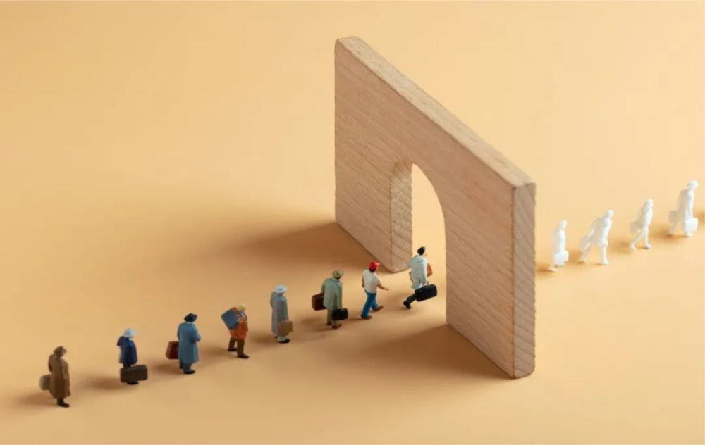

# 降价进医保的新药，却迟迟不进医院，是什么阻碍了“谈判药”落地？

**文/ 辛颖**

**编/ 王小**

_图/Pixabay_

2023年春节后刚开工，在一家药企负责地方政府事务的华彤（化名）就准备去拜访医保部门，为刚刚通过谈判进入医保目录的几款新药做准备。新版医保目录将自3月1日起执行。

“想吸取以前的教训，去年也有一款谈判成功的药，没进医保目录的时候已经进了一些医院，住院患者可用，本来期待报销后能扩大范围。”华彤说。

然而，这款药在2022年反而被踢出了医院。

**进入医保药品目录“双通道”的药，可同时在医院门诊和药店报销。**
在华彤负责的地区，新政策执行到市级医院时，变成了只能门诊报销，住院不报销，且支付上限不过几千元，也就是一次只够开一次药，所以医院干脆就不再采购了。且注射剂型用药不允许在药店销售，这款药一时间没了出路。

华彤希望尽快了解今年的落地政策，早做准备。

在新版国家医保目录中，共增加了111个药品，国家医保局近期将狠抓这些药品的落地，“应该会有一些新的有效措施，也是接下来的一项重点工作。”医保部门相关负责人对《财经·大健康》介绍。

千辛万苦进了医保目录，却进不了医院的药品此前很多。
**中国药学会在2021年对1420家样本医院的一项调研显示，2018年—2019年纳入国家医保目录的肿瘤创新药，进入医院的比例只有25%。**

国家医保在进行谈判药品时，在疗效和价格上都仔细权衡。上述医保部门负责人指出，医院进什么药也是在一定程度上替大家选药，“国谈药”是性价比最高的，医院应该优先选用，当然影响医院选择的因素很复杂，但只有大家形成一个合力，才能解决问题。

给医院腾空间

往返在省、市医保和医院之间多次沟通，华彤和同事最终确认，这款药并不限制住院报销，误会虽然解开了，这款药却还是没能再次进入医院。“医院有控制药品数量的顾虑，并不想为了这款药走复杂的入院流程。”华彤说。

医院使用的药品有限，有进就得有出。同样，医保目录也是应该有进有出，动态更新。

**医保目录中的新品要进入医院，就有可能医院得抛弃一款现用着的药。**

新版医保目录增加了111个药品，只调出三个药品，这是五年来调出最少的一次，且都是已被药监部门注销文号的品种，可调出的空间显然已经非常有限了。

有药品调出，医院才有机会进新药。800张以上床位的公立医院，配备药品的数量上限是1500种，绝大多数医院的用药早就饱和。

业内也不乏取消1500种限制的声音。
**农工党中央就在2022年全国“两会”提案中建议，逐步取消不同级别院内药品目录数量上限，医院不得以用药目录数量限制为由影响谈判药品落地。**

其实，“关键不在于数量上限，在于医院在用的1500种药里，有多少辅助用药或者性价比不高的药。”上述医保部门负责人分析，这种情况是过去的市场环境导致的，需要逐步调整。

有些医院把选择的第一轮压力交给医生，在各科医生建议增加新药时，就直接填写拟删除的药品以及理由。

**“已经进院的药品背后都有足够多的支持者，那新药要有多大的优势才能把它挤出去？”在一位药企管理人士看来，把一款药挤出医院，比单纯地进入难多了。**

《财经·大健康》统计，过去五年，国家医保目录增加了618个品种，累计调出了197个品种。被调出者均为疗效不确切、临床易滥用的或被淘汰的药品。

虽然清退的只是增加的三分之一，但也为医院引进新药腾出了不小的空间。

并且，各省医保取消了地方增补药品，又帮了医院一把。如安徽省原省级增补乙类药品共计411个，在过去三年分批调出目录。

然而，这些被清退的药品着落到每一家医院的仓库，就没有高达数百种的空位腾出来，“这些被剔除的药，有的是早就淘汰了，有的是我们医院本来就没有用。”一家三级公立医院的管理人士解释。

国家卫健委重点监控的药品，给医院“清退”提供了另一个机会。重点监控的对象是，临床使用不合理问题较多、使用金额异常偏高、对用药合理性影响较大的化学药品和生物制品。2019年第一批20个药品被纳入《第一批国家重点监控合理用药药品目录》，2023年又增加30个。

**从各省市公布的调整情况看，率先被医保目录“清退”的就是重点监控药品。**
数据显示，纳入国家版第一批重点监控的品种销售额下滑明显。20个品种2018年样本医院合计销售数据为474.6亿元，2019年市场规模降至378.5亿元，2020年仅有109.8亿元，市场萎缩近80%。

医保不再报销的品种，很快被医院“放弃”。如景峰医药的参芎葡萄糖注射液被调出2019年版国家医保目录，当年四季度销售收入相比2018年同期下降超过90%。

原因也在于相关指标事关公立医院考核。“这一类目录公布的时候，很多药都直接被剔出医院。”一位山东三甲医院副院长坦言。

帮医院算得失

华彤负责的药品，最终得到医院的妥协方案，先走临时采购，这样患者能用上药，也能享受报销。

只不过，每一批临采都需要走一遍完整的科室提单、药剂科审核、分管院领导、院长审批的流程。“偶尔审批慢一些，就会有患者开药就得延后几天。”华彤说。

**医院对临时采购药品都有严格限制，如某北方三甲医院就规定，临时采购均为一次性有效，不得连续采购。采购数量原则上为一个患者一个疗程的使用量。**

上述医院虽然为“国谈药”开了“绿色通道”，可以连续采购，但每一次临时采购量都很少，最终还是限制了使用量。

医院其实深知“国谈药”的性价比高。“一些多年不开药事委员会的医院，会专门为‘国谈药’开会讨论，优先级已经是最高的。”一位业内人士介绍。

**只是，最终能否正式引进，医院很大一部分的顾虑——还是贵。**

“国谈药”以创新药为主，2022年新进入医保目录的药品中，97%都是5年内刚上市的新药，相比于传统的治疗用药，价格自然相对高。

而这笔钱，关系到医院方方面面的考核。

广东省一家三甲医院在2022年引入了40余个“国谈药”后，直接拉低了多项考核评分，让负责“国谈药”落地的医保科主任也颇为难。

在卫健委系统的考核中，国家级考核的人均药费，明显因“国谈药”升高；在省、市两级的考核，还要求医院采购基本药物的增幅达到6%，但“国谈药”都不是基本药物，对指标冲击就很大。

“虽然国家早就取消了药占比考核，但是地方和医院内部药占比的考核还在，药价偏高的创新药进了医院，很容易就会把指标拉起来，这样的考核指标还出现在药事委员会的否决理由中。”一位中部省份三甲医院肿瘤科主任介绍。

此外， **按照正在推行的医保按病种支付，治疗相同的疾病，医院成本控制的越低，才能留下更多的医保支付结余款，那么用更贵的药显然不是明智的选择**
，上述医保科主任已经感受到了，“国谈药”占用医保费用高带来的压力。

如何解困？医院是关键。

**一是为“国谈药”入院的顾虑松绑。** 2022年，国家卫健委针对公立医院的绩效国考中，取消了“国谈药”相关的考核指标。

**二是尝试单独列支。**
2022年7月，北京首次尝试支付调整，将审批通过的国谈新药单列支付；同样，湖北也提出121个“国谈药”品单独支付，也就是不计药占比，报销不封顶。

**还有，做得更干脆的是直接增加指标。**
浙江省就是采取的这个方法。2021年底，浙江率先要求，三甲医院“国谈药”配置不低于30%，三乙、三级中医院不低于20%。之后，云南、上海等地也提出类似的要求。

只是盘根错节的考核指标中，“国谈药”涉及的利益牵扯实难忽略。上述山东医院副院长也着实感到为难，很多好的药品排队申请入院，“贵的新药进来多了，能保证医院的收益大于成本增加吗？”

现在医院卖新药不仅不挣钱，还增加管理成本。对医院来说，尽可能多地引入创新药，可能是赔本买卖，无法持续。而适当引入创新药，可以增加患者黏性。

**最终能撬动医院的还是得失的计算，药企也学会根据医院的“局势”分配力量。**
“同样受到指标束缚，但医院的优势学科、能帮医院挣钱、增强影响力的学科，就更容易进新药，骨科、肿瘤不乏此类。但那些原本就弱势的科室，医院更不想增加风险，比如一些皮肤科、感染科相关。”上述药企管理人士告诉《财经·大健康》。

**绕开医院的利益纠葛，在院外开辟第二通道，最好的办法是患者拿着医院处方去医保定点药店购药，这样绕开医院，药店与医保基金直接结算，这种“双通道”模式正在成为破除医院“垄断”的着力点。**

“国际上以社会化药房为主，在中国，药店已经是销售‘国谈药’的重要渠道，随着发展未来也有可能完全取代医院渠道。”一位业内人士说。

