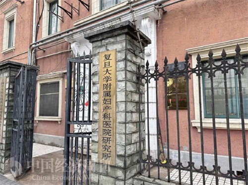
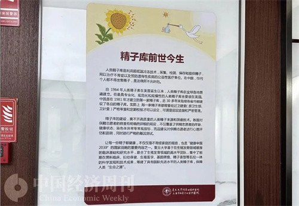
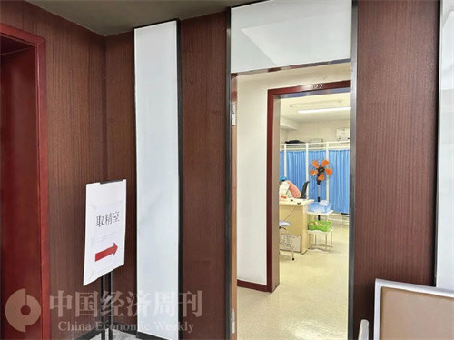
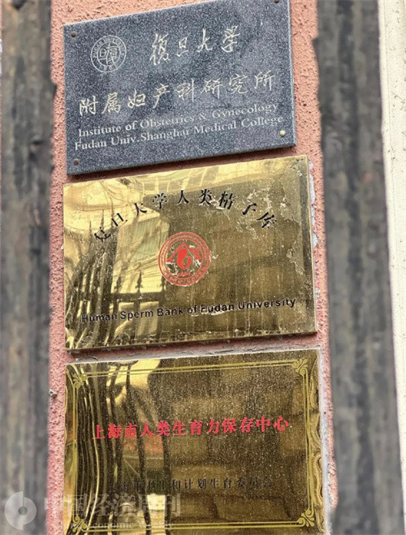

# “阳”后精子质量下降？多地倡议大学生捐精

《中国经济周刊》记者 宋杰 | 上海报道

**精子库告急？**

2月9日，“云南省人类精子库倡议大学生捐精”相关话题登上微博热搜。此后，陕西、湖北、北京等地精子库都陆续发布捐精倡议，其中也包括上海复旦大学人类精子库。

复旦人类精子库官微2月10日发布的一篇《捐精倡议书！致在沪的大学生》文中写道：“冬去春来，魔都各高校陆续开学。往年，来精子库捐献的志愿者朋友中，相当一部分是青春灿烂的在校大学生。去年以来，由于疫情，精子库缺少了你们宝贵的身影，我们倡议广大在校学生能献出一份爱心。”

2月13日11点，《中国经济周刊》记者来到了位于黄浦区复旦大学附属妇产科医院内的复旦大学人类精子库，此时正有两位男士在报名体检。

工作人员告诉记者，在倡议发布后每天通过线上接待咨询人员数不胜数，“我今天‘线上’接待志愿者已经头晕眼花，现在打字都打不动了，希望大家能够通过微信公众号‘复旦人类精子库官微’报名，上面可以自己初步判断一下是否符合标准。”

_复旦大学附属妇产科医院正门
摄影:《中国经济周刊》记者 宋杰_

_2月13日，在复旦大学人类精子库，有男士在做基础项目体检。摄影:《中国经济周刊》记者
宋杰_

**7000元补贴不好拿**

记者注意到，复旦人类精子库的捐精补贴自2021年6月起上调了1000元，达到7000元（税后），相较于其他城市4500-6000元的补贴算是最多的。许多报名者也是冲着这7000多元的补贴而来，但工作人员提醒：想要最终拿到补贴还有许多条件。

硬性条件包括：“目前在上海，有二代身份证原件。净身高165cm以上，年龄20-40周岁。高中中专以上学历或在读。无色盲色弱、乙肝等遗传病、传染病。”

_墙上的宣传海报
摄影:《中国经济周刊》记者 宋杰_

现场工作人员向记者详细介绍了捐精流程：

第一步，按预约时间前来精子库进行两次免费男科体检（合格总共给予250元路费，两次体检都不合格给予100元路费。）

据了解，男科体检，包括精液分析、染色体检测、全套遗传与传染病筛查。全套体检的价值为2000元。

“尤其精液与染色体检测，大部分人从未做过。志愿者即使最终没有通过，对了解自己的生育状态意义重大。”该工作人员说。

第二步，正式建档捐献时，捐献15毫升（正常男性每次排精2-6毫升，因此需3-7次），给予3000元，同时每次捐献还额外补贴50元路费；精液量大的志愿者可选择捐20毫升，给予4000元。

第三步，半年后HIV复查（复查约5分钟，当天一次性领2000元补助）。

**为何初步体检通过，建档了半年后还要再来复查？**

“因为艾滋的潜伏期为半年，并不是志愿者捐了，我们就能使用他的精子。志愿者必须完成整个流程，我们才能正式使用。”工作人员向记者解释道。

据介绍，全程捐献时间不能超过6个月，最短时间不限制，两次取精最短间隔在48小时以上，具体时间自定。捐献全程在复旦大学附属妇产科医院内的人类精子库进行，每人一间温馨的取精室。

这位工作人员还特别提醒：“捐精前，禁欲要求3-7天，低于3天密度不行，大于7天活力不行。”

_取精室入口 摄影:《中国经济周刊》记者
宋杰_

**阳后精子质量下降了？**

为什么发起大学生捐精倡议？工作人员对记者说：“这次点名让大学生参加，是因为过去一年两年多的时间，很多大学都在封校，无法来体检，再加上医院是感染新冠风险相对比较高的地方，进医院还要做核酸，所以这样就限制了大学生们来做志愿者的机会。大学生是较优质的人群，生活相对规律，合格率比较高，所以我们特别欢迎大学生志愿者。”

湖南精液研究项目观测了三万多名中国年轻男子的精液质量，整理了2001～2015 年的数据，发表在学术期刊《生育与不孕》(Fertility and
Sterility)上，这也是迄今针对中国年轻男性精液质量最大型的研究。结果发现，合格捐赠者的比例从2001年的55.78%下降到2015年的17.80%，不足原来的1/3。

2018 年，有媒体报道，复旦精子库的合格率不到
1/10。“其实不同月份，不同季节，合格率都有所不同。夏天我们还出现过一天来十几个人，一个都不合格的。我们发现，‘阳’了过后，精子质量也会下降。”工作人员对记者说。

另一方面，工作人员还介绍，市场需求端却在增加，2021年数据显示，我国不孕不育发病率在7%-12%，辅助生殖技术成关键治疗手段。

湘财证券发布的研究报告中提到：中国生育力状况恶化，需求基数大。根据沙利文数据，近年来，中国和全球不孕不育症患病率持续走高，中国不孕不育夫妻的数量逐年增加，人数在2020年达到了5050万。

据沙利文数据预测，到2025年，我国辅助生殖市场规模将超过852亿元，
2023-2027年均复合增长率将保持14.5%，辅助生殖行业的渗透率有望进一步提升。

“不孕不育的夫妇并不是一上来就要选择精子库的精子，一般是男方发现无精少精，又发现治不好，且不能通过显微取精的技术提取出有用的精子来受精，最后迫不得已才用精子库的精子。”前述工作人员对记者说。

根据我国2001年8月1日起实施的《人类精子库管理办法》规定，供精者只能在一个人类精子库中供精，一个供精者的精子最多只能提供给5名妇女受孕。精子库采集精子后，应当进行检验和筛查。精子冷冻6个月后，经过复检合格，方可向经卫生行政部门批准开展人类辅助生殖技术的医疗机构提供，并向医疗机构提交检验结果。未经检验或检验不合格的，不得向医疗机构提供。

“需要强调的是，合格的志愿者一辈子只能参加一次捐精活动。全国所有的精子库之间有一个查重系统，是由卫健委牵头成立的，这个系统只要通过刷身份证就可以查重，即检查是不是在其他精子库捐献或者体检过。比如这个志愿者在A城市只是体检过，但不合格，没有捐献，那么他也不可以再到其他精子库重复体检了，这也视为参加过。”工作人员进一步解释说。

责编 | 郭霁瑶

（版权属《中国经济周刊》杂志社所有，任何媒体、网站或个人未经授权不得转载、摘编、链接、转贴或以其他方式使用。）

