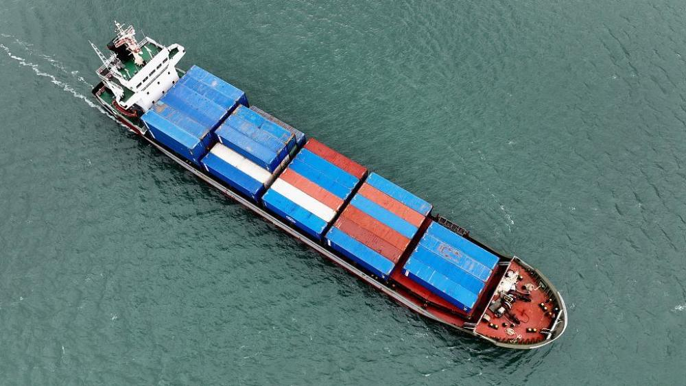
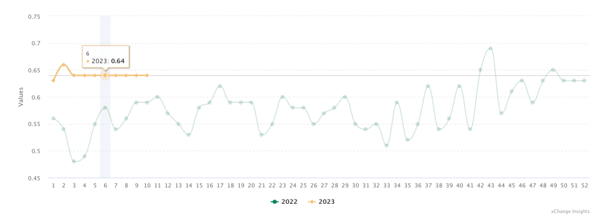
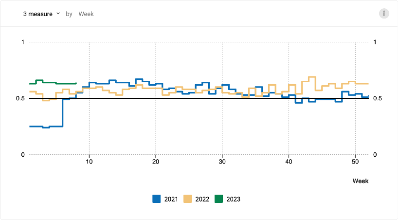

# 一箱难求到空箱堆积？船企：集运货量增长是缓解核心

“一箱难求”到“空箱堆积”，集装箱航运市场开始退烧了？

“相比前两年，现在是不缺箱的，都能提到。”近日，一位上海货代告诉澎湃新闻记者，对货主和货代企业而言，箱等货总比货等箱好。

一货代公司负责人则告诉澎湃新闻记者，年前一段时间出现空箱堆积，目前情况应该有所好转。“船公司要为春节假期前的爆仓做预留方案，每年都一样，会担心出现有货没箱。”

2月15日，马士基大中华区箱管负责人在接受澎湃新闻记者采访时表示，当前亚太地区各港口相比去年同期，空箱保有量都有大幅上升，主要由于当前出口需求下降，导致很多空箱在亚太地区停留时间、堆积数量相对有一定的增加。“亚太地区属于长期的进出口极度不平衡，主要以出口为主，长远来看需要大量空箱，目前全球空箱主要流向很大部分也是回流到亚洲。因此依据出口的速度和需求，空箱堆积的时间长短也会有一定变化。”

**集装箱货流进出口不平衡**

据全球集装箱交易平台Container
xChange最新数据显示，2023年第6周上海港40英尺集装箱CAx（集装箱可用指数）达0.64，今年以来该港CAx指数均在0.6以上，明显高于去年同期水平。

Container xChange数据显示，今年以来上海40英尺集装箱CAx指数均高于去年同期。

2021至2023年上海40英尺集装箱CAx指数变化趋势。

据Container
xChange平台信息显示，CAx指数可以量化全球主要港口的集装箱的进出动向。当CAx的数值大于0.5时，表示进港集装箱多于出港集装箱，低于0.5则表示有更多集装箱离开。该指数长时间高于0.5，如果是在港口短缺集装箱后，则意味着港口的缺箱正在缓解，如果港口没有出现明显集装箱不足，则意味着可能该港口空箱过剩。

而空箱堆积的现象几乎是全球性的。澎湃新闻记者查询该平台上多个主要港口，今年40英尺集装箱CAx指数均处于0.5以上。

“与前两年相比，今年港口空箱堆积成为普遍情况，尤其是亚洲地区情况严重。”2月15日，大连海事大学交通运输工程学院教授、博士生导师孙家庆接受澎湃新闻记者采访时表示，前两年在圣诞节期间，大量集装箱从中国运至北美、欧洲等热门目的地后，没有及时回流至中国。一方面，由于国外港口集装箱装卸能力相对较弱，集装箱卡车运力和港口场地空间也相对不足。另一方面，在港口拥堵、运价飙涨期间，也存在部分船公司为提高效率而直接空船返航。

对于空箱回流的原理，马士基大中华区箱管负责人告诉澎湃新闻记者，一般都是马士基总部根据各个区域之间的进出口需求来决定每周、每月的回流总数。“例如，根据亚太区预计的进出口需求，制定从欧洲、美国等地回流亚洲的数量，再安排好每周、每月大概的回流总数。空箱运至马士基亚洲箱管中心后，会再安排运至各国各地区具体港口的每周空箱数量。”

孙家庆认为，集装箱货流进出口不平衡是导致空箱堆积问题的主要原因。

据海关总署的数据显示，2022年全年中国进出口总值6.31万亿美元，同比增长4.4%。其中，出口3.59万亿美元，同比增长7%；进口2.71万亿美元，同比增长1.1%；贸易顺差8776亿美元。

“节后单子开始接了，一般3至4月开始正常。春节后订单较平稳，相比前两年行情最好时期有所下降，订单货运量基本降至2019年疫情前的水平。”一位上海货代人士告诉澎湃新闻记者。

该货代还表示，虽然货运行业面临集运运价下跌，但只要订单量上来、有货量，货代还是形势明朗的，“回暖也要等全球经济复苏，等国际友人们有需求买买买，我们生意就好了。”

此外，孙家庆还告诉澎湃新闻记者，随着近年新造集装箱数量增加，集装箱全球结构性过剩也进一步加剧了空箱的堆积问题。

集装箱制造龙头企业中集集团（000039.SZ）在2022年三季报中提及，集装箱需求逐步回归正常，产销量正高位回落。受此影响之下，中集集团去年前三季度归母净利润为31.18亿元，同比下降64.57%。

据Container
xChange2月2日发布的报告显示，中国集装箱的供应量在不断增加，而到2022年10月集装箱供应已经出现过剩。与过去三年相比，上海、宁波、天津等港口的CAx指数不断上升，这表明入港集装箱较出港集装箱更多。通常情况下，每年这时中国入港集装箱增多是季节性地调运，为了在旺季后平衡集装箱，也有助于稳定集运价格。

**空箱堆积如何缓解？**

孙家庆告诉澎湃新闻记者，港口整体的操作量包括空箱和重箱，集装箱空箱在一段时间内堆积过多，超过港口的堆存能力，一定程度上会影响港口的正常作业。而在港口可容纳空间范围内过长时间堆积空箱，则会增加船公司的成本。“集装箱堆放港口，过了免费的保管期后，港口会向货主或是船公司收取超期保管费用。”

由于全球通货膨胀，集装箱供应过剩也加速即期市场价格、合同价格和集装箱价格大幅下降，尤其是此前爆火的中美航线已开启大降温。据Container
xChange最新发布的报告显示，2023年1月从亚洲到美东的即期运价相比去年1月降低了84%。2023年1月亚洲到美西的运价相比2020年1月降低了11%。

“部分航线价格溢价水平也已经回落到2019年疫情之前的状态。”1月14日，中远海控（601919）党委书记、执行董事、总经理杨志坚在上海两会现场接受澎湃新闻记者采访时表示，预计今年一季度将保持这一态势。二季度之后供需局面会出现好转，但仍不会出现需求大于供给。预计未来两年的供给和需求会保持弱平衡状态，可能部分航线效益会出现波动，但整体的亏损局面应该不会产生。

一位货代告诉澎湃新闻记者，由于海运费不断降温，一些小船司也开始搞“饥饿营销”，例如开始撤船、停航来稳运价，“大部分舱位还是比较好订，目前东南亚、中南美的舱位比较紧张”。

另一位货代表示，当前订单量、货量下降后，业内也开始出现降价和胡乱报价的现象。据Container
xChange在《2023年的23个航运业趋势》中提及，随着市场中集装箱过剩，航运公司将继续减少船舶运力或是继续空船航行，预计2023年海运业将迎来价格战。

对于如何缓解空箱堆积？孙家庆告诉澎湃新闻记者，“船公司争取货源是核心，通过有货可运来减少空箱滞留；另一方面，船公司可以优化空箱调运方案，平衡好空箱调运、存放以及运货的成本，将空箱运至缺箱的港口或内陆地区。在可行的情况下，应加大调往内陆地区，以进一步促进内陆集装箱多式联运的发展。”

“最终还是希望能够有货量的增长，把更多的空箱用出去。”马士基大中华区箱管负责人向澎湃新闻记者介绍，目前空箱量大而出口需求不太强的背景下，马士基会尽量找一些有额外且长时间堆存空箱的地方，包括码头、堆场，或是其他一些内陆地点。此外，今年也会加快一些旧箱、二手箱的淘汰计划，以减少一部分保有的箱量。

