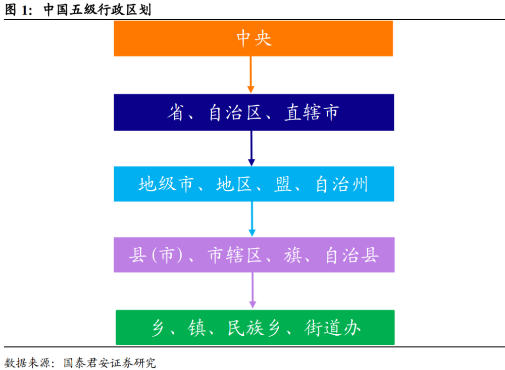
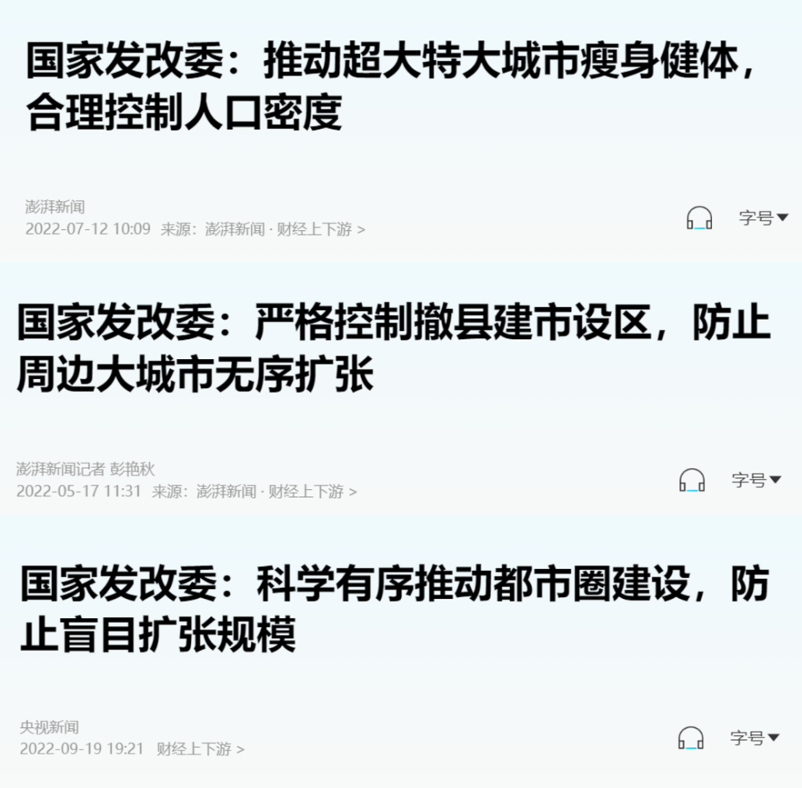

# 东北撤街设镇，山西缩减铁饭碗，“大收缩”时代来了？

**文|凯风**

城市收缩，悄然降临。

**01**

铁饭碗，不再“铁”了。

前不久，山西6个县试点探索“人口小县”机构改革，多个 **行政部门被撤并精简** ，部分 **事业单位编制被缩减** 。

**忻州市河曲县，36个党政机构精简为22个，135个领导领导职数精简为114名，186个涉改事业单位整合为40个，1964个事业编制核减为659个。**

**太原市娄烦县，全县9个县委机关减少至6个，26个政府部门降至16个，133个事业单位则削减了29个。**

**吕梁市石楼县，改革后，全县党政机构减少了37.1%，事业单位减少了31.1%，行政事业单位科级职数减少11.8%。**

**……**

这些县有一个共同特点： **人口小县，且人口面临持续减少的困境。**

这6个试点县，常住人口多则13万人，少则不到10万人，属于典型的袖珍小县。

过去10年，这些 **小县人口还在持续萎缩** ，河曲县人口减少14.9%，娄烦县降低13.8%，石楼县减少13.4%。

与之对比，在中部和东部， **百万人口大县** 屡见不鲜，作为第一县级市的昆山常住人口更是达200万人以上，超过了许多中西部地级市规模。

虽然人口大相径庭，但在如今的行政架构下，无论是10万人口小县，还是百万人口大县，行政部门、事业单位总量不会相差多少，县直事业机构动辄一两百个。

且不说经济和财政可负担性如何，人口萎缩本身就会带来一个严峻问题： **人口与财政供养人员比例失衡。**

为此，山西在全国率先开启人口小县机构改革，重点解决“财政供养人员比例失衡、人浮于事等突出问题”。

这一切还只是开始。

根据中国县域统计年鉴，全国户籍人口不足50万的县（市）共有1257个。其中， **5万以下的袖珍县（市）有90个，5万-10万之间的有116个**
，10万-20万之间的228个。

这些人口小县，未来或许都将成为改革对象。

**02**

与山西精简铁饭碗相比，东北出现了“逆城市化”现象。

日前，黑龙江省伊春市和齐齐哈尔市6个街道被撤销，并设为镇，这一举动被媒体称为 **“撤街设镇”** 。

事实上，几年前，东北就已出现更高层面的 **“撤区设县”** 。

2019年，黑龙江伊春市撤销了15个市辖区，新设立了8个县区。行政区划从15区1县1市，调整为5县4区1市， **区少了整整11个。**

长期以来，城市扩张一直都是主旋律， **撤县设区、撤县设市、撤镇设街、撤村改居** 可谓屡见不鲜。

如今一切开始逆转，不仅浩大的“撤县设区”潮戛然而止，逆向的“撤区设县”、“撤街设镇”也成了现实。（参阅《1亿人，为何没有一座万亿GDP城市？》）

**“撤区设县”、“撤街设镇”，意味着什么？**

在我国的行政架构中，中央-省-市-县（区、县级市）-乡镇（街道）构成 **5级行政体系。**

根据《中国城市大趋势》一书分析，县与区，镇与街道，看似级别相当，但无论是名称还是实际定位，都截然不同。

**区和街道，都属于城市架构** ，深度融入城市的产业、交通、教育、卫生等规划中，多以二三产业为主，且村民向城镇居民的身份转型，得以享受相应的城市福利。

**与之对比，县与乡镇，多属于乡村管理单元。**

乡基本以乡村经济为主，镇兼顾农业和工商业职能，且财权、事权相对独立，虽然享受不到城市层面的利好，但如果产业基础良好，反而更利于自力更生。

同时， **街道与镇设立门槛不尽相同。**

根据黑龙江相关规定，街道人口及城镇人口规模一般高于乡镇，且财政收入、二三产业增加值必须位于区域前30%，而镇经济水平只要求达到50%左右。

所以，撤街设镇的背后，核心原因是 **人口减少，城市收缩，逐渐达不到设立街道的标准。**

**以率先进行“撤区设县”、“撤街设镇”的伊春市为例，2010年到2020年，伊春常住人口从114.8万人减少到87.9万人，人口下降23.45%，年平均增长率为-2.64%。**

而在东北，除了沈阳、大连、长春外，其他 **30多个城市人口都在减少。**

当人口持续流失，一旦低于设立街道的最低标准，撤街设镇，就是无法回避的选择。

**03**

种种信号表明，城市正在从大扩张模式，转向“收缩”模式。

无论是超大特大城市，还是收缩型城市，抑或普通县城、镇街，都不能再随意扩张了。

前不久，国家发改委发布《“十四五”新型城镇化实施方案》，要求推动 **超大特大城市瘦身健体** ，科学确定城市规模和开发强度，合理控制人口密度。

这是继“严控省会城市规模扩张”、严控撤县设区之后，对超大特大城市扩张加上的又一个紧箍咒。

早在三四年前，国家发改委就已发布文件，要求 **收缩型中小城市要瘦身强体** ，转变惯性的增量规划思维，严控增量、盘活存量，引导人口和公共资源向城区集中。

随后，官方进一步发文指出， **稳妥调减收缩型城市市辖区，审慎研究调整收缩型县（市）。**

这些规定，正是中小城市撤区设县、撤街设镇等“逆城市化”现象的政策渊源。

与此同时，县城在区域经济中的地位得到前所未有的提升，但 **人口流失县城** 却受到诸多限制。

去年，中办、国办印发《关于推进以县城为重要载体的城镇化建设的意见》，提出分类引导县城发展方向，加快发展大城市周边县城 ，积极培育专业功能县城 ，
**引导人口流失县城转型发展。**

这意味着，县城迎来了命运的分水口， **人口流失县城的扩张之路就此搁浅** ，未来或将迎来新一轮收缩型的撤并潮。

毕竟，随着人口大盘见顶、经济高增速发展阶段远去，城市收缩现象只会越来越严峻，这在凯风《中国城市大趋势》一书有详细论述。

根据龙瀛团队的最新研究，2010年-2020年， **全国共有1507个收缩的区县** ，占比超过一半
，总面积为440万平方公里，覆盖了中国近46%的国土。

龙瀛团队：2010-2020年，中国人口收缩的县区市，新疆数据暂缺

以城市来看， **全国共有266个收缩城市** ，与前十年相比，增加了86个，总数占全国城市的4成左右。

城市收缩之下，只有“瘦身强体”一条路可走。

