# 中国人口形势报告2023：我国总和生育率全球倒数，鼓励生育刻不容缓

育娲人口研究团队：任泽平、梁建章、黄文政、姚劲波、何亚福、吕俊、於嘉

特别鸣谢：白学松 对本文数据整理有贡献

**导读**

**2022年我国人口开始负增长，总和生育率跌破1.1、全球倒数，放开并鼓励生育刻不容缓。**

中国总和生育率从1970年代之前的6左右，降至1990年的2左右，再降至2010年后的1.5左右，2021年仅1.15，2022年或不到1.1，仅为世代更替水平（2.1）的一半，全球倒数。

全面二孩政策不及预期、三孩政策效果未显现，未能扭转中国出生人口下降趋势，生育堆积效应已消退，出生人口自2017年以来连续六年下降，2022年出生人口956万人，比2021年减少106万人，创历史新低，总人口比上年减少85万，开始负增长。

中国的老龄化速度和规模前所未有，2021年中国65岁及以上人口占比达14.2%，进入深度老龄化社会，2022年上升至14.9%，预计在2030年左右进入占比超20%的超级老龄化社会。

**老龄化、少子化、不婚化三大趋势加速到来。人口因素影响重大深远，生育政策调整是最根本、最重要的供给侧结构性改革之一。**

**我们这几年呼吁“全面放开并鼓励生育，应对老龄化少子化挑战”，开始逐渐看到曙光，生育政策在逐渐松动。**

**在严峻的现实面前，过去长期影响生育政策走向的保守派也开始改弦易辙，也开始呼吁放开并鼓励生育。**

**自放开三孩政策以来，全国各地积极健全生育配套服务，从生育补贴、生育保险、个税减免、延长育儿假、提供托育服务、住房优先保障等方面降低生育养育教育成本。**

越来越多的地方拿出真金白银来鼓励生育，根据统计已经有四川省攀枝花市、甘肃省临泽县、湖北省安陆市等十几个城市出台或拟出台生育或育儿补贴的相关政策，但目前看补贴力度仍低于大部分欧洲国家。

**近日，2023年第一期《人口与健康》刊发了卫健委人口监测与家庭发展司司长杨文庄的文章，提出要鼓励地方在降低生育、养育、教育成本方面积极探索、大胆创新，在“十四五”期末，使家庭负担有效降低。**

**我们期待未来能有更多行之有效的鼓励生育政策得以出台，中国未来的生育率，很大程度上取决于鼓励生育的力度。相信经过一系列长短结合的措施，未来人口有望长期健康均衡发展。**

**正文**

**1 总人口14.1亿，开始负增长，老龄化、少子化、不婚化三大趋势加速到来**

**2022年中国总人口14.12亿，开始负增长，是1949年以来除了三年自然灾害期外，第一次负增长，符合我们在2021年对人口总量的预测结果。**

2020年中国总人口为141178万人，净增204万，2021年总人口141260万人，净增仅48万，创有数据以来新低，2022年总人口141175万人，比2021年减少85万人，人口总量开始见顶回落，进入负增长时期。

中国人口从8亿到10亿，花了12年；从10亿到12亿，花了14年；从12亿到14亿，花了24年。

2016年《国家人口发展规划（2016-2030年）》预估2020年中国人口14.2亿人，但未实现， **过高估计全面二孩政策对生育率提升的影响**
，认为2015年总和生育率在1.5-1.6之间，预期2020年、2030年总和生育率分别为1.8，进而预测中国人口将在2030年前后达14.5亿人的峰值。

**此外，联合国同样高估中国人口增长。**
联合国《世界人口展望2019》对中国人口有9个预测方案，其中中方案假设2015-2020年、2020-2025年、2025-2030年中国总和生育率分别为1.70、1.72、1.73，进而预测中国人口将在2031年迎来14.6亿的峰值；低方案假设2015-2020年、2020-2025年、2025-2030年中国总和生育率分别为1.45、1.32、1.23，人口将于2024年达到14.5亿的峰值。

联合国最新的《世界人口展望2022》调低了对中国未来人口的预测参数，但仍然认为，从2023年起，中国总和生育率的大趋势是缓慢上升。中方案生育率参数为：2030年上升到1.27，2040年上升到1.34，2050年为1.39，到2100年上升到1.48左右。

相较于维持人口总量不变的世代更替水平2.1，2021年中国总和生育率约1.15、2022年已降至不到1.1，处较低水平，随着生育堆积效应消失，生育率还将进一步下滑。如果总和生育率一直较低，中国人口将陷入持续负增长。

人口见顶之后前25-30年内萎缩速度较慢，但随着1962-1975年高生育率时期出生人口进入生命终点，2050年左右开始，萎缩速度将明显变快。

**根据育娲人口《中国人口预测报告2021》中方案，2050年中国总人口将下降至12.64亿，2100年中国人口将降到6.85亿，占世界比例将从现在的18%降至6.5%。**

**人口数量和质量共同影响国力，随着人口总量萎缩，将影响中国大市场优势，也将影响经济增长和经济规模以及全球竞争力。好在全社会已经开始高度关注中国的人口问题，长期保守的计生政策在松动，逐渐转向了鼓励生育的政策。**

2021年5月31日，中共中央政治局会议指出，进一步优化生育政策，实施一对夫妻可以生育三个子女政策及配套支持措施。

2021年7月20日，中共中央、国务院发布《 **关于优化生育政策，促进人口长期均衡发展的决定**
》，内容包括：取消社会抚养费等制约措施、清理和废止相关处罚规定，配套实施积极生育支持措施。

2022年8月16日，国家卫生健康委、国家发改委等17部门又发布《关于进一步完善和落实积极生育支持措施的指导意见》，强化深入实施一对夫妻可以生育三个子女政策及配套支持措施。

同月，国务院办公厅发函，同意 **建立由26个部门和单位组成的国务院优化生育政策工作部际联席会议制度，统筹协调全国优化生育政策工作。**

**2022年10月二十大报告提出，“优化人口发展战略，建立生育支持政策体系，降低生育、养育、教育成本”，“实施积极应对人口老龄化国家战略”。**

**2022年12月召开的中央经济工作会议强调，“完善生育支持政策体系，适时实施渐进式延迟法定退休年龄政策，积极应对人口老龄化少子化。”**

**2023年第一期《人口与健康》刊发了卫健委人口监测与家庭发展司司长杨文庄的文章，提出要鼓励地方在降低生育、养育、教育成本方面积极探索、大胆创新，在“十四五”期末，使家庭负担有效降低。**

**自放开三孩政策以来，各地积极健全生育配套服务，从生育补贴、生育保险、个税减免、延长育儿假、提供托育服务、住房优先保障等方面降低生育养育教育成本。**

越来越多的地方拿出真金白银来鼓励生育，根据统计已经有四川省攀枝花市、甘肃省临泽县、湖北省安陆市等十几个城市出台或拟出台生育或育儿补贴的相关政策，但目前看补贴力度仍不足，低于大部分欧洲国家。

**我们期待未来能有更多行之有效的鼓励生育政策得以出台，中国未来的生育率，很大程度上取决于鼓励生育的力度。相信经过一系列长短结合的措施，未来人口有望长期健康均衡发展。**

**2 老龄化加剧，正从人口红利期转入人口负担期**

**中国的老龄化速度和规模前所未有，2021年中国65岁及以上人口占比达14.2%，进入深度老龄化社会，2022年上升至14.9%，预计在2030年左右进入占比超20%的超级老龄化社会，之后持续快速上升至2060年的约36.8%，企稳一段后将再度上升至2084年及之后的约46%。**

2001-2010年中国65岁及以上老年人口占比年均增加0.2个百分点，2011-2022年年均增加0.5个百分点，人口老龄化速度明显加快。

**由于人口基数大，中国老年人口规模也是前所未有。**
预计到2035、2050年，中国65岁及以上老年人口将分别达3.27、3.93亿，占全球老人比重将分别为36.8%、40.4%，届时大致每3个中国人中就有1个65岁以上的老人。

中国高龄化问题也将日益突出。2020年中国80岁及以上高龄老人超3580万人，占比2.5%。预计2030、2050、2073、2100年将分别占比3.8%、10.3%、17.1%、20.8%。

**老龄化地域差异大，东北、川渝地区老龄化明显。**
分省看，2021年仅西藏65岁及以上人口占比低于7%，未进入老龄化阶段；新疆、广东、青海、宁夏等13省65岁及以上人口占比介于7%-14%，初步进入老龄化阶段；河北、陕西、浙江、北京、河北、湖北等17省高于14%，处于深度老龄化阶段，其中，辽宁、重庆、四川、上海、江苏、黑龙江、吉林分别高达18.8%、17.8%、17.6%、17.4%、17.0%、16.8%、16.7%。

**1962-1976年的婴儿潮人口加速步入老龄化，退出劳动力市场。我们前面享受了多大的人口红利，后面就要背负多大的老龄化负担，我们正从过去几十年的人口红利期转入人口负担期。**

未来养老负担、社保支出和政府债务将持续上升。未来医药、养老、医疗等行业都是大赛道。

值得注意的是，日本、韩国等亚洲发达国家的老龄化比美欧更严重，日本是世界上老龄化最严重的国家之一，韩国最新的总和生育率已经降至0.8（联合国的代际平衡黄金综合生育率是2.1），可能跟
**美欧移民政策比亚洲更开放有关，但是欧洲的大规模移民涌入带来了社会治安变差、种族冲突、社会撕裂、白人比重大幅下降等新的问题。**

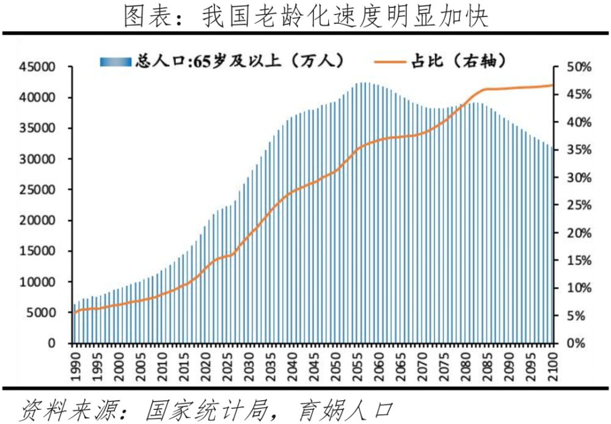

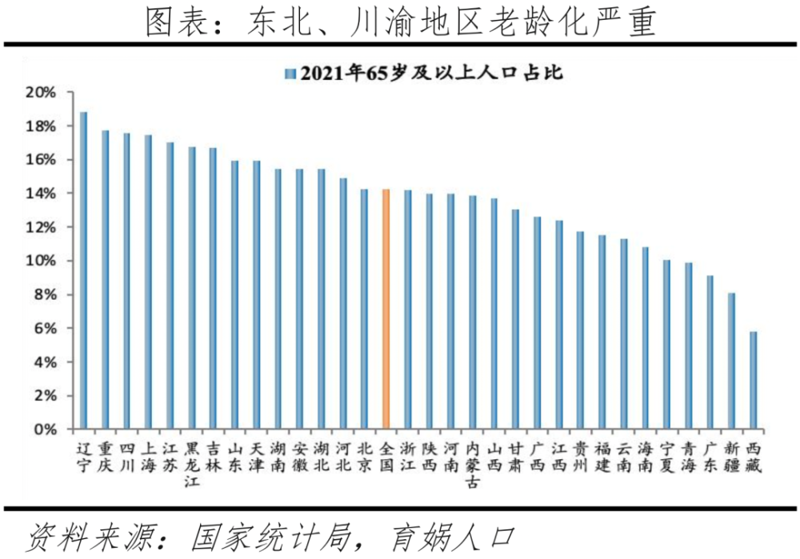

**3 劳动年龄人口下降，经济潜在增长率下降**

**劳动力规模持续萎缩、劳动人口占比大幅下降，2010-2021年15-64岁人口规模从10亿降至9.7亿，占比从74.5%降至68.3%，预计到2050年降至59%。**

中国劳动年龄人口比例及规模分别在2010、2013年见顶，随后进入快速下滑阶段，根据育娲人口《中国人口预测报告2021》中方案，2050年劳动年龄人口占比下降到59.1%，2100年劳动年龄人口占比下降到44.3%。人口数量红利消失，劳动力成本大幅上升，挑战中国世界工厂地位，社会创新创业活力下降，经济潜在增速下行。

**我们正从人口红利期转入人口负担期，面临“未富先老”局面。**
人口数量红利是过去中国经济保持高速增长的一个重要因素。1978年改革开放后，中国依靠庞大且年轻的劳动力以及与之相关的巨大统一市场，快速成长为世界第二经济体。

1962-1975年第二轮婴儿潮人口是改革开放40年的建设主力，生产和储蓄多，消费少，导致储蓄率和投资率上升，储蓄超过投资部分产生贸易顺差，同时过剩的流动性和人均收入水平提高推动消费升级，经济潜在增速较高。

在长期低生育率背景下，中国15-64岁劳动年龄人口比例及规模分别在2010年、2013年见顶，而日本、美国、英国的劳动年龄人口比例分别在1991、2009、2013年见顶，当时的人均收入远高于中国。

**如果不作出改变，老龄化人口结构将影响长期经济增长。** 人口总量的增加、质量和结构的改善推动美国在第二次工业革命中经济腾飞，并在二战后成为世界霸主。

人口老龄化使得我国社保收支矛盾日益凸显，养老金缺口将日益增加；随着劳动力供给总量持续下降，劳动力成本将日益上升，部分制造业已经开始并将继续向东南亚、印度等地迁移。

从边际上看，中国人口红利即将结束，面临“未富先老”局面，未来储蓄率和投资率将逐渐下降，消费率将逐渐上升，经济潜在增速下滑。从绝对水平看，当前中国人口总抚养比约40%，未来一段时间仍处于人口负担相对较轻的“人口机会窗口期”（小于50%）。

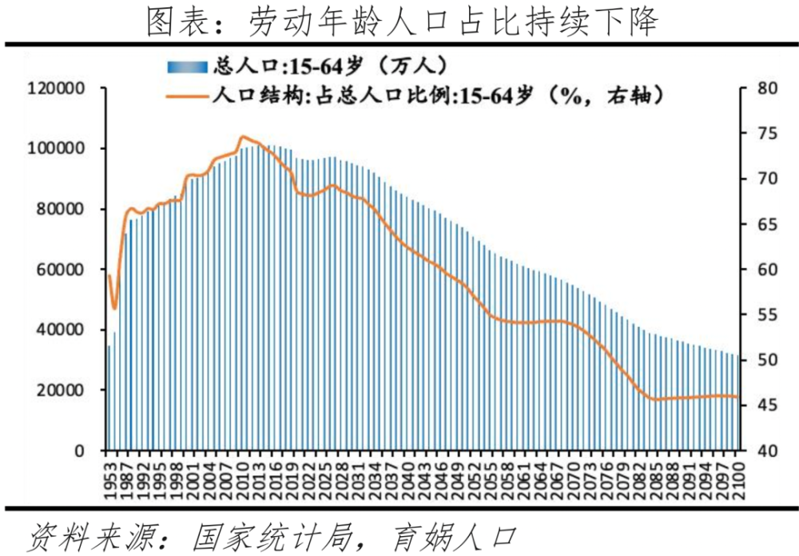

**4 少子化加剧，新出生人口持续创新低**

**全面二孩政策不及预期、三孩政策效果并未显现，未能扭转中国出生人口下降趋势，生育堆积效应已基本结束，出生人口自2017年以来连续六年下降，2022年出生人口956万人，比2021年减少106万人，继续创新低。**

新中国成立以来，出现三轮婴儿潮，分别为1950-1958年的年均2100万，1962-1975年的年均2628万，1981-1994年的2246万，之后逐渐下滑至2003-2012年的约1600万，其中2012年为1635万。第四轮婴儿潮原本应在2010年后出现，但因长期严格执行的计划生育而消失。

2013-2015年出生人口分别为1640、1687、1655万。2015年末中央决定全面放开二孩，出生人口在2016年达1786万、创2000年以来峰值；但2017年开始，出生人口连续六年下滑，至2022年已跌破千万大关，降至956万人，继续创历史新低。

**分省看，广东出生人口居前，河南、山东、河北等人口大省近五年出生人口降幅超过40%。**
从出生人口看，2021年出生人口前三的省份分别为广东、河南、山东，分别为118.3万、79.3万、75万人，仅广东省出生人口超百万，合计占全国的26%。

从出生人口变动看，2017-2021年新疆、山东、黑龙江3省出生人口降幅超过50%，重庆、湖南、河北等10省出生人口降幅在40%-50%，山西、吉林、四川等15省出生人口降幅在20%-40%，仅宁夏、贵州、西藏3省出生人口降幅小于10%。

**目前各地公布的2022年的出生人口数据，相比2021年均有所下滑，下滑比例在6%-14%，其中青海、重庆、贵州、广西、甘肃、江西出生人口降福分别为6%、7.9%、9.4%、11.9%、12.7%、13.8%。**

**从长期趋势看，由于生育堆积效应逐渐消失、生育率低迷、育龄妇女规模持续下滑等，出生人口仍将下降。**

根据育娲人口《中国人口预测报告2021》中方案，到2050年，我国出生人口将降至773万，为印度的1/3，2100年降至306万，仅为印度的1/4。
**相信经过一系列长短结合的措施，中国生育率一定能触底回升，人口结构有望逐步改善。**

**5 生育率持续下降，“不想生、不敢生、不能生”问题严峻**

**中国总和生育率从1970年代之前的6左右，降至1990年的2左右，再降至2010年后的1.5左右，
2021年我国总和生育率仅1.15，2022年降至不到1.1，仅为更替水平（2.1）的一半，全球倒数。**

根据我们估算，2016年总和生育率冲高至1.7、较2015年明显上升，2017年略降，2018年明显下降至1.5左右，2019年基本持平，2020年仅1.3，2021年已降至1.15，2022年不到1.1（按照出生人口每年956万计算）。

从国际比较看，根据联合国《世界人口展望2022》，法国、美国、巴西、英国、德国、日本分别为1.79、1.66、1.64、1.56、1.53、1.3，中国总和生育率全球倒数。

**为什么不生？现阶段低生育率原因已经从死亡率驱动转向功利性生育消退和成本约束驱动转变，生育基础削弱、生育观念改变、生育的机会成本和直接成本高是影响生育率的主要原因。**

**首先，晚婚晚育、单身丁克、不孕不育等削弱生育基础。**

第一，中国结婚率2013年见顶后持续回落，晚婚晚育现象日益突出，1990-2020年平均初婚年龄从22.9岁推迟至28.7岁。

第二，结婚后选择丁克的家庭在增多，尤其是在较为发达的一二线城市。第三，生育年龄推迟、环境污染、不良生活方式、生殖卫生保护缺失等导致不孕不育率上升，根据国家统计局数据，我国不孕不育率为12%-18%。

**其次，生育观念改变也使得生育率趋于下降。** 随着经济社会的发展，年轻一代的生育观念已经发生改变。与父母辈相比，现在的年轻人并不把生育作为必然选择。

70、80后生育观念保守，认为生育是必然选择，但现在90后、00后更加追求自我满足，不愿意过早被生育束缚，倾向于晚生、少生、甚至不生。

随着女性意识的觉醒和受教育水平的提升，很多女性不愿因生育被困在家中，从而降低生育意愿。并且，由于社保体系的完善，社会养老功能逐渐强化，“养儿防老”观念逐渐被淡化。

**最后，住房、教育、医疗等直接成本高是抑制生育行为的“三座大山”，**
“四二一”结构的家庭养老负担重、挤压生育，女性劳动参与率较高但就业权益保障不够，导致机会成本高。

根据育娲人口2022年发布的 **《中国生育成本报告》**
，在统计的14个国家中，全国家庭0-17岁孩子的养育成本平均为48.5万元；0岁至大学本科毕业的养育成本平均为62.7万元。

**如果把一个孩子抚养到刚年满18岁所花的成本相对于人均GDP的倍数进行国际对比，澳大利亚是2.08倍，法国是2.24倍，瑞典是2.91倍，德国是3.64倍，美国是4.11倍，日本是4.26倍，中国是6.9倍，几乎是全球最高的。**

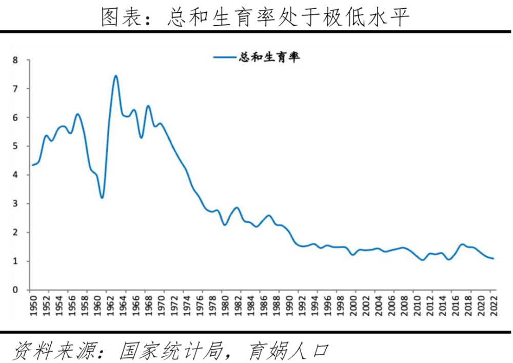

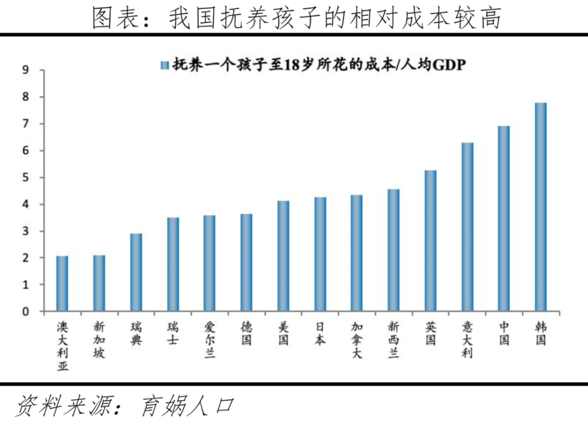

**6 家庭小型化、不婚化成新趋势，2020年家庭户规模降为2.62人**

**根据普查数据，2010-2020年平均每个家庭户规模由3.10人降至2.62人，家庭户规模继续小型化，主要受我国人口流动日趋频繁、户籍制度改革不到位、年轻人不婚不育观念等因素影响。**

2020年平均每个家庭户人口为2.62人，比2010年第六次全国人口普查的3.10人减少0.48人。根据抽样数据，2021年，我国家庭户规模约2.77，总体呈小型化趋势，主要原因集中体现在三方面。

**第一，人口流动日趋频繁** ，职业流动性增加，家庭成员间空间距离变大，年轻人更可能离开父母独立居住，一人户、“空巢”家庭和“纯老户”数量、比例均会增加。

**第二，当前户籍制度改革进程明显滞后于人口流动趋势。** 流动人口无法享受与户籍人口均等的教育、医疗资源与公共服务，降低生育意愿。

**第三，年轻人不婚不育观念日趋普遍。**
60年代是传统的一代，70、80年代是转型的一代，90、00后不向往结婚生育，向往独立、自由、享受，抵制“996”，发达国家也走过类似的道路。年轻人对组建家庭、养儿育女的意愿逐渐下降，对婚姻的依赖不如以往强烈，单身经济盛行。

近年，我国结婚率日益走低，离婚率逐渐达峰并趋于平稳。2013-2021年我国结婚登记对数从1347万对的历史高点持续下滑至764万对。我国离婚对数于2019年达峰，由于离婚冷静期制度，2020、2021年离婚对数逐渐下降。不婚导致大量单身人口的出现，民政部估计2021年独居单身成年人口或高达9200万。

**从国际看，因生育率下滑、晚婚、不婚率和离婚率提高、人口流动等因素，家庭规模小型化是世界各国人口发展的普遍趋势。**
当前，日本、美国、韩国家庭户均规模分别降至2.27、2.53、2.4人，中国家庭户均规模从1982年的4.41降至2021年的2.77。从一人户、二人户比例看，1960-2015年，日本一人户、二人户家庭比例分别从5.3%、12.7%增至34.5%、27.9%；中国2020年分别为25.4%、29.7%，未来户均规模仍有下降空间。

**此外，中国家庭户规模小型化空间大，可能导致更多的住房和更大的人均住房面积需求。（请参考“泽平宏观”深度报告《中国住房存量报告》）**

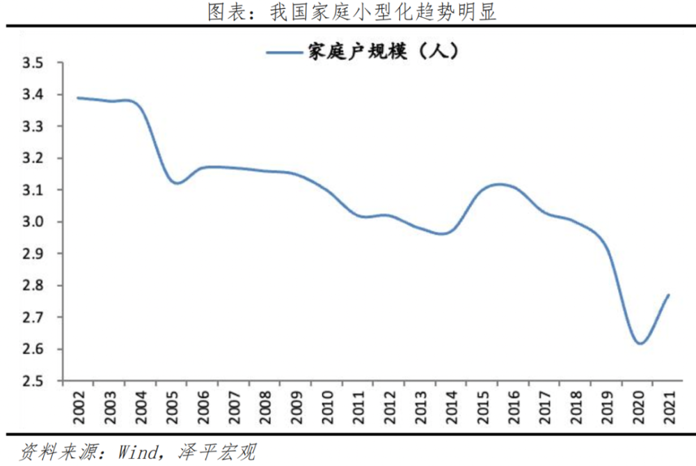

**7 性别比持续改善，男性比女性多3337万，农村“剩男”和城市“大龄剩女”问题突出**

**性别比逐渐改善，2022年总人口性别比为104.7，较2021年略有降低，处于历史低位水平。**
2022年男性、女性人口分别为72206、68969万人，占比分别为51.2%、48.8%，男性比女性多3337万，总人口性别比（以女性为100，男性对女性的比例）为104.7，较2021年略有降低，目前处于历史低位水平，“重男轻女”的错误思想有明显改善。

分省看，2021年，辽宁、河北2省人口性别比在100以下，吉林、黑龙江、河南、青海、四川、重庆等16省介于100-105，湖南、天津、湖北等10省介于105-110，西藏、广东、海南在110以上。整体看，东北呈现“女多男少”的特点，辽宁、吉林、黑龙江分别为97.6、100.3、100.4，人口大省广东性别比高达111.7。

**需要注意的是，男女比例失衡、女性意识觉醒等原因造成婚姻市场匹配困难，农村“剩男”和城市“大龄剩女”问题突出。**

第一，男女比例失衡。比如00后男女性别比达119，男性比女性多近1300万，90后男女性别比达110，男性比女性多近900万。

第二，女性多偏好不低于自身条件的男性，男性多偏好不高于自身条件的女性。

婚姻成本越来越高，男性在婚姻市场的主动性受家庭资源、财富水平的影响。经济发展和受教育水平提高给女性提供了更多就业机会，社会地位上升。女性不再只作为“家庭主妇”，而是进入职场实现自己的人生价值。

高学历女性往往偏好不低于自身条件的男性，在事业发展期面对巨大的恋爱、结婚、养育等成本时，如果没有遇到物质与理想同时匹配的择偶对象，更倾向选择不婚甚至不恋，加大婚姻市场匹配难度。

**2020年，中国30岁及以上未婚男性有超过60%分布在村镇、为高中以下学历；未婚女性有超过60%分布在城市、为高中以上学历。**

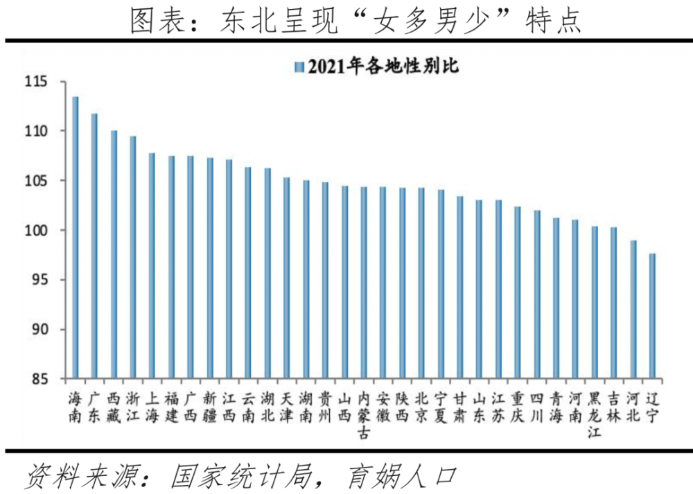

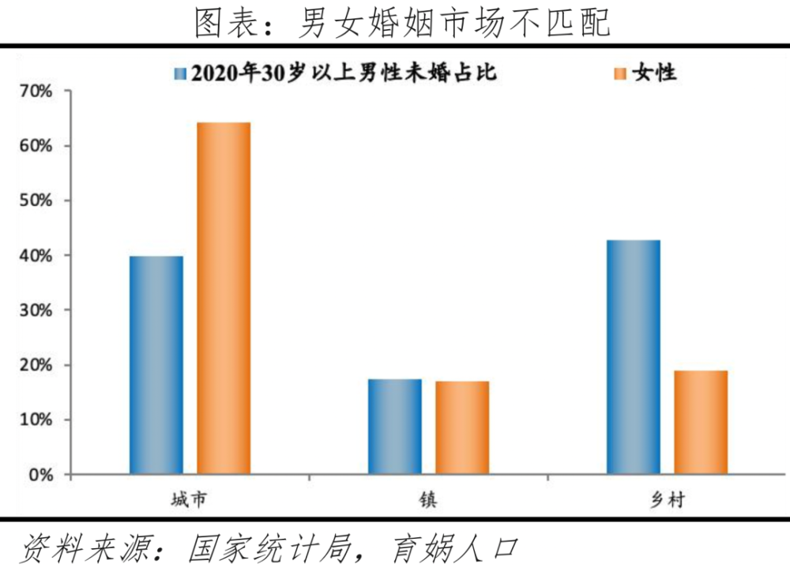

**8 人户分离人口规模扩大，户籍制度亟待改革**

**人口流动规模持续扩大，流动趋势明显，2020年人户分离人口、市辖区内人户分离人口、流动人口分别比2010年增长88.5%、192.7%、69.7%；2021年人户分离人口、市辖区内人户分离人口、流动人口继续同比增长2.2%、1.7%、2.4%。**
人户分离是指居住地与户口登记地所在的乡镇街道不一致且离开户口登记地半年以上的现象，与户籍制度、经济发展联系密切。2021年常住人口城镇化率64.7%，但户籍人口城镇化率仅为46.7%，低于常住18个百分点。

根据普查数据，2020年，人户分离人口为49276万人，其中，市辖区内人户分离人口为11694万人，流动人口为37582万人，跨省流动人口达12484万人。与2010年相比，人户分离人口增长88.5%，市辖区内人户分离人口增长192.7%，流动人口增长69.7%。根据抽样调查数据，2021年人户分离人口为5.04亿人，其中，市辖区内人户分离人口为1.19亿人，流动人口为3.85亿人。与2020年相比，人户分离人口增长2.2%，市辖区内人户分离人口增长1.7%，流动人口增长2.4%。

**分地区看，东、中、西部吸收人口流动比例差异明显，东部地区吸收跨省流动人口能力强。**
其中，2020年，东部地区吸收跨省流动人口9181万人，占比达73.54%；中部地区吸收955万人，占比是7.65%；西部地区吸收1880万人，占比15.06%；东北地区吸收468万人，占比仅3.75%。

**以上数据说明我国新型城镇化战略持续推进，但另一方面也反映了户籍制度改革滞后于人口流动趋势，人地挂钩机制不完善，流动人口的基本公共服务不公平化，同一城市内教育、医疗等资源分配不均等。应当尽快建立人地挂钩机制，推动基本公共服务按照常住人口配置。**

**9 人口向城市群都市圈集聚，东北、西北人口持续流出**

**人口进一步向经济发达区域、大都市圈城市群集聚但分化加大，6个人口萎缩省份全部位于北方，人随产业走，人往高处走。**

2010-2020年东部人口占比上升2.15个百分点，中部下降0.79个百分点，西部上升0.22个百分点，东北下降1.20个百分点。2020年东部、中部、西部、东北地区人口占比分别为39.93%、25.83%、27.12%、6.98%。分省看，2020年广东、山东2省人口超1亿，分别为1.26、1.02亿，合计占全国的16.1%。

河南、江苏、四川等9省人口在5000万-1亿，云南、江西、辽宁、福建、陕西等17省人口在1000万-5000万，宁夏、青海、西藏不足1000万。10年间甘肃、内蒙古、山西、辽宁、吉林、黑龙江等6省人口萎缩，分别减少55.5万、65.7万、79.6万、115.5万、337.9万、646.4万人，全部位于北方，人们用脚投票，奔向南方。

**研究发现，改革开放以来，中国人口迁移经历了从“孔雀东南飞”到2010年后的回流中西部，再到近年的粤浙人口再集聚和回流中西部并存。城市层面，人口持续向少数核心城市集聚。**

一、二线人口持续流入但增速放缓；三、四线城市人口持续净流出。都市圈层面，人口向大都市圈集聚，但分化加大。城市群层面，人口进一步向核心城市群集聚。从国际看，美国人口迁移呈现两个特点：一是在地区层面，从向传统工业主导的铁锈8州集聚，到向能源、现代制造和现代服务业主导的西海岸、南海岸集聚。二是在城乡层面，人口在城市化中后期明显向大都会区集聚。日本人口随产业持续向大都市圈集聚，但在1973年左右从向东京圈、大阪圈、名古屋圈“三极”集聚转为向东京圈“一极”集聚。

**人口集聚分化促使房地产市场不断分化，需求向大都市圈大城市群集中，在少子老龄化背景下，未来房地产市场将更加分化，但人地分离、供需错配，一二线城市高房价、三四线高库存。**

中国城镇化战略长期存在“控制大城市规模、积极发展中小城市”的倾向，与人口迁移趋势背离。分地区看，2010-2020年东部城市建设用地增速低于城镇人口增速3.3个百分点；而中部、东北、西部分别高20.3、17.4、24.3个百分点。

分规模城市看，2010-2020年1000万人以上城市城区人口增长25.4%，但土地供给仅增长2.6%；20万人以下城市人口增长22.8%，土地供给增长47.8%。人地分离、供需错配，导致一二线城市高房价、三四线高库存。而且货币超发使得广义货币增速多高于名义GDP增长，尤其刺激供给短缺、优质公共资源富集的一二线城市房地产价格快速上涨。尽管近年中国城市发展战略逐渐调整为“以中心城市为引领，以城市群为主体形态，以都市圈建设为突破口，对中小城市分类施策”，但任重道远，共识还未形成。

**为促进房地产市场平稳健康发展，建议以人地挂钩和金融稳定为核心加快构建房地产长效机制，建立居住导向的新住房制度，更多发挥房地产实体经济功能，回归居住属性和制造业属性。**

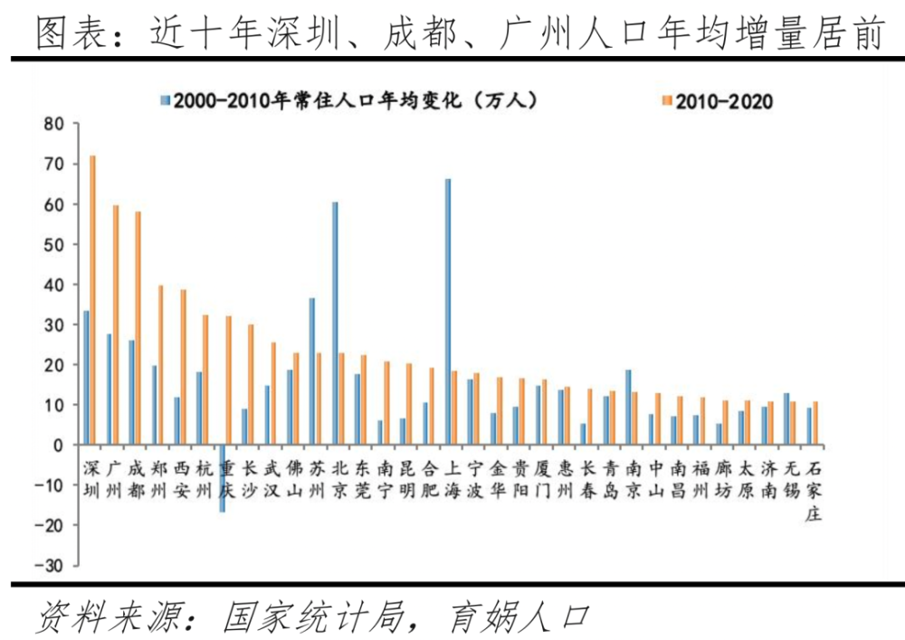

**10 受教育程度提高，但社会阶层固化现象需重视**

**2010-2020年具有大学文化程度的人数增长73.2%，15岁以上人口平均受教育年限提高9.1%，文盲率由4.08%降至2.67%，受教育程度大幅提高，人口红利转向工程师红利。**

**从受教育程度看，**
2020年具有大学、高中、初中、小学文化程度的人口占比分别为17.2%、16.8%、38.4%、27.6%。与2010年第六次全国人口普查相比，每10万人中拥有大学文化程度的由
8930 人升为15467人，拥有高中文化程度的由14032人升为15088人，拥有初中文化程度的由
38788人降为34507人，拥有小学文化程度的由26779人降为24767人。

分区域看，2020年北京、上海具有大学文化程度的人口占比大于30%，学历水平高；内蒙古、江苏、陕西、宁夏等20省介于20%-30%，四川、河北、湖南等8省小于20%。

**从受教育年限看，** 15岁及以上人口的平均受教育年限由9.08年提高至9.91年，提高9.1%。文盲人口3775万人，文盲率由4.1%降为2.7%。

分区域看，2020年北京、上海、天津15岁及以上人口平均受教育年限大于11年，受教育程度较高，山西、广东、辽宁等10省介于10-11年，黑龙江、湖南、河北等14省介于9-10年，青海、云南、贵州、西藏4省在9年以下。

**但近年社会阶层流动放缓，名校录取中来自农村和寒门的比例下降。**
我国收入基尼系数由2015年的0.462升至2021年0.466，税前收入前10%的人群收入占比由2000年的35.56%升至2019年的41.43%。

1978-1998年北大清华等名校农村学生超三成，90年代中期开始下降。2021年清华在内地招生约3500名，农村及专项计划实施区域学生占21%，若没有针对贫困地区的专项计划，清华农村生源比例不到一成。

此外，就像中国香港年轻人被一套房子绑架一生，高房价抑制了社会阶层流动和年轻人奋斗的梦想。

住房制度决定房地产市场。全球各经济体房地产市场表现差异极大，有的陷入高房价困境，带来各类经济和社会问题，如中国香港和英国；有的暴涨暴跌，引发金融危机，如美国和日本；有的房价长期稳定，居者有其屋，如德国和新加坡。

1998年内地住房制度改革学的是中国香港、中国香港学的英国（参考畅销专著《房地产周期》《全球房地产》）。
**加大教育投入、调节收入分配、促进教育公平、加快推动人地挂钩和金融稳定的住房制度改革等日益重要。**

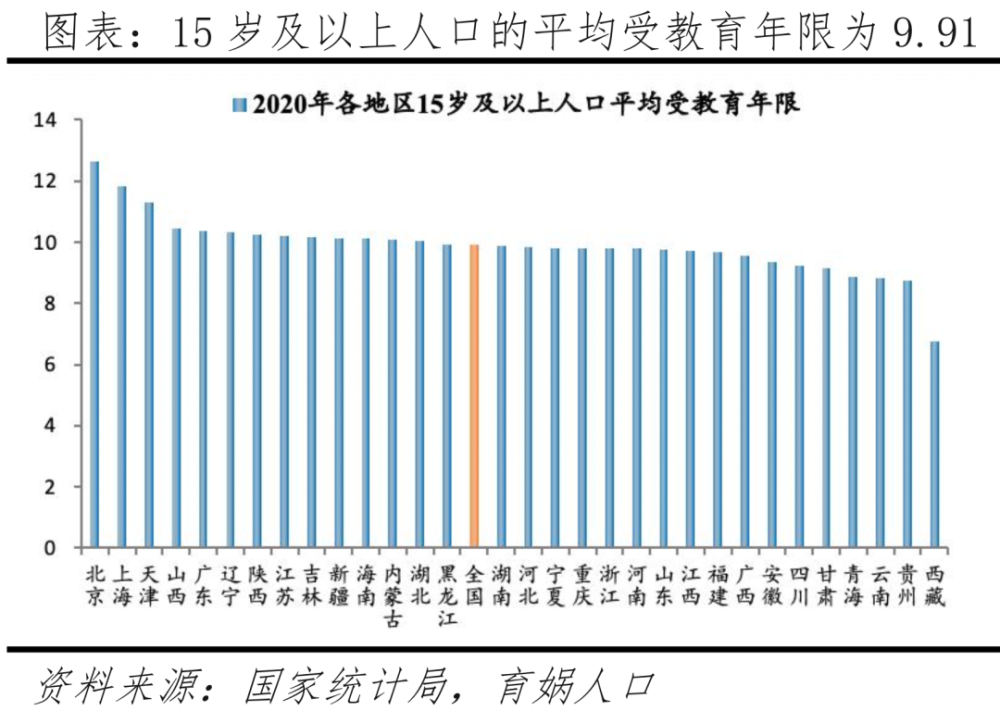

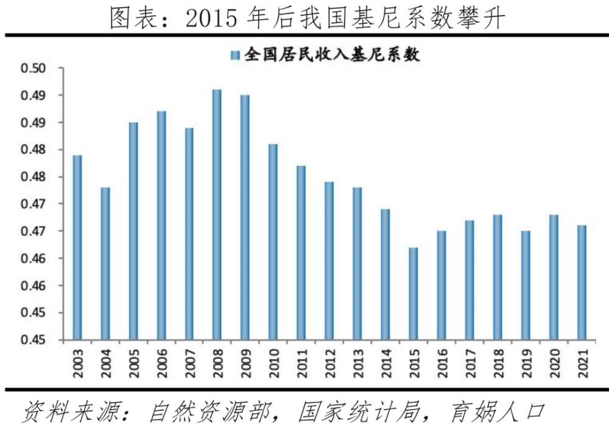

**11 全面放开并鼓励生育刻不容缓，加快构建生育支持体系**

**我国老龄化、少子化、不婚化在“十四五”时期扑面而来，将影响中国经济社会长远发展。**
人口既是经济社会发展的根本目的，也是经济社会发展的基础要素。生育政策调整是最根本、最重要的供给侧结构性改革，放开并鼓励生育大势所趋。

**尽快全面放开生育，让生育权重新回归家庭。**
全面放开生育，将是否生育、生育几个孩子、什么时候生育的权利还给家庭，由每个家庭自主决定生育的孩子数量。全面放开生育，原本不想生的人还是不会生，但一些想生三孩的人能生，不用担心部分人群、部分地区会大幅多生导致出生人口激增。

**加快构建生育支持体系，大力鼓励生育。**

一是实行差异化的个税抵扣及经济补贴政策，覆盖从怀孕保健到18岁或学历教育结束。

二是加大托育服务供给，大力提升0-3岁入托率从目前的4%提升至40%，并对隔代照料发放补贴。

三是进一步完善女性就业权益保障，并对企业实行生育税收优惠，加快构建生育成本在国家、企业、家庭之间合理有效的分担机制。

四是加大教育医疗投入，给予有孩家庭购房补贴，降低抚养直接成本。

五是加强保障非婚生育的平等权利。

六是建立男女平等、生育友好的社会支持系统。

七是完善辅助生殖顶层设计，给有需求家庭定向发放辅助生育补贴券，促进合理需求充分释放。

**积极应对人口老龄化，打造高质量为老产品和服务体系，建设老年友好型社会。**

一是加快推动社保全国统筹，发挥养老保障体系中第二、三支柱的重要作用。

二是构建老有所学的终身学习体系，鼓励企业留用和雇佣年长劳动力，推进渐进式延迟退休政策。

三是加大养老产业金融支持探索，优化养老服务供给，打造高质量的为老服务和产品供给体系。

四是建设老年友好型社会，大力发展“互联网+养老”的智慧养老服务体系，推进适老化改造，保障老年人高质量、有尊严的退休生活。

**我们正处于人口大周期的关键时期，应该高度重视老龄化、少子化、不婚化的新形势新趋势。好在社会已经基本形成共识，开始关注生育问题，积极出台完善生育支持体系的政策、积极应对老龄少子化。**

相信经过一系列长短结合的措施，中国生育率一定能触底回升，人口结构有望逐步改善，从而实现人口长期健康均衡发展。

