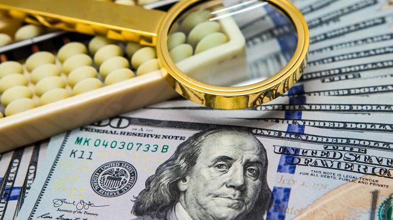
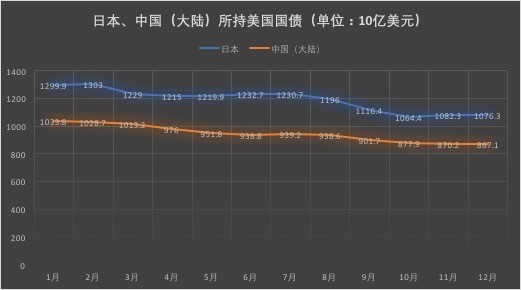

# 中日两大“债主”去年齐抛美国国债，中国持债创2010年来新低

美东时间2月15日，美国财政部公布2022年12月的国际资本流动报告（TIC）。至此，2022年全年的TIC数据也已经披露，最前披露的数据较之前披露有所修正。

目前，日本、中国（大陆）分别为美国国债的前两大“债主”。根据最新数据，日本12月所持美国国债环比11月减少60亿美元至1.0763万亿美元；中国12月所持美债环比11月减少31亿美元至8671亿美元。

中国连续五个月减持美债，且美债总持仓续创2010年6月以来新低。从去年4月以来，中国对美国国债的持仓连续八个月低于1万亿美元。

从2022年全年来看，日本减持美国国债2245亿美元，中国减持美国国债1732亿美元。

_中国、日本2022年所持美国国债走势。（澎湃新闻记者
陈佩珍整理）_

**受美联储连续大幅度加息影响**

2022年，美联储连续大幅度加息，牵动着全球经济。

根据澎湃新闻梳理，美联储在2022年加息7次，累计加息幅度达425个基点。

美联储分别于2022年3月、5月、6月、7月、9月、11月、12月加息25、50、75、75、75、75、50个基点，年内连续四次加息75个基点的加息速度为近40年来最快。

一般来说，当美债收益率处于上行阶段，投资者会倾向于减持美债资产以降低资产损失，当美债收益率下行时再增持。

2022年，美国10年期国债收益率因美联储较为“鹰派”加息曾一路高涨，在去年11月公布的美国通胀数据超预期回落后，美联储开始放缓加息，美国10年期国债收益率有所下行，同时全球汇、债得以喘息。

根据2022年的TIC数据，日本在美联储2022年第一次加息的3月和连续第三次加息75个基点的9月减持美债数额较大，分别为740亿美元和796亿美元。

美联储去年9月议息会议上连续第三次加息75个基点后使得日本的汇、债承压。

去年9月，日本一方面大幅度减持美国国债，一方面年内第一次出手干预外汇市场。

**全球宏观市场的不确定性仍存**

美联储3月将迎来新的议息会议，日本央行也将迎来新行长，两者均会对全球宏观市场产生重要影响。

最新的宏观数据方面，美国劳工统计局2月14日发布的数据显示，美国1月CPI连续第七个月降温，同比增6.4%，增速仍高于预期，环比增0.5%为三个月最高增速。

此前，多位美联储官员“鹰派”发声警告，若通胀压力持续存在，可能促使美联储加息至超过预期的水平。

日本方面，今年2月14日，日本政府正式提名植田和男为下一任日本央行行长。

学者出身的植田和男出生于1951年9月20日，1974年毕业于东京大学理学部，之后在麻省理工大学研究生院从事研究活动，1993年开始担任东京大学经济学部教授。

值得一提的是，植田和男和2022年诺贝尔经济学奖得主、美联储前主席本·伯南克师出同门。

美国前财长萨默斯在前几日的一次采访中表示：“可以把植田和男看作是日本的伯南克。他和伯南克差不多同时在麻省理工大学学习，他们的论文导师都是前美联储副主席斯坦利·费希尔（Stanley
Fischer）。”

此前，市场预期“鸽派”雨宫正佳（现任日本央行副行长）为日本央行行长人选，如果雨宫正佳当选，则日本央行大概率延续目前的宽松政策，植田和男的提名为日本货币政策带来一些不确定性。

国泰君安研报指出，“由于植田不是现任央行官员，市场也因此预期其在主导货币政策正常化上不会有太重的历史包袱。”

日前，植田和男被媒体问及对日本目前货币政策的态度时，他表示，“金融政策必须基于景气和物价的现状以及前景来运行，从这一观点来看，我认为现在日本央行的政策是适当的。我认为目前有必要继续实施宽松货币政策”。

2022年7月，当日本央行的宽松政策受到批评时，植田和男在日经新闻专栏中表示，“应该避免操之过急的紧缩政策”。

