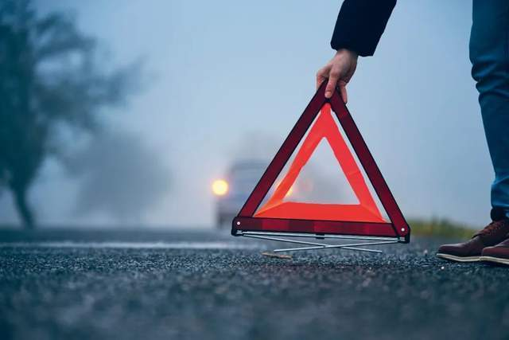

# 夫妻吵架妻子跳车身亡，乘客跳车司机该担何责？

自“长沙跳车案”后，又一起跳车案引发热议。

这次身处车中的，是一对夫妻。2020年9月28日，男子额某某驾驶小轿车前往内蒙古阿拉善左旗巴彦浩特镇通古淖尔牧区，其妻子朝某某从车辆后车门跳车，落地后因严重颅脑损伤死亡。

内蒙古自治区阿拉善左旗人民法院审理查明，额某某驾驶车辆行驶过程中，与坐在后排座右侧位置的妻子朝某某“因是否需要去牧区看望女儿问题发生争吵、争执”，朝某某“突然自行”打开车辆后车门后跳车。法院认为，被告人额某某“因过于自信”的过失致一人死亡，其行为已构成过失致人死亡罪。因此判处有期徒刑二年，缓刑三年。

中国政法大学刑事司法学院教授阮齐林告诉《中国新闻周刊》，对于乘客跳车死亡的案件，并不是每个案件的司机都要因过失致人死亡罪承担刑罚，具体要看每个跳车案的案情，而根据案情不同，要有故意和过失才会承担刑事责任，对于不可预见的情况，则不应当承担刑事责任。

**司机的责任**

在朝某某跳车案中，额某某辩护人提出，“被害人突然跳车后被告人始料不及，并且及时停车急救并拨打120呼叫救护车为挽救被害人争取宝贵的时间。被告人从事发到案的全过程始终没有拒绝、逃避、抗拒，主动交代犯罪事实，认罪态度好，系初犯，无犯罪前科，积极与被害人家属协商赔偿事宜并取得谅解。”

辩护人还指出，额某某虽然过失致人死亡，但没有主观恶性。已经死亡的朝某某有重大过错，她因为想去吃火锅而拒绝看望女儿引发本案。

然而，法院只认可了额某某自首情节、认罪态度好、系初犯、无犯罪前科的辩护意见，并认为“其他辩护意见与本院查明的事实不符，且于法无据，本院不予采纳”。在量刑时，法院考虑被告人额某某与被害人家属达成和解协议并取得书面谅解、自愿认罪认罚，依法可以从宽处罚。

最终，额某某因过于自信的过失致一人死亡，构成过失致人死亡罪，被判处有期徒刑两年，缓刑三年。额某某无须进监狱服实刑，辩护人说，这有利于额某某照顾年幼的孩子，并尽快偿还被害人留下的巨额债务。

此事在舆论场引发了争议，很多人提起2021年2月发生的“长沙跳车案”。同样是汽车内的狭小空间，乘客跳车，司机周阳春因过失致人死亡罪被判处有期徒刑一年，缓刑一年。

但与上述案件不同的是，周阳春因等候装车时间长且两次提议收费搬运服务被拒，在运输服务中态度恶劣，多次无视车某反对偏航的意见，行车至较为偏僻路段，导致车某心生恐惧而离开座位并探身出车窗，最终坠亡。

法院认为，周阳春发现了车某的危险举动后已经预见到车某可能坠车，但轻信可以避免，未及时采取有效措施以致发生车某坠亡的危害结果。周阳春的过失行为与车某的死亡结果之间具有刑法上的因果关系，其行为已构成过失致人死亡罪。

《中国新闻周刊》记者以“跳车”和“过失致人死亡罪”检索裁判文书网，获得了超过200条结果。在司机被判犯过失致人死亡罪的案例中，不少司机是因为被害人要求停车并且准备跳车，但其仍未停车而继续驾驶。

比如2018年7月发生在陕西的一起案件，被害人三次要求停车，司机都未予停车。第二次要求停车时，被害人即拉开右侧车门准备跳车，但被其他乘客阻止；第三次被害人要求司机停车时喊道“不停车便跳车”，同时拉开车门从车内跳下。被害人因颅脑损伤死亡，司机犯过失致人死亡罪，被判处有期徒刑二年，缓刑三年。

也有乘客与司机争吵时未要求停车，之后却跳车的，司机也承担责任的判例。2016年10月发生在山东一起案件中，司机与乘客是男女朋友关系，两人在上车前因琐事通过电话发生争吵。在车上，两人因分手再次发生争吵，后来乘客拉开面包车右侧车门跳车，后因严重颅脑损伤死亡。2014年8月发生在贵州的案件中，司机与乘客同样是男女朋友关系，两人因经济问题发生争吵，被害人打开副驾驶的车门跳车，因颅脑损伤死亡。这两起案件中司机都因过失致人死亡承担刑责。

而在2016年7月20日凌晨的广东，发生了一起司机宣判无罪的案例。出租车司机李某向两位乘客索要车资人民币51元，两人质疑车资过高而拒绝支付并下车，李某下车阻拦并拨打报警电话，两名乘客要求到指定地点，李某则驾车搭载二人回始发地。途中，乘客邓某要求下车并拉开右后方车门，被另一乘客阻止，邓某再度要求下车，但司机李某没有理睬继续行驶，过了一阵，邓某从后方玻璃处跳车，造成重伤二级。

对于这起案件，两审法院认为，根据现有证据证实本案的引发系因被害人邓某拒绝支付车资所起，邓某的损伤亦是其自行从车后座车窗跳出所致；本案中并无证据证实被告人李某有危险驾驶或违反交通法规的行为，被告人李某主观上不具有过失，客观上没有实施直接致被害人受伤的行为，其驾车行为与邓某的损伤结果之间不存在刑法上的因果关系，故原公诉机关指控李某犯过失致人重伤罪不成立，判决李某无罪。

为何李某无罪？四川鼎尺律师事务所主任万淼焱告诉《中国新闻周刊》，她留意到，李某案中除了司机和跳车的乘客，现场有第三名目击证人，这或许使办案机关取得了更多证据，坐实了其没有预见到乘客跳车的的行为，因而无责。

**过失与不作为犯罪**

中国人民大学刑事法律科学研究中心主任时延安告诉《中国新闻周刊》，乘客跳车后司机承担刑责的案件多属于不作为犯罪。

何为不作为犯罪？时延安指出应考虑几个要素。首先，不作为人要有作为义务，同时被害人或者被损害的财产利益等处于危险状态，而这一危险状态处于不作为人能够控制的范围之内；其次，不作为人有能力来防止危险转化为实害；再次，危害结果与不作为人违反作为义务的行为具有因果关系，且能够归责于不作为人；最后，不作为人具有故意或者过失。

针对跳车案，他分析，首先要判断司机是否有作为义务，即对乘客非正常下车这种危险行为是否有阻止义务，一般来讲，司机有这种义务，尤其是从事客运的司机；其次要判断司机是否有能力阻止，如果司机发现存在乘客跳车的危险就及时停车，就不会发生跳车行为，说明司机是具有及时防止乘客跳车行为能力的。

当然，也存在司机没有能力阻止的情况。时延安说，比如司机正在驾驶时，乘客毫无征兆地打开车门，或者司机在停车过程中，乘客未等停车就跳车的，都可以认为司机当时没有能力阻止结果发生。另外，在多因一果的情况下，也要考虑这个危害结果能否归责司机。“简单地说，就是由司机承担是否合理的问题。”时延安说，如果乘客先行干扰司机，在司机专注于控制车辆正常行驶时，乘客跳车的，其伤亡结果不能由司机来承担。

在朝某某跳车案中，万淼焱认为，客观层面来说作为司机的丈夫额某某没有实施将被害人朝某某强行推下车以及其他犯罪行为，两人在车上进行的争吵也不能被视为是危害行为，所以被害人死亡的结果，从客观层面来看不应被归因司机的作为，只能视为是被害人自陷风险所导致。

但从法益对象的保护义务角度来看，万淼焱认为，额某某作为司机，对于作为乘客的妻子有基于“司机—乘客”的特定领域保护义务，“额某某是轿车这一特定领域的临时管理者，他对于该特定领域因高速行驶而产生的危险有排他性的支配作用，司机与乘客形成了一种实质上的依赖关系，通俗地说，额某某手上掌握了朝某某的命运”。因此她认为，无论是从额某某的履行能力上看，还是从救助与否的因果关系上来说，额某某都存在不作为的行为。

而从意图来看，刑法将犯罪行为主要分为故意犯罪和过失犯罪两类，过失犯罪又具体分为疏忽大意的过失和过于自信的过失，万淼焱说，“应当预见而没有预见是疏忽大意的过失，已经预见但轻信自己可以避免是过于自信的过失。”

但从主观角度分析，万淼焱认为，额某某案有模糊之处，因为过于自信的过失和意外事件的区别主要在于“有无预见的可能性”，而在该案中，无论是检察院的起诉书还是法院的判决书，均没有详细写明死者跳车前，双方在车内发生了什么、死者朝某某有无表达要跳车的意愿或者朝某某曾有意图跳车的行为，判决书仅将这一过程表述为“朝某某突然自行打开车辆后车门跳车”，如果仅根据这一模糊的事实，无法判断被告人额某某是否能够预见死者跳车的可能性。

阮齐林也持有相同的观点。他认为，朝某某跳车案发生在仅有两人的密闭空间中，无法准确判断妻子跳车前车内究竟发生了什么。他分析，“妻子因为要吃火锅不去看女儿而跳车”不符合常理，但妻子在跳车前的心态行为究竟如何，已经“死无对证”，这也是内蒙古当地法院最终并未认定辩护人提到的“吃火锅”情节的原因。

万淼焱还提到，如果有证据证明妻子的确因要吃火锅而不愿意看望三岁女儿，则属于对未成年人侵权的漠视，侵犯了儿童应当得到父母关爱的权利，可被认定存在过错。

发于2023.2.20总第1080期《中国新闻周刊》杂志

杂志标题：跳车案中，司机该担何责？

记者：苑苏文 实习生：王迪雅

