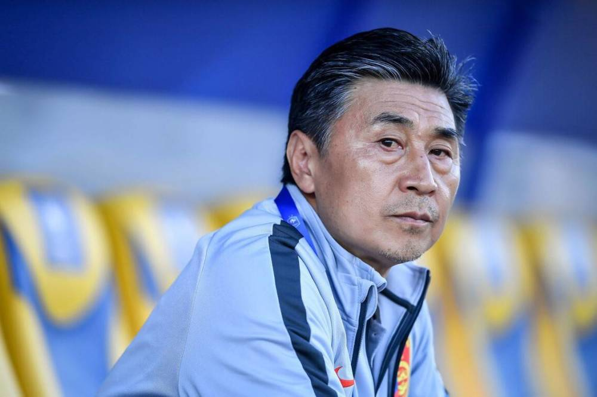
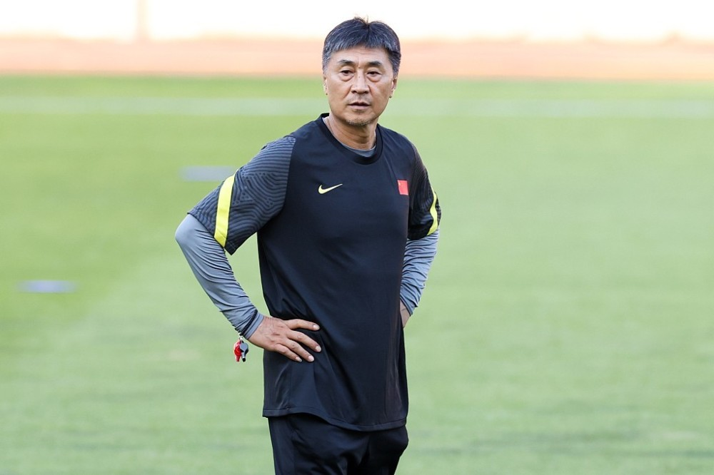
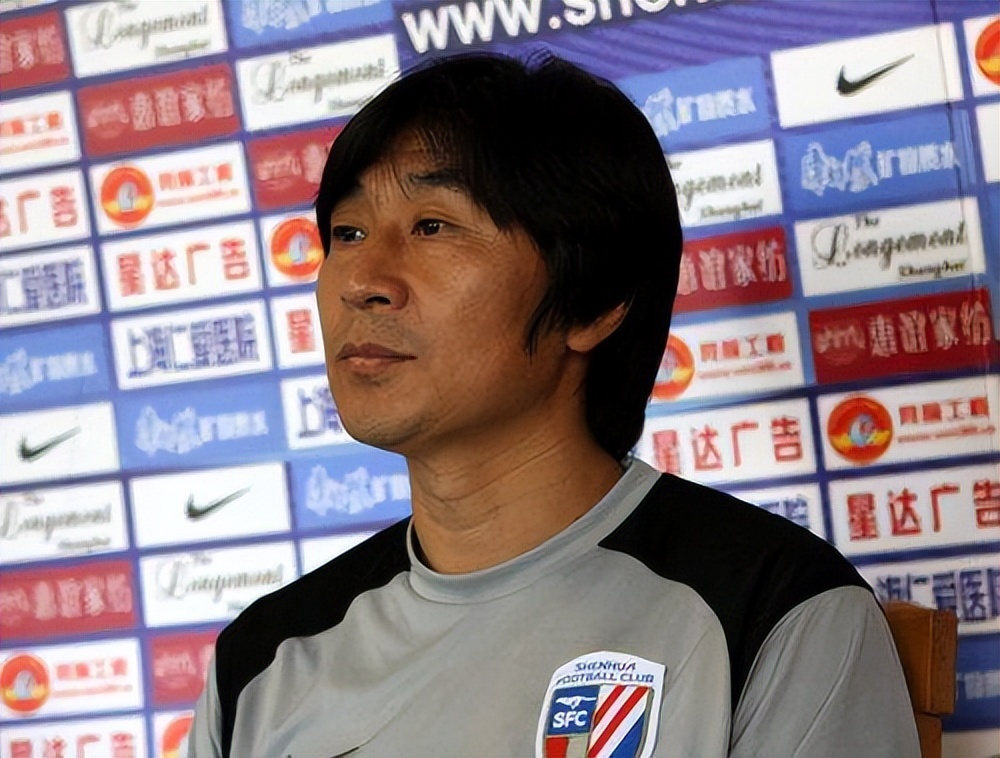

# 媒体人暗示贾秀全被捕！曾涉赌球却全身而退，执教女足雪藏王霜惹众怒

继中国足协话事人陈戌源接受调查后，足坛又一位重量级人物被传“出状况”。据媒体人秦云透露，有一位主教练“二进宫”，而综合目前的情况来看，这一人选所指的显然是前中国女足主教练贾秀全。

在上一次中国足坛的扫黑风暴中，贾秀全就曾经受到波及。2010年初，有媒体曝光贾秀全被相关部门带走调查，而在此期间，贾秀全坦白了自己操纵比赛、打假球等诸多事实，并且供出自己与后来被判刑的前足协高官杨一民等人的关联。

然而，由于出身八一队的贾秀全身份特殊，并且在协助调查期间表现良好，最终他竟被“无罪释放”，关于他的一些黑料也就此不了了之，令人大跌眼镜。不过，逃过一劫的贾秀全也沉寂了相当长一段时间，直到2014年开始担任河南建业主教练，他才算是正式回归主流足坛。

不过，在2018年担任中国女足主帅期间，贾秀全再次引发巨大争议，尤其是雪藏女足头号球星王霜的做法，令许多球迷感到不满。尽管率队拿到了东京奥运会的比赛资格，但是贾秀全的用人却引发外界口诛笔伐，女足在奥运会上羸弱不堪的表现，更是让贾秀全在赛后直接下课。

令人意外的是，这些争议并没有影响到贾秀全在足协心目中的地位。就在前不久，他还被任命为女足形象推广大使。不过，倘若真的确定“二进宫”，那么贾秀全这次能否继续全身而退，恐怕就要打上一个大问号了。

