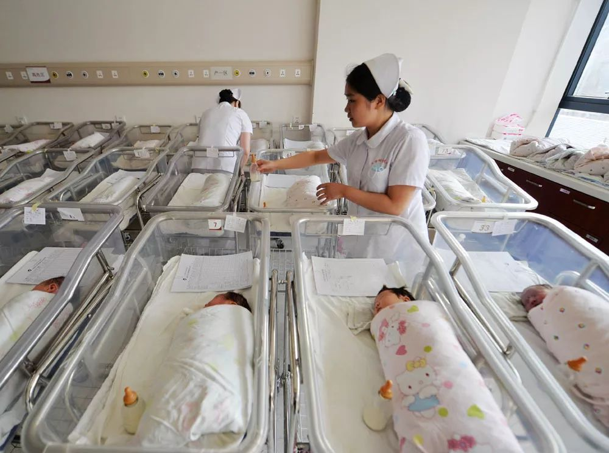

# 媒体：“降低法定婚龄”，不是提高生育率良方

_▲持续走低的社会生育率，让我国面临人口负增长的严峻现实。图/新华社_

近一个时期以来，我国的生育问题广受社会关注。今年1月17日，国家统计局发布数据显示，2022年末我国人口比上年减少85万人，这也意味着，我国将进入人口负增长常态化时期。

这一人口发展现实，令如何提升我国社会生育率的相关议题，更见紧迫。在此背景下，有人再次提出将法定结婚年龄降至18岁，以刺激生育，引发了讨论。

事实上，早在2019年，全国人大常委会审议民法典婚姻家庭编草案时，就有委员提出这一建议，以此调节婚姻人数下降和老龄化上升趋势。当时这一消息也曾迅速成为热搜。

但是，从法律层面看，民法典规定，18周岁以上的自然人为成年人，为完全民事行为能力人，可以独立实施民事法律行为。婚姻权是一项基本民事权利，因此，降低法定婚龄到18岁，其意义主要在还权于民与赋权于民，保障成年人的婚姻家庭权益。

在晚婚情况普遍存在、低生育率已成趋势的背景下，降低法定婚龄到18岁这一措施，对于提高生育率是否有明显作用，尚待现实验证。

_▲养育条件是否具备，直接影响到年轻人的生育意愿。图/新华社_

**降低结婚年龄作用可能不大**

18岁，是国际上普遍认可的成年标志。但我国现行法定结婚年龄男性22岁、女性20岁的规定，明显偏高。如，日本规定男性18岁、女性16岁，美国为男性18岁、女性18岁，印度为男性21岁、女性18岁，德国、法国、加拿大、意大利、墨西哥、西班牙、俄罗斯、澳大利亚等国，则男女均为18岁。

由此也可以看出，18岁即可结婚成家，是多数国家约定俗成的共识。因此，如果将我国的法定结婚年龄降低到18岁，这是同国际接轨，同时也满足了小众人口的愿望。

但是，这一措施对于提高生育率的作用不能寄予厚望。因为，随着社会的变迁，我国年轻人的婚育模式已经转型到极晚婚极晚育的模式。全国已有多地公布的婚姻登记大数据显示，晚婚已经成为一种较为普遍的现象。

如据《中国人口普查年鉴-2020》，2020年，我国平均初婚年龄提高到了28.67岁，其中，男性平均初婚年龄为29.38岁，女性为27.95岁。而在2010年，我国平均初婚年龄为24.89岁，男性平均初婚年龄为25.75岁，女性平均初婚年龄为24岁。10年间，平均初婚年龄推后了近4岁。

在现实生活中，到了18岁就早婚的人口少之又少，而且早婚也未必早孕早育，只是在理论上提供了多生多育的可能性空间。可以说，试图通过降低法定结婚年龄来提高生育率的想法，未免有些简单，18岁允许结婚也不等于18岁就必须结婚。

理想丰满，现实骨感，18岁还是20岁，只是可以结婚的门槛年龄。能否结婚涉及的因素则比较多，譬如能否找到结婚对象，双方是否有结婚意愿，是否具备相应的经济条件等。

我国适婚人群普遍晚婚的趋势说明，降低法定结婚年龄，对于提高已婚生育率作用，恐怕并不会如想象那么大。

_▲提升社会生育意愿，也需照顾到女性职业发展需求。图/新华社_

**提振生育率仍需从源头做起**

2022年末，全国人口141175万人，比上年末减少85万人，2022年因此成为人口负增长元年，我国将由此进入人口负增长常态化时期。而这也将让我国面临少子化、老龄化、过度城市化以及国际移民输出的多重挑战。

问题的关键是，目前已经出现了以不婚不育和晚婚晚育为主体的低生育文化，决定着年轻人的生育意愿和生育行为。

“人口即命运。”正如18世纪法国思想家孔德所说，低生育率人口问题乃中国的“国之大者”，将极大影响未来中国的国运民生。人口安全问题，也将成为非传统安全的重要一维，成为新国家安全的重要组成部分。

为此，自2016年全面实施两孩政策以来，如何回应生育率持续低迷的挑战，从源头上提振生育率到适度水平、打造生育友好型社会已经有了高度共识，亦成为优化人口发展战略的当务之急和重中之重。

建议将法定结婚年龄降至18岁，以促进生育，无疑也是对此严峻现实的积极回应。但是，要提高我国社会生育率，仍需针对我国目前主要面临的不敢生、不愿生、不能生情况，切实有效进行分类施策。

“不敢生”的原因是怕养不起、养不好。这需要从人的生命历程出发，建立大生育观念，降低婚嫁、生育、养育和教育的成本，国家和政府要拿出真金白银给予补贴，让每一个家庭生得起养得好孩子。这是国际上应对低生育危机的普遍对策，我国部分地方也已有一些探索，但力度要加大、进度要加快。

“不愿生”主要是指生育意愿低下，而不仅仅是养育条件是否具备。可以观察到，我国生育意愿出现了代际弱化的倾向，一代不如一代。这也直接导致我国育龄妇女生育意愿持续普遍走低。

而经济负担重、子女无人照料和女性对职业发展的担忧等因素，已经成为制约生育的主要障碍。为此，需要传播积极的种族繁衍文化和多样化适度生育文化，创造条件激发生育热情。

“不能生”则主要是指不孕不育症、人工流产等生殖健康问题。目前，我国不孕不育症发病率逐年上升，约占总人口的12.5%-15%。为不孕不育症患者提供优质的生殖健康基本公共服务，如将辅助生殖技术项目纳入医保等，也因此有其现实意义。

同时，也应纠正无痛人流的误导，设法降低人工流产比例，保护育龄女性的生殖健康和生育力，积极挖掘生育潜力。

总之，生育既是家事亦是国事，面对人口负增长的严峻现实，降低法定结婚年龄是一个应对尝试，但更需多方努力、多措并举，方能有效缓解育龄人群的生育焦虑、切实提振社会生育愿望，确保我国人口可持续发展。

撰稿 / 穆光宗（北京大学人口研究所教授）

编辑 / 何睿

校对 / 吴兴发

