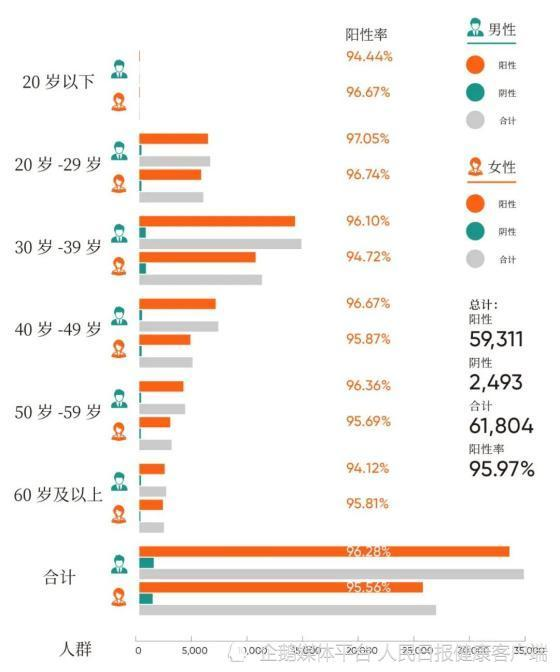

# 新冠病毒抗体IgG阳性率近96％，专家：不建议过度检测

**人民日报健康客户端 谷雨微**

“如果想了解康复后及接种疫苗后抗体水平，或者怀疑自己近期有新冠感染，可以考虑抗体检测，但不建议大家盲目跟风检测抗体。”国家卫健委全国新型冠状病毒专家组成员、北京大学公共卫生学院流行病学与卫生统计学系研究员刘珏在接受人民日报健康客户端采访时表示。

2月14日，爱康集团正式发布《37个城市爱康体检人群新型冠状病毒抗体IgM和IgG检测结果统计分析报告》，该报告数据来源于2022年12月26日至2023年2月8日在37个城市爱康集团旗下体检中心参与新型冠状病毒抗体检测的21830位体检用户，用于评估体检用户新冠感染情况和免疫水平。

_新型冠状病毒抗体IgG检测结果的性别年龄分布。爱康集团报告
图_

**新冠病毒抗体IgM总体阳性率11.97%，少数人还处于感染初期**

该报告数据显示，自2022年12月26日以来，新型冠状病毒抗体IgM的总体阳性率为11.97%，提示随时间推移，“整个社会面上的感染已经明显下降了，少数人还处在感染初期，还有一部分人是因为自身无症状或者还未感染，接种疫苗后导致IgM升高。”北京市丰台中西医结合医院感染科主任王波告诉人民日报健康客户端。

报告指出，在相同年龄段中，男性新型冠状病毒抗体IgM阳性率均高于女性。刘珏表示，“这种差异不一定具有统计学意义，需要进行严格的统计学检验才能得出调查人群性别差异的结论。从数值上看，IgM抗体阳性率在性别上的差异有可能与行为特征不同所致近期暴露与感染风险差异等多种因素有关。”

针对阳性率的性别差异，王波认为，“IgM一般发生在感染后的一周左右，抗体检测的结果也无法标准化，可能本身社会面上男性的活跃性高于女性，或者与男性与女性饮食、卫生习惯不同，导致感染率增高。”

**新冠病毒抗体IgG阳性率近96%，不建议过度检测**

“若一个人IgM阴性、IgG阳性，通常会有两种情况，一是受检测者在接种疫苗一段时间后已经产生了IgG抗体；二是曾经感染过新冠病毒，目前已经“阳康”。”刘珏向人民日报健康客户端表示。

统计数据显示，自2022年12月26日至2023年2月8日，在全国参与新型冠状病毒抗体IgG检测的人群中，约96%的用户检出新型冠状病毒抗体IgG阳性。王波提到，“事实上，单纯的新冠病毒IgM、IgG抗体检测结果不能等同于中和抗体的结果。中和抗体作为有抗病毒活性的抗体，实验监测比较复杂，在临床上一般不作为常规检测方法。我们也无法区分新冠病毒抗体数值较高究竟是由于疫苗接种，还是自然感染造成的，也不代表受检者就绝对安全。”

“96%体检人群有IgG抗体，说明在这次被调查的体检人群中多数已经接种过疫苗或者既往已经感染过新冠病毒。建议大家理性看待检测结果，不论抗体是否阳性，平时仍然要保持良好的健康习惯。”刘珏说。

