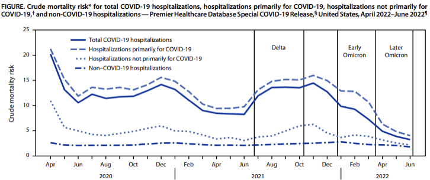

# 新冠病毒真的“消失”了吗？疫情正在进入新阶段

根据中国疾病预防控制中心的通告，2月13日中国内地新冠感染住院病例下降到2.6万人，不到1月5日峰值160多万人的2%，核酸阳性人数也只有高峰时的1.6%。

毫无疑问，我们面对的新冠疫情已经出现了巨大转变。面对巨变，不同人对今后的预期也出现了分歧，有些人开始担心什么时候会有第二波疫情，另一些人则觉得新冠病毒是不是消失了。

虽然我们没有预知未来的水晶球，但我们还是可以尝试根据过去三年多疫情的变化趋势，新冠病毒近期的演变特点和免疫学的基本规律，来分析未来疫情的可能变化。

**中国与全球疫情均在好转**

根据中国疾控中心2月15日发布的《全国新型冠状病毒感染疫情情况》[1]，内地核酸检测阳性人数在2022年12月22日达到高峰694万人，之后逐渐下降，到2月13日只有不到九千人。全国的核酸检测数量在不断减少，会让不少真实的感染病例因为没有检测而无法反映到核酸阳性人数中。可是阳性检出率在12月25日达到29.2%的高峰后也不断下滑，2月13日时已经降低到1.6%，可以佐证中国的感染高峰确实已经过去。

_附图1.
中国内地核酸检测阳性数与检测阳性率变化（来自参考1）_

疫情的好转趋势不仅在中国，根据世界卫生组织（WHO）2月8日发布的新冠流行病学更新，从1月9日到2月5日，四周的时间内，全球新增感染约1050万例，死亡9万多例，比上一个四周时间范围分别下降了89%与8%[2]。

不过这种好转离病毒消失还相去甚远。我们要注意到新冠病毒早已传播到了全球各地。说疫情好转是指新增病例相较过往的高峰出现了大幅下降，与疾病严重程度相关的住院、死亡等也逐步走低，这并不是说新冠病毒就要消失了，或者以后不再有疫情。

参考美国的情况，在2022年初的第一波奥密克戎BA.1疫情冲击过后，当地的疫情也进入一个比较平稳的阶段，可每周新冠死亡人数仍然一直在2000-4000的区间内[3]。即便不再有任何疫情高峰，如果一个疾病每周导致2000人死亡，一年的病死人数也将超过10万，而在美国，这会与糖尿病的每年致死人数相当，位于每年死因前十，是流感与其它肺炎导致死亡总数的两倍左右[4]。显然就算疫情好转了，但新冠病毒没有消失，仍然在造成影响。

**新冠病毒的演变方向意味着它不会消失**

在每月全球仍有上千万人感染新冠的形势下，我们无法说新冠病毒不见了。这种感染病例数还是在全球的新冠检测幅降低的背景下，实际感染病例数会远远超过统计出来的数字。新冠病毒还在人群中传播，没有消失。

从奥密克戎出现后的演变过程来看，新冠病毒恐怕也会一直伴随人类。最早出现的奥密克戎亚株BA.1与BA.2是凭借自身传播力强的基础上又加持了免疫逃逸强，从而取代了其它病毒株，成为全球的主流。在过去一年多的时间里，我们看到BA.5，BQ.1，XBB等突变株系不断取代之前的主流奥密克戎亚株。这种亚株间的互相取代往往是基于免疫逃逸上不断加强，带来的适应性优势。

例如BA.5感染后人体会对BA.5形成较高的中和抗体滴度，防止二次感染。可是BQ.1与XBB这些病毒株对BA.5也存在免疫逃逸，使得BA.5感染形成的中和抗体对它们来说滴度并不高，提升了二次感染的可能性。

免疫逃逸上的不断进化不仅让新冠病毒可以突破疫苗构建的免疫屏障，也能突破过往感染的阻拦，犹如不断突破“自我”。参考国外的一些病毒基因组跟踪，新冠病毒的自我突破还极为迅速，例如美国的主流奥密克戎亚株几乎是3-4个月一换，全世界也存在大量不同的亚株在各个地区流行[5]。

_附图2.
新冠主流病毒株正以极快的速度更替（来自参考5）_

加之我们人体对于新冠这类呼吸道病毒很难形成持久的足以阻断感染的免疫防护，新冠病毒实际上永远有大量的易感人群。已经扩散到全球各个角落的新冠，自然也会继续在各地传播、演变，不会消失。

**疫情正在进入新阶段**

虽然新冠病毒会一直存在，但疫情已经逐渐进入了一个新阶段。乐观地看，我们无法告别新冠病毒，却有希望告别疫情，至少是严重的疫情。

参考经历过多个奥密克戎亚株冲击的地区（如美国等地），会发现疫情的影响对绝大部分人群是逐渐走低。

以往，美国各年龄段的新冠住院率都会随着一个新突变株的出现而升高。但自2022年4月后，新突变株带来的疫情反复只在老年人中引发了住院率的上升。年轻人中的住院率一直维持在较低水平[6]。

_附图3.
2022年4月后随疫情波动，美国老年人新冠住院率有增加，而年轻人则变动很少（来自参考6）_

而早在2022年9月，美国CDC的一项研究即显示因新冠住院的患者病死率从德尔塔时期（2021年7-10月）到奥密克戎早期（2022年1-3月）再到奥密克戎晚期（2022年4-6月），呈明显下降趋势[7]：

_附图4.
美国德尔塔到奥密克戎时期因新冠住院病人的病死率显著下降（来自参考7）_

也就是说新冠病毒虽然没有消失，但新冠感染的严重性下降了。

为什么会出现这种现象呢？除了奥密克戎病毒株相对过去的德尔塔在致病性上有下降外，更为关键的是人群免疫水平的变化。

前文提到奥密克戎各亚株在免疫逃逸特征上不断演变进化，人体对呼吸道病毒又无法维持长久的免疫防护，这些都是针对防护新冠病毒的感染而言，相比之下，针对新冠重症的免疫防护更为长久。这也符合免疫学的原理，阻断呼吸道病毒感染更依赖于中和抗体，特别是在呼吸道黏膜处的中和抗体滴度，而人在没有接触到病原体时，对应的中和抗体滴度会自然衰减，奥密克戎的免疫逃逸也专注在对中和抗体的逃逸。可是防护重症时，免疫系统中的免疫记忆、细胞免疫等均得以调动，相比中和抗体，这些会更持久，也更少受新冠病毒突变的冲击。

如今全球超过50亿人都全程接种了新冠疫苗[8]，反复的自然感染也在带来对新冠免疫防护的加强，这使得在世界范围内，人们对新冠的免疫基础处于一个较高的水平。随之而来的，则是新冠重症风险的下降。

不仅人群免疫水平的提高降低了重症风险，一些有效的新冠抗病毒药药物的使用也降低了高危人群的重症、死亡风险。看到全球范围内新冠重症、死亡与感染人数的脱钩，世界卫生组织也在1月30日指出：新冠虽然还是影响全球的紧急公卫事件，但新冠疫情已经进入了转折点[9]。

**如何应对不会消失的疫情？**

如果新冠病毒不会消失，那是否意味着我们可以高枕无忧，静待病毒变得更温顺驯良呢？

绝非如此！面对不会消失的新冠病毒，我们还是要主动应对，世界卫生组织提出的疫情进入转折点，其实是需要我们去推动社会更平稳地走出疫情，而不是忽视新冠病毒的存在。

参考美国2022年1月到2023年1月一年多时间里，奥密克戎疫情造成的分年龄段新冠感染病例数与死亡人数[6]：

_附图5.
2022年1月2日-2023年1月18日美国各年龄段每十万人新冠累计感染人数与死亡人数（来自参考6）_

各年龄段的新冠感染人数类似，可见新冠病毒没有消失，也没有偏好感染或绕开某个人群。可是在新冠病死人数上却高度集中在老年人，尤其是75岁以上老人。其实这也与另外两个常见的呼吸道传染病流感与RSV（呼吸道合胞病毒）类似：老年人由于身体脆弱，免疫反应也可能存在衰老现象（immune
senescence），面对感染后的风险更高。而婴幼儿可能由于没有免疫基础，对上呼吸道感染更为敏感，面临的风险也高于一般成人。不同于这些脆弱人群，健康青少年与成人如果有一定的免疫基础——包括疫苗接种或过往感染带来的免疫基础，感染后风险很小，更像是对免疫基础的不断强化。

因此，我们也需要参考流感等疾病，针对不同人群做一些差异化的防护措施。像老年人需要更好地加强免疫基础，例如使用高效疫苗完善防护。毫无疑问，不同的新冠疫苗存在有效性、安全性上的差异。这其实也不是新冠疫苗独有的问题。流感疫苗就有加佐剂与不加佐剂的区分，一些国家会推荐老年人使用加佐剂的流感疫苗，以获得更强的免疫反应；而普通人群则采用无佐剂的疫苗，减少副作用，提高大众的接受度[10]。这种差异化的疫苗接种方案可能也是新冠疫苗需要参考的。

在未成年人中新冠整体威胁不大，可是最低龄的婴幼儿由于缺乏预存免疫，比其它年龄段的儿童受到更大威胁。虽然相比老年人，婴幼儿新冠病死率极低，但仍有必要通过尽早为新生儿接种疫苗的方式来提供免疫保护。如今国际上新冠疫苗的最低接种年龄已经降至6个月，年龄段更小的新生儿理论上还有妊娠晚期从母亲体内通过胎盘转运过来的抗体防护。整体来说，婴幼儿的新冠免疫防护工具是比较充足的，但比较遗憾的是尽管多个新冠疫苗在婴幼儿中有充分的有效性、安全性数据支持，可疫苗犹豫仍然在影响着婴幼儿、低龄儿童的疫苗接种率，带来了潜在危险[6]。

对于其它年龄段的人群，我们需要注意有多种基础疾病的人也会是高危人群，有些严重免疫抑制的人面对的新冠重症风险可能不小于高龄老人。他（她）们也会需要高效疫苗或者不同的接种方案来完善免疫防护。除此之外，及时为老人与有基础疾病的人提供抗病毒药物也应是必须考虑的长期医疗举措。

采取这些措施，让新冠在高危人群中的重症风险长期维持在较低水平，我们或许就能在新冠病毒长期存在的情况下，不必再担心疫情对社会产生严重的健康威胁。此外，普通年轻人在疫苗接种、自然感染等的反复免疫加强下，新冠重症、死亡的威胁已经极低，但不可新冠感染仍然会是一个生病的过程，所有人都需要社会在康复、病假等方面的支持。

我们也不能忘记新冠病毒的突变存在不可预测性，新冠病毒不会消失，也就存在出现能引发疫情反复的新突变株的风险。这也意味着监测新冠病毒株变异会是长期面对新冠病毒时不可缺失的科学工作。

总之，我们不能也无法指望新冠病毒自行消失，但可以依靠科学手段让新冠病毒不再影响我们的日常生活与社会运转。

图源：pixabay

**撰文 | 周叶斌**

**责编 | 徐卓君**

**参考文献：**

1.https://www.chinacdc.cn/jkzt/crb/zl/szkb_11803/jszl_13141/202302/t20230215_263756.html

2.https://www.who.int/publications/m/item/weekly-epidemiological-update-on-
covid-19---8-february-2023

3.https://covid.cdc.gov/covid-data-tracker/#trends_weeklydeaths_select_00

4.https://www.cdc.gov/nchs/fastats/leading-causes-of-death.htm

5.https://www.fda.gov/media/164809/download

6.https://www.fda.gov/media/164814/download

7.https://www.cdc.gov/mmwr/volumes/71/wr/mm7137a4.htm?s_cid=mm7137a4_w

8.https://covid19.who.int/

9.https://apnews.com/article/health-world-organization-pandemics-
covid-2ed2d1e268d3be50fa98ff04c2dec989

10.https://www.cdc.gov/flu/prevent/qa_fluzone.htm

