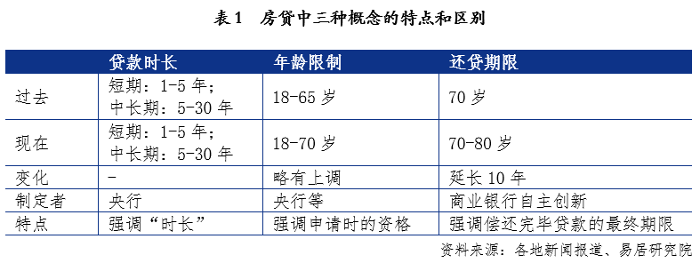

# 最高可贷到95岁？北京房贷年龄限制，我们采访了多家银行

连日来，“房贷年龄期限可延长至80岁”持续发酵。继南宁之后，杭州、宁波等地相继成为房贷政策松绑的主角。其中，杭州已有两家城商行延长贷款年龄至75周岁，宁波两家银行将房贷年龄期限提升至最高80周岁。

近期，有报道称，北京亦有银行放宽了房贷年龄限制。2月15日，新京报贝壳财经记者采访北京多家银行了解到，各家银行在贷款年龄期限上规定不尽相同，多数银行表示目前并未接到通知调整。

不过，70岁也并非所有银行的“红线”。

中信银行北京分行相关人士告诉新京报贝壳财经记者，该行住房按揭贷款项下的借款人年龄与授信期限之和最长不超过80年。

交行一家支行表示，当前最高房贷年龄期限可达95岁，但是需要子女担保，且借款人退休金和担保人的月收入可以覆盖月供的2倍。

**多家银行政策未调整，有银行宣称可有条件贷款至95岁**

“我行最长可以贷到70岁。”北京银行某支行工作人员表示，该行执行的政策是借款人年龄加贷款年限不超过70岁，近期也没有接到上级行的通知调整。

贝壳财经记者从建设银行北京分行相关人士处获悉，该行没有接到相关政策变化的通知。

建行一支行客户经理告诉贝壳财经记者，该行贷款年龄的要求为男性最高不能超过65周岁，女性最高不能超过60周岁。在此基础上可以办理10-15年的贷款，具体期限要根据借款人的征信和流水等资质判断。

贝壳财经记者采访了解到，北京多数银行执行“购房年龄+贷款年限”不超过70岁这一政策。不过，个别银行根据申请人条件也在年龄上有所放宽。

中信银行北京分行相关人士告诉贝壳财经记者，该行住房按揭贷款项下的借款人年龄与授信期限之和最长不超过80年。对于有两个及以上借款人的，授信期限以年龄孰低者为准。

贝壳财经记者采访中，交行个贷中心的客户经理表示，该行办理贷款的年龄不能超过65岁，最长贷款年限是25年，但是最多只能贷到70岁。

不过，交行另一家支行的客户经理则向记者表示，最高可贷到95岁，即该行借款人年龄最高不超过70岁，最长贷款期限为25年。在这位客户经理口中，这项政策并不是近期才调整的。

该客户经理解释称，执行这项政策也有一定的前提，如果70岁的借款人单独办理贷款，最长的贷款期限其实仅有5年。但是如果有子女担保，且借款人退休金和担保人满足月收入可以覆盖月供的2倍等条件，该行可以适当将贷款期限放宽至25年。

**增加额度、减轻月供压力？家庭“接力贷”出没**

“一般来说贷款期限加贷款年龄不能超过80岁，在办理贷款前需要了解客户具体的资质情况，然后我们的专员会给客户进行匹配。”北京一位办理银行贷款融资业务的中介向贝壳财经记者介绍，这是之前培训的内容，有一些政策尚未更新，可能会有一些差别。

银行业内人士向贝壳财经记者透露，在实际业务中，各网点都是结合客户资质等具体情况进行办理。

根据易居研究院文章，过去很多城市规定的房贷年龄期限为70岁，目前包括杭州和南宁提及过80岁的概念。其通俗理解是，无论购房者办理何种房贷，在80岁之前需要偿还完毕。

贷款年龄限制的设定有基本的逻辑和出发点，即要求自然人具备完全民事行为能力，通俗理解是该购房者不会违约。在房贷领域主要是指18-70周岁之间的成年人，即要申请个人按揭贷款，其年龄必须为18-70岁。实操过程中，部分城市会设定为18-65岁。此次南宁“房贷年龄期限延长至80岁”，其购房者年龄也是限制在小于70岁。

易居房地产研究院研究总监严跃进表示，客观说，在一定程度上，此类产品确实可以属于接力贷。

所谓“接力贷”是指当借款人贷款年限受限或偿还贷款能力有限时，可以以借款人的亲属（父母、子女及其配偶）作为共同借款人或担保人向银行申请贷款购买住房，所购住房归一方或者各方共同所有。

严跃进认为，“房贷年龄期限延长”属于房贷领域的政策工具，其本质上是增加了部分购房者的贷款时长，进而增加贷款额度、减轻月供压力。“房贷年龄期限延长”最直接效应，是指
40-59岁的中年人在办理房贷中，可以足额获得贷款，尤其是可以获得30 年期的贷款时长，对于刚需和改善型购房需求的释放具有积极的作用。

**年龄偏高加入房贷大军要慎重**

北京金诉律师事务所主任王玉臣律师告诉贝壳财经记者，从银行贷款的角度延长还款时间，可以降低每个月的还贷压力，同时还能让更多年龄偏高的人群加入房贷大军。但是，这种做法有利有弊，作为购房人还是要慎重选择。

王玉臣认为，一般来说，60岁、70岁以后，很多人基本上已经没有了工作能力，大多靠子女或者社保等方式养老。这个时候，老人的资金支付能力其实是相对不佳的，一方面可能会影响到自己老年的生活品质，继续背着房贷压力，给银行打工。另一方面，相关风险可能会转移到子女身上，增加子女的经济压力。

“需要再次强调，各地政策的放松，出发点都在于激活合理住房消费需求，以降低购房者购房成本为导向。房住不炒的红线也不改变。”严跃进指出，从商业属性理解这个政策，那么违约率是评价此类政策优劣的重要标尺。各地若是涉及“房贷年龄期限延长”的政策创新，其关键是要去测算此类房贷是否有违约的可能，或者说房贷是否有足额、及时收回的可能。

各地评价此类政策工具，要从全年的信贷投放规模、申请此类贷款的购房者资质状况、还贷的来源等角度进行分析。以客观理性、合理尺度制定政策，确保政策制定服务于刚需和改善型购房者。

此外，统计2020年以来各地房地产政策和热点事件，可以看出，“房贷”比“房价”更容易引起大家的关注，也容易引发热点话题。这也说明，要谨慎处理好房贷方面的问题，要从维护购房者合法权益、和购房者“打成一片”的角度，积极探索健康科学的房贷政策工作。

新京报贝壳财经记者 王雨晨 编辑 王进雨 校对 柳宝庆

