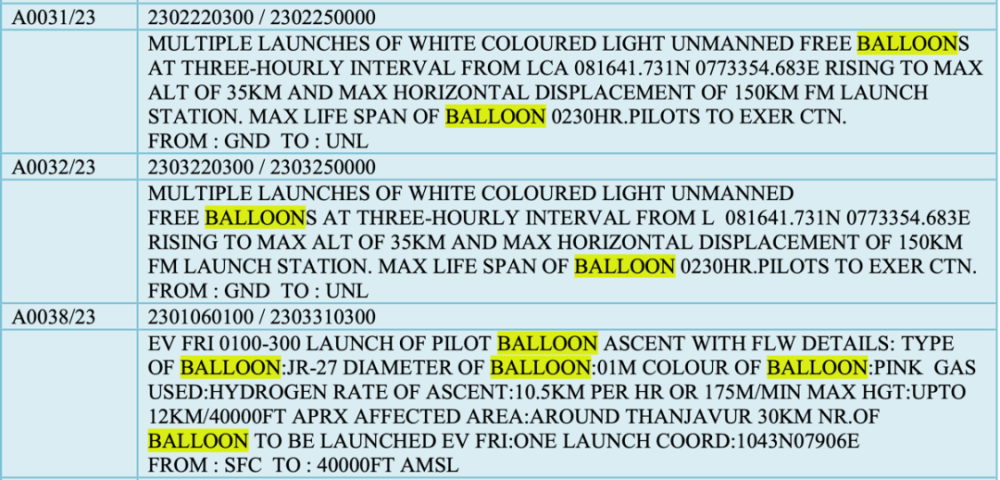
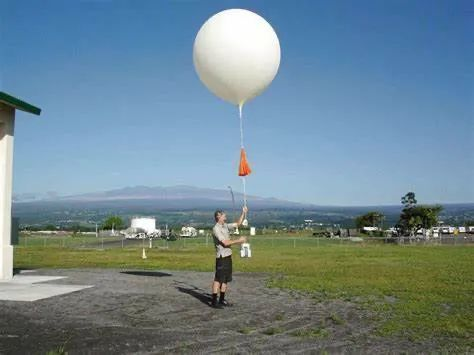
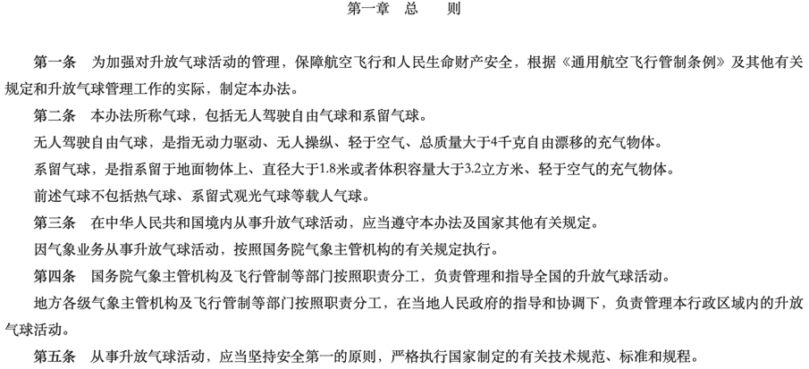

# 石家庄上空发现气球，飞机怎么预防和气球相撞？

**飞行员怎么能知道高空有没有气球呢？**

飞行员有两个途径可以知道高空的气球信息：一个是其他飞行员报告了气球，另外一个途径就是通过航行情报事先了解到了高空的气球信息。这里所说的高空气球不包括低空飞行的热气球。

**什么是航行通告呢？**

就是今年1月11号FAA那个系统坏了引起美国大范围航班延误的系统，简单地说航行通告，或NOTAM，包含目前被认为对飞行安全至关重要且需要通告航空人员的信息，以及能对其他运行出版物产生影响的补充数据。参考：什么是航行通告（NOTAM）？

**航行通告会发布气球的哪些信息？**

我们先看印度金奈机场当局发布的几个关于影响高空的气球的航行通告（NOTAM）：

这几个都是印度金奈飞行情报区的。

A0031/23
是说在23年2月22日03时00分到23年2月25日00时00分，从北纬081641.731东经0773354.683这个位置每隔3小时会升放
**多个白色的轻型无人驾驶自由气球**
，最高飞行高度是3万5千米。最大水平范围是从释放点周围150公里。气球最大留空时间（寿命）2小时30分，请飞行员特别警惕。

影响范围：从地面到无限高

A0032/23只是位置不同，其他同A0031A0038/23
是说从23年1月6日01时00分到23年3月31日01时00分，每周五0100-0300，会有 **有人操纵的气球**
升放，详细信息如下：气球类型：JR-27，直径1米；气球颜色：粉红；使用的气体：氢气；上升率：10.5公里/小时或175米/秒；最高高度12公里/40000英尺；可能影响的区域：在THANJAVUR周围30公里范围；每周五升放的气球数量：1个；升放的位置：北纬01043东经07906；

影响范围：从地面到无限高

A0066/23是说从23年2月1日09时00分到23年2月28日23时30分，位于GADANKI的印度空间和国家大气研究实验室将升放
**GPS/无线电探空仪用于气象的无人驾驶自由气球**
，详细情况如下：释放地点：北纬0132848东经0791048气球的飞行识别码/无方向性信标台：GADANKI国家大气研究实验室/频率400-406MHz类别和描述：轻型、重量为150克颜色：白色直径：1.5米氢气球升放数量：每天一个预计的方向和上升率：东或东北、300米/分钟巡航高度：300米/分钟一直到垂直距离32-35公里预计通过18公里时间1小时30分留空时间（寿命）：2小时30分钟

影响范围：地面到无限高

A0094/23说从23年1月20日00时30分到23年2月20日04时30分，每天0030-0430，从Varavina Karal航空测试中心升放用于
**测试高空大气数据的GPS探空仪气球。** 详细信息如下：升放位置：Varavina
Karal航空测试中心北纬0142313东经763337；气球颜色：白色；重量：125克；吊线长度：15米；气球高度：30公里；上升率：5米/秒或18公里/小时；气球上升时长：1小时20分；发射频率：400/406MHz；气球升放时间：0030/0130/0230

影响范围：地面到无限高

从以上的信息我们可以看出来几点：

气球是会威胁到飞行安全的，所以会出现在对于飞行员需要了解的航行通告中，这样帮助飞行员了解相关信息。

对空中升放气球是经常性的，尤其是高空探测气球。

对空中升放的气球有多种多样，也有不同的部门，有研究大气结构的，有研究气象数据的；可以是有人控制的，也可以是无人驾驶自由上升的。

通常用于气象或大气研究飞向高空的气球都会有一定寿命，2-3个小时之后就解体了，然后就会掉落到地面，也不知道会不会砸到花花草草？

**气球对于飞机飞行安全确实会有一定的影响：**

如果飞机空中撞到气球，对于飞机来说会造成很大的损害，尤其在高空巡航时飞机的速度非常快，通常会有800-900公里每小时。如果空中撞到气球或者气球下的悬挂物，会对飞机造成较大的损伤，因为撞击时的能量和速度的平方成正比。

**飞机怎么预防和气球相撞：**

通常对于向高空释放气球，都是需要严格的规定，比如我国气象局的36号令：

飞行管制部门获得气球升放信息后通过发布航行通告来提前告知航空公司和飞行员，飞行员和航空公司通过航行通告可以预先了解升放时间、地点、影响范围等。

在实际飞行时，管制员也可能会提醒受影响的飞机注意气球。 **但是确实会有一些没有解体的气球在空中流浪，全球各地经常会有飞行员报告发现气球。**

在飞行员报告之后，管制员也会提醒其他飞行员注意气球。

