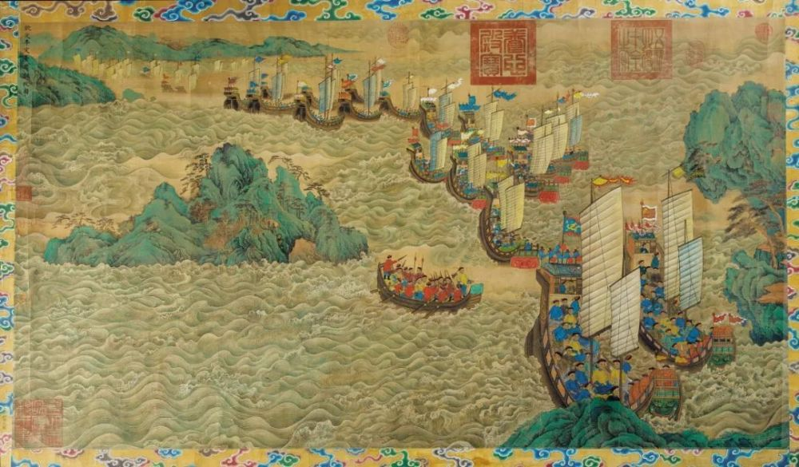

# 纪念康熙统一台湾340周年，学术单位展开征文活动

2月16日，中国社会科学院台湾史研究中心及《台湾历史研究》期刊官方微信公众号发布《“纪念康熙统一台湾340周年暨两岸关系历史研究”学术研讨会征文启事》。

_钦定平定台湾凯旋图 （清宫画家绘制）_

启事介绍，康熙统一台湾是中国历史上的重大事件。2023年恰逢康熙统一台湾340周年，为纪念中国历史上的这一重大事件，进一步加强与深化台海两岸关系历史研究，促进两岸关系和平发展，中国社会科学院台湾史研究中心与汕头大学潮汕文化研究中心合作，拟于2023年9月下旬在广东省汕头市南澳县共同举办“纪念康熙统一台湾340周年暨两岸关系历史研究”学术研讨会，进行学术交流。会议欢迎海内外学界朋友撰文与会，共襄斯举。

“纪念康熙统一台湾340周年暨两岸关系历史研究”学术研讨会筹委会介绍，该会议时间为2023年9月22日至25日。

此番研讨会征文参考选题共有16个：

1、康熙统一台湾研究

2、自远古迄今的台湾历史研究

3、台海两岸关系历史变迁研究

4、历史上的闽台行政关系研究

5、台海两岸经贸交流研究

6、台海两岸文化交流研究

7、台海两岸人员往来研究

8、历史人物与台海关系研究

9、大陆对台政策研究

10、台湾对陆政策研究

11、台湾在海上丝绸之路的角色与地位研究

12、台海局势与国际关系研究

13、台海和平统一与中华民族复兴研究

14、台湾史研究学术述评

15、台湾与潮汕地区的经贸、文化交流及人员往来研究

16、其他相关问题研究

上述启事强调，论文应遵循学术规范，为原创学术成果，不存在任何学术不端行为，且尚未公开发表。论文语言为中文（简体汉字），论文格式按照《台湾历史研究》技术规范处理，篇幅尽量控制在2万字以内。

台湾及其附近的岛屿自古以来就是我国的神圣领土。

据故宫博物院官网介绍，顺治十八年（1661年），在东南沿海坚持抗清斗争的郑成功率师东征，收复了被荷兰殖民者强占38年之久的台湾。郑成功于该年去世后，继位的郑经以及其后的郑克塽都继续坚持抗清立场，妄图自立一国。清王朝收复台湾的策略总的来说是剿抚并用，但前后期有所不同。康熙二十年（1681年）以前，大陆战事不断，清朝海军力量比较弱小，所以对台湾郑氏政权以抚为主；康熙二十年以后，对郑氏政权则因剿寓抚。

初期，双方的多次和谈都归于失败。但清王朝的招抚政策也取得了明显的成效，郑氏政权的大量官兵投降了清朝，这就严重削弱了郑氏势力，提高了清军的战斗力尤其是水战能力，清军逐渐由劣势变为优势。

康熙二十年，清政府平定了三藩之乱，收复台湾的时机逐渐成熟。同时，郑氏政权动荡不安，内部矛盾尖锐，官民不服，将士离心。该年郑经病死，大臣冯锡范等人发动政变，拥立年仅12岁的郑克塽继位，借机篡夺大权。在与清王朝的对抗中，郑氏政权统治下的百姓要承担沉重的赋税和兵役负担，阶级矛盾非常尖锐；各地驻兵不服水土，筑城疲劳，兵士不满。基于这种情况，康熙皇帝大胆任用熟悉海战的施琅为福建水师提督，授其全权收复台湾。施琅认为澎湖列岛是台湾的门户，决定先占该地，可使台湾不攻自破。台湾方面也积极备战，加强了防务，派最得力的战将刘国轩守卫澎湖。康熙二十二年（1683年）七月，双方在澎湖展开激战。在这场海战中，清军全歼了郑军主力。困守孤岛的郑克塽见大势已去，投降了清王朝。

台湾回归后，康熙采纳施琅等人的建议，在台湾设台湾府，隶属于福建。台湾府下设三县——台湾县（今台南）、凤山县（高雄）、诸罗县（嘉义），派总兵官一员率官兵八千驻防台湾，所建台湾府县组织完全与内地相同。这加强了中央对台湾的管辖，有力地维护了祖国领土主权的完整。

