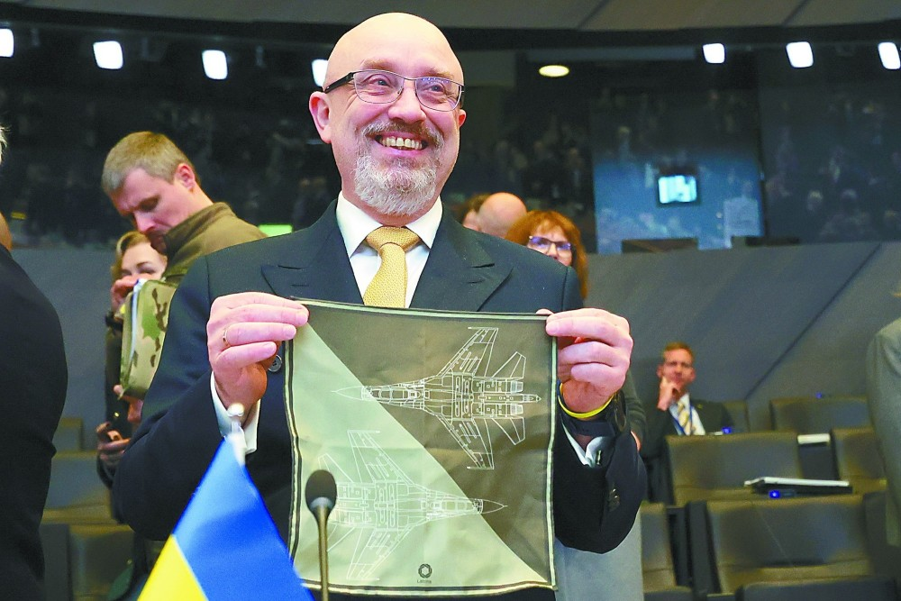

# 西方鼓动乌克兰“春季大反攻”，乌克兰军队要扩充至100万人？

【环球时报驻美国特约记者 萧达 柳玉鹏
陈康】“西方正为乌克兰春季反攻做准备”。当地时间14日，美国国防部长奥斯汀在布鲁塞尔举行的北约国防部长会议后宣布，俄乌冲突正进入“决定性时刻”，预计将在春季看到乌克兰军队开始大反攻。随着俄乌冲突爆发将满一周年，美国和西方越来越担心俄乌冲突局势不利于自己。美联社15日公布的最新民意调查结果显示，美国民众对向基辅提供军事援助的支持率正在迅速降低，仅有19%的人对拜登政府应对俄乌冲突的能力有信心。德国《明镜》周刊感慨，这次有50多个支持乌克兰的盟友参加的北约防长会议在“没作出任何重大承诺”的情况下结束。《华盛顿邮报》14日援引匿名官员的话警告称，白宫决心全力支持乌克兰，但如果基辅用完目前的援助后仍没有取得军事进展，后续援助“可能面临挑战”。

**“没作出任何重大承诺”**

“美国正敦促盟友确保乌克兰有足够的武器和弹药，以发起一次成功的春季反攻。”据路透社报道，美国国防部长奥斯汀在布鲁塞尔参加北约防长会议后对记者称：“我们期望看到乌克兰在春季某个时候发动攻势。我们正努力合作，以确保他们拥有装甲能力、火力和持续作战能力，在战场上产生效果。”

近些天来，在得到西方承诺援助主战坦克后，乌克兰一直要求西方尽快援助战机。据美联社报道，乌克兰国防部长列兹尼科夫当天在出席北约防长会前，面对等候在会场外的记者，他从胸前的口袋里掏出一条印有战斗机图案的手帕，展开手帕将其举起并向面前的记者们展示。这一幕立即被发布到社交媒体平台推特上，引发网友议论。对这种作秀式求援，有网友表示：“他需要接受现实：首先，他不会得到战机；其次，战机也不会起作用或者不能给乌克兰带来好处。”

德国《明镜》周刊称，这次会议主要重申了一些已宣布的援助计划，其中包括向基辅承诺的主战坦克。但对于向乌提供战机，会议没有达成任何实际成果。就连奥斯汀在被记者问及是否将向乌提供战机时也敷衍称：“我今天没有任何关于这方面的宣布。”

一些盟友援助坦克的计划甚至也发生了变化。德国《世界报》称，丹麦和荷兰防长声称将不参与向乌克兰交付“豹2”主战坦克。对此，新上任不久的德国国防部长皮斯托里乌斯当天在会议上抱怨称，他对一些国家“深感失望”，他“不怎么理解”一些国家为什么之前在提供坦克问题上向德国施压，现在自己却在提供坦克方面出了问题。

**美国的意图**

“关键时刻，拜登为什么要逼乌克兰进行反攻？”俄《论据与事实》周报14日以此为题分析称，美国官员近来频频鼓吹称，乌克兰正准备进行反攻并将在战场上取得成功，俄乌冲突的“转折点”即将到来。对此，俄政治学家杜达科夫认为，拜登团队正全力以赴利用乌克兰危机作为其宣布参加2024年总统大选的前奏。拜登政府必须在支持乌克兰方面展示一些成功，以显示自己是“民主世界救世主”的形象。如果乌克兰失败，他对乌的支持将会受到质疑。

由于通胀居高不下以及自身经济可能衰退，美国人对大笔援助乌克兰越来越反感。美联社15日公布最新民调结果显示，美国人对向基辅提供军事援助的支持率迅速降低，去年5月有60％的人赞成提供军事援助，如今降至48%。与此同时，仅有19％的美国人对拜登应对乌克兰局势的能力有信心，43％的人表示没有信心。

《华盛顿邮报》14日引述匿名官员的话警告称，乌克兰正面临着“改变冲突走向的关键时刻”，美国要求乌克兰在所获武器和援助激增的同时，要在战场上取得重大进展，这加大了基辅的压力。美国官员还暗示，虽然美国此前对乌克兰“有求必应”，但在共和党拿下国会众议院控制权后，这种情况很难继续。

**乌军要扩至100万人？**

对于西方鼓动乌克兰发动春季反攻，俄《真理报》14日引述军事专家马罗奇科的话称，目前乌正在积蓄力量，等待西方承诺的坦克和其他重型武器的到来。乌军反攻可能在3月进行，这与乌动员能力有关。目前，乌许多残疾人、老年人和妇女都被抓走并派到前线，乌军的任务是将人数增至100万人。此外，乌军在东部前线的炮击明显减少，表明正在囤积炮弹，等待西方援助的坦克、大炮等到来后进行反攻。报道称，如果乌军反攻，俄军就要建立一条足够坚固的防线来抵抗敌人，使其筋疲力尽，然后才能前进。俄方需要重视乌反攻动向。当然，现在战场主动权掌握在俄军手中。

俄卫星通讯社称，即使乌克兰从西方获得数百辆坦克，也不会改善乌克兰在“东线”的地位。美国在乌克兰的计划即将失败。目前，俄罗斯新的攻势正在展开，已给乌军造成大量伤亡。俄军在整个战线上占据主导地位。美《外交政策》杂志称，在俄乌冲突爆发一周年即将到来之际，俄为大规模进攻进行的准备可能超过2022年2月24日的水平。

美联社称，俄军在乌克兰东部正在向前推进，同时加强了在乌克兰南部的防御。在冬季的几个月里，战争总体上处于胶着状态，不过预计俄乌都将发起大规模攻势。乌东战略要地巴赫穆特将是双方争夺的首要目标。报道还称，令北约盟国不得不思考的一个问题是，如何在自己武器库存不枯竭的情况下源源不断地向乌克兰提供弹药。根据一些评估，乌克兰每天要发射6000到7000发炮弹，大约是俄罗斯部队每天发射量的1/3。北约秘书长14日警告称，乌克兰消耗弹药的速度远远快于盟友供应的速度。

不过，对当前俄乌胶着的战事是否会有所突破，《华盛顿邮报》14日称，一些分析人士警告，俄乌双方都不太可能在“可预见的未来”夺得决定性的军事优势。报道引述美国前情报官员肯达尔的话说，俄乌冲突仍将长期持续下去，“这是一个非常不确定的时刻”。

