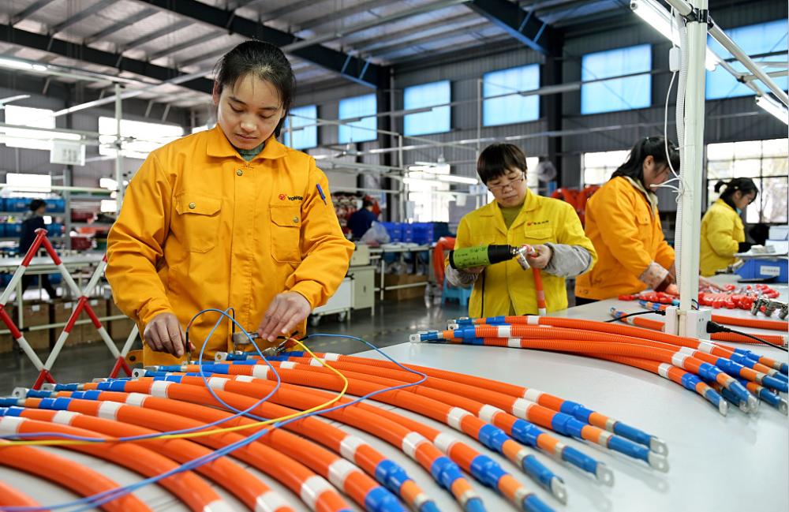
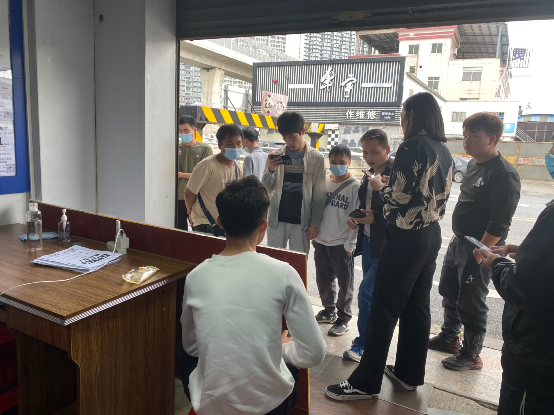
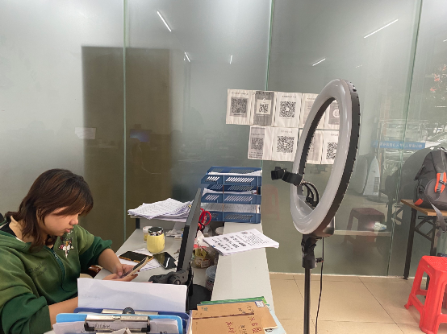
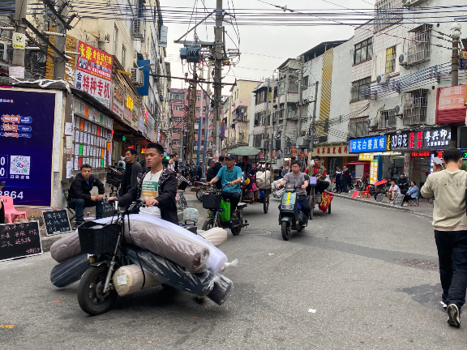

# 00后农民工不愿进工厂

_来源：视觉中国_

作者 | 陈弗也

编辑 | 杨布丁

出品 | 棱镜·腾讯小满工作室

“我要朝九晚五，我要包吃包住，我要可以抽烟，我只上白班不上夜班，有没有夫妻房？食堂的饭菜能不能先看一下？”杨乐（化名）一口气说了如今工厂求职者常见的好几个诉求。

杨乐是广东佛山一家劳务中介的负责人。她的公司地理位置优越，临近地铁口，这条地铁连接着珠三角的重要交通枢纽——广州南站。每年春节过后，珠三角地区都会迎来一波招工高峰期，很多打工者一下火车，就会拖着行李沿着地铁线寻找落脚的地方，劳务中介往往是他们的第一站：找到工作后，就可以住进工厂的宿舍。

2月11日，正月二十一，节后招工高峰期本已过去，但依然还有源源不断的求职者前来。杨乐熟练地将他们聚拢在一起，简单交代几句后，便派车将他们送到工厂。

_一家劳务中介正在为求职者安排工作。作者拍摄_

但是，这些求职者应聘成功的并不多。特别一些20岁出头的求职者进厂后，看一眼工作环境，不满意了，扭头就走。

杨乐每次都要苦口婆心地劝说年轻求职者，工厂还没有恢复元气，用工需求量不大，有坑位就赶紧占住，不要期望太高。但收效甚微。

每年这个时候，00后打工者都是一个备受关注的群体，他们脑子活、学习能力强、精力充沛，被视为未来产业工人的主力军。多位劳务中介负责人告诉作者，工厂会特别交代，希望能多招一些年轻人。

但他们往往又崇尚自由，不愿被管束，很难在工厂里长时间干下去。“三天打鱼，两天晒网”，是劳务中介对他们最普遍的评价。

根据劳动法，劳动者最小年龄为16岁，这意味着不少2007年出生的人都可以外出打工，而年龄稍大的00后已经在社会上闯荡多年。综合近几年国家统计局发布的《农民工监测调查报告》，可以得出结论：目前，我国的00后打工者约有500万人。

这是一个被制造业寄予厚望的群体，但是在就业选择更加多元化的今天，他们还愿意进工厂吗？

**哪怕工资少2000，开心就好**

“又想骗我进厂打螺丝。”

2003年出生的陈磊（化名）轻蔑地哼了一声，不想被套路。正月二十一这天，在刷抖音时，陈磊正好刷到了几个关于工厂招聘的视频，视频显示，厂妹多，工资高，压力小，食堂饭菜也好，但他在这样的视频里没停留多久，很快就刷走了。

他本应该有一个时髦的称谓——Z世代，但在官方统计上，他还是一名“农民工”。根据《农民工监测调查报告》的定义，农民工是指“户籍仍在农村，年内在本地从事非农产业或外出从业6个月及以上的劳动者”。

在时下的招工市场，抖音、快手、小红书已经成为了不少劳务中介吸引00后农民工进厂的平台。

比如，在小红书上，检索“工厂”、“打工”等关键词，就会出现很多厂妹分享打工经验的帖子，当与其联系时，对方会甩过来一个劳务中介的联系方式。一位小红书博主告诉作者，小红书主要是用来吸引00后女生关注，抖音、快手则用来吸引00后男生关注。

_一家劳务中介曾经尝试用直播的方式进行招工。作者拍摄_

去年，陈磊曾在广东省中山市的一家工厂干了一年，也是他坚持时间最长的一份工作。

那是一家规模不大的小厂，只有十几个工人，管理松散。陈磊主要负责一台机器的运转，只要机器正常运转，他就可以坐在那里打打游戏、聊聊天，出去上个厕所，抽根烟也没人管。老板也和他们打成一片，平时会给员工们递烟递槟榔。

今年春节后，朋友介绍他去美的工作，但他连想都没想就拒绝了——在珠三角地区，像美的、格力、格兰仕这样的大厂，是出了名的管理严格。

“上个厕所都要打报告，开离岗证，遇到脾气不好的线长，想上厕所都不敢去问。”陈磊向作者表示，“打工嘛，最主要的是开心。你一个月给我7000块，但管得很严，我宁愿去给我5000块但管得不严的地方。”

和很多同龄人一样，陈磊过着一种“低欲望、高消费”的生活。他不想买房、买车，也不想结婚生子，只要能够在城中村里租一间单人房，就可以开心地生活。与此同时，吃喝玩乐也会将他们的工资给花完，如果谈对象，一个月五六千的收入，更是不够花。

“我喜欢去小厂打工还有一个重要原因是，小厂允许我们提前透支工资，很多时候，一个月干完了，我的工资也就透支完了。”陈磊向作者坦言。

阿峰（化名）是一位来自四川的00后，17岁高中没上完就辍学打工了。他的第一份工作是在东莞的一家工厂，但只干了三个月，就辞职不干了。此后，他送过外卖，去理发店做过学徒，如今在广州市番禺区的一家酒吧做营销。

“进工厂时，我就没想过长久干下去，要不是家里人劝，拿到第一个月工资时，我就离开了。”阿峰向作者感叹。

他向作者讲述了几年来他的“人生蜕变”：刚进厂时，他是一位乖巧的小男生，对领导言听计从；送外卖时，开始喜欢上自由的感觉，再也不想回到厂里了；在理发店做学徒时，就彻底放飞了自我，他在胳膊上纹满了花秀，头发也变换了好几种颜色。

“在这里能学到不少东西，我一直都有创业的想法，这些经验对我非常宝贵。”阿康向作者表示，“很多人说00后三天打鱼两天晒网，可能这些人还没有找到喜欢的工作吧。”

**“夫妻优先”的招工广告背后**

2022年，清华大学社会学系副教授严飞发表了一篇文章《“00后”农民工的主体性建构》，对00后农民工这个群体做了系统的分析。他认为，这个群体与第一代、第二代农民工有着明显的区别，他们是无法简单定义的“新一代都市外来务工者”。

在文章中，严飞列出了这个群体的三大显著特征。

第一，他们的工作状态呈现边缘化、迷茫化的特点，工作稳定性低，以零工和兼职为主；第二，他们不愿再回到家乡生活工作，甚至对乡土氛围产生了排斥心理；第三，他们更渴望进入城市，融入社会，重构自我身份主体性，并表现出了渴望通过奋斗提升地位的意愿。

“指望00后都进工厂，这个不太现实。”张康（化名）向作者直言。

十几年前，他在广东佛山开了一家劳务派遣公司，专门为附近的工厂招聘劳动力，早几年春节用工荒，他都要帮着企业去劳务市场里“抢人”。

他有个直观的感受，十几年过去了，劳务市场的主力，还是那些熟悉的70后、80后。在他看来，与70后、80后相比，00后的家庭条件一般都比较好，没有像70后、80后那样经历过贫穷的生活，他们父辈们大都有工作、有收入，所以生存压力要小很多。

张康向作者介绍，在珠三角地区，很多工业园区的周围都会有一批专门招聘临时工的劳务中介，为那些订单不稳定的工厂随时输送劳工。不少00后就依靠着这种打零工，将“快乐的打工人”演绎得淋漓尽致。

按照张康说法，这些00后往往会打两天工歇三天，拿到工资后，就出去玩，没钱了，再回来打工。如今完善的劳工保障制度，使得他们即便只打一天工也能拿到应得的工资。

因此，虽然工厂老板们都知道00后的工作效率更高，也会特意叮嘱劳务中介帮他们留意年轻人，但为了拥有一个稳定的员工团队，工厂还是要招聘大量的70后、80后。

位于广州海珠区的康乐村，是国内知名的制衣基地，那里聚集着成千上万的作坊、商铺，从早到晚，拖着布料、成衣的三轮车、电动车繁忙地穿梭在并不宽敞的街道上。

_忙碌的康乐村。作者拍摄_

每年的春节，这里都会遭遇一段时间的“用工荒”，制衣厂的老板们会举着招工的牌子，站在街道的两旁，等待着求职者们的挑选。

在这里，很多招工广告都写着“夫妻优先”的字样。老板们认为，已婚人士基于对家庭的责任，在工作上更加踏实、负责、稳定，会干得时间长一些。

相反，年轻的单身人士则很难管理，三天打鱼，两天晒网，一言不合还会撂挑子不干。一位制衣厂老板向作者讲述了一个故事，去年，他招了一个令他哭笑不得的年轻人，这个人经常会迟到、早退，但每到饭点时，他就会准时出现在食堂，吃完饭后，就找不到人了。

“这个人就是来蹭饭的。”这位老板向作者感叹道。但苦于招不到人，就只能让他蹭了几天饭。

张康向作者分析，现在的家庭条件都好，父母最起码也会让孩子去学一门技术，毕业之后，可以走专业路线，不会从事普工的工作。对于那些没有技术的00后，进厂打工也只是一个过渡期，社会上的就业选择太多了，不只是送外卖，做主播。

**15年后，一些行业就没人了**

“00后谁去做衣服？”杨琪向作者感叹，“再过15年，我们这个行业可能就后继无人。”

1992年出生的杨琪，在康乐村有一间自己的制衣作坊。在康乐村，工人以40岁以上的中年人为主，35岁以下的工人已经很少见，一些年轻的95后、00后也会从事这一行，但是很少进厂做工，他们更多的是在行业里承担销售、外联的任务。

制衣工对年龄有一定的要求，超过50岁的，视力往往会下降，可能就看不清针线了。

不仅是制衣行业，在珠三角地区，有一个不成文的规定，一个男工到了50岁，就要进入“退休”倒计时，很多工厂不会招聘50岁以上的男工。15年后，当最后一批80后也年过五旬时，那些依靠廉价劳动力的小工厂、小作坊可能就再难招到人了。

而我们的农民工群体，又正在面临着平均年龄增大、年轻人减少的局面。

根据国家统计局发布的《2021年农民工监测调查报告》，2021年，农民工的平均年龄达到41.7岁，比上一年提高了0.3岁；16-20岁的农民工仅占1.6%，与2020年持平，但低于2019年的2%、2018年的2.4%和2017年的2.6%。

建筑行业也是一个可能很快就招不到工的行业。佛山一家建筑公司的负责人向作者感叹，工地的工作环境差，强度高，几乎没有90后会在工地上干活，更不要说是00后。在房地产行业比较好的那几年，70后、80后一直都是工地上的中流砥柱。

“在工地上干活的00后，可能连对象都找不到。”该负责人无奈地说，他认为社会上并没有给予一些行业的工人足够的尊重。

面对用工荒的难题，用机器取代人工，是很多人想到的解决方案，但是这种需要大量投资的方案并不适合小工厂、小作坊。

“我们这个行业，智能化时代我是看不到了，我今年55岁了，最多再干10年，这10年应该还是能招到工的，以后就不好说了。”康乐村一位制衣厂老板向作者感叹。据他介绍，在康乐村，用工成本每年都会有10%-15%的涨幅，他们的利润率也在逐年降低。

他有一个想法，如果未来实在招不到人了，可以去国外引进一些劳动力。但是想到我们是全球人口最多的国家，他尴尬地笑了笑。

面临用工荒的不仅是小工厂、小作坊，根据央视财经报道，到了2025年，中国制造业十大重点领域人才缺口将接近3000万人。

00后是被寄予厚望的一代，与70后、80后农民工相比，他们拥有更好的教育背景。近几年，职业教育在我国获得了快速的发展，很多00后农民工上过技校，受到过系统的技能教育，拥有一技之长，他们本该是解决人才缺口问题的主力军。

不过，去年曾有媒体报道，6成职校毕业生宁愿送快递也不进工厂。

如今仍在工厂打工的陈磊，计划再打几个月工就转行。去年底，他回老家考了驾照，拥有了“一技之长”，家人打算给他买辆车，让他去跑网约车。

**以下是作者与陈磊的一段对话：**

“你觉得自己是农民工吗？”作者问。

“我啊？是啊？怎么了？”陈磊说。

“好多人不觉得你们是农民工，因为你们在家也不种地。”作者问。

“但是，我家里人在种地啊。”陈磊说。

“你希望别人怎么称呼你？靓仔？民工？还是打工人？”作者问。

“这个无所谓，跟我谈钱就行。”陈磊说。

**腾讯新闻出品内容，未经授权，不得复制和转载，否则将追究法律责任。**

