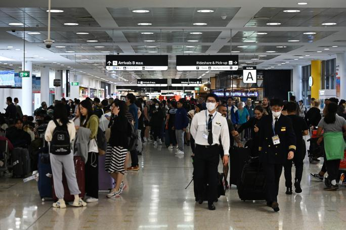

# “网课留学”不再认证：政策差异下，四万留澳学生如何返校？

_当地时间2023年1月5日，澳大利亚悉尼，国际旅客抵达史密斯国际机场。澳大利亚此前采取相对严格的边境落地检疫和隔离政策，直到2022年2月21日，才重新对所有签证开放国境。（视觉中国/图）_

2023年1月28日，教育部留学服务中心发布公告，宣布对于2023年春季学期（南半球秋季学期）及以后仍采用远程方式学习所获国（境）外文凭证书，将不再提供认证服务。

这意味着，之前受疫情影响线上上课的留学生，必须返校上课了。

与1月28日公告相对应的，是留学服务中心在2020年4月所发布的规定，其中表明留学人员无法按时返校而通过在线方式修读部分课程，从而导致其境外停留时间不符合学制要求的情况，不作为影响其获得学位学历认证结果的因素。

这项“生于新冠”的留学规定也带来一些争议。留学服务中心在2022年3月发布的文件透露，存在部分境外院校和中介机构以营利为目的，趁机专门开设远程课程、降低录取标准、扩大招生规模，不实宣传“包入学、包毕业、包认证”等损害留学人员利益的情况。

如今这项临时规定宣告结束，南方周末记者注意到，受影响较大的群体是在澳大利亚留学的中国学生。与英美等国不同，澳大利亚此前采取了相对严格的边境落地检疫和隔离政策，直到2022年2月21日，澳大利亚才重新对所有签证开放国境。澳大利亚多所高校规定，从2023年6月30日起，所有国际学生必须返回校园上课，而在秋季学期仍保留线上授课，不少学生由此选择继续上网课。

据路透社1月30日报道，澳大利亚国际教育协会CEO霍尼伍德指出，新规发布时，有约四万名中国籍学生在澳洲境外。

**“生于新冠”**

留学服务中心自2000年开始对国（境）外学位证书和高等教育文凭提供认证，至今已持续23年。

这项认证服务用于鉴别国（境）外所颁发学位证书或高等教育文凭机构的合法性，同时甄别高等教育文凭、证书的真实性，并出具认证证书。

对于中国留学生及其他外国学位获得者而言，这是在中国升学、就业、落户等必不可少的证明文件，只有经过认证，在国外获得的学历学位在中国才具有效力。

认证流程并不复杂，留学生如今可以在线申请。个人需要准备的认证材料包括文凭证书、护照、签证等，身份认证通过后即可获取出入境记录。认证系统中录入了1.7万多个境外院校颁发的学位证书信息，以便留学生在选择留学项目时鉴别真伪。

境外停留时间是认证中一项重要指标。对于具体的停留时间，由于各国学制不同，原则上没有统一的时长要求。但留学服务中心曾指出，“如果申请人在境外学习时间明显短于学制要求，建议提交学习期间的正式成绩单协助评估”。某留学中介机构澳大利亚项目经理潘妙霞补充，疫情之前，留学生只有通过线下完成所有课程，才能得到认证。

从始至终，远程留学都不在认证范围内。根据留学服务中心的界定，远程留学是指境外院校所开设的课程性质本来就是远程教育，没有面授课程，而不是指境外院校因受疫情影响，将面授课程调整为线上课程的情形。

早在2007年，留学服务中心就发现有境外院校在境内违法独立招生，这些院校提供全部时间或大部分时间在境内学习的课程，以函授和远程教育等方式对学生授课。2009年12月，留学服务中心颁布的《中国（境）外学历学位认证评估程序和标准》就规定，通过函授、远程教育及网络教育等非面授学习方式获得的国（境）外学历学位证书或高等教育文凭暂不在学历认证范围内。2018年1月8日，留学服务中心对此再作强调。

2020年，新冠疫情暴发，全球航班大量缩减，许多高校被迫调整授课模式，增设线上课程。当年4月，留学服务中心顺势调整认证规定，表明留学人员无法按时返校而通过在线方式修读部分课程，从而导致其境外停留时间不符合学制要求的情况，不作为影响其获得学位学历认证结果的因素。

2022年3月，留学服务中心又一次提醒，远程留学不在认证范围，并提及疫情期间一些海外院校就同一课程同时开设面授（含因疫情影响调整为在线授课的情况）和远程教学等授课模式，提醒留学人员在选择课程模式时注意区分。

不仅是留学服务中心，潘妙霞表示，英美澳等国外高校驻中国的招生代表在推荐课程时，也会提醒学生，申请仅有线上课程的项目将无法拿到留学服务中心的学历认证。

因此，相比始终不被认证的远程留学，2023年1月28日的新规面向的是高校提供面授课程、但受疫情影响只能线上上课的留学生群体。

_2021年10月24日，2021中国国际教育展。（视觉中国/图）_

**谁受影响？**

潘妙霞对新规出台并不意外。她认为，疫情逐步放开，大家的生活要逐渐回归到疫情前的状态，调整是顺势而为。

中国在2023年1月8日起对新冠病毒感染实施“乙类乙管”，并采取积极措施便利中外人员往来，与此同时，大部分国外高校则早已恢复线下教学。

大多数美国高校的线下教学是在2021年秋季学期恢复的。2021年4月，美国教育部长Miguel
Cardona接受NBC专访时表示，预计在2021年秋季，全美100%的学校都将开放且恢复线下授课。随后，哈佛大学、康奈尔大学、哥伦比亚大学等高校相继宣布在秋季开学后恢复线下教学。

更多国家的高校则是在2022年恢复线下教学。以英国为例，2022年上半年，牛津大学和剑桥大学在此学期以线下教学为主，受疫情影响无法返校的同学则可以申请线上上课，并推迟入校时间。伦敦国王学院在2022年5月宣布将在秋季学期开始全面恢复线下授课，不再提供线上课程选项，并要求学生在当年10月10日前返校。

根据教育部历年公布的数据，中国学生出国留学的主要目的地是美国、英国、加拿大和澳大利亚。综合来看，认证新规出台后，由于各国政策差异，澳大利亚的中国留学生所受影响最大。

澳大利亚此前本土疫情防控较为严格，近期随着疫情形势的改变，澳大利亚政府宣布2023年1月5日起，从中国抵澳的旅客提供出发日期前48小时内的核酸阴性检测结果凭证即可入境。澳大利亚高等教育质量与标准署（TEQSA）在2022年底宣布，学生需要在2023年6月30日前回校上课。此后，多所高校宣布2023年第二个学期全面取消线上课程，仍允许学生在第一个学期选修线上课程。目前受影响的中国学生主要集中在澳大利亚的八大名校，包括悉尼大学、昆士兰大学、新南威尔士大学等。

新规发布后，留学中介机构也感受到了明显的变化。潘妙霞告诉南方周末记者，不少学生和家长咨询签证、课程延期等相关事宜。同时，“办理留学签证的同学多了，赶着交学费、拿注册确认书以便尽快递交签证的学生也有所增加”。

**“很多人着急得睡不着”**

相比起中介机构，对学生们来说，消息来得突然。

1月28日打开留学群看到公告的那一刻，就读于昆士兰大学的张彤慌了。她赶忙将公告截图发给同学，连夜讨论对策，“很多人着急得睡不着”。

随着认证规定的调整，中国留澳学生急需在学校转换课程截止日期前返校。不同学校规定的截止日期不同，昆士兰大学是3月31日，悉尼大学则更早，是3月3日。

赵颖已经在国内上了一年网课，按照一年半的学制安排，她2023年5月就要从新南威尔士大学的精算专业硕士毕业。她原计划在一家券商公司实习到3月，还早早报名了河南省的公务员省考和银行的考试，分别在2月底和3月中旬。新规颁布后，赵颖已经无心实习和准备考试，开始焦急地准备签证所需材料，包括存款证明、出生证明等等。“两边的政策‘打架’，受伤的是中间这一群人”。

与不得不放弃的实习和考试相比，他们更担心的是学历不被认证。“花了一两年时间，还花费了几十万学费，拿到的学历如果不能被认证，那跟假的有什么区别？在中国就变成一张废纸了。”就读于昆士兰大学传播学专业的李昊说。

他们不得不做两手准备。一方面，不断与留学服务中心及学校沟通，争取相关的认证材料；与此同时，也不断寻求返校的方法。

他们一起写信、发邮件、打电话，与学校和相关政府部门沟通，李昊还到国务院平台留言，得到的回复是“会收集更多相关信息”。

留学服务中心在1月29日也曾发布新规解读。其中针对不能到线下上课的种种情况，多次提及留学生应保存相应证明材料，并于学位认证时提交，以便顺利通过认证。

但多名受访者表示，证明材料的标准较为模糊，“具体哪些可以被采用”，截至目前，留学服务中心客服也未提供清晰的回复。

目前，澳大利亚多所大学已向留学生表明愿意提供所需的证明材料。新南威尔士大学在给学生的回复邮件中表示，正在出台相关文件为受新规影响的中国学生提供支持，具体方案会在未来几周内公布。

除了准备材料之外，签证、租房等都成为一时“挤兑”的现实问题。

张彤早在2022年7月收到昆士兰大学的offer时就办理了留学签证，那时仅花费一周时间，新规出台后，何时能成功办下签证也变得众说纷纭，“集中在两周至四周”。而新南威尔士大学2月13日已经开学，
赵颖现在还在等待学校的就读证明——办理签证必不可少的文件。校方在2月13日的回复邮件中称，目前申请者过多，造成了积压。

针对线上线下课程转换，一些高校也给出了明确的时间节点。以昆士兰大学为例，该校2月20日开学，如果学生在3月3日之前返校，可以自行将线上课程转为线下课程；3月3日之后，则需要学生与自己的教授联系，经他们同意后才能转换；而3月31日之后就不能再转换。

张彤如今盼望尽快租到房，回到学校，将线上课改为线下课。如果3月31日之前租不到房，那么即使去了澳大利亚，她也还得继续上网课。而这种情况能否被认证，她并不确定。

（应受访者要求，赵颖、李昊、张彤为化名）

南方周末记者 魏翠翠 南方周末实习生 郭馨阳

