# 中国人口预测报告2023版：出生人口将在2056年被美国反超

育娲人口研究

2023/02

专家团队：梁建章，任泽平，黄文政，何亚福

**摘要**

我们在2021年12月发布了《中国人口预测报告2021版》，引起了社会各界的广泛关注。在上一版报告中，我们将低、中、高三种预测的长期总和生育率分别设置为1.0、1.2、1.6。

而根据国家统计局数据，2021年中国出生人口仅1062万人，2022年已跌破1000万，只有956万，创下1949年以来最低记录。在出生人口继续快速下降的背景下，我们有必要将人口预测的参数进行调整，根据当前的现实情况，分下述三种情形更新预测并据此给出政策建议。

**1.低预测：**
前提是没有实质有效的鼓励生育政策，生育率持续下降至0.8左右。为何把生育率下限设置在比日本还低得多的0.8呢？这是因为相对于收入，中国的教育支出和房价等与养育相关的成本远高于日本。

鼓励生育力度并不小的韩国，在2020年的生育率已经低至0.84，在2021年进一步下降至0.81。可见如果没有有效的鼓励生育政策，中国的生育率会类似于韩国而远低于日本。

中国现在的大城市和东北三省的生育率已经只有0.7-0.9，随着年轻人口的进一步城市化，中国的生育率还会继续走低。最近各地陆续推出一些鼓励生育政策，但力度仍然太小，其效果恐怕还是杯水车薪。

**2.中预测：** 前提是推出各种鼓励生育的政策，鼓励生育的财力达到发达国家的平均水平，即GDP的1-3%。

虽然生育率会从1.0的低点有所提升，但由于中国养育压力更高，而且社会变化带来的生育率下行惯性更大，生育率只能维持在1.1左右的水平，比日本还低一些，更远低于西方发达国家。

**3.高预测：** 前提是推出各种积极有效的政策，大力鼓励生育。中国面临世界最严重的低生育率下行惯性，所以需要世界上最大力度的鼓励生育力度。

我们估计，需要用GDP的5%来鼓励生育[1]，才能把生育率从2022年的低点逐步提升到1.4，即接近发达国家的平均生育率水平。在这个情形下，2030年的新出生人口将在1062万，2050年的总人口为12.9亿。

在低预测情形下，中国出生人口将在2023年降至900万左右，2025年跌破800万，2027年跌破700万，到2050年降至493万，2100年仅不到100万。

中国现在的出生人口只有印度的一半，到本世纪中叶只有印度的1/3，到2100年可能不到印度的1/4。按此预测，中国出生人口将在2056年被美国反超，到2100年只有美国的2/3左右。

现在中国总人口还达到美国的四倍多，可出生人口却将在两代人后被美国反超，可见人口衰竭之快。其实美国现在的生育率也已显著低于更替水平，能维持出生人口的基本稳定，主要得益于美国可以吸引大量育龄移民。

在低预测情形下，中国人口到2050年将减少到11.7亿，2100年中国人口将降到4.79亿，占世界比例将从现在的17%降至4.8%，而新出生人口只有世界新出生人口的0.89%。

届时，中国就不再是一个人口大国了。按此趋势，华夏民族几千年积累的人口优势，将在100年内丧失殆尽。值得一提的是，由于人口惯性，总人口的萎缩会滞后于出生人口的萎缩，因而不能及时反映人口衰减的严峻性，及其对经济社会的深刻影响。

如果只按目前这种力度来鼓励生育，中国毫无疑问将在几十年内成为老龄化程度和人口萎缩最严重的国家之一。如果低预测成为现实，那么到2100年，新出生人口只有94万，还不到美国新出生人口的一半。

如果我们采取发达国家鼓励生育的平均力度，那也只能维持中预测——略低于日本生育率水平的1.1。只有采取大力度的鼓励生育的政策——平均需要投入GDP的5%的财力，才能把生育率维持接近西方国家的平均水平1.4。

本报告具体提出了鼓励生育的十大建议，其中包括：

  * _1_ 一是现金补贴，对于二孩家庭的每个未成年孩子，给与每月1000元的现金补贴，给与多孩家庭的每个孩子，每月2000元的现金补贴。
  * _2_ 二是税务补贴，对于二孩家庭的父母实施所得税和社保减半，对于三孩以上家庭实施所得税和社保全免（可以设置封顶上限）。
  * _3_ 三是购房补贴，通过按揭利息返还或房价打折进行补贴。举例，返还二孩家庭的房贷利息的50%，对于三孩家庭的房贷利息可全部补贴返还（可以设置封顶上限）。
  * _4_ 四是增建托儿所，把0-3岁的入托率从4%提高到50%左右。
  * _5_ 五是同时增加父母双方的产假天数。
  * _6_ 六是提倡灵活办公。
  * _7_ 七是引进外劳保姆。
  * _8_ 八是扶植辅助生育技术。
  * _9_ 九是保障单亲家庭权益。
  * _10_ 十是教育改革，普及大学本科教育，减轻升学压力，缩短基础教育的学制。

以上是最有效的十项鼓励措施，希望能够尽快设计和落实各项全面鼓励生育的政策。这些政策虽然需要增加不少的财政支出，但是中国经济正面临内需不足、消费疲软、产能过剩的问题，正好可以通过鼓励生育，来刺激消费和提振经济。

而且这种鼓励生育的投入，是对未来人力资源的投入，长期有很好的回报。所以投入GDP5%的水平，把生育率从现在的1.1提升到1.4，是非常值得的。

那么把生育率提升到1.4是不是理想目标呢？当然不是。只要生育率一直低于2.1的更替水平，群体最终必然消亡。因此，要维持社会的可持续发展和中华民族的薪火相传，将生育率提升到2.1，是迟早要做到也必须要做到的。而且越早去做越容易，所遭受的损害也越小。

如果能在10年内把生育率提升到更替水平，我们甚至可能把中国的人口规模长期维持在14亿左右，这需要把每年出生的人口从2022年的956万提升并维持在1500多万。尽管难度非常大，但如果真正认识到，维持人口规模是确保繁荣稳定和优良生活品质的基石，以实现民族复兴的历史担当全力以赴来提升生育率，做到这点并非不可能。我们估计这需要远高于GDP的5%的财政支持，还需要大刀阔斧地改革现有的高考制度，来减轻升学和择校的压力。

人口尤其是年轻人口的迅速萎缩，已成为中国社会面对的最大挑战。解决低生育率问题，需要整个社会巨大的投入。如果把提升生育率作为国家的头等大事来看待，充分发挥我们的制度优势，中国完全有可能解决这个世界性难题。

**目录**

**1、生育率和出生人口预测**

1.1 中国1950-2020年生育率和出生人口

1.2 2022年出生人口概况

1.3 疫情和三孩政策对出生人口的影响

1.4 中国低生育率的成因

1.5 高中低三种生育率预测

1.6 出生人口预测

1.7 中国与美国和印度的出生人口比较

**2、死亡人口预测**

2.1 平均寿命和死亡率假设

2.2 死亡人口预测

**3、总人口预测**

3.1 中国1950-2022年总人口

3.2 总人口预测

3.3 中国与美国和印度的总人口比较

3.4 中国人口占世界比例预测

**4、人口结构预测**

4.1 总抚养比预测

4.2 老年抚养比预测

4.3 劳动年龄人口比例预测

4.4 老龄化比例预测

**5、政策建议**

**6、取消中考和缩短学制**

**7、附录：高中低情形的出生人口和总人口比较**

**正文**

从2017年至2022年，中国的每年出生人口已经连续六年下降。2022年的出生人口不到上一代人的一半，但这还远远不是底，中国的出生率和生育率在未来十年将继续下降。

比较六普与七普的育龄妇女人数，可以看出，从2010年至2020年，中国的育龄妇女人数减少了5749万人，这十年间，育龄女性人数平均每年减少575万人，其中20-29岁生育旺盛期妇女人数减少了3463万人，平均每年减少346万人。

如果生育率没有显著提升，我们预测中国的每年新出生人口将很快降到900万以下。中国的低生育率问题和未来的人口预测已经引起了广泛关注。

人口预测是根据一个国家或地区现有的人口状况，以及可以预见到的未来发展趋势，通过设置一些合理的或可能性较大的参数，对未来人口状况所做的各种测算。人口预测的主要内容通常包括对未来某年人口总数、出生人数、死亡人数、性别年龄结构等方面进行预测。人口预测对于人口政策的制定以及国民经济和教育事业的发展都有重要的参考意义。

在国际上，最有权威的人口预测当属联合国每两年或三年发布一次的《世界人口展望》（World Population
Prospects），目前最新版的是2022版。《世界人口展望2022》包括了235个国家和地区从1950年至2022年的人口数据，以及对各个国家（包括中国在内）和地区未来人口的预测。

既然联合国已经有了对于中国未来人口的预测，为何我们仍然要对中国未来人口进行预测？原因是，联合国的预测往往倾向于高估中国人口。

例如，《世界人口展望2019》中方案假设2020至2100年的中国总和生育率将介于1.70到1.77之间，到本世纪末，中国总人口下降到10.65亿；低预测假设从2020年到2100年的总和生育率均为1.3左右，到本世纪末，中国人口将下降为6.84亿。

而《世界人口展望2017》中方案预计中国未来的总和生育率将介于1.6到1.8之间，到本世纪末，中国总人口下降到10.2亿；低方案假设从2015年到本世纪末的总和生育率均为1.3的水平，到本世纪末，中国人口将下降为6.2亿。

可见，即使是联合国2017和2019年的低方案假设的生育率也有1.3，但实际上，中国在2021年生育率已经下降到了1.15左右，2022年的生育率已经低于1.1，已经明显低于联合国低方案的生育率。

与前几个版本相比，《世界人口展望2022》调低了对中国未来人口的预测参数，但仍然认为，从2023年起，中国总和生育率的大趋势是缓慢上升。中方案生育率参数为：2030年上升到1.27，2040年上升到1.34，2050年为1.39，到2100年上升到1.48左右。

由于城市化进程、高房价、子女教育成本过高等原因，中国人的平均生育意愿普遍低迷。因此，如果不大力鼓励生育，未来中国的生育率还会进一步下降。作为一种参照，韩国即便在鼓励生育的情况下，2021年的生育率也已经跌到了0.81。

好在全社会已经开始高度关注未来的生育率危机。2021年7月20日，中共中央、国务院发布《关于优化生育政策，促进人口长期均衡发展的决定》，内容包括：取消社会抚养费等制约措施、清理和废止相关处罚规定，配套实施积极生育支持措施。这是一个巨大的转变，实行了四十多年的限制生育政策，终于正式转向改成了鼓励生育的政策。8月20日，全国人大会常委会通过了关于修改《人口与计划生育法》的决定，新计生法第二十七条规定：“国家采取财政、税收、保险、教育、住房、就业等支持措施，减轻家庭生育、养育、教育负担。”

2022年10月二十大报告提出，“优化人口发展战略，建立生育支持政策体系，降低生育、养育、教育成本”，“实施积极应对人口老龄化国家战略”。2022年12月召开的中央经济工作会议强调，“完善生育支持政策体系，适时实施渐进式延迟法定退休年龄政策，积极应对人口老龄化少子化。”

进入2023年之后，全国各地相继出台或酝酿推出鼓励生育的政策。比如在《深圳市育儿补贴管理办法》的征求意见稿中，打算对生育三个孩子的家庭累计补贴3.75万元。又比如，山西近日印发《关于优化生育政策促进人口长期均衡发展的实施方案》，其中提到了加大税收政策支持力度、建立住房倾斜保障政策以及大力发展普惠托育服务等方面的配套措施。

我们期待未来能有更多行之有效的鼓励生育政策得以出台，中国未来的生育率，很大程度上取决于鼓励生育的力度。法国和北欧国家的家庭福利和鼓励生育的力度要普遍高于南欧、东欧和亚洲的其他发达国家，所以法国和北欧国家的生育率也普遍高于其他发达国家。对于中国来说，至少需要达到法国和北欧国家的福利水平，才能有效提升已经非常低迷的生育率。

我们根据未来的鼓励生育的力度做了三种生育率的假设，以此为基础，来预测2023年-2100年的出生人口、死亡人口、总人口、劳动年龄人口和抚养比。主要数据来源是2010年第六次全国人口普查、2020年第七次全国人口普查以及《中国统计年鉴》。

**1、生育率和出生人口预测**

**1.1 中国1950-2020年生育率和出生人口**

_图1: 1950-2020年中国总和生育率 资料来源：国家统计局、育娲人口_

**图2:中国1950-2022年出生人口**

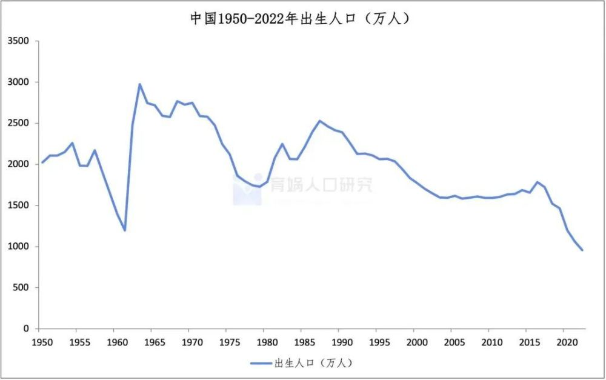

_资料来源：国家统计局、育娲人口_

**通过以上图表可以看出，中国的生育率和出生人口都是总体呈现下降的趋势，尤其是最近几年呈直线下降的趋势。**

2020年的出生人口1200万，只有1990年代初的一半，生育率降到了1.3，比日本还要低。而2022年，中国的出生人口已经跌破1000万，只有956万，生育率不到1.1。

**1.2 2022年出生人口概况**

根据国家统计局的数据显示，2022年全年出生人口956万人，人口出生率为6.77‰；死亡人口1041万人，人口死亡率为7.37‰；人口自然增长率为-0.60‰。

上述数据，意味着我国人口近61年来首次出现负增长。其实对于长期关注中国人口发展趋势的人来说，出现负增长原本就是完全在预料之中的必然结果。

自从2016年以来，中国每年的新增人口数都在持续减少，从2016年的906万人一路跌至2021年的48万人，所以2022年的负增长只是延续了近年来的趋势。至于导致这个结果的最关键因素，则是生育率的持续低迷。

2016年，当时在“全面二孩”政策的推动下，全年新出生人口达到了1883万人，出现了阶段性的反弹势头。然而短短6年之后，2022年的新出生人口已经降到了956万人，非但跌破了千万级别，而且只有2016年的一半左右，下滑之剧烈要比当初最悲观的预计更糟糕。

**图3:中国2016-2022年全国年末总人口增减情况（万人）**

_资料来源：国家统计局、育娲人口_

**1.3 疫情和三孩政策对出生人口的影响**

2020年新冠疫情发生后不久，有人预测，疫情会导致全民宅家“造人”，年底将会迎来一波生育高潮。

但国家统计局的数据显示，2020年全国出生人口仅为1200万，比2019年减少265万。而在2022年，出生人口数更是进一步跌破了千万。

为何疫情对出生人口的影响是负面的？因为疫情可能导致经济衰退，会造成失业率上升或降薪，进而导致家庭收入减少。此外，疫情也增加了生活的不确定性和对住院分娩的担忧，进一步降低了育龄家庭的生育意愿。

当然，尽管这几年身处疫情防控的特殊历史时期，但考虑到中国之前的防控措施曾长期卓有成效，至少以2022年的人口数据而言，受到新冠疫情的影响并不是太明显。

相比之下，2023年的新出生人口数据倒是有可能因为疫情压力而进一步下滑。

整体而言，中国人口的首次“负增长”，并不能主要归因于疫情影响，而是各种长期因素综合作用下的结果。

同样的道理，即便未来中国迅速摆脱了来自疫情的负面影响，也不意味着新出生人口数据会出现报复性增长，不应当对此报以不切实际的幻想，仍然必须以长期发展的眼光来审视中国的人口问题。

2021年5月31日，中央政治局会议决定实施三孩政策。但由于现在人们的生育意愿普遍低迷，如果仅仅出台三孩政策而不大力鼓励生育，对提高生育率的效果并不显著。

原国家卫计委在2017年进行的全国生育状况抽样调查结果显示，育龄妇女平均理想子女数为1.96个，平均打算生育子女数为1.75个。

在不受任何外界条件影响下，11.4%的育龄妇女认为1个孩子最理想，80%的育龄妇女认为2个最理想，7.9%的育龄妇女认为3个及以上最理想，0.7%的育龄妇女认为没有孩子最好。

可见，认为3个孩子及以上最理想的育龄妇女人数，大约只有认为2个孩子最理想的人数的十分之一。二孩政策实施的头几年，每年因为二孩政策而多出生的人口只有200万至300万，由此估计，每年因为三孩政策而多出生的人口估计只有20万至30万。尽管2021年开始实施三孩政策，但2022年出生人口继续下降。

**1.4 中国低生育率的成因**

从图1可以看出，从1991年到现在，中国的生育率一直低于更替水平。2016年全面二孩政策实施后，中国的生育率短暂提升，但从2017年起又开始下降，2020年生育率已经降到1.3。

世界各国的普遍现象是，经济发展水平越高，生育率就相对越低，发达国家的生育率普遍低于发展中国家的生育率。

中国却是一个例外，虽然中国仍然是发展中国家，但生育率低于大多数发达国家。原因何在？

除了与中国过去几十年实行限制生育的政策有关以外，还有以下几个原因导致中国的生育率比其他国家更低：

首先，中国大城市的住房支出占据了一个普通工薪阶层的很大部分。

比如，根据《2019年全国50城房价收入比报告》的数据，深圳房价收入比是35，也就是说，对于深圳的普通人来说，即便不吃不喝，平均也需要35年才能买得起一套房子。中国其它大城市的房价收入比也几乎是世界最高的。这样的高房价，会极大地压抑城市夫妇的生育意愿[2]。

第二，中国小孩的教育压力和教育成本高得惊人。中国独特的高考制度，使得家长不得不消耗大量的精力和费用来为小孩备战高考，导致中国的育儿直接成本和机会成本相对于收入几乎也是世界最高[3]。

第三，在中国养育孩子，还面临着严重的看护困难。相对于其他国家，中国奇缺托儿所。据原国家卫计委2015年的调查显示，0到3岁的婴幼儿在各类托幼机构的入托率仅为4%，远低于一些发达国家50%的比例[4]。

还有，中国女性的就业率和受教育程度都是比较高的，但女性非婚生育的权益保障还没有完全到位。种种因素导致中国的生育率将降至世界最低水平。

多项生育意愿调查显示，城乡的意愿生育率只有1.8左右，比日本还要低很多，实际生育率只有1.3。而且中国大城市现在的生育率已经只有0.7-0.9，上海和北京的户籍人口的生育率只有0.7，是世界最低的。

随着年轻人口的进一步城市化，中国的生育率还会继续走低。

此外，中国的结婚登记人数和初婚人数自从2013年以来连续八年下降，也是中国近年来生育率下降的原因之一。在欧美国家，非婚生育的情况很普遍。但在中国，结婚和生育密切相关，非婚生子占新生儿比例很低，所以结婚登记人数下降必然对生育率有负面影响[5]。

**1.5 高中低三种生育率预测**

本报告的生育率设置，分为高、中、低三种生育率预测，以2022年总和生育率设置为1.07作为基础：

**高限生育率：**
从2023年起生育率逐渐递增，到2028年递增到1.4；2025年之后固定为1.4。高生育率的假设前提，是非常大力且有效的鼓励生育政策，例如鼓励生育的财政支出要达到GDP的5%左右。还需其它相应的配套措施，例如大幅度提高入托比例，争取达到北欧发达国家的水平也就是50%左右。当然我们希望未来鼓励生育政策力度要超出我们的预期，例如说拿出GDP5%以上来鼓励生育。

**中限生育率：**
从2023年起生育率逐渐递增，2028年回升到1.1，从2028年起固定为1.1。这是最有可能发生的一种情形，需要鼓励生育引起全社会的广泛响应，政府推出各种鼓励生育的措施，但是总体的财政支出只有GDP的1-3%，相当于其他发达国家的平均水平。由于中国的教育投入和房价成本仍然是世界上最高的，因此生育率也只能维持在发达国家里偏低的水平，稍低于日本，远低于欧美国家。

**低限生育率：**
从2023年起生育率逐渐递减，到2028年降到0.8；2028年之后总和生育率固定为0.8。这是我们不愿意看到的一种情形，但是如果没有有效的鼓励生育政策，中国的生育率就会接近全球最低水平，和韩国差不多，中国将在两到三代人以后失去人口大国的地位。

预测算法的其他一些假设不变，包括平均生育年龄和性别比。平均生育年龄在2021年设置为28.5岁，随后缓慢递增，到2050年平均生育年龄为30.5岁，至2100年平均生育年龄为31.5岁。出生性别比设置为从2021年起逐年下降，到2025年下降到106的正常值，此后一直保持106。图4是2023-2100年高、中、低三种生育率预测。

**图4: 2023-2100年高、中、低三种生育率预测**

_资料来源：育娲人口_

需要指出的是，近年可能受到新冠疫情带来的生育意愿变动、生育计划推迟和政策干预等因素的影响，使得实际生育率产生波动。和长期预测模式的结果相比，可能会出现短时间和预期相异的下降或反弹。

**1.6 出生人口预测**

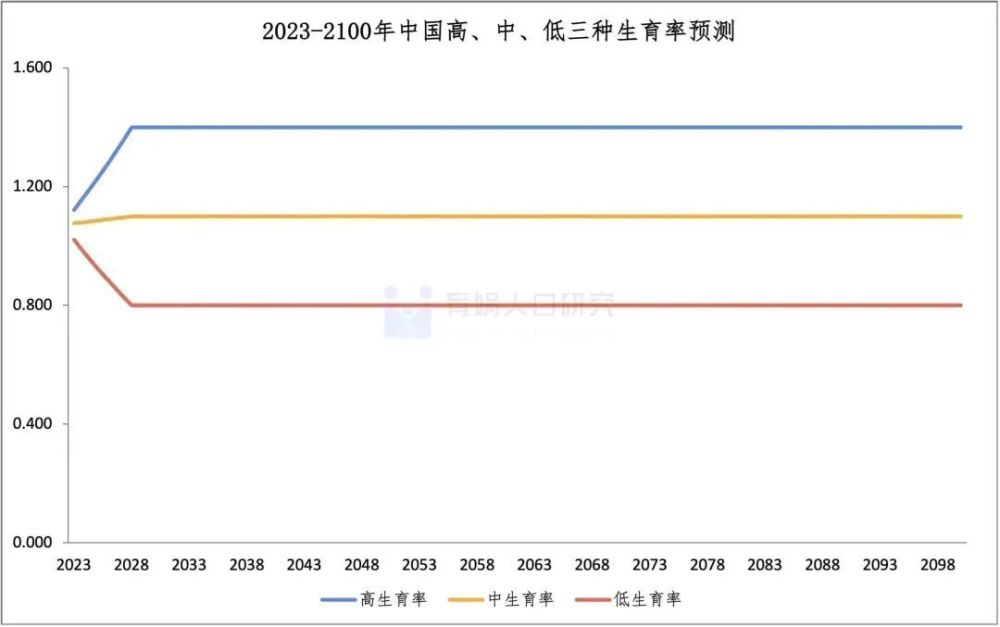

按照高、中、低三种生育率参数，我们预测2023-2100年中国出生人口的结果如图5：

**图5: 2023-2100年中国出生人口预测**

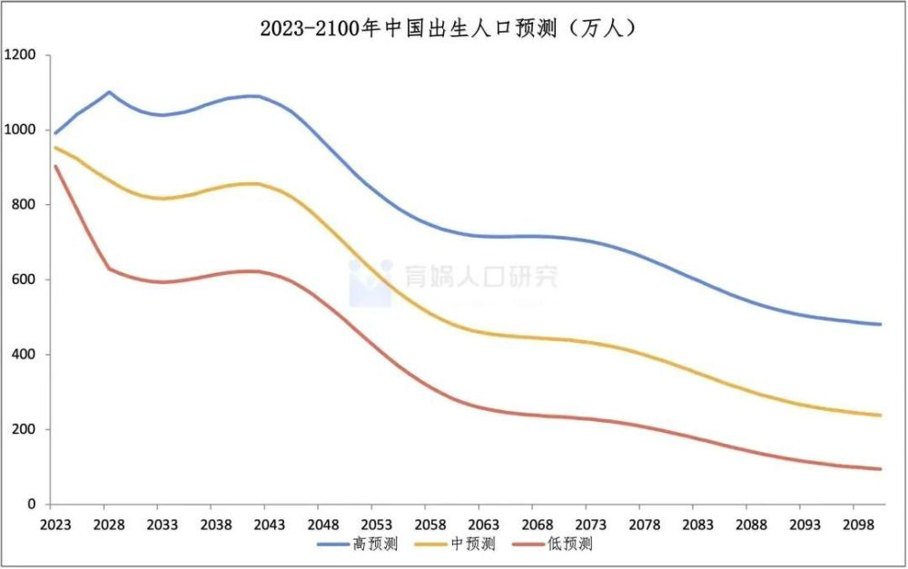

_资料来源：育娲人口_

2030、2050、2070和2100年出生人口预测如表1所示：

**表1: 中国出生人口预测（万人）**

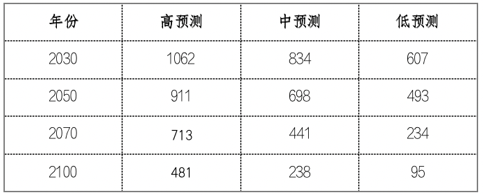

_资料来源：育娲人口_

**1.7 中国与美国和印度的出生人口比较**

下图是中国与美国和印度2023-2100年出生人口比较，中国出生人口数据来源是我们的低生育率预测，美国和印度的出生人口数据来源是联合国发布的《世界人口展望2022》。

**图6: 2023-2100年中国、美国和印度出生人口**

_资料来源：联合国《世界人口展望2022》、育娲人口_

从上图可以看出，中国和印度的出生人口在2022年以后都在逐渐下降，而美国出生人口则一直保持在400万左右，比较平稳。

虽然美国近年来生育率不断下降，2019年已下降到1.71，但由于美国每年吸收了约100万外国移民，仍然能使美国每年出生人口保持基本稳定。而中国的净移民数量可以忽略不计。

根据我们的低生育率预测，2030年，中国出生人口为607万；2050年，中国出生人口为493万；2070年，中国出生人口为234万；2100年，中国出生人口为95万。按照低预测，2056年中国的出生人口数量数将被美国超越。

2020年，印度出生人口为2400万，中国出生人口为1200万，仅相当于印度的一半。按照低预测，2030年和2050年，中国出生人口只相当于印度的30%不到；2070年中国出生人口只相当于印度的约14%；2100年中国出生人口只相当于印度的约7%，甚至比美国还少，只相当于美国的三分之一。

**2、死亡人口预测**

**2.1 平均寿命和死亡率假设**

根据国家统计局数据，中国人口的死亡率近十年来变化不大，2010年死亡率为7.11‰，2020年死亡率为7.07‰。人均预测寿命则逐年增长，2010年中国的人均预期寿命为74.83岁，其中男性为72.38岁，女性为77.37岁；2015年中国的人均预期寿命为76.34岁，其中男性为73.64岁，女性为79.43岁。本报告的人均预期寿命设置为寿命逐年缓慢增长，到2050年男性81.5岁，女性86.5岁；到2100年男性89.5岁，女性94岁。

**2.2 死亡人口预测**

我们预测2023-2100年死亡人口的结果如图7：

**图7:2023-2100年中国死亡人口预测**

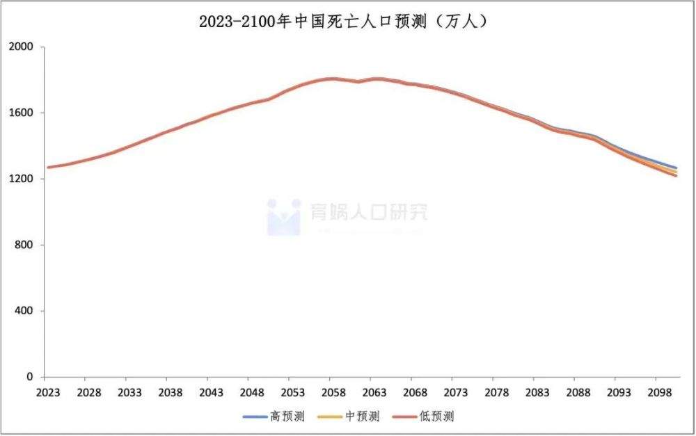

_资料来源：育娲人口_

2030、2050、2070和2100年死亡人口预测如表2所示：

**表2: 中国死亡人口预测（万人）**

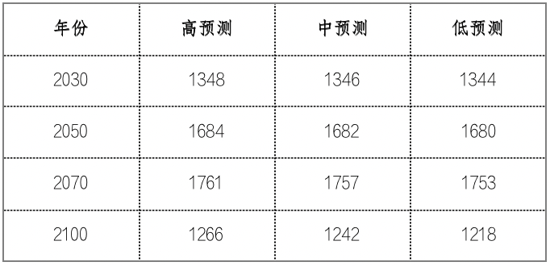

_资料来源：育娲人口_

可以看出，在高中低三种生育率下，死亡人口没有显著差异。这是因为未来几十年的死亡人口大部分是在2020年之前出生的。

**3、总人口预测**

**3.1中国1950-2022年总人口**

在预测未来中国总人口之前，我们先回顾一下中国过去几十年的总人口。下图是1950-2022年中国总人口。

**图8:1950-2022年中国总人口**

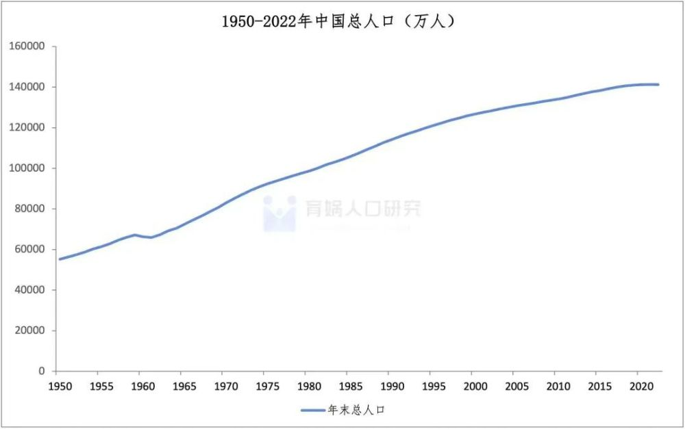

_资料来源：国家统计局_

可以看出，1950年中国总人口为5.5亿，1960年达到6.6亿，1970年达到8.3亿，1980年达到9.9亿，1990年达到11.4亿，2000年达到12.7亿，2010年达到13.4亿，2020年达到14.1亿。

**3.2 总人口预测**

我们预测2023-2100年中国总人口的结果如下图：

**图9:2023-2100年中国总人口预测**

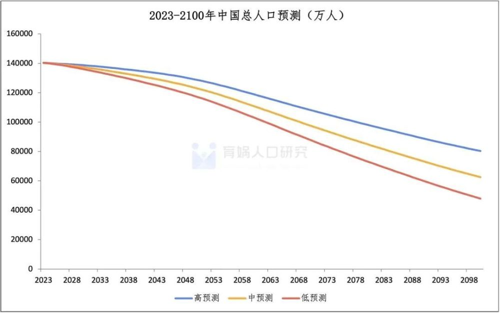

_资料来源：育娲人口_

2030、2050、2070和2100年总人口预测如表3所示：

**表3: 中国总人口预测（万人）**

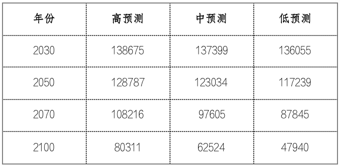

_资料来源：育娲人口_

**3.3 中国与美国和印度的总人口比较**

下图是中国与美国和印度2023-2100年总人口比较，中国总人口数据来源是我们的低预测，美国和印度的总人口数据来源是联合国发布的《世界人口展望2022》中方案。

**图10:2023-2100年中国、美国和印度总人口预测**

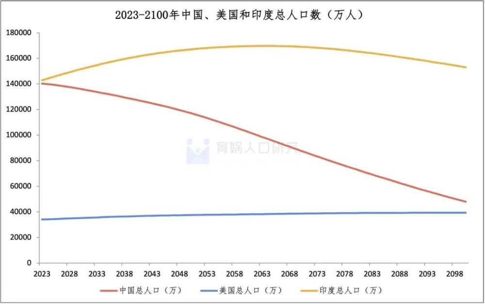

_资料来源：育娲人口_

根据联合国中方案预测，2030年，美国总人口3.5亿；2050年，美国总人口3.8亿；2070年，美国总人口约4亿；2100年，美国总人口约4.3亿。

根据联合国中方案预测，2030年，印度总人口约15亿；2050年，印度总人口约16.4亿；2070年，印度总人口约16.3亿；2100年，印度总人口约14.5亿。

根据我们的低预测，2030年，中国总人口为13.65亿；2050年，中国总人口为11.7亿；2070年，中国总人口为8.75亿；2100年，中国下降到4.79亿，不到印度人口的一半。

**3.4 中国人口占世界比例预测**

近200年来，中国人口占世界比例不断下降。中国人口占世界比例在1820年、1900年、1950年、1980年、2020年分别为36%、25%、21.8%、22.1%、18%，总体上在大幅下降。

我们对2023-2100年中国人口占世界比例进行了预测，中国人口的数据采用我们的高中低预测数据，世界人口数据采用联合国中方案预测（其中，中国人口的数据采用我们的数据来替换），出生人口采用的是联合国数据中的0岁人口。

高中低三种情形下，中国总人口占世界比例如下表所示：

**表4:中国占世界人口比例预测（%）**

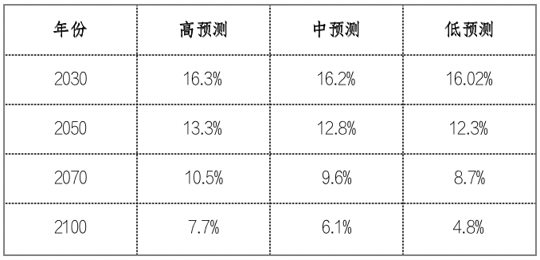

_资料来源：联合国《世界人口展望2022》、育娲人口_

高中低三种情形下，中国出生人口占世界比例如下表所示：

**表5:中国占世界出生人口比例预测（%）**

_资料来源：联合国《世界人口展望2022》、育娲人口_

可见，按照低预测，到2100年，中国总人口占世界比例将下降到4.8%，而出生人口占世界比例只有不到1%。未来几十年，随着中国总人口和出生人口占世界比例的快速下降，中华文明在世界上的地位将大幅下降。

**4、人口结构预测**

国际上一般把15-64岁人口列为劳动年龄人口（又称为工作年龄人口）。劳动年龄人口以外的人口都属于非劳动年龄人口，包括少儿人口和老年人口。

总抚养比是指，少儿和老年人口对劳动年龄人口的比率，用以表明每100名劳动年龄人口要负担多少名非劳动年龄人口。

少儿抚养比是指少儿人口对劳动年龄人口的比率，老年抚养比是指老年人口对劳动年龄人口的比率。总抚养比就是少儿抚养比和老年抚养比相加之和。

**4.1 总抚养比预测**

我们预测2023-2100年总抚养比的结果如下图：

**图11:2023-2100年中国总抚养比预测**

_资料来源：育娲人口_

从人口学上来说，如果总抚养比低于50%，就称为处于“人口红利”时期。如果总抚养比高于50%，就称为“人口红利”结束。

按照高预测，中国的人口红利将在2035年结束；按照中预测，中国的人口红利将在2036年结束；按照低预测，中国的人口红利将在2038年结束。

**4.2 老年抚养比预测**

我们预测2023-2100年老年抚养比的结果如下图12。

按照中预测，2050年老年抚养比上升到52.44%，2100年老年抚养比上升到111.14%。也就是说2050年每一个劳动年龄人口需要抚养1/2个老人，到2100年每个劳动年龄人口需要抚养1个老人。和其他发达国家相比，中国会成为老龄化程度最深的国家之一。

按照高预测，2050年老年抚养比上升到50.78%，2100年老年抚养比上升到83.06%。

按照低预测，2050年老年抚养比上升到54.26%，2100年老年抚养比上升到161.89%。

**图12:2023-2100年中国老年抚养比预测**

_资料来源：育娲人口_

**4.3 劳动年龄人口比例预测**

我们预测2023-2100年劳动年龄人口占比的结果如下图：

**图13:2023-2100年中国劳动年龄人口占比**

_资料来源：育娲人口_

按照高生育率预测，2050年劳动年龄人口占比下降到58.34%，2100年劳动年龄人口占比下降到49.43%。

按照中生育率预测，2050年劳动年龄人口占比下降到59.14%，2100年劳动年龄人口占比下降到44.30%。

按照低生育率预测，2050年劳动年龄人口占比下降到59.98%，2100年劳动年龄人口占比下降到36.77%。

**4.4 老龄化比例预测**

2021年中国65岁以上人口占比达14.2%，进入深度老龄化社会；2022年65岁以上人口占比进一步上升到14.9%，按照低预测，预计2032年左右进入占比超20%的超级老龄化社会。

从发达国家看，从65岁及以上人口占比超过7%的老龄化过渡到超14%的深度老龄化，法国用了126年、英国46年、德国40年、日本24年（1971-1995年）、中国仅用了20年；从深度老龄化到老年人口占比超过20%的超级老龄化，法国用了28年（1990-2018年），德国用了36年（1972-2008年），日本用了11年（1995-2006年）。

未来随着第二、三轮婴儿潮人口逐渐进入老龄，叠加低生育率影响，老龄化趋势将加速。在低预测情景下，预计中国将于2032年前后、即用10年左右的时间，进入超级老龄化社会，之后持续快速升至2050年的32.54%、2060年的40.17%，企稳一段后将再度上升至2078年的50.39%并继续上升。

而且，由于人口基数大，中国老年人口规模也是前所未有。预计到2050年，中国65岁及以上老年人口将达到3.82亿，占全球老人比重约24%，届时大致每3个中国人中就有1个65岁以上的老人。

**图14:2023-2100年中国老年人口占总人口的比例(%)**

_资料来源：育娲人口_

**5、政策建议**

根据国家统计局数据，2022年中国总人口已进入负增长。人口进入负增长之后，只要生育率一直低于更替水平，这种人口衰减将一直持续下去，所以必须刻不容缓地推出强有力的鼓励生育政策。

我们在之前多次提出鼓励生育的具体建议的基础上，进一步将这些内容概括为“十大建议”。而在十大建议里面，又可以进一步细分为三个部分。第一个部分，是我们认为最重要也最刻不容缓的四个方面，具体包括：

**1） 现金补贴：对于二孩家庭的每个孩子，给与每月1000元的现金补贴。给与多孩家庭的每个孩子，每月2000元的现金补贴，直至孩子到20岁。**

很多发达国家为了鼓励生育，会针对多子女家庭直接发放现金补贴。

比如：法国孩子出生首先可获928欧元奖金，0～3岁每月有185欧元补助，3～20岁每月有65～231欧元补助，每月还可获得169欧元的额外补助。德国目前每个家庭的前两个孩子每人每月可获184欧元，第三个孩子每月获190欧元，第四个孩子起每人每月获215欧元。

相比这些国家，中国目前面临的低生育率危机要严重得多，所以也必须推出同等甚至更大力度的现金补贴政策。

**2） 税务补贴：对于二孩家庭，实行所得税和社保减半，三孩家庭所得税和社保全免除。**

之所以要现金和减税的方式，是考虑到城市抚养小孩的成本比农村要高很多，而城市里的父母也缴纳更高的所得税和社会保险。

另外，从共同富裕的角度出发，可以针对上述税务补贴政策再打一个补丁，即对于特别富裕的家庭而言，通过该项政策所获的补贴将设置上限，进而确保规范财富积累机制。总的来说，现金和减税部分要2-3万亿元，可能相当于GDP的2-3%。

有人会问有必要这么多吗？尽管听起来似乎很多，其实分摊到中国两亿多个孩子，每月也不过1000多元，比养育小孩的实际直接财务成本还要低很多。

**3） 购房补贴：具体方式可以通过按揭利息返还或房价打折进行补贴。比如说返还二孩家庭的房贷利息的50%，对于三孩家庭的房贷利息可全部补贴返还。**

**或者在高房价的地区，可实施一孩房价九折，二孩房价七折，三孩房价五折的政策（不超过一个封顶补贴的上限）。同时加大人口流入地区和大城市的住房土地供应。**

据估计，每多一个小孩，差不多额外需要20平方米建筑的空间。举个例子，某个大城市的房价是每平米6万，假设一个家庭的年收入20万，那为了生这个孩子的住房成本就是夫妻6年的年收入，所以在中国的大城市，生孩子的住房成本很高。

中国大城市的房价为什么这么高呢?主要还是地价贵，每平方米6万元的房价中大部分都是地价，等同于地方政府的一种税收。

如果地方政府能够拿出一部分卖地收入通过贷款免息或者房价打折的方式补贴多孩家庭购房，就可以减轻生孩子的住房成本压力。这部分补贴的成本可能在2万亿左右，完全可以通过增加当地的土地供应来覆盖。

**4） 增建托儿所：把0-3岁的入托率从4%提高到50%左右[6]。**

发达国家尤其是法国和一些北欧国家，由政府提供普惠性的托幼儿所，帮助职业女性产后尽可能地回归工作。但在中国，托儿服务严重缺乏。

原国家卫计委的数据显示，0-3岁婴幼儿在我国各类托幼机构的入托率仅为4%。我们建议把0-3岁婴幼儿的入托率提高到50%左右。要实现这一目标，政府有必要直接或者牵头兴建至少十万个幼托中心。

按照0-3岁有4000万儿童计算，每个儿童补贴20000元的营运费用，结合50%的入托率目标，每年大概需要4000亿左右的财政补贴。

以上四个鼓励生育政策所需要的财政支出总额，估计要达到GDP的4-5%，但是这是必须的。

**前面已经提到，中国的低生育率是世界上最严重的，所以必须要有世界上最大的鼓励生育的力度**
。这也是成功鼓励生育的那些国家（如北欧国家），所需的鼓励生育的财政支持力度。

如果每个月只是几百元的补助，远远不足以劝说大部分家庭多生一个孩子。现在中国经济面临内需不足，消费疲软，产能过剩的问题，可以通过鼓励生育，来刺激消费，提振经济。

现在中国的人口老龄化还不是很严重，还有较高的储蓄和投资率，也就是说我们还有钱鼓励生育。等到未来人口严重老化，养老的财政负担加重，鼓励生育的代价就会比现在高很多，所以鼓励生育已经到了刻不容缓的时间节点。而且这种鼓励生育的投入是对未来人力资源的投入，长期有很好的回报。

以上四项是效果最为显著的鼓励生育政策，还有其他的一些公共政策也有助于降低养育成本，构成了第二部分的五项建议，简单概括如下：

  * _1_ 同时增加父母双方的产假天数，确保年轻的父母有更多时间和精力投入到对于新生儿的抚养；
  * _2_ 提倡灵活办公，鼓励企业允许员工以包括居家办公在内的多种灵活形式参与工作，从而降低工作与抚养孩子之间在地点和时间上的冲突；
  * _3_ 引进外劳保姆，借鉴我国香港地区以及其它一些国家的经验，允许从国外引进参与抚养孩子和家政服务的专业人员，从而为家庭提供人力资源的支持；
  * _4_ 扶植辅助生育技术，在确保法律规范和伦理道德的基础上，鼓励在更广范围内使用辅助生育技术，帮助原先各类受困于不孕不育等疾病的家庭看到迎接新生命降临的希望；
  * _5_ 保障单亲家庭权益。在很多欧洲国家，非婚生子女所占的比例甚至可能超过一半，即不再强行将生育与婚姻挂钩，尤其是确保“单亲妈妈”也能在社会上获得公平的对待。相比之下，中国的非婚生子女目前仍可能在户口登记等方面遭遇一系列障碍。近日，《四川省生育登记服务办法》因其修订内容涉及“生育登记取消结婚限制”而引发热议，其实也反映出对于该项问题的重视已刻不容缓。

而在上述总共两部分的九项建议之外，“十大建议”中的最后一个，是我们认为最有难度可能也最有争议的领域，那就是教育改革，我们认为，应当通过教育改革来减少教育的内卷式竞争。我们对此的建议是：
**教育减负：普及大学本科教育，减轻升学压力，缩短基础教育的学制[7]** 。

减少教育内卷是一个非常复杂的话题，我们对此的整体思路是，实现大学教育的普及化和均等化，从而减弱对大学录取和名牌大学录取的竞争。普及大学教育以后，就可以把中考和高考变成一种资格考试，只要通过就可以进入下一阶段的学习，而不作为淘汰和择校的依据。

**6、取消中考和缩短学制**

中考和高考浪费了大量的时间，导致学生有2年时间用于复习和应付中考和高考。必须取消中考和缩短学制，毕竟在拥有互联网之后，学生不必死记硬背很多知识点，缩短学制完全可行，取消中考则省下很多原本纯粹因为复习迎考而虚耗的时间，就可以把基础教育阶段提速2年，16岁就能上大学。

需要和取消中考相配套的，是高中教育资源的均等化。跟初中和小学资源的均等化一样，可以通过就近抽签入学、教师轮换等方法做到。普及十年的基础教育，让绝大多数年轻人在20岁时可以完成大学教育，提早两年走上工作岗位。一部分人可以在22岁获得硕士学位，提早2—3年走上专业类岗位。这既可以减轻社会和家庭的负担，又可以让年轻人尤其是女性有更多时间成家立业，从而提升生育率。

**7、附录：高中低情形的出生人口和总人口比较**

在本报告的正文，已经用图来表述2023-2100年的出生人口和总人口，下面是用表格来表述高中低三种情形下的2023-2100年出生人口和总人口。

2023-2100年出生人口的预测结果如下表：

**表6：2023-2100年中国出生人口预测（万人）年份**

_资料来源：育娲人口_

2023-2100年总人口的预测结果如下表：

**表7：2023-2100年中国总人口预测（万人）年份**

_资料来源：育娲人口_

**参考文献：**

[1] 梁建章、黄文政.建章解读七普数据之一：需要GDP2%到10%鼓励生育”.绕梁说,2021.5.12.
https://mp.weixin.qq.com/s/qHtJuEthoTu5-jvx7mZ1VQ

[2] 梁建章.中国,最严峻的人口形势.绕梁说,2021.6.3
https://mp.weixin.qq.com/s/SNgz2T07iwvXODN3DrBwKw

[3]
梁建章、黄文政.中国的生育率将是世界最低？绕梁说,2021.5.11.https://mp.weixin.qq.com/s/CNOQl7UEcqABlU69jt9l2A

[4] 梁建章.降低生育成本，应兴建至少十万个幼托中心. 新浪财经,2019.3.7.
http://finance.sina.com.cn/zl/bank/2019-03-07/zl-ihrfqzkc1854944.shtml

[5] 梁建章、任泽平、黄文政等.《中国婚姻家庭报告2022版》.育娲人口研究,2022.3.28.
https://mp.weixin.qq.com/s/2o9Yw1Npi1E1NC-fc2gaxg

[6]
梁建章、黄文政.建章解读七普数据之四：生育友好就是女性友好.绕梁说,2021.5.14.https://mp.weixin.qq.com/s/hc6u2gZWSUuIZI7PRvvxDQ

[7] 梁建章.普及大学教育和缩短学制. 绕梁说，2021.10.20.https://mp.weixin.qq.com/s/5tOE-
iOROzi8iExMkYDh2w

[8] 梁建章、任泽平、何亚福等.《中国生育成本报告2022版》.育娲人口研究,2022.2.22.
https://mp.weixin.qq.com/s/J2AcC1z32a4gjuQWqZiKdw

[9]
梁建章.《超低生育时代：人口经济学15讲》.绕梁说,2021.6.10.https://mp.weixin.qq.com/s/cCLCQ7dw_LeSmkyzzfHolg

[10] 联合国.《世界人口展望2022》,https://population.un.org/wpp/

