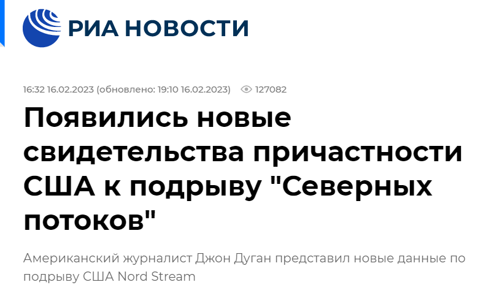

# 俄媒：美国爆破“北溪”更多新证据出现，还有匿名信件和照片

**财联社2月17日讯（编辑 牛占林）**
当地时间周四，据多家俄罗斯媒体报道，有一名美国记者提供了美国爆破“北溪”天然气管道的新证据，这一次爆料的不再是赫赫有名的普利策奖得主西摩∙赫什，而是一位叫做约翰·杜根的美国记者。

_（来源：俄新社）_

据杜根所言，他在去年10月2日收到了一封匿名信件，信件使用的是一次性电子邮件地址。杜根后来试图联系写信的人，但没有成功。

杜根向俄新社提供了这封信件的内容，但是他请求不要分发它们，以免外人识别出他的身份。杜根指出，他完全有理由相信向他提供演习照片和文件等证据的匿名消息人士，他也完全相信信件内容的真实性，因为里面有太多的细节了，信件作者自称参加了去年的北约“波罗的海行动”演习，不是亲身经历者根本无法描述出相关的细节。

**信件主要内容**

信件文本显示，美国深海潜水员参加了去年6月在丹麦博恩霍尔姆岛旁举行的“波罗的海行动”
军事演习，在带着不大的箱子进行6小时的潜水前，这些潜水员接受了美国第6舰队中将的指导。

写这封匿名信件的人指出，他当时也参加了这场演习，据他介绍，在6月15日那一天，一架直升机运送来了一群身着便衣的美国人(潜水员)。写信的人写道：“我的第一个想法是他们看起来像一群恐怖分子。”
他发现这些美国人的发型、胡子和鬓须很奇怪，也没有名字标牌。

随后，美国海军第6舰队的一名海军中将和一群便衣人员迎接了潜水员。写信的人指出，有目击者注意到潜水员带有深海潜水装备MK-29循环呼吸器。
除此之外，他们还有其它高度专业且昂贵的装备，这些装备是常规海军部队所不具备的。他们还带来了不大的箱子。

潜水员们自己声称是来参加排雷演练的，他们要乘坐橡皮艇航行到某个水域，在那里寻找并排除反舰水雷，但他们却没有排雷的专门设备。
而潜水员在与美军中将交谈后，并未前往演习指定区域，且长时间缺席。

写信人写道：“他们戴着呼吸器跳下船，消失在水下六个多小时。没有这样的可以让潜水员在水下停留六个小时的自给装备，使用最新的军用系统，最多也就三四个小时。”他表示，他们回来时没有带回箱子，然后他们就被直升机接走了。

**事情还在发酵**

这封信件描述的内容与上周西摩∙赫什发表的文章完全吻合。据赫什爆料，在北约2022年夏季的“波罗的海行动”演习期间，美国潜水员在“北溪”管道下安置了炸药，在三个月后，挪威人将其引爆。

赫什表示，美国总统拜登在与国家安全问题团队进行了9个多月的秘密讨论后，决定破坏北溪。美国政府回应称，美国与2022年俄罗斯天然气管道爆炸事件无关，白宫驳斥了赫什的文章，称其为“完全虚假和彻头彻尾的虚构”。而西方主流媒体基本上集体对该事件保持了沉默。

近日以来，赫什还在高强度输出，他接受了多家媒体的采访。赫什表示，拜登政府想要制造冲突，但这种做法却极为愚蠢；美国炸毁北溪是因为担心德国会在严冬到来的情况下同意北溪开闸输气，对欧洲来说，北溪管道爆炸事件的后果是极为严重的。在事情发生后，他们只能依赖美国，即使在危机时期。

俄罗斯常驻联合国副代表波利扬斯基周三在社交媒体上发文说，鉴于北溪被炸事件出现新的细节，俄罗斯已向联合国安理会提出申请，要求在莫斯科时间2月22日23时(美国纽约时间22日15时)召开会议，讨论相关事件。

俄罗斯外交部长拉夫罗夫周三声称，俄方正就召开联合国安理会特别会议做准备，将要求联合国对事件进行调查。拉夫罗夫补充说，俄方不同意有关联合国无权调查北溪管道遭破坏事件的说法。

（财联社 牛占林）

