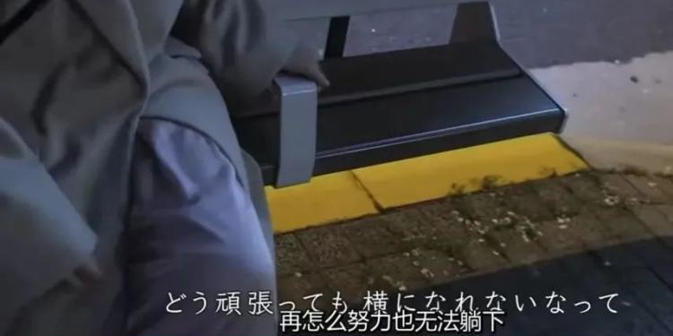
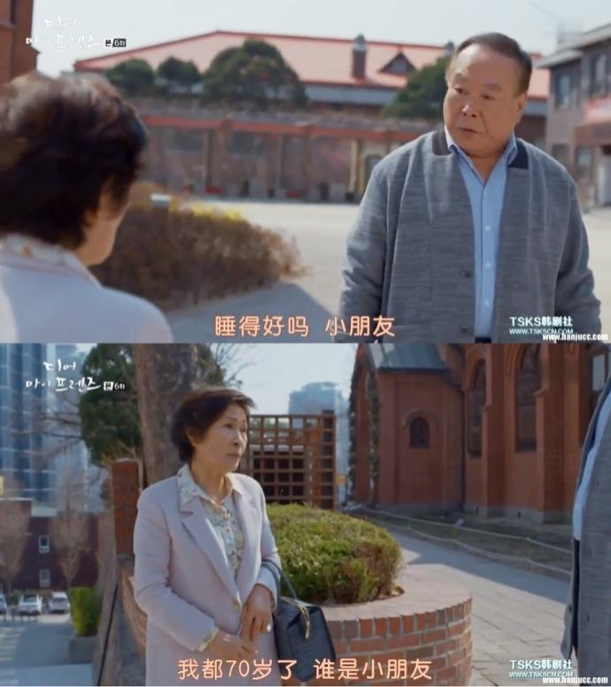
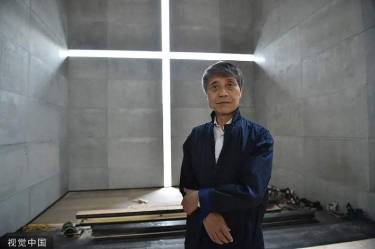
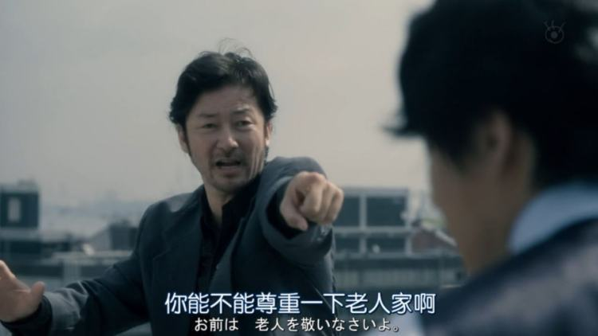
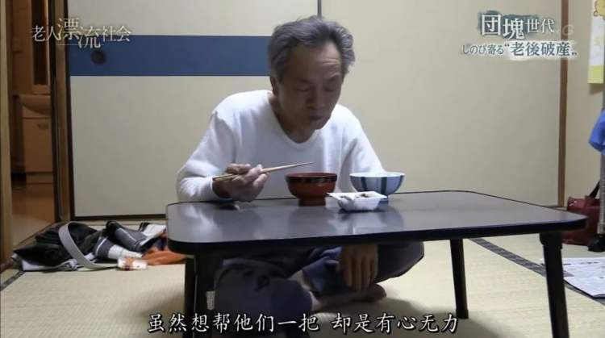

# 工作至死：789万日本老人还在打零工

_图源：《我亲爱的朋友们》_

**备受关注的日本老年人工作现状，是一个让全亚洲警示的信号。**

前段时间，《纽约时报》上刊登了这样一条报道：

**73岁的大波良仁** ，如今也未能脱离工作。他 **每天凌晨1点半起床**
，随后驾车1个小时前往面向东京湾的青果市场，将一筐筐沉重的货物搬上货车。在天亮之前，他要按照订单将果蔬送往市内各处的餐厅。繁忙的时候，一天要前往十来家。

对于早该颐养天年的大波先生来说， **“过了70岁仍在工作，感受不到丝毫乐趣，只是为了生活，不得不这么做罢了”** 。

_图源：《二十五，二十一》_

**无法停止工作的日本老人**

简单回溯一下大波先生年轻时的职业经历，就能明白他退休之后仍需要工作的理由：

他年轻时在出租车公司当过司机，后来为了挣钱而辞职，成为一名独立的货车司机——

这意味着他要放弃公司的庇护，偏离战后日本主流的“终身雇佣制”的工作路径， **意味着他要失去稳定的工资、定期的晋升，以及一半由企业负担的养老保险。**

年轻时，货车司机的收入也许一度还不错，但过了50岁之后就收到医生的警告：他的腰椎不能再承受过度的重物搬运。

15年前，大波先生开始了青果市场的配送工作，虽然相比前一份工作，其重量级轻松了许多，但随着年龄的日渐增长，这仍是一份严酷的体力劳动。

_图源：《我亲爱的朋友们》_

大波先生从65岁之后开始领取日本政府发放的养老金，但由于不能享受企业缴纳的养老保险，每个月只能拿到6万日元（约合人民币3000元）。

在长寿之国的日本，像大波先生这样，由于养老金不足以维持生活，在70岁之后仍然不得不继续工作的老年人，正在膨胀为一个越来越壮大的群体。

另一方面，伴随着少子化现象愈演愈烈，年轻劳动力不足，这些老年人正在填补超乎他们体力所能胜任的劳动力市场。

《纽约时报》在对大波先生的报道中，用标题总结了这一社会现象： **“退休是梦中之梦，不得不工作的日本老年人们‘严苛的老后’。”**

_图源：《事件の泪》剧照_

过去很长时间里，“60岁退休”都是日本人之间的一个共识。但自从2013年实施的《老年人雇佣安定法》规定“企业有义务让员工继续工作至65岁”起，正规的雇佣者在退休之后会继续被企业返聘5年，再加上日本社会领取养老金的年龄是从65岁开始，因此人们的观念又在面对“65岁退休”时达成了新的一致。

然而2021年春天，这一法律又经过了一次改革。政府要求“确保70岁之前老年人的就业机会”——这也意味着，
**整个社会已经悄然将“退休”的上限从65岁提升到了70岁。**

到底有多少日本老年人退休之后仍在工作呢？根据日本总务省的最新统计，2021年，日本65岁以上的从业人员达到909万人，这是史上最高纪录。与此同时，日本
65岁以上老年人在2022年达到了3627万人。

这就意味着，日本的老年人中，达到退休年龄以后仍在工作的，平均每4个人中就有1个。

再细分一下年龄段，60代（60岁-64岁）仍在工作的老年人达到71.5％，60代后半（65岁-69岁）仍在工作的人群也达到了50.3％——
**工作到70岁，确实已经逐渐成为常态了。**

_图源：《我亲爱的朋友们》_

从日本公共职业安定所公布的另一组数据中还可以看到：2019年，日本65岁以上的求职登录者达到59万人——这个数据是10年前的两倍，而自从2017年后，70岁以上的求职者也在增加。

2017年年满70岁的求职者，意味着在1947年至1949年的第一次“婴儿潮”时期出生的806万人，也即是我们常说的“团块世代”，正在成为庞大的超老年人群体。

他们从2022年开始陆续年满75岁，这也使得这一年，日本75岁以上老年人在总人口中所占的比例首次超过了15%。

于是日本社会出现了很分裂的现象：

一方面，是 **社会需要负担的老年人养老金越来沉重** ，人们为自己的老后生活忧心忡忡。另一方面，人们又将“世界第一长寿国”作为骄傲的谈资，
**75岁还不算太老。**

在2022年，日本连续52年增加的“百岁老人”达到90526人，比上一年又增加了4016人。大街上的宣传海报、电视上的新闻节目，随时都有人在高喊“人生百年时代”的口号。

_图源：《我亲爱的朋友们》_

我在日本遇到过许多在“人生百年时代”燃烧生命的老年人。他们是支撑日本战后经济复兴的主体，创造了泡沫经济时期的繁华。尽管经历过泡沫经济的破灭，仍然满怀雄心壮志，退休之后也不愿放弃改造社会的愿望。

例如被称为“日本国民编剧”的仓本聪，80多岁还在开展演剧工坊、培养戏剧界年轻的新人；例如“第一列车设计师”水户冈锐治，75岁的今天仍在推出新的设计作品……

也有一些中国人也很熟悉的名人——74岁的村上春树，刚刚写完一本40多万字的小说，81岁的安藤忠雄，患癌被摘除5个脏器后还在建造儿童图书馆……

_安藤忠雄。图/视觉中国_

在日本各地旅行时，也遇到过一些70多岁了还在经营民宿的老年夫妇。即便拿着很高的公务员退休金，他们也不肯闲下来，还积极讴歌着“第二人生”。

有时也难免感慨，这些老年人是我在日本见到的最有干劲的一群人。与年轻人中层出不穷的“废柴”和“家里蹲”群体相比，他们对人生、对社会、对未来都更充满力量。

也正是因为有他们这样的人在社会上活跃，外界很容易形成一种错觉：日本老年人精力充沛、热爱工作，没有后顾之忧。

**但收入稳定的精英阶层，真的能代表日本的现状吗？还是说，从事体力劳动的大波先生才是底层的大多数？**

**日本老人究竟有多累？**

有一个数字很能说明问题： **眼下日本65岁以上的909万名从业人员中，正式员工只有120万人** ，剩下的大部分都属于临时工和兼职工等非正式员工。

在这些非正规雇佣的老年人中，最多的人从事批发贩卖业（大波先生的情况就属于这一种）和零售业，其次是农业和林业，再往后依次是服务业、制造业和医疗福利业。

这些人在日常生活中无处不在：

我家楼下的便利店，平日白天总有一个满头白发的老太太站在收银台前，因为反应力稍微有点儿迟缓，常常会有年轻的顾客露出不耐烦的神情；

在某个农村遇到的农家阿姨，每个月只能拿到5万日元退休金，必须找工作补贴生活，但年纪大了没有体力继续从事农业劳动，后来找到一份短工，每周在老人院工作一天，
**从晚上9点到早上9点，一个月勉强能拿到5万日元** ；

退休金不够用的农家男人们，会从事一些门槛更低的工作，例如跑跑长途汽车，或者贷款买一台小型吊车，哪里有施工现场就去哪里接活儿。

**在东京和大阪这样的大城市里，往往能看到老人在担任公司和公寓大楼的管理、安保、清扫之类的体力劳动工作。**

日本警视厅发布的“保安业概况”显示，至2019年年末，日本全国57万名保安人员中，60岁以上的群体占据45%，70岁以上的群体也正在增加。

这些老年人保安，主要在施工工地和活动现场做临时工作，薪水按日结算，如果运气好总有活儿，从晚上12点工作到早上7点，按照每小时1200日元的报酬，每个月能收入10万日元。

还有一种情况，相信来过日本旅游的人们会有一个共同感受： **为什么日本的出租车司机总是老年人？**

我第一次意识到这件事，也还只是旅游者。当时有一位颤颤巍巍的老头子，踩紧油门送我们去赶一班火车。当时，整车人都陷入了沉默，事后再说起，都是一样的不安与不解。

_图源：《我亲爱的朋友们》_

这确实是一个令人震惊的数字： **日本出租车司机的平均年龄超过60岁，其中65岁以上的老年人占据将近一半。**
不仅如此，70岁至74岁之间的老年出租车司机有近两成，75岁以上的大约一成，甚至还有超过80岁的情况。

开出租车似乎门槛比较低，只要有驾照就能工作，同时 **出租车公司还要履行政府“保障70岁之前的老年人的就业机会”的义务，也会积极接收老年人**
，使得这份工作成为许多退休的老年人再就业的最佳选择。

但在积极保障老年人工作机会的同时，确实也引发了一些人的不安：老年人的视力和反应力都在不断弱化，这是否会导致更多的道路安全事故？

在日本生活久了，渐渐会明白：每一个老年出租车司机，背后都有这样那样的故事。

日本的出租车服务向来以周到著称，最近几年，我开始频繁地主动要求自己搬行李箱，对方肉眼可见地松了一口气。

这些老年人司机中，搬不动大箱子的人越来越多。

有一位70多岁的司机，为此连声向我抱歉，说他从前搬箱子是没有问题的，只是去年刚从楼梯上摔下来，全身多处骨折，四肢和脖子都不能动弹地躺在病床上，留下后遗症，左手至今无力。
**他只在病床上躺了8个月，就又来开出租车了，不然没钱继续生活，还有一大堆因医疗费欠下的债要还。**

他终于开始后悔，年轻时成天到处玩，没干过正经工作，甚至还干过黑社会，直到妻子带着孩子离开了他。如今他既没有家人，也没有养老金，只靠开出租车活着，大概会一直开到死。

_图源：《老人漂流社会“老后破产”的现实》_

这几年，京都的私人租车公司越来越多。司机中，老年女性的身影也越来越多，能看出她们无论对行驶路线还是电子支付都不太熟练，显然是才刚刚开始接触。

这样的事情遇到得多了，再听到开车的老年人们在车里播放起怀旧的昭和老歌，也再也感受不到浪漫和怀旧，只觉得是听了一曲他们的青春哀歌。

**老后破产，离他们有多远？**

在“人生百年时代”的日本，青春不再的底层老年人，没有丝毫余力去讴歌“第二人生”。他们身陷贫困泥泞。

在日本，65岁以上的老年人家庭的贫困率大约是27%，直观来说， **每4个老年人家庭之中，就有1个处于贫困状态。**

养老金不够用，陷入贫困，是这些六七十岁的老年人仍在工作的最大原因。

_图源：《老人漂流社会“老后破产”的现实》_

日本的养老金构成分为两种：一种是厚生年金，工作时由个人和企业对半缴纳养老保险，过了65岁之后陆续发放；一种是国民年金，没有企业保障的人自行按月缴纳保险金（2022年约为每年20万日元），这属于一种个人保险行为，同样在65岁之后可以领取。

这两种养老金的差异悬殊巨大。

以2021年为例，领取厚生年金的老年人，平均每月可以拿到14万5665日元（约为人民币7500元），而领取国民年金的老年人，平均每月则只有5万6479日元（约为人民币2900元）——
**维持老后基本生活的养老金，只属于那些被企业终身雇佣的员工或是稳定的公务员。**

这就要求你一辈子必须拥有稳定工作，人生不能遭遇变故，最好不要患上重大疾病，不能中年失业，公司千万不能倒闭，从事自由职业更是万万要不得……

如果你不幸恰好是个女性，你还要仔细想一想： **生产和育儿，会不会让你在职场失去立足之地？**

将近20年前，日本政府在进行大规模的养老金改革时，曾经提出过一个振奋人心的口号：“年金100年安心”。大意是，以目前的养老金制度，政府能够保障人们在职业时代收入50%的养老金的水准，这种情况能够维持100年，国民请安心！

只不过到了2019年，人们谈论的话题就变成了 **“‘年金100年安心’的谎言”** 。

在当年，金融厅公布了一份针对老年社会资产构成和管理的提案书，其中提出了一个正相反的事实—— **“老后资产2000万日元不足”** 。

内容分析说：丈夫65岁以上、妻子60岁以上的老年人家庭，将面临每月平均5万日元的入不敷出，如果按照退休后继续生活30年来试算的话，这个家庭还需要2000万日元（约为人民币100万元）存款，才能够保证老年生活。

提案书建议，随着少子高龄化的影响和物价不断上涨，未来仅靠养老金肯能无法维持老后的生活水准，寿命越长需要的钱就越多，大家请积极自助并自行理财吧！

_图源：《老人漂流社会“老后破产”的现实》_

其实对于大多数老年人家庭来说，2000万日元的存款都不是一个轻松数字。

厚生劳动省2018年7月发布的《国民生活基础统计调查》显示，日本家庭的平均年收入为560万日元，但实际上有60%以上的家庭没有达到这一数字，其中有近40%的家庭收入还不到400万日元。

无论是号召存款2000万日元，还是保障70岁以下的老年人工作的权利，背后都是一个醒目的现实： **日本的养老已经从“公助”时代进入了“自助”时代。**

而且人们也意识到，这种“自助”越早越好，等到退休后再来考虑，为时晚矣。

担心养老的日本老人，也在操心子女的养老

最近，我的一位老师极力推荐我购买一款年金保险，提醒我要未雨绸缪，为老后生活提前做好准备。

这是一个名叫“iDeCo”的私人保险，也是目前日本政府大力推广的年金补助方式。本质上其实是投资业务，每个月向银行储蓄五千日元至几万日元不等的资金，在60岁以后作为养老金领取。投保资金能够享受小额收益，同时很有吸引力的一点是，还可以享受每年的个人所得税和住民税减免政策。

在我写这篇稿件的时候，iDeCo 的加入者已经超过了270万人，虽然它早在2001年就推出，但一直备受冷落，
**直至“老后资产2000万日元不足”提出之后，才肉眼可见地变得受欢迎。**

尤其是20岁到29岁之间的加入者，据说在短短四年里增加了12倍。

日本各大银行和证券公司的网页上，在推广这项业务时，也都毫不掩饰地向人们积极解释购买它的三大理由：

**老后生活，光靠养老金是不够的；随着泡沫经济的崩坏，企业倒闭而不能支付员工年金的案例越来越多；物价上涨，钱会更加不值钱。**

