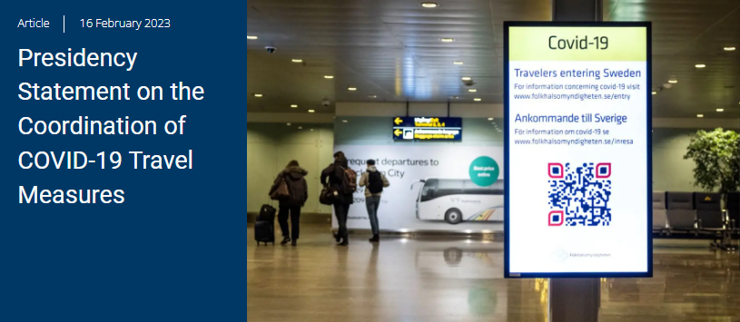

# 欧盟：即日起，逐步取消针对自中国出发旅客的入境防疫要求

（观察者网讯）当地时间2月16日，欧盟轮值主席国瑞典发布声明称，申根区成员国已经同意，即日起逐步取消针对自中国出发旅客的入境防疫要求。申根区由23个欧盟成员国以及冰岛、列支敦士登、挪威和瑞士4个欧洲自由贸易联盟成员国共同组成。

声明指出，在当天举行的欧洲理事会危机管理机制“整合性政治危机应对”（IPCR）会议上，27个申根区国家代表出席，共同审议了适用于自中国旅客的新冠防疫措施的情况。

“鉴于疫情的最新发展，考虑到欧盟卫生与食品安全委员会的意见，各成员国达成一致意见”，欧盟轮值主席国瑞典在声明中宣布，即日起，
**在2月底前“逐步取消”对自中国旅客出发前需提供48小时内新冠病毒检测阴性证明的要求；在3月中旬前“逐步取消”随机核酸检测。**

声明还说，欧盟方面将继续采取协调一致的防疫措施，并继续监测与新冠疫情发展相关的情况。

_欧盟轮值主席国瑞典发布声明_

此前，意大利已经决定放松针对自中国出发旅客的入境限制。作为第一个宣布对中国旅客实行强制性核酸检测的欧洲国家，当地时间1月31日，意大利卫生部宣布，自2月1日起，不再对中国旅客实行强制性核酸检测，而是改为“随机检测”，但仍需提前出示48小时核酸阴性证明。

同时，意大利《24小时太阳报》援引数据指出，截至1月底，官方对从中国入境罗马的旅客进行了超3000次核酸检测，检测结果呈阳性的旅客仅有47例，占比约为1.4%，并未发现新变异株。而47名阳性旅客中，只有5名是在1月6日之后入境。

_意大利《24小时太阳报》报道截图_

为保障促进中外人员交流交往，去年12月27日，中国国家移民管理局宣布自2023年1月8日起有序恢复受理审批中国公民因出国旅游、访友申请普通护照，恢复办理内地居民旅游、商务赴港签注。但此后，美国、印度、意大利、日本、韩国等国以担心出现新变异毒株为由，对中国旅客入境加增限制。

其中，欧盟在1月4日称，“强烈建议”各成员国政府要求自中国入境旅客出发前提供48小时内新冠病毒检测阴性证明。与此同时，欧盟还同意采取一系列与旅行相关的措施，涉及口罩、飞行前病毒检测和废水检测等，相关具体措施由各国自行决定。

欧盟上述“强烈建议”，令期待中国旅客大幅重返出境游市场的欧洲航空业出离愤怒。1月5日，欧洲航空协会（A4E）、国际航空运输协会（IATA）和国际机场理事会欧洲分会（ACI
Europe）发布联合声明，称对欧盟这一决定“深感失望”（lament），并将该建议比作未经思考的“膝跳反应”。

对于欧盟“针对”中国旅客设限的行为，我外交部发言人毛宁曾在第一时间指出，欧盟应多听听理性的声音，客观公正看待中国疫情防控形势。

毛宁强调：“中方多次强调，各国的防疫措施应当科学适度，不应影响国家间正常的人员交往和交流合作，不应有歧视性做法，更不应借机搞政治操弄。针对有些国家出台不合理的做法，中方将结合疫情情况和防控需要，按照对等原则采取相应措施。”

**本文系观察者网独家稿件，未经授权，不得转载。**

