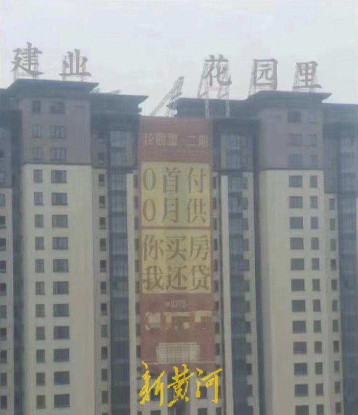

# 河南一楼盘推出“0首付0月供你买房我还贷”？工作人员：避免烂尾

2月17日，河南安阳一楼盘发布的“0首付0月供你买房我还贷”的宣传广告引发热议。17日下午，新黄河记者以购房者的身份咨询该楼盘售楼处，一名工作人员表示，“首付可以分期，只需要交定金，剩下的首付需要交房之前交齐。0月供，指的是贷款下来后，月供由开发商来还，交房拿钥匙之前把钱还给开发商，没有利息，这样就不用担心工期延期或者烂尾现象。”

新黄河记者：刘海奎

编辑：刘玉红

