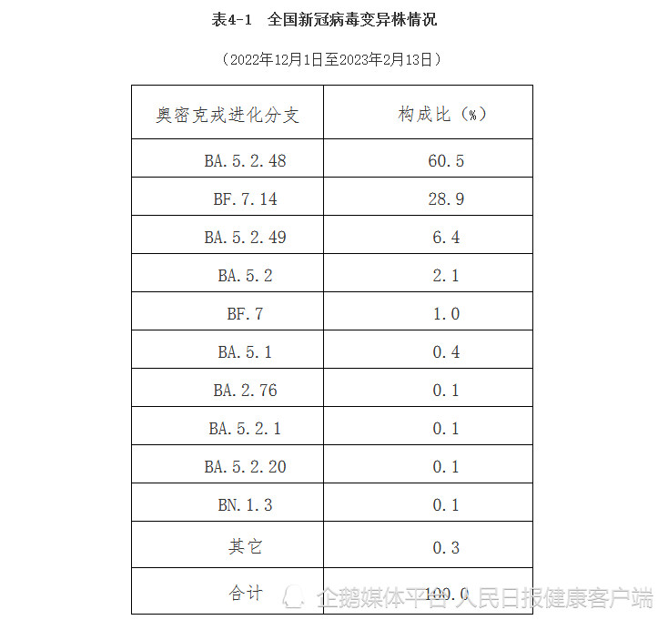

# 重点关注的变异株是否会大面积流行？曾光：取决于人群的易感性

**健康时报记者 高瑞瑞**

2月15日，中国疾控中心发布全国新型冠状病毒感染疫情最新情况。2022年12月1日至2023年2月13日，共发现本土重点关注变异株14例，其中，1例XBB.1，1例XBB.1.5，5例BQ.1.1，1例BQ.1.1.17，4例BQ.1.2和2例BQ.1.8。

**新冠病毒新增变异株是否会大面积流行？**

著名公共卫生与流行病学专家曾光教授表示，新冠病毒新增变异株目前是否会大面积流行，重要的是取决于两点：一是变异株的传播性和致病性；二是人群的易感性。另外，社会因素、自然因素也会影响病毒的传播过程。

_中国疾病预防控制中心前流行病学首席专家曾光教授_

“目前中国10多亿人群在短时间内集中发病后获得了自然免疫，相当于普遍接种了一次疫苗，而且这次自然感染免疫是在全国已经接种34亿剂次疫苗的基础之上发生的获得的，我国易感人群已经不足全人口的10%内地民众。”曾光教授告诉健康时报记者，“可以说，我国民众短时间内形成如此大规模的免疫屏障，其他各国没有出现过，我国的自然感染率已经高过世界上绝大多数的国家，免疫屏障是相当牢固的”。

“当前感染高峰已经过去一个多月了，我们还没有发现能够突破免疫屏障的变异株，针对新增的变异株，我们需要继续观察，与其相信预测不如做好实战探测，以早期发现病毒的演变，为应急决定最适合的疫苗接种策略服务。”曾光说。

**面对新冠病毒新增变异株，哪些人群需要注意？**

目前，两类人群需要尽快接种疫苗，一是这次集中感染潮中既没有进行过序贯疫苗接种又没有被感染所有的人群，特别是其中的老年人和有基础性疾病的患者，。二是儿童，特别刚满3周尚未接种疫苗的儿童还。
这类人群务必加紧接种。

曾光提醒：由于新冠病毒长期存在，即使世卫组织未来有一天会解除新冠疫情紧急状态，也需要同时发布提示，至少要像对待流感那样，将新冠作为全球监测的重点传染病，并指导各国建立常规监测系统，探索建立类似流感那样规范化的年度常规疫苗接种制度。

