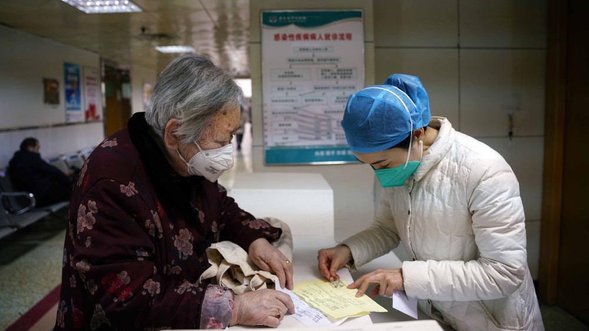

# “医保个账减少，增加5000家药店有何用？”

出品 | 虎嗅医疗组

作者 | 陈广晶

编辑 | 陈伊凡

头图 | 视觉中国

万众关切的医保再次激起了舆论漩涡。

前几天，医保个人账户改革在部分地区引起了较大反应。

作为回应的一部分，2月15日，国家医保局发布了《国家医疗保障局办公室关于进一步做好
定点零售药店纳入门诊统筹管理的通知》，将药店纳入门诊统筹，也就是说，在药店开药有望参照门诊标准报销。

在此后两天，武汉更是大手笔将682家定点医疗机构、5094家定点零售药店纳入了门诊统筹保障范围。

**“将定点药店纳入门诊统筹，比预计来得更快。”医保领域研究者仲崇明向虎嗅表示。**
这项改革措施的落地，也将加速促进中国医疗医药市场的快速转变，包括原本集中在医院的药品市场，向院外的药店流转等过程。

此后，参保人，主要是退休人员，有望在门诊、药店享受到更高水平的医保支付待遇。

但表面上看起来，医保药店纳入门诊统筹只是增加了买药的地方，并没有解决个帐钱变少的问题。因此质疑仍在，有网友直指，医保个账减少，增加5000家药店有什么用？买药不花钱吗？

这将关于医保个账改革的争议推到了一个新的高度。

**医保局推出把药店纳入门诊统筹背后的政策逻辑是什么？能否解决个账改革的问题？医保个账改革的争议核心到底是什么？最终解决的方向是什么？**

“个账改革”到底在解决什么问题？

在本轮医保改革的蓝图中，个账钱少了实际上只是其中一步。

根据国务院办公厅2021年4月份正式印发的《关于建立健全职工基本医疗保险门诊共济保障机制的指导意见》（以下简称“指导意见”），这项改革最终指向的目标是：进一步健全互助共济、责任共担的职工基本医疗保险制度，更好解决职工医保参保人员门诊保障问题，切实减轻其医疗费用负担。

简言之，就是要提高门诊保障水平，从整体上减轻医疗费用负担。这个负担里既包括医保基金的部分也包括个人的部分。

在这份《指导意见》中，个账改革是重要的基础，要改变医保报销策略，向门诊、定点药店、甚至互联网+医疗服务方向倾斜。
**而在这个政策中，退休人员也是政策要“适当倾斜”的对象。**

这蕴含着中国医疗卫生体系改革的新方向，特别是理念上的巨大改变，即从“治已病”向“治未病”转变，从侧重疾病治疗向侧重疾病预防倾斜。

长期以来，中国人对待健康的态度就是不生病不关注健康，小病小痛都是尽量忍，直到受不了才看病。“发现就是晚期”的情况非常常见。

而在中国医保基金建立之初，筹资水平低、基金管理能力弱，保障的重点也是集中在较重的疾病上，更容易管理的住院患者是其中主体。

这也形成了中国独特的现象——住院率虚高问题严重。中国社会科学院经济研究所研究员朱恒鹏曾与中国社会科学院大学、牛津大学的研究者一起对中国住院率问题进行调查，统计数据显示，从2012年到2018年，三级医院的住院人数占比从42.4%增长到了54.4%；住院收入在医院收入中的占比从63.9%升至72.6%。

他们在对2017年城镇职工百人住院情况的调查中发现，全国退休职工中，每一百人就有42.4人住院，在沈阳、武汉、重庆、长沙，这个数据甚至达到51人、56.8人、59.4人、94.8人。

**也就是说，在一些地区，100个退休职工中，就可能有94个到95个住院。**

来自《重庆理工大学学报（社会科学）》

究其原因，有“挂床”骗保，人不是真的住院，而只是由医院通过某些操作将医保卡中的钱划走；也有部分医院为了牟利，诱导病情较轻患者住院的情况；还有相当部分是因为医保支付上对住院患者的倾斜的结果。

总而言之，这些住院患者中，很多人的问题是可以通过门诊，甚至是药店来解决的。 **扎堆医院，不仅造成了看病难，也浪费了大量的医保基金，增加民众负担**
——国家卫健委统计数据显示，2022年1-9月，全国三级医院次均门诊费用368.9元，次均住院费用13914.7元。

这也就是这次门诊统筹改革的动因。调整医保基金结构，扩大门诊统筹支付范围，通过医保基金“指挥棒”将医疗需求从大医院分流到中小型医院，甚至药店，都是解决住院率虚高，进而遏制医疗费用过快不合理增长的重要手段。

而个账改革是门诊统筹改革的基础，也就是提供资金支持的部分，在既往住院医保报销不做大改动的情况下，提高门诊报销比例的基础。

**从这个意义上讲，实际上“医保个账的钱用以’共济’，与从个人收入中缴纳医保来实现共济是同样的逻辑。”中国社会科学院公共政策研究中心特约研究员贺滨告诉虎嗅。**

改革的影响也不仅仅局限于医保个账上“蛰伏”的1.2万亿元，更是对整个中国医疗、医药市场，以及国人看病就医习惯的彻底改变。

医保个账改革是好事还是坏事？

对于收入来源更少，因为生病花销更大的老年群体来说，直接到手的钱忽然变少了，已经习惯了的消费方式，忽然要发生大改变，确实是很难接受的事情。

不过，改革本身并不是一件坏事。根据改革设计者的初衷，将门诊、药店等纳入到门诊统筹中（可以理解为医保报销标准普遍提高），本身就是避免小病发展成大病，花更多钱、受更多罪。

事实上，个账改革与门诊统筹共济相衔接的改革，酝酿的时间比很多人想象中更早。

早在2009年，山东青岛等地就开始了小规模的试水，且取得较好的成效。《中国社会保障》杂志曾对这项“暗中进行”的试点做了报道。试点中，退休人员和在职职工每人每月在个账中分别扣4元、5元，门诊统筹支付比例提高到50%，部分药品报销比例60%，封顶1500元。

门诊统筹也引导当地居民、职工从观念到行为都将发生改变。门诊统筹实施后，青岛的门诊就医人次在3年内实现了翻番——2007年相关医院门诊人次2万人，到2010年已经达到了5万人。

时任青岛市医疗保险管理中心调研员姜日进在接受《中国社会保障》杂志采访时表示，如果困难群体因为无法负担门诊小病的费用而放弃门诊就医，最后很可能会拖成大病。而门诊统筹就是要改变中国人小病拖成大病才看的思维方式，让他们花更少的钱，将大病扼杀在萌芽中。

武汉大学健康学院和武汉大学健康研究中心的学者在《我国城镇职工医保的门诊统筹进展及改革思考》一文中指出： **“疾病具有连续性，
从确诊发展到门诊大病的过程缺乏保障，容易使患者陷入经济困境，甚至耽误治疗，导致更多的医保基金支出。”**

由此可见，提高门诊报销水平，降低起付线，也与中国医疗卫生从“保疾病”向“保健康”转变的整体思路一致。

按照国办《指导意见》给出的时间表，门诊统筹在全国落地也进入了倒计时阶段。北京、上海、杭州、深圳、济南、青岛、沈阳、大连等诸多知名城市都已经建立了普通门诊统筹。

部分地区的门诊大病统筹等新的待遇保障措施，还将心脏病、高血压、糖尿病、恶性肿瘤放化疗，以及一些可以在门诊开展的小手术等都纳入到了门诊报销的范围中。

**深圳、大连、青岛等地，门诊报销已经没有起付线了，封顶线也在逐年上调，报销比例的峰值更是达到了96%。**

已有很多患者从中受益。青岛的一名慢性胃病和肩周炎患者，在社区医院接受治疗后，就报销了2700元，个人只支付了800元。

**这也表明了一种可能性，就是门诊统筹及其配套措施落地以后，更多患者可以不必住院、“小病大治”，就能享受到医保支付带来的实惠。**

争议问题要如何解决

因为门诊统筹的基础，是动用了医保个人账户，所以围绕改革的争议从试点时候就已经有了。

贺滨向虎嗅表示，从财务角度看，年轻人的个人账户在眼前“受损”更多，老年人则可能会因为个人账户使用方式不同而有不同的感受，但从保险角度看，缴纳保费是为了应对可能出现的风险，而如果仅计算财务得失，就没必要购买保险了，在保险领域，财务层面“吃亏是福”，因为那说明没有遭遇风险。

不过，医保并不是通常意义上的保险，贺滨向虎嗅指出，
**医保实际上是一种“第三方支付”，特别是门诊，并非“小概率灾难性事件”发生的领域，所以医保具有普惠的福利性质，并不适用“吃亏是福”的保险规则，因此部分人更关注财务指标，是可以理解的。**

**“医保待遇改革是最难的。”**
仲崇明告诉虎嗅，与集采、医保支付方式等改革不同，这次改革不再是从顶层设计框架下手，而是落实到各地区开始统筹。又因为门诊统筹改革是在个账改革之后，即便酝酿再久、行动再谨慎，理论上舆情风险是不可避免的。

从长远来说，年轻人也同样有希望从这样的制度中获益。个人账户可以随意支配固然好，但是不能将这些钱发挥出最大的威力，也很难获得更高水平的保障。

另一方面，从目前政策实施的情况看，个账改革也并不是最难的。“个账改革很容易，甚至可以认为已经‘一键完成’，关键是门诊统筹怎么做实做细、不出系统性问题。”仲崇明向虎嗅强调。
**也就是说，门诊统筹相关改革才是最大的难点。**

这意味着，改革之后，老年人应该不再需要跑好几家社区医院才能凑齐常用的药品，在周边的定点药店也能实时报销，在医院门诊治疗确实可以花更少的钱获得同等水平的医疗服务。

但至于门诊统筹如何落地？这才是各地面临的最大的挑战，也是平息争论最好的发力点。在这个过程中，医保基金将是最好的“指挥棒”。
**“门诊统筹‘钱多了’，钱要能支配做事。让事情追着钱跑，不让钱追着事情跑，这是医保作为战略购买者的威力。”仲崇明说。**

