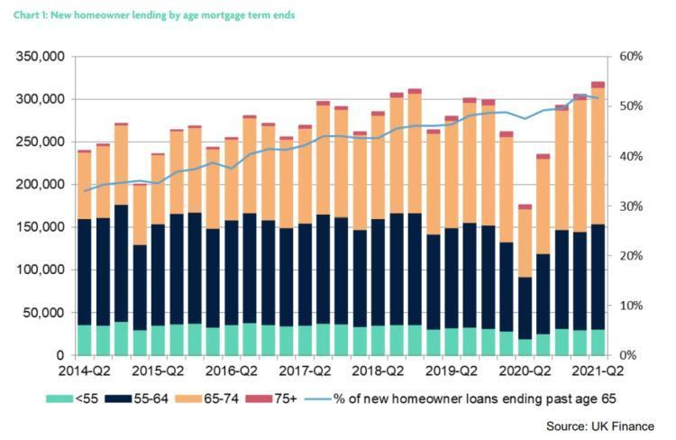

# “退休后，我终于还清了父母的房贷”

无论是南宁的房贷可延长至80岁，还是成都的90岁，其实都是变相的“接力贷”。但我们还应看到，真正给“贷款年限”设置终极限制的，不全是金融机构政策，更可能是肉眼不能看见的血亲关系。

**你愿意还房贷到80岁吗？**

“南宁房贷年龄期限可延长至80岁”的新闻，近日冲上了热搜。据报道，广西南宁一股份制银行从2月10日起，将个人住房按揭贷款年限从原来的70年调整至80年。所谓贷款年限，是指“贷款人年龄+贷款期限”之和。

换句话说，最长贷款期30年不变的前提下，50周岁的贷款人有望获批最长30年期的房贷，60周岁则最高可得20年的房贷，如此类推。

据悉，这一政策仅适用于没做过房贷的优质中老年客户，条款上明确规定贷款人年龄不能超过70周岁，同时要求其子女作为共同还款人。一旦贷款人丧失还款能力，子女要继续承担还款的责任。/微博

正当网友为“还贷到80岁”热议，成都某商业银行被证实已将最长贷款年限延长至90岁。据《成都日报》报道，这是一种名为“合力贷”的特色个贷产品，其中“还款人”一栏也要加上子女。

银行解释，该产品主要解决老年贷款购房者的常见痛点：由于年龄偏大，老年信贷申请者通常会受到贷款额度、期限等方面的限制。

实际上，这种“还贷到80岁”的情况在我国早有先例。2019年年初，杭州某银行规定个人住房按揭贷款最长可贷到80周岁，父母和子女可接力还款，即所谓的“接力贷”。

然而，哪怕有着“贷贷相传”的保障，长达30年的时间里，家庭或个人财务状况难免有起伏。

在四五十岁贷款买房，是一种什么的体验？如果年长的贷款人中途离世，余下的贷款将如何处理？我们试着从中外不同地区的“贷款年限”去寻找答案。

**中国香港：楼价逐年涨，有人50岁才背上房贷**

南宁的还贷到80岁，暂时还没有相关业务落地，但在寸金寸土的香港，人到中年才贷款买楼却大有人在。

本地媒体在2019年曾报道过一位黄先生的买房故事。黄先生50岁时购入一套两房单位，楼价688万港元，贷款510万港元，分30年期还清。他与太太两人的月收入合共超过6万港元，月供不算吃力。之前一家五口常年租房，每月房租1.6万港元，黄先生总觉得是在“帮房东供房”。

妨碍他们买房的因素，从来都是高昂的首付。夫妻二人存钱的速度，总赶不上香港楼价的涨幅。曾经有一次存够了首付，又因政策调整而不得不放弃。

_有楼才有家，真的？/《上车家族》剧照_

然而，黄先生50岁才开始供楼，意味着他要到80岁才能还清贷款。退休后收入减少，付不起月供又该怎么办？面对媒体的疑问，黄先生表示付不起月供就卖楼，搬去更远的地方，或换到小面积单位。

黄先生并非个例，香港一间按揭咨询公司曾统计贷款买房的客户年龄，发现有四成客户是在41岁至60岁之间，这种“大叔之龄买房”的现象正在成为常态。

**日本：超长借贷期限，退休后继续操劳**

如果你到日本旅游时碰到了七八十岁的司机和服务员，不要想当然地以为是他们太勤奋，更可能是他们的房贷没还清。

《日本经济新闻》比较了2000年至2020年期间的房贷数据，发现日本购房者还清全部房贷的平均年龄正在不断上升，已达到了73岁，创下了历史新高。

为了还房贷，很多老人退休后仍要从事兼职工作。根据日本房产中介的统计，65岁至69岁的老年人中，平均7人里有1人需要做兼职来贴补家用。

_日本老人从事收银工作。/视觉中国_

随着昭和泡沫的破裂，日本政府持续用低利率来刺激经济，目前，日本个人自住房贷的利率低至0.3%—0.5%之间。

那些目睹“土地神话”化为泡影的中年人，再次鼓起勇气“进场”，在更大年纪，借更多的钱，还更长的贷款。为了借到更高的额度，个别家庭甚至夫妻俩双双负债。

据统计，日本人在2003年初次申请房贷的平均年龄为37岁，贷款总额均值为1900万日元，到了2020年，这两个均值分别上升至40岁和3100万日元。

_20年里，日本平均个人住房贷款总额明显增加。/Nikkei
Asia_

顺应这一潮流，日本有银行放宽房贷申请人的年龄限制。一般来说，日本房贷的最高期限是35年，预计信贷申请人80岁前还清，索尼银行则会放宽至85岁。

地方的宫崎银行，更是从2022年起将住房贷款最高期限提升至50年，“年龄+期限”加和高达92年，超过日本平均预期寿命。

人们原想着延长还款期，可减少月供压力，但未来并不总似预期。上涨的物业费、大小的楼宇翻修等额外费用，都能让“老房奴”们捉襟见肘。这些老年人要么在退休前节衣缩食提前还贷，要么70岁后为还贷继续操劳。

日本法律规定，房贷未还清的房产需征得贷款银行同意，方可进行出租。受传统观念的影响，日本人不喜欢二手房。楼龄超过10年的二手房，要想转手可比在中国香港困难多了。

**法国：老年贷款难获批，保险也不好买**

在法国，就算你拍着胸口说自己乐意供楼到80岁，政府和保险公司也不会爽快答应。

老年人往往被法国银行机构视为“高风险”客户。过去，为了获得贷款，有法国老人会在贷款申请者一栏加上子女的姓名。在审核时，法国信贷部门通常会看年纪最大的贷款申请人来判断，而非年纪最小的。

随着法国加速进入老龄化社会，以及离婚率上升，当地金融机构逐渐放宽老年人贷款业务。通常情况下，法国的贷款年限不超过75或80年（贷款年限=贷款人年龄+贷款期限，即贷款人预计到多少岁还清贷款）。

老人贷款的另一个阻力，来自保险公司。法国银行要求贷款者必须购买“房贷保险”。如果在偿还贷款期间，贷款人因死亡、意外事故或被解雇而无法偿还贷款，余下的贷款则由保险公司来承担。

_在法国，优雅地老去并不容易。/《刺猬的优雅》剧照_

贷款人年龄越大，保险公司会认为其“生病”或“失业”的风险越高，保费也就越高，甚至有可能拒保。

哪怕贷款人不介意多交保费，也可能贷不到款。按照法国金融监管机构的最新规定，法国银行发放贷款必须遵守税后收入35%的信贷杠杆，而且贷款期限不得超过25年。

据法国资深金融人士介绍，对于超过55岁且收入主要来自薪酬的信贷申请人，银行审核时会将申请人的薪酬收入打七折计算。

法国收紧信贷条件旨在降低借款人过度负债的风险，但同时也限制了50岁以上人士获得贷款的机会。

**英国：超过半数英国人，65岁后才能还清房贷**

随着平均预期寿命增长和延迟退休，英国55岁以上人士的贷款需求持续增长。

自2014年起，老年贷款业务开始在英国流行，随后迎来连续5年的增长。受新冠疫情的影响，该业务短暂下跌后，在2021年回弹至有记录以来的最高位。

根据英国金融行业协会UK Finance的报告，预计申请人在65岁还清的新增房贷业务数量，占到2021年全英个人房贷的一半以上。

_老年人撑起英国个人贷款业务。/UK
Finance_

当英国的个贷业务整体萎缩时，老年贷款这一细分市场却逆市增长，其中年过六旬的贷款者是这一细分市场增长的主要动力。

为了业务增长，英国银行对老年贷款者还算友好。自住房的贷款年限可达到80或85年，一般分为5—25年期。

贷款人的预计退休年龄减去现在的年龄，大致就是贷款可以贷到的最长期限。如果这个时间过短，则意味着月供过高，越难以通过银行在贷款支付能力的审核。

金融的本质是信用、杠杆与风险。尽管英国银行欲拓展新业务，但它们审核贷款时并不会忽略老年申请人自带的风险。

**美国：没年龄限制，更看重还款能力**

位于大洋彼岸的美国，对房贷申请者的最高年龄没有限制，但对还款能力有着较严格的要求。

在美国，任何金融机构都不能因年龄太大而拒绝人们的贷款申请。美国《公平信贷机会法》禁止贷款人在处理信贷业务时，基于种族、性别和年龄等的不同而对信贷申请人采取歧视待遇。

美国金融机构还会推出适合老年人的贷款计划，例如针对62岁以上老人的Reverse
Mortgage，类似人们熟悉的“以房养老”，适合退休后想改善住房条件的老年家庭。

不过，根据美国消费者金融保护局的规定，借款人可根据申请人的还款能力评估，从而决定是否批出贷款。中老年申请者容易被质疑退休后，能否拥有稳定且足够的收入来偿还贷款。

_《大空头》剧照_

**房贷的尽头，是亲人**

看过中外多地的“贷款年限”情况，我们不难发现不同地区的贷款年限设置，与各自的老龄化程度、近年的经济调控政策和控制风险的法律法规等因素息息相关。

根据联合国发布的《2023年世界社会报告》，2021年全球65岁及以上人口为7.61亿人，到2050年这一数字将增加到16亿人，其中80岁以上的人口增长速度更快。一句话，人们的寿命正在延长。

无论是东亚、西欧还是北美地区，金融机构都在努力适应人口结构的变化，重新审视老年人的贷款需求，将贷款年限适当地延后5年至10年。

_人类寿命在延长，老后烦恼也不少。/《爱》剧照_

2003年，《中国人民银行关于进一步加强房地产信贷业务管理的通知》首次提出了个人住房贷款差别化管理，强调针对不同的购房者采取不同的住房信贷政策。对此，各家银行可以自行规定个人按揭贷款的年龄上限。

有房地产政策研究的专业人士表示，我国多家银行延长贷款年限，与正在试点的延迟退休政策方向相呼应，对年龄较大的购房者有一定促进作用。

在大趋势之下，我们也应看到文化与传统的重要
影响。与欧美文化下的人们相比，东亚文化更容易将“房产”与“安居”联系到一块，因此也更愿意为一处房产背负几十年的债务。

回到中华文化的语境下，老年人之所以申请房贷，大多数还是为了孩子，帮助名下已有一套房的子女利用老人的购房名额，同时享受首次贷款的利率优惠。

无论是南宁的80岁，还是成都的90岁，其实都是变相的“接力贷”。多数中国家庭掏出六个钱包买一套房，父母、子女实际都是“共同还款人”，只是没把名字都写在“贷款申请表”上。

真正给“贷款年限”设置终极限制的，不全是金融机构政策，更可能是肉眼不能看见的血亲关系。

[1]在日本贷款买房，流程是怎样的？丨东京老潇

[2]How Does France Treat Mortgages for the over 60s?丨French Entrée

[3]法国房贷利率上升或致申请贷款难 还贷压力大丨海外网

[4]法国买房怎么选贷款？丨法国装修笔记

[5]Later life mortgage lending丨UK Finance

[6]2023年世界社会报告丨联合国

