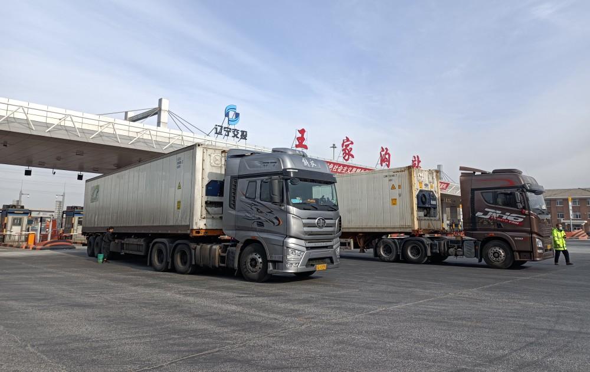
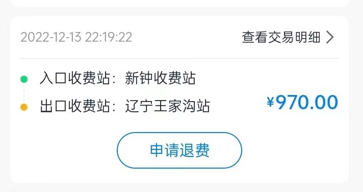
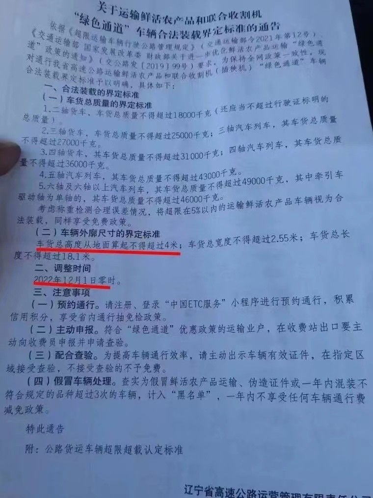

# “限高”标准不统一致免费绿通车被收过路费，辽宁高速：暂缓收费

货车司机李东运输鲜活农产品的集装箱货车，按相关规定应免除通行费，但2022年12月13日其因车货总高度4.1米，被辽宁高速公路王家沟收费站以“超过4米限高”认定为非法装载，收取通行费970元。

按国务院行政法规《道路交通安全法实施条例》（下文简称《条例》）规定：载运集装箱的车辆不得超过4.2米。

对此，辽宁高速方面认为，其收费依据为2022年12月1日实施的《关于运输鲜活农产品和联合收割机“绿色通道”车辆合法装载界定标准的通告》。此《通告》依据交通运输部《超限运输车辆行驶公路管理规定》和“国标”，规定车货总高度从地面算起不得超过4米。

新京报记者了解到，李东进行鲜活农产品运输已有五六年，此前并未遇到类似情况。近期还有多辆绿通车有类似情况，在辽宁省境内多个高速收费站被收取通行费。

中国政法大学、北京大学两名行政法领域教授认为，行政法规的效力高于规章。与《条例》相抵触的规章和行政规范性文件，不得作为合法行政行为作出的依据。

2月9日，辽宁高速公路运营公司副总经理展图宁告诉新京报记者，收费引发关注后，公司7日已作出暂缓收费决定。

2月17日上午，多名司机告诉新京报记者，辽宁高速目前只登记车辆信息，并未收费。

_2月9日，辽宁高速王家沟收费站只对绿通车检查登记，已暂缓收费。新京报记者
白德彰 摄_

**绿通车因“超高”被收取通行费**

李东介绍，2022年12月13日他从云南运输橘子到辽宁沈阳八家子水果市场，经辽宁高速公路王家沟收费站检查，其车货超过4米限高，被界定为非法装载，收取通行费970元。此前，他并未遇到类似情况。

依照2008年12月中共中央、国务院《关于2009年促进农业稳定发展农民持续增收的若干意见》规定，长期实行并逐步完善鲜活农产品运销绿色通道政策，在全国范围内免收整车合法装载鲜活农产品车辆的通行费。

_集装箱绿通车司机李东被收取高速通行费记录。受访者供图_

李东向王家沟收费站交涉，车辆是经公安车管部门合法登记入户。国务院《条例》规定：载运集装箱的车辆不得超过4.2米。他的车实际高度4.1米，未达到国务院规定的最大高度限值，也就是说他的车辆是合法运输。

王家沟收费站向李东出示，由辽宁省高速公路运营管理有限责任公司于2022年12月1日实施的《关于运输鲜活农产品和联合收割机“绿色通道”车辆合法装载界定标准的通告》（简称《通告》），《通告》明确车辆外廓尺寸界定标准，车货总高度从地面算起不得超过4米。

《通告》还显示，其制定依据是交通运输部《超限运输车辆行驶公路管理规定》（简称《规定》），以及交通运输部等三部委《关于进一步优化鲜活农产品运输“绿道”政策的通知》。

_辽宁省高速公路运营管理有限责任公司于2022年12月1日实施的《关于运输鲜活农产品和联合收割机“绿色通道”车辆合法装载界定标准的通告》。受访者供图_

2月9日，辽宁高速公路运营公司副总经理展图宁向新京报记者介绍，2016年9月交通运输部的《规定》和2016年7月国家原质检总局发布的《汽车、挂车及汽车列车外廓尺寸、轴荷及质量限值》GB1589-2016（简称“国标”）中，均明确车辆高度限值4米。公司由此界定车货超高4米运输鲜活农产品的集装箱车辆属非法装载，收取通行费符合规定。

李东说，如果不缴纳通行费，其车辆信息将被录入全国高速公路追逃费系统，以后或将不能通行高速公路。和他情况类似的至少还有18辆车，涉及辽宁高速公路辽中站、热高乐园站、新民站、王家沟站。

**专家建议统一限高标准**

中国政法大学法学院副教授马允认为，问题的症结在于，有关汽车外廓尺寸的国家标准、以及交通运输部据此制定的相关规范性文件，未能与正有效实施的上位行政法规进行有效衔接。

马允解释，《立法法》规定行政法规的效力高于规章。《条例》是国家行政法规，而《规定》《通知》《国标》的性质，可纳入部门规章和规范性文件的范畴。与《条例》相抵触的规章和行政规范性文件，不得作为合法行政行为作出的依据。

北京大学法学院教授沈岿同样认为，交通运输部《规定》以及“国标”都不得与《条例》相冲突。

此外，“国标”于2017年1月正式实施，而李东认为，他的货车于2016年以前购买入户，不适用于新国标规定。

新京报记者查询发现，2017年11月，交通运输部、公安部发布《关于治理车辆超限超载联合执法常态化制度化工作的实施意见》，其中文件附件《公路货运车辆超限超载认定标准》明确说明，载运标准集装箱的挂车列车的整治工作另行部署，在专项整治前，重点检查其车货总质量是否超过限载标准的行为，暂不对外廓尺寸进行检查。

时隔两年，交通运输部办公厅公开文件《关于进一步规范全国高速公路入口称重检测工作的通知》重申，对车货外廓尺寸超限行为，将依照国家有关部门统一部署，分阶段、分步骤实施。在部署工作开展前，高速公路入口暂不对车货外廓尺寸检测。

对此，马允建议，道路运输涉及全国统一大市场的建设，宜由交通运输部进行统一的政策衔接和过渡安排，明确各地的政策执行依据和尺度。沈岿表示，若《规定》和“国标”中的标准更有利于公路安全，那么应当修改《条例》相关规定，或者通过别的方式淘汰超限车辆。

2月6日，此事引发关注后，辽宁高速公路运营公司组织召开货运司机代表座谈会。2月7日，绿通车司机代表被通知，辽宁省高速公路境内暂缓收通行费。

新京报记者 李英强 编辑 刘倩 校对 张彦君

