# 上戏：表演系考生高考成绩须达一本线的70%，明年要达到100%

近日，各大高校迎来开学季，这是"乙类乙管"后的首个新学期，学子们从全国各地陆续返校，拥抱如常而又全新的校园生活。

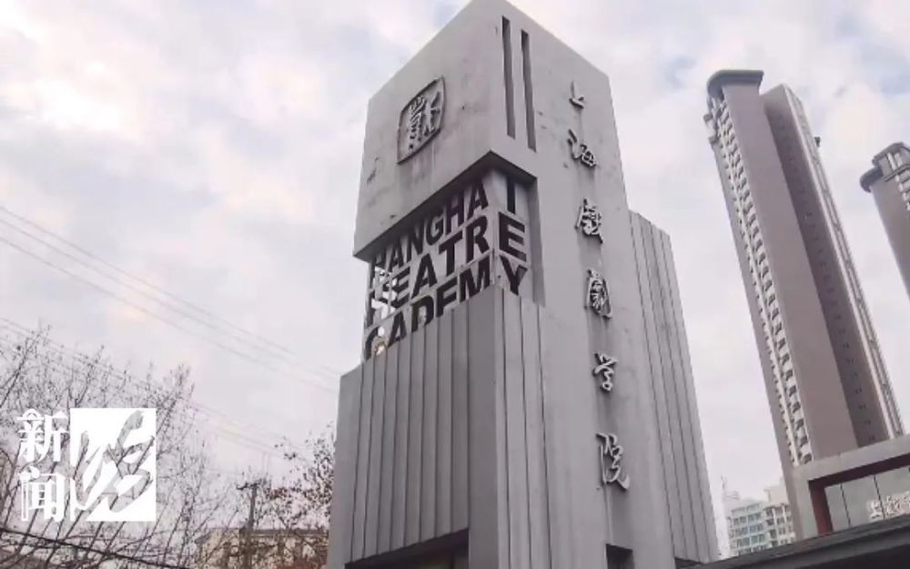

今天，上海戏剧学院，最为热门的表演系迎来了三试。这也是上戏时隔三年，首次恢复因疫情暂停的线下艺考。上午八点，首批考生进入检录室，老师仔细检查每位考生的面容。不允许化妆、不能戴美瞳，尽管招生简章已写明这些要求，仍有不少考生化了淡妆、戴了美瞳，只能当场匆匆卸妆。

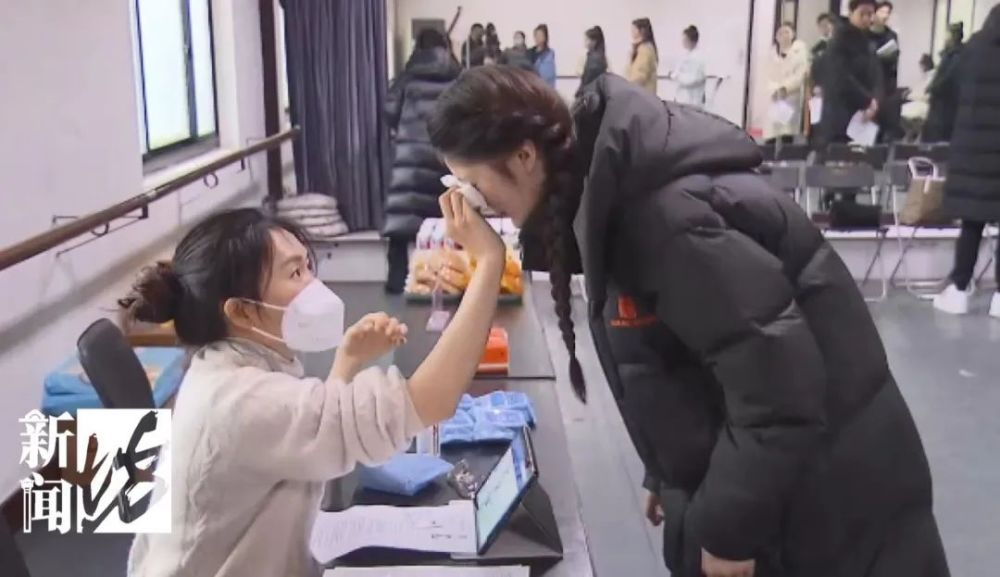

考生：招生简章上有写，我戴了一点点，有个小黑环，近视400度。没办法，根据学校招生简章，现在就摘掉吧。

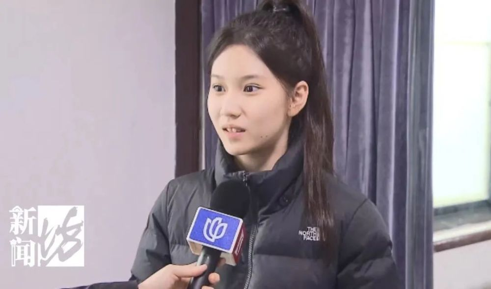

八点半，考生们领取号牌后排队入场，三试正式开始。今年，上戏共有37000多人报考，其中8000多人报考最热门的表演系戏剧影视专业。经过初试、复试，最终进入三试的只有211人，录取37人。

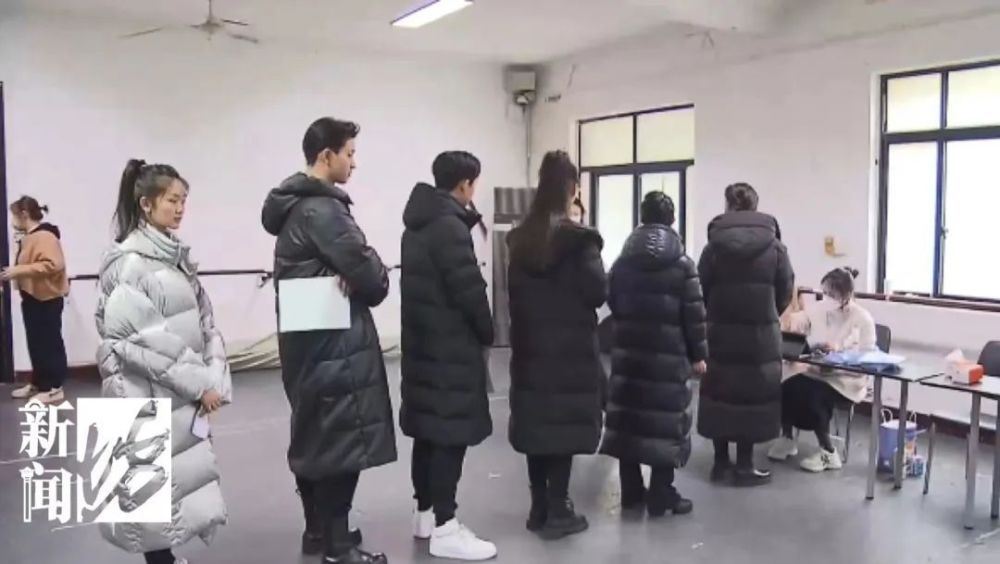

九名考官中有半数来自校外，将通过工作坊的形式，对考生进行全方位考核。

上海戏剧学院院长黄昌勇：一般都是30个同学一场，九个考官半天时间对他们进行反复测试、反复观察、反复考试，最后九个考官各自打分进行排名。

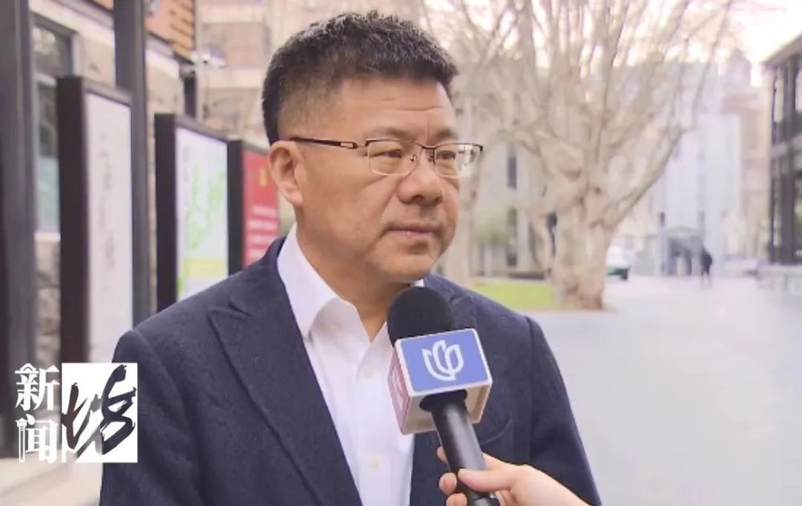

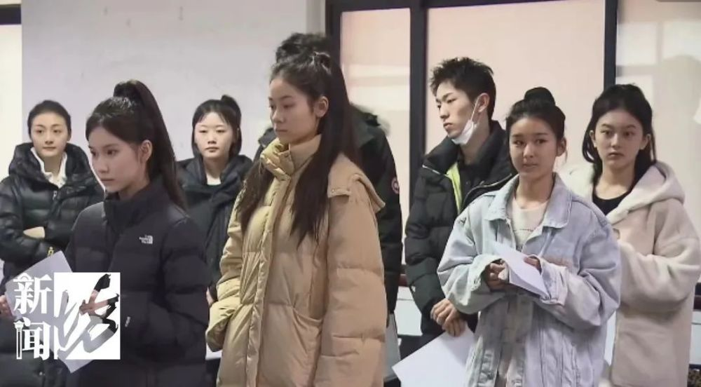

三个多小时后，首批考生陆续走出考场。考生：之前没有预料到这种考试方式，挺有意思，以上课形式来考验平常的知识和专业。

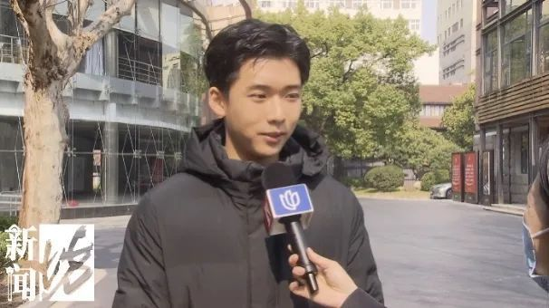

考生：没有准备时间，一上来就开始了。

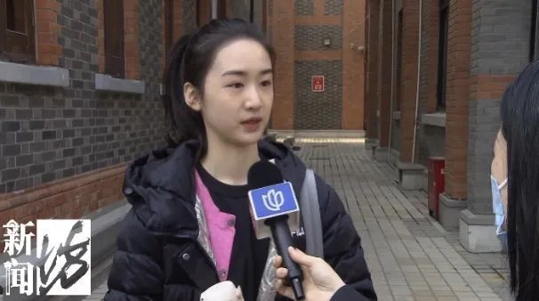

考生：比较即兴、比较看心理素质，也看你的反应能力，而且时长拉得也比其他考试久很久。

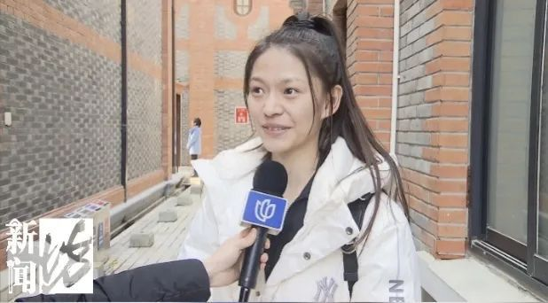

考生：这是我接触到非常新的考试形式，回去好好学文化，这个也很重要。

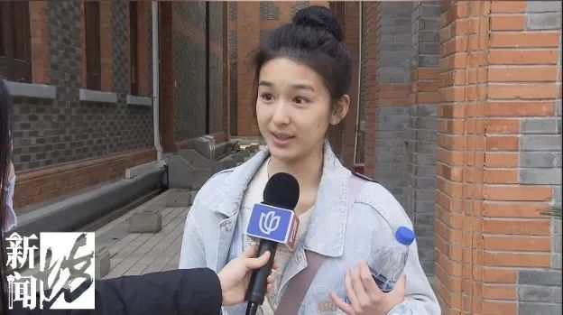

211名三试考生，将在四天里分批完成考试，但最终能否进入37人的录取名单，还要看高考成绩。

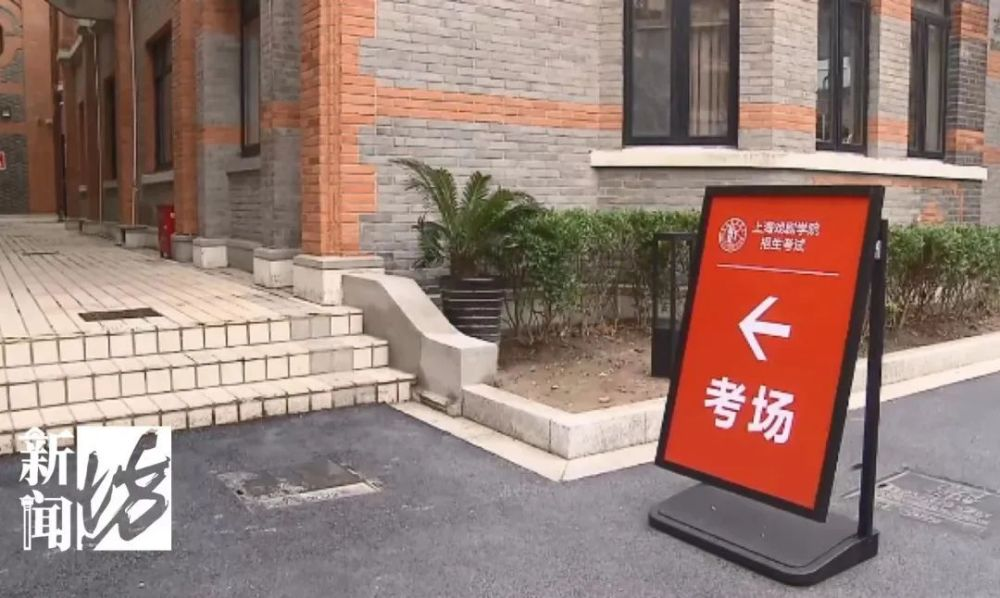

今年上戏又提高了对表演系考生的高考成绩要求，考生必须达到所在各省普通一本分数线的70%。而明年，根据教育部的艺考新政，则要达到100%。也就是说，明年考上戏、中戏、北电等几十所拥有校考资格的一流艺术院校，文化课分数线要达到普通一本线水平。这意味着，艺考热将逐步降温。

上海戏剧学院院长黄昌勇：难度是逐年提升，我们预计明年我们学校报考的人数会更少一点，认为艺考对高考成绩要求低，要改变这种观念，新政对艺术类考试过热，或者我们演艺界目前一些社会上普遍不满的流量明星现象可能会有所影响和扼制，从长远来看它有利于我们国家艺术人才的培养。

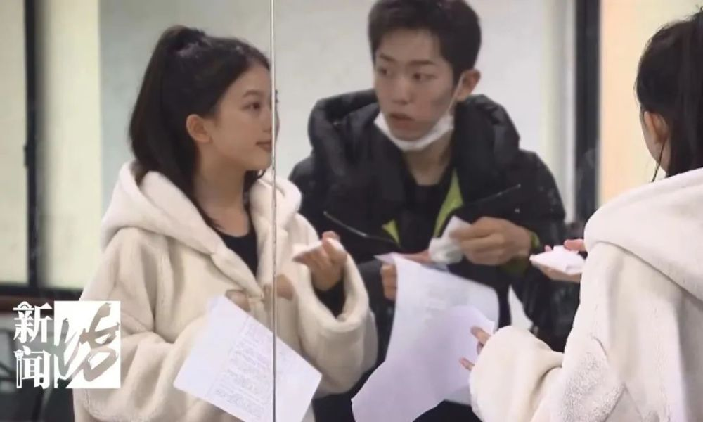

祝愿考生们能顺利录取！

记者：章海燕、张鹰

编辑&视频：许露露

