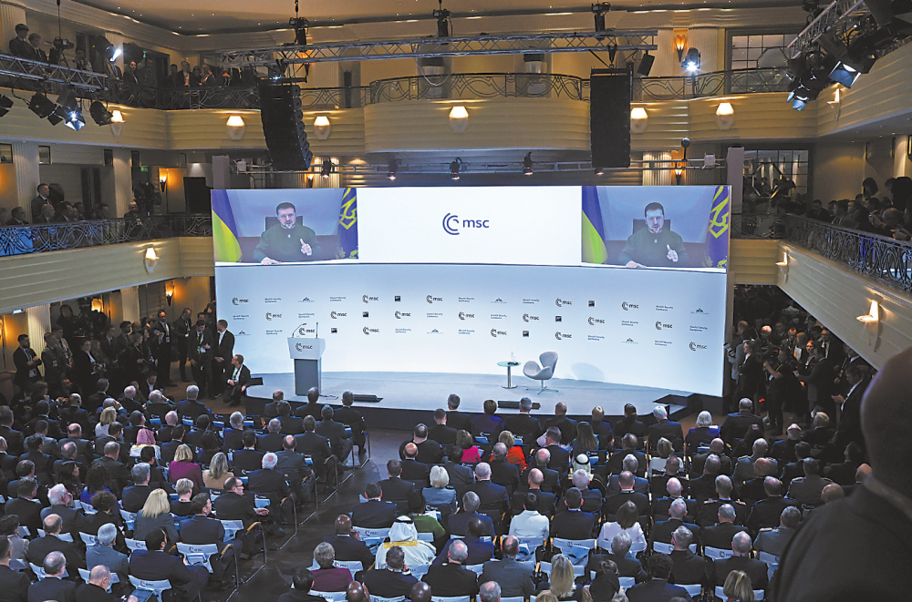
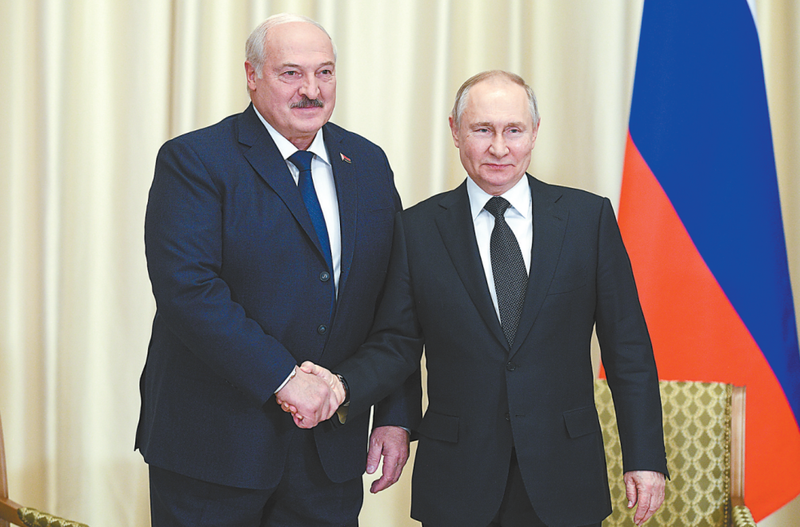

# 乌克兰高调要武器，俄罗斯警告别玩火……慕尼黑安全会议“硝烟弥漫”

【环球时报综合报道】“聚光灯将牢牢锁定在乌克兰身上。”当地时间17日，第59届慕尼黑安全会议（以下简称慕安会）在德国召开。按照会议组委会发布的日程，从核安全、气候变化到国际贸易往来和全球治理，出席本届慕安会的100多个国家代表将就多项议题进行讨论。由于临近俄乌冲突爆发一周年这个关键节点，一些欧洲媒体不约而同地认为，本届会议将重点讨论乌克兰危机，部分西方国家将重申对基辅的支持，直到击退俄罗斯的“侵略”。值得注意的是，乌克兰总统泽连斯基17日意外地以视频连线的方式“现身”本届会议，呼吁西方“加快”武器交付的速度。不少媒体认为，美国和西方领导人已准备好借本届慕安会再次展示团结和力量，但他们也需要意识到，世界上许多国家并不以同样的方式看待问题。俄罗斯的“缺席”某种程度上体现出，慕安会正在失去自己的价值。

**泽连斯基连线**

“慕尼黑安全会议连线泽连斯基”，德国电视一台17日报道称，乌克兰总统去年2月19日身着西装亲自出席了上届会议，5天之后俄罗斯发动了对乌特别军事行动。而今年，他通过视频发表演讲。据法新社17日报道，泽连斯基当天感谢了西方国家对乌克兰的支持，同时敦促盟友“加快”武器交付的速度，称提供给乌克兰的武器总是出现延误。泽连斯基称：“除了胜利我们别无选择，我们也必须抱有这样的决心。”

报道称，泽连斯基及其政府官员近期已在不同场合多次呼吁西方加大军事援助。欧洲媒体日前称，代表乌克兰出席此次慕安会的外交部长库列巴计划在会议期间与一系列欧洲国家高级官员进行会谈，重点是武器供应问题。库列巴前往德国前在社交媒体发文称：“（西方）当务之急是加快向乌克兰提供已经承诺的武器和弹药，以及在未来就向乌提供作战飞机作出政治决定。”

在俄乌冲突爆发一周年即将来临之际，泽连斯基正抓紧一切机会渲染俄罗斯的“攻势”，以凸显武器援助的重要性。在英国广播公司（BBC）16日播放的一段采访视频中，他称，外界预计的俄军春季攻势已经开始，俄军已从数个方向发起攻击。泽连斯基坚称乌克兰可以继续抵御俄军进攻，直到发起反攻。他同时呼吁西方继续提供包括战机在内的军事援助，称西方的武器援助将使和平更加接近，“当然，现代武器加速了和平进程，武器是俄罗斯唯一能够理解的语言”。泽连斯基还强调，乌克兰不会为了与俄罗斯达成潜在和平协议而放弃任何乌克兰领土，称放弃领土将意味着俄罗斯可能“卷土重来”。

在采访中，泽连斯基还回应了白俄罗斯总统卢卡申科16日有关“若遭到乌克兰等国侵略，白俄罗斯将进行‘最严厉回击’”的表态。泽连斯基说：“我希望（白俄罗斯）不会卷入（冲突），”“如果他们真的这样（卷入），我们将会继续战斗，我们会生存下去。”

路透社17日称，除呼吁西方加大军援，乌克兰还要求欧盟与联合国成员国磋商起草一项决议，目的是根据联合国宪章争取国际社会对乌克兰和平的强有力支持。该决议呼吁停止敌对，实现确保乌克兰“主权、独立、统一和领土完整”的和平，要求俄罗斯撤军。联合国大会下周四将就这项决议草案进行投票。报道称，该决议预计会获得通过。重要的是，它将获得多少张“赞成”票。

**朔尔茨与马克龙表态强硬**

紧随泽连斯基之后，德国总理朔尔茨和法国总统马克龙也先后在17日的慕安会上发表讲话。朔尔茨说：“那些拥有作战坦克的人现在应该把它们派往乌克兰了。”他还补充称，将就这一问题向盟友进行“大力宣传”，呼吁它们采取行动。德国国防部长皮斯托留斯17日也在慕尼黑表达了类似态度，称“会谈仍在继续，我从未放弃希望”。他说，联邦政府“每天”都在努力说服盟友。目前，德国似乎在武器运输方面“领先”，而其他国家则在拖延这一进程。据英国媒体报道，英国首相苏纳克16日表示，英国军队在2022年训练了1万名乌克兰军人，并计划今年至少再协助2万名乌克兰军人训练。法新社17日称，朔尔茨的表态标志着一种转变，因为他几个月来一直受到盟友的压力，要求批准向乌克兰运送德国制造的“豹”式坦克。

面临来自乌克兰方面潮水般的“战机”要求，虽然欧洲国家尚未明确表态，但以美国为首的西方仍承诺将提供大量其他武器，包括基辅长期寻求的重型作战坦克。据《华盛顿邮报》16日报道，率领美国代表团出席此次慕安会的副总统哈里斯定于18日发表演讲。一年前的同一天，哈里斯曾在慕安会发出俄军包围乌克兰的警告。哈里斯的助手称，哈里斯届时将传达美国对乌克兰的持续承诺，强调拜登政府决心继续支持泽连斯基保卫国家的努力。报道还透露，白宫官员私下告诉乌克兰官员，美方最近的援助计划是基辅改变战争进程的最佳机会。

值得注意的是，法国总统马克龙17日在慕安会上表示，随着莫斯科加强对乌克兰的“袭击”，与俄罗斯进行对话的时机还不成熟。他称：“现在不是对话的时候，因为俄罗斯选择了战争，选择了加剧战争，甚至选择了犯下战争罪和攻击民用基础设施。”

俄副外长里亚布科夫16日在俄罗斯电视台第一频道的节目中称：“我们从目前乌克兰正发生的事件中看到，华盛顿和其他一些国家正在肆无忌惮地升级局势，无限制地提高赌注。我们仍然表现出负责任的态度，但我们的敌人，他们在玩火，风险很高。”

**美媒：俄罗斯没被吓倒**

美国有线电视新闻网（CNN）16日称，在俄乌战争一周年来临之际，西方在慕安会上的言辞和外交攻势将进一步升级。不过，西方想要说服俄方认输，将是一项艰难的任务。俄罗斯并没有表现出被北约先进武器弹药大量涌入乌克兰吓倒的迹象。这解释了为什么西方政客认为战争的下一阶段至关重要。

路透社17日提到，在宣布提供援助的同时，西方国家领导人还应该进行更多的讨论，例如欧洲应该在多大程度上依赖美国，乌克兰战争对全球的深远影响等问题。这场战争已经清楚地表明，让非洲、亚洲和拉丁美洲领导人孤立莫斯科“举步维艰”，因为这些地区对西方在冲突中的不公正态度不感兴趣。此外，这次会议也会被视为俄罗斯与西方关系的晴雨表。英国《金融时报》称，俄罗斯的“缺席”是很难忽视的，从长远来看，慕尼黑安全会议最终可能会失去自己的地位。

白俄罗斯国家通讯社17日报道称，卢卡申科当天在会见普京时表示，白俄罗斯在2022年履行了与俄罗斯在国防和安全领域的所有协议。

据俄罗斯《消息报》16日报道，俄罗斯国家杜马（议会下院）已通过有关终止“欧洲委员会宪章”等21项法律条约在俄效力的法案。舆论认为，这说明俄罗斯已表达出与欧洲彻底割裂的决心。

外交关系学院国际研究所教授李海东17日对《环球时报》记者表示，欧洲的繁荣是建立在和平基础上的，但欧洲在解决危机方面正面临“难以形容的尴尬”。美国为了自身利益正将欧洲拖入冲突状态，使其成为俄乌冲突的受害者。但他们却不能公开表示反对。李海东认为，“如何防止欧洲被美国劫持为人质，实际上才是对欧洲安全的真正挑战。”

《环球时报》旗下环球舆情调查中心近期进行的首届“欧美关系民意调查”结果显示，欧洲很多民众对本国及欧洲与美国的关系感到不满。对于美国是否有能力以及意愿保护欧洲的安全，多国民众持悲观看法。对于美国趁着俄乌冲突在经济上“敲诈”欧洲的做法，更有多达近八成受访者表示愤怒和无奈。

【环球时报驻德国特约记者 青木 王涛 环球时报记者 王琪 环球时报特约记者 任重 柳玉鹏】

