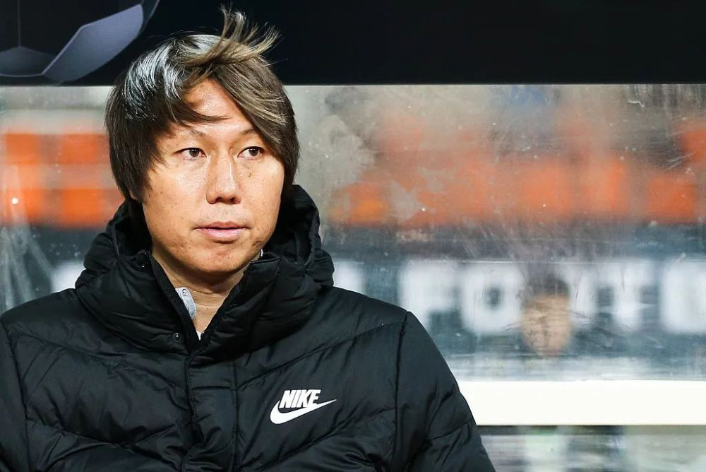
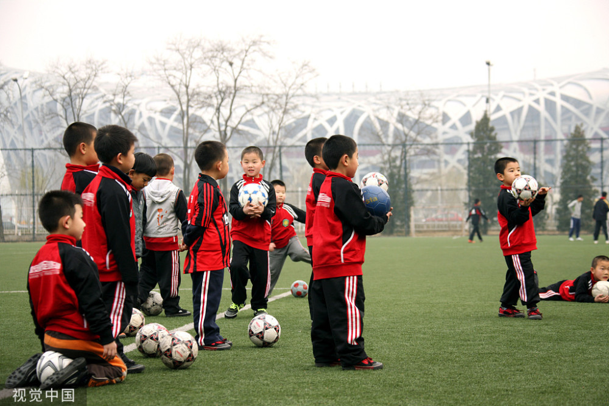

# 代表委员呼吁足协改革：让中超公司独立运营，减少行政命令干涉

_陈戌源_

随着国足原主教练李铁，中国足球协会第十一届执委会成员、原秘书长刘奕，中国足球协会常务副秘书长兼国家队管理部部长陈永亮以及中国足球协会主席、党委副书记陈戌源等人接连被查，足球领域掀起的整肃风暴引人关注。

澎湃新闻注意到，近期，中国民主建国会四川省遂宁市委员会微信公众号“遂宁民建”刊发了多则基层代表委员关于中国足球的提案建议。有代表委员指出，足协应该提高运营透明度，另外，不再为了短期成绩提升而去邀请外籍大牌教练，脚踏实地搞好青训才是正道理。

**“李铁竟然也出现这种腐败案件”**

其中，民建大英县总支会员、遂宁市政协委员、船山区政协副主席林云，民建大英县总支会员、县人大代表王黎明反映：足球为世界第一运动，深受各国人民喜爱，但中国足球发展尤其是男足历来让人诟病，足球协会作为行业管理机构，更是遭受社会各界无数次的批评，国内足球环境也是每况愈下。作为中国球迷，对足球成绩本不敢奢望，但足球运动员们在场上表现出的拼搏不积极着实让人气愤和失望。

_李铁_

“原国家男足主教练李铁案爆发后，迟迟让人心情不能平复，李铁作为2002年世界杯国家足球队主力球员，是目前整个国家少有的在世界杯赛场上踢过比赛的人，对中国足球是应该有情怀的，竟然也出现这种腐败案件，足球队员们在场上的表现也就不难理解了。”

林云、王黎明指出，从近邻日本、韩国足球成功的经历来看，成熟的青训是不二路径。国内足球环境每况愈下，社会各界更是把男足当笑话来看，家长们不愿意把孩子送去学习足球，青训的对象越来越少，足球人口不多也就选不出好的苗子，本应该去踢球的小孩课余时间更多是在玩手机等电子产品，足球发展呈恶性循环状态。此外，各地对体育场馆的建设也是越来越重视，投入大笔资金和土地建设大型体育场，更多成为城市地标性建筑璀璨夺目，但是这些体育场一般人进不去、用不起，场馆外圈硬化广场也是被坝坝舞占据。总的说来，体育设施更多是来看的，不是来用的。

林云、王黎明还表示，从1994年中国足球联赛开始以来，国家队和俱乐部层面邀请的大牌外籍教练数不胜数，使用较多资金，但效果并不明显或者不可持续，巧妇难为无米之炊，没有好的运动员苗子，再大牌的教练也无法带领队伍取得好成绩，大额的外教费用也就打水漂了，要想持续取得好成绩，脚踏实地搞好青训才是正道理，没有捷径可走。

为此，他们建议，提高足球协会运营透明度。足球受到广泛关注，每当遇到国家队输球，足球协会就会迎来铺天盖地的批评，否定足协的一切努力。
**究其原因是大家没有看到足协的工作过程，一味关注比赛结果也是不客观全面的，对足球行业发展也是不利的，足协应该提高运营透明度，对年初计划、年中执行、年末评估等都向全社会公示和接受监督，引导社会各界理性看待输赢，支持国家足球事业健康发展。**

另外，提高青少年在校期间足球课程的比重，指导地级以上城市在周末等课余时间开展足球比赛，把青少年从手机等电子产品中争夺过来。在城市公共空间开辟免费足球场所，营造全社会良好足球氛围，提升青少年的足球兴趣，大力提升足球人口数量。通过足球弘扬中华民族优秀传统文化，引导全体青少年积极拼搏，乐观面对人生一切挑战。

他们还呼吁，不再为了短期成绩提升而去邀请外籍大牌教练，将有限资金更多用于培养本土教练员、运动员、裁判员和管理人员，要借鉴国外先进足球经验，可以派员外出学习。合理设置国内运动员薪酬上限，鼓励运动员出国踢球提升竞技水平。重视运动员场外管理，对于短期内取得较好成绩的运动员，拒绝媒体广泛追捧而提高商业参与性，杜绝场外因素影响运动员的拼搏动力。

**“改革中国足协的机制体制”**

“2022年在卡塔尔世界杯亚洲区预选赛上，中国男足给全国人民交了一份非常糟糕的答卷，曾经的亚洲一流强队已经沦为亚洲三流球队，这让广大球迷非常失望，呼吁足协改革的声音越来越高。中国男足必须痛定思痛、深刻反思，全面改革，从基础抓起。”民建遂宁市委园区总支会员、遂宁市政协委员、民建遂宁市委副主委、秘书长黄鹏反映。

黄鹏提到，由于中国足球总体水平低，难以走向世界，加之黑幕、假球、贪污等丑闻频出，让广大球迷失去了信心，降低了参与热情，导致市场发展不充分，职业化道路艰难，越走越窄。青少年从事足球运动发展空间不大，成功的概率非常低。家长权衡考虑，基本上不愿意让子女走足球职业化道路。

为此，黄鹏建议，要根据国情特点，大刀阔斧地改革中国职业联赛、改革中国足协的机制体制，培养更多队伍，举办更多高水平联赛，向世界接轨，促使其健康、规范、可持续化发展。
**坚持市场化运作足球职业俱乐部，按照公司化管理，自负盈亏。要加强与亚洲和欧洲职业联赛的交流，在人才培养、商业运作、技术交流等方面全面合作，为中国足球发展提供广阔空间。**

民建遂宁市船山区总支、四川职业技术学院本草文化研究院综合办主任冯耀文在《我国足协管理体制改革的问题及对策》一文中指出，中国足协作为行业性的自治协会，也是一个社会团体，常理上应由与该行业有关的利益团体进行自我管理、自我约束。然而在实际的操作中，
**中国足协更多表现为半官方的身份，足协的官员本身又具有行政级别，这就使得足协具有较强的行政性，足协代表大会和执委会形同虚设。**

文章梳理道，中国足协依赖的法律法规主要有《中国足协章程》《民法通则》《体育法》《国际足联章程》和《亚足联章程》。但相关法律法规更多的是对足协进行原则性的规定，中国足协章程更是流于形式，在实践中更多依赖于上级的“红头文件”，在决策执行方面缺乏弹性和灵活性。同时对于足协的决策和执行也缺少监督。
此外，足协章程规定与足协相关的法律纠纷不得提交法院，而只能向仲裁委员会提出申诉。仲裁委员会又是足协内部的专门委员会，其本身的公正性就难以服众，足球俱乐部及球员的利益也就得不到合理的保护，因此建立一个独立于足协的由足球相关专业人员参与的仲裁委员会刻不容缓。

对此，冯耀文提出了三点建议：

一、充分吸纳足球相关利益主体参与决策、执行和监督。作为由多种利益主体交织的足协，其改革必须强调服务对象的参与，首先应克服其自身的单一行政性，撤销足球运动管理中心，取消人员编制，充分吸纳政府人士、足协专业管理人员、专家学者、足球人士、足球俱乐部成员、地方足协等相关利益主体参与足协的决策、执行和监督，以实现足协的社会化、自治化、市场化和透明化。

二、完善相关治理法律法规。在足协管理体制改革过程中，必须完善相关法律法规，对足协进行精确的职能定位，使足协的管理活动在决策、执行和监督程序上有法可依，有法必依，从而为实现足协治理的法治化、现代化提供完善的法律保障。

三、建立独立的足球仲裁机构。在完善足协内部管理体制的同时，必须建立独立于足协的仲裁机构，该机构由相关法律人士、足球专业人士、相关专家构成，针对足球相关纠纷依法独立处理，从而有利于足球纠纷获得更加公正合理的判决。

民建遂宁市委文卫总支会员、民建遂宁市委青联委主任陈舒扬也反映，目前中超联赛由中超联赛有限责任公司负责运营，表面是独立公司，但实质隶属于足协，表面运营整个联赛，本质上局限于项目招商，导致联赛受行政指令影响严重，失去“职业化”“市场化”的先决条件。

另外，受各方面因素影响，中超联赛为赛会制、且比赛均在同一年进行，与国际主流的联赛主客场制、跨年制步调不一致，加之明年亚冠联赛也将采用跨年制，总体结构的不同会使各球队身心俱疲，同时又因为赛会制联赛，让球队失去球迷支持，让足球脱离发展基础，更加不利于中国足球发展。

陈舒扬建议，坚定真改革的信心，
**加大对足球领域反贪腐的查处力度，尽全力降低“场外因素”对足球联赛发展的影响制约；“管办分离”，让中超公司独立运营，建立完善的俱乐部进出入和竞争机制，减少行政命令干涉的同时，严防足球联赛变为“政绩工程”**
；继续鼓励、刺激专业俱乐部青训发展和球员留洋，提高足球联赛的整体水平，提升中国足球形象，提高中超联赛商业价值；调整联赛结构，取消持续两年之久的赛会制模式，接轨亚足联实行跨年制。实行主客场制模式，让球队有自身成长的土壤，激发中国球市内在的动力，营造更加良好的足球氛围。

