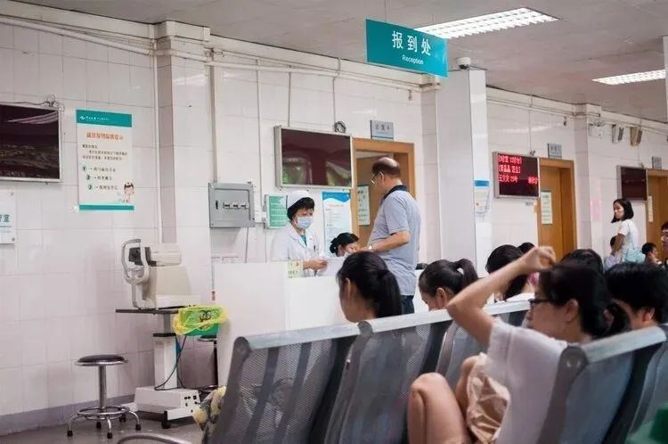

# 医保改革受益最大的一些退休者反而不满意，问题出在哪里？

门诊共济保障改革在一些地方实施以来，有些人产生了误解，意见很大。老胡认为，
**根本原因还是没把这项改革的目的和好处真正讲清楚，对那些觉得吃亏了的群体没有做好思想工作，改革所需要的共识没有跟上。**

**这项改革让所有去医院看病的人得到门诊报销的更大保障，受益方向十分明确。**
但是当下每个月打到个人医保账户里的钱又的确少了，身体健康或没什么大病、用不着经常跑医院的人从眼前看就是吃亏了，但他们获得了长远保障。国人通常最担心的不就是得病了去不起医院吗，需要把这当中的利弊关系掰开揉碎，给大家彻底讲清楚，用实例讲，一边算账一边讲。

现在有的地方表达不满的主要是退休老年人，他们恰恰到了或者临近了经常去医院的高龄期。按说就算有不满，也不该是这个群体，他们的不满有悖事情的基本逻辑。然而这样的不合逻辑又一定有它的原因。
**老百姓不喜欢听大道理，更相信切身的感受，对看得到的利益增点减点非常在意。**

老胡看了一篇包含专家解读的文章，说实话，我从头到尾把它读下来都感觉很费劲。里面的语言很严谨，不乏专业术语，就是读起来很晦涩，围绕人们主要疑问的针对性不强，缺乏鲜活的例证。

**要把这个思想工作做通，决不能回避大家的具体困惑和不满，**
比如，有的老人觉得自己不怎么去医院看病，但是经常要买一些药品，过去个人医保账户的钱多，可以用，改革后他们能在药店花的钱少了，其他必须去医院，但不达到一定额度又报销不了，所以亏了。需要帮这些人好好算清楚，在退休以后这个年龄舍弃药店买“小药”的那点利益，换取增加看大病的报销额度，这究竟是不是很划算的一件事。这个时候强调公家给打到医保里的钱不属于工资收入，老百姓很难听得进去。是不是工资，反正之前买药可以花，但现在有一部分进了公共账户。只有把这当中对高龄人产生的实际好处有理有据摆出来，才会有说服力。

在看到过去几年抗疫当中国家为保障人民生命健康不计代价的努力之后，按说社会是有信任国家这一改革善意的集体心理基础的。但一些流传的说法正好是反着来的，宣扬是防疫把医保的钱花光了，地方政府没钱了，所以打起了个人医保账户里余额的主意。说实话，让已经退休、不再习惯文件式语言的老人们听懂官方通稿式的宣传，并且入脑入心，是不切实际的。
**改革的好处需要是真实有感的，少掉的眼前利益需要换来看得见的长远利益，解读也要通俗易懂，和大家的感受对得上。**
否则的话，一些人就会人云亦云，相信政府“撸大家的羊毛”。

对利益存量进行分配方式的改革是最困难的，增量改革要容易推进得多。不知道这次医保改革有无更多资金投入，如果没有的话，就要充分认识它的难度，下大力气做“短期受损者”的思想工作。
**做人心的工作不是单向的宣讲，不能认为政府说什么，大家就必须信什么。还是要把群众路线真正走通了。我们平时对群众路线谈得很多，做好这件事，我认为就是一块试金石。**

