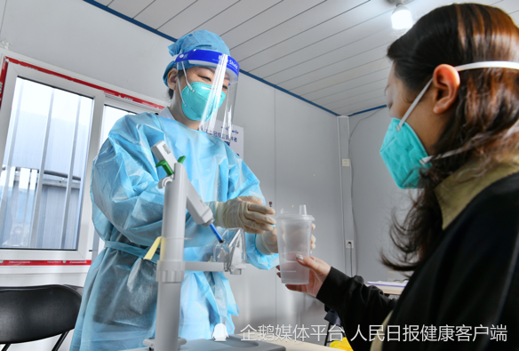

# 国内首次本土检出XBB.1.5，专家：短期内不会在国内引起大规模传播

**人民日报健康客户端作者 记者 王艾冰**

“我国在前段时间已经有较多人群被感染，形成了一定的群体免疫，所以目前不太可能引起新一波的流行，短期内也没有迹象表明XBB.1.5会在我国引起大规模传播。”广州医科大学附属市八医院感染病中心首席专家蔡卫平告诉人民日报健康客户端记者。

2月15日，中国疾控中心发布通报：

2022年12月以来，全国共发现本土重点关注变异株14例，其中1例XBB.1.5，为本周期新增变异株病例。此前，据财联社消息，美国疾病控制与预防中心表示，他们正在追踪一种名为XBB.1.5的新型奥密克戎亚型毒株。美国疾病控制和预防中心公布的数据显示，XBB.1.5约占全美新感染新冠病例的40.5%。

_北京海淀区上地街道疫苗接种点，一位居民在接种疫苗。人民日报健康客户端牛宏超
摄。_

本土出现XBB.1.5变异株病例是否会在我国引起大规模传播？“XBB.1.5属于XBB的变异毒株，与XBB毒株相比，XBB.1.5的免疫逃逸能力有所增强，意味着其传播力可能会有一些增强。”蔡卫平指出，但是不是说每一个变异毒株的出现都会在一个地区占据绝对的优势，是否能在一个地区引起大规模传播，需要看当地人群的免疫能力等等。

蔡卫平强调，“XBB.1.5虽然在一些国家引起了一定规模的传播，但目前还没有证据表明，这一变异毒株的致病力在增强，所以，依照目前的情况来看，没有必要对此变异毒株太过担心，但为了应对这些变异毒株，没有阳过或者老年人等高危群体也可以提前接种疫苗加强保护。”

