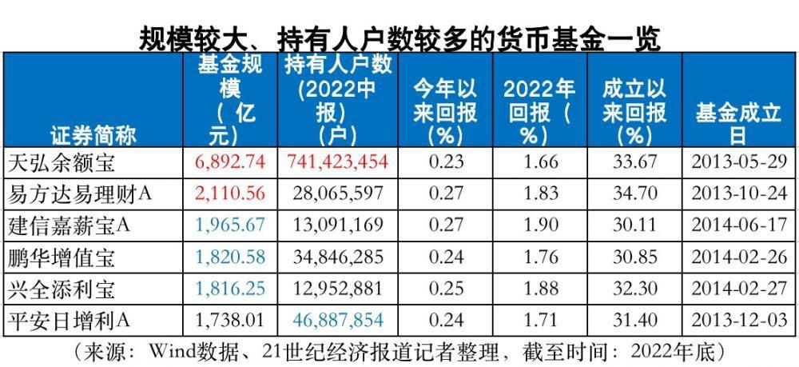

# 影响超7亿人！余额宝、易方达易理财或迎“重要货币市场基金”监管新规

**21世纪经济报道记者 庞华玮 广州报道**

影响超7亿投资人的货币市场基金监管新规来了。

2月17日，为强化重要货币市场基金监管，证监会联合中国人民银行共同发布《重要货币市场基金监管暂行规定》（以下简称《暂行规定》），自2023年5月16日起施行。

《暂行规定》指出，满足规模大于2000 亿元或者投资者数量大于5000
万个等条件的货币市场基金，应纳入重要货币市场基金评估范围。对这些基金，《暂行规定》明确附加监管要求，增强抗风险能力，明确风险防控与处置机制。

21世纪经济报道记者据Wind数据筛选，截至2022年四季度末，全市场满足上述条件的货币基金仅有两只：天弘余额宝（规模6892.74亿元，2022年年中基金份额持有人户数7.41亿户）、易方达易理财（规模2110.56亿元）。此外，市场上还有多只产品接近重要货币市场基金的纳入标准。

重要货币市场基金未来在投资运作中要满足《暂行规定》的多项监管要求，比如，重要货币市场基金投资运作时，持有一家公司发行的证券市值不得超过基金资产净值的5%；投资组合的平均剩余期限不得超过90天；投资组合的杠杆比例不得超过110%等。

**强化重要货币基金监管**

《暂行规定》出台的背景是，近年来，我国公募基金行业快速发展，整体规模已超27 万亿元，投资者数量突破7亿。

而货币市场基金作为现金管理类的普惠金融产品，具有安全性高、流动性好、投资成本低等特点，已成为公募基金的重要品种，积极服务于居民财富管理。同时，个别货币市场基金产品规模较大或涉及投资者数量较多，如发生风险易对金融市场产生负面影响，需提出更为严格审慎的监管要求。

为进一步提升重要货币市场基金产品的安全性和流动性、有效防范风险，证监会会同人民银行研究起草了《重要货币市场基金监管暂行规定》(以下简称《暂行规定》)。

《暂行规定》共五章二十条，主要内容包括：

(一)明确定义及评估条件、标准、程序。重要货币市场基金是指因基金资产规模较大或投资者人数较多、与其他金融机构或者金融产品关联性较强，如发生重大风险，可能对资本市场和金融体系产生重大不利影响的货币市场基金。
**满足规模大于2000 亿元或者投资者数量大于5000 万个等条件的货币市场基金，应纳入评估范围** 。证监会对参评产品予以评估，确定最终名单并予以公示。

(二) **明确附加监管要求，增强抗风险能力**
。《暂行规定》从经营理念、风险管理、人员及系统配置、投资比例、交易行为、规模控制、申赎管理、销售行为、风险准备金计提等方面，对重要货币市场基金的基金管理人、托管人和销售机构提出了更为严格审慎的要求。

(三) **明确风险防控与处置机制**
。一是要求基金管理人及相关市场主体应当制定合理有效的风险应对预案，提前对风险处置事项做出安排。二是规定证监会会同人民银行等相关部门建立信息共享机制，明确重大风险情形下的风险处置机制。三是规定不同风险情形下基金管理人自有资金、风险准备金、主要股东等风险处置资金来源。

其中，值得关注的是，《暂行规定》提出，基金管理人应当完善投资管理机制，全面加强内部信用评级管理，投资标的和相关决策应当有及时、充分的研究支持。重要货币市场基金的投资运作指标应当符合以下要求：

（一）持有一家公司发行的证券市值不得超过基金资产净值的5%；

（二）投资于具有基金托管人资格的同一商业银行发行的金融工具占基金资产净值的比例不得超过15%；

（三）持有债券、资产支持证券、银行存款、同业存单等金融工具的内部信用评级，以及债券逆回购交易的交易对手的内部信用评级应当为较高级；

（四）涉及私募资管产品的债券逆回购交易余额合计不得超过基金资产净值的10%，相关质押券等担保品计入第（一）项规定的比例且其内部信用评级应当为较高级；其中，涉及同一私募资管产品的债券逆回购交易余额不得超过基金资产净值的1%；

（五）投资组合中现金、国债、中央银行票据、政策性金融债券以及5个交易日内到期的其他金融工具占基金资产净值的比例合计不得低于20%；

（六）主动投资于流动性受限资产的规模合计不得超过基金资产净值的5%，投资于有存款期限的银行存款（含协议约定可无条件提前支取的银行存款）的规模不得超过基金资产净值的50%；

（七）投资组合的平均剩余期限不得超过90天；

（八）投资组合的杠杆比例不得超过110%；

（九）中国证监会根据审慎监管原则作出的其他要求。

**谁将纳入重要货币基金？**

据Wind数据，截至2022年四季度末，市场上共有371只货币基金（A/C/D/E/F类基金合并计算为一只，下同），货币基金总规模超过10万亿元，达到10.46万亿元，2022年年中基金份额持有人户数总计15.66亿。

2022年，货币型基金平均收益为1.78%，中位数为1.82%。

与之相对，2022年全年，股票型基金平均回报为-20%，债券型基金的平均回报为0.61%。

2022年，股市和债市都经历了较大的震荡，货币基金不但整体风险低于权益基金和债券基金，而且当年收益也较高，这使得2022年货币基金受到投资人青睐，2022年底较2021年底，货币基金份额净增加了1万亿份。

而据记者统计，根据2022年四季报数据，符合《暂行规定》的“重要货币市场基金”要求的货币基金仅有天弘余额宝、易方达易理财两只产品，管理规模分别为6892.74亿元、2110.56亿元，同时，天弘余额宝基金份额持有人户数在去年中报已高达7.41亿户。

除了上述两只基金外，目前建信嘉薪宝规模也逼近2000亿元，去年底为1965.62亿元，此外，鹏华增值宝、兴全添利宝两只基金的规模去年底也超过了1800亿元。

而在基金份额持有人户数上，平安日增利持有人户数逼近5000万户的重要货币市场基金门槛，去年中报显示，为4689万户。

不过，按照《暂行规定》的要求，“基金份额持有人数量”， 是指持有份额大于 1 的投资者数量，因此，如果剔除持有份额小于1
的投资者数量，持有人户数可能会有所下降。

总体来看，上述货币基金未来有望进入重要货币市场基金的评估范围。

