# 最长可休18天！天津、安徽、江西等多地发文延长婚假

近日，天津、安徽、江西等多地发文延长婚假。

央视网报道，自2月10日起施行的《 **南京市** 人口与生育服务规定》对各类假期进行了明确规定，包括依法办理结婚登记的夫妻， **可以享受婚假十五天。**

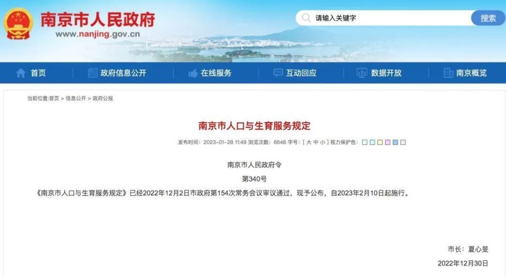

**天津** 发布的《关于婚假生育假（产假）陪产假育儿假护理假等假期休假的实施办法》规定：依法办理结婚登记的公民， **享受婚假十日。**

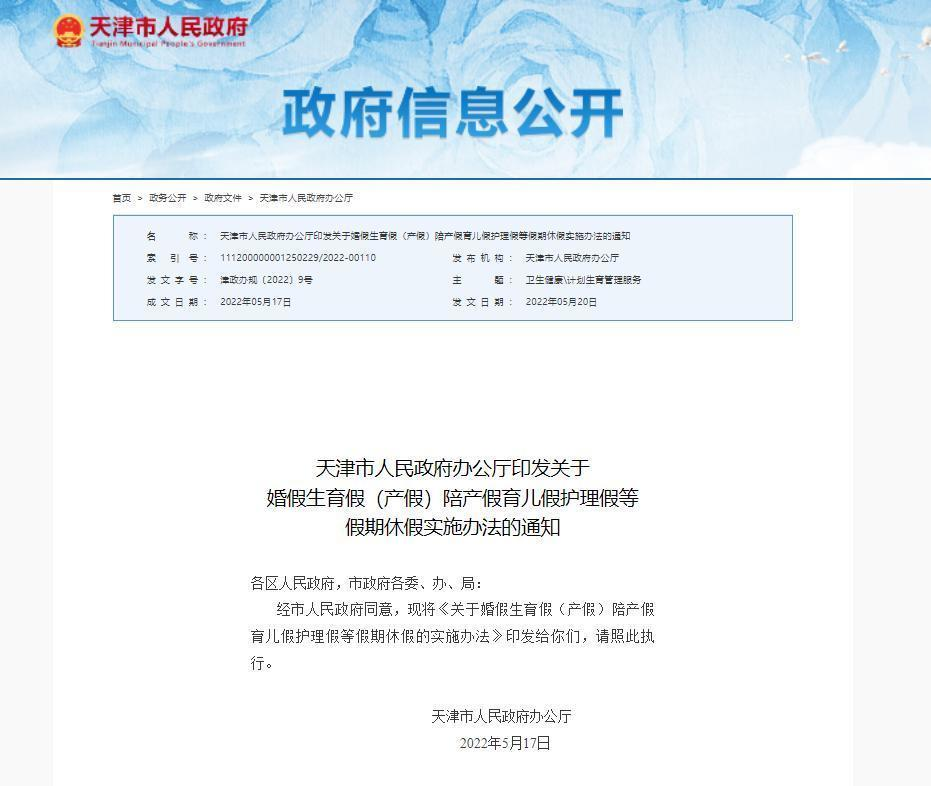

《安徽省人口与计划生育条例》自2022年1月1日起施行。

根据《条例》第三十一条规定：符合法律规定结婚的职工，在享受国家规定婚假的基础上， **延长婚假十天。**
婚假期间，其享有的工资、奖金、福利待遇不变。可一次休完，也可分次享受。

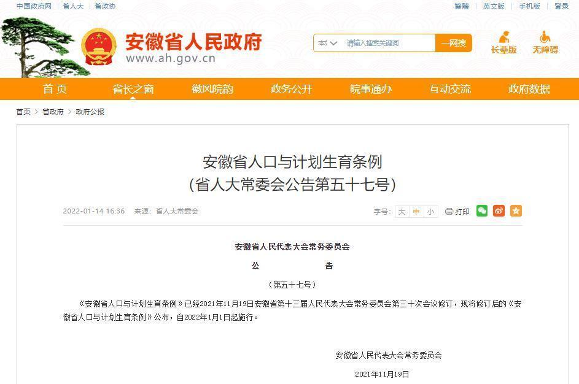

《江西省人口与计划生育条例》则规定，符合法律、行政法规和本条例规定结婚、生育的夫妻， **除享受国家规定的假期（3日）外，增加婚假15日。**

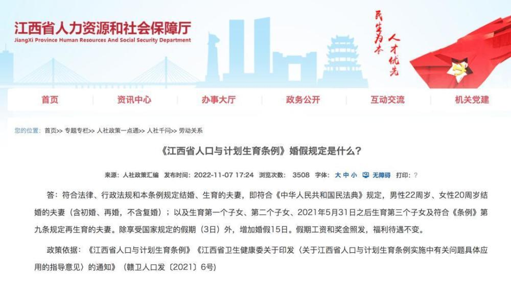

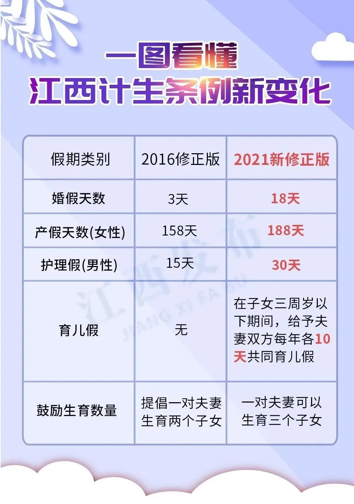

_图片来源：赣南日报_

用事假来延长婚假，可行吗？

**法定节假日、带薪年休假、病假、探亲假、婚假和奖励婚假、丧假、女职工产假、哺乳假等假期都有相关法律法规的规定。**

若符合休假条件， **可以进行休假** 或者向单位申请休假，都是“有法可依”的。

事假通常指员工因私事或其他个人需要请的假， **我国《劳动法》和《劳动合同法》中对“事假”没有明确规定。**

区别于其他法定节假日、婚假、产假等国家法定的假期， **事假批准的决定权在单位。** 因此，如果劳动者打算用事假来延长婚假，应得到单位批准。同时，
**员工休法律法规规定的假期，用人单位是不应该扣除工资的。** （病假期间的工资按照具体的法律法规规定处理）

**对于其他休假（例如事假），** 用人单位可以按照员工请事假的天数扣除工资，但不得扣除双倍或多倍工资。

法院指出，用人单位和员工应当互相体谅，员工应当对自己的工作情况负责，在履行完整的请假手续后进行休假，若有急事，

可考虑和单位进行协商， **优先休法律法规规定假期，次之考虑请事假。**

休假相关知识点

带薪年休假有多少天？没休的年假该如何进行补偿？……休假事关自身权益，以下知识点需掌握

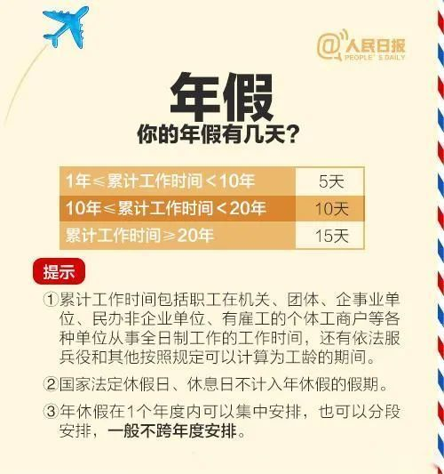

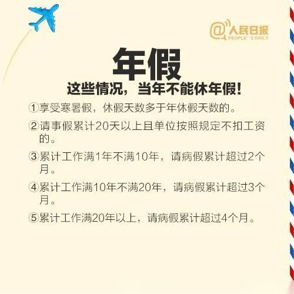

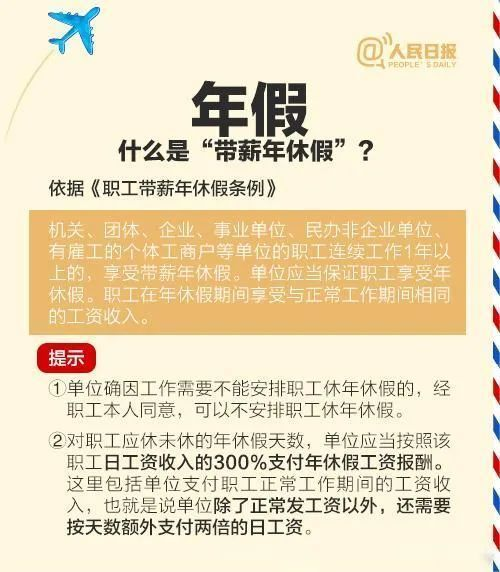

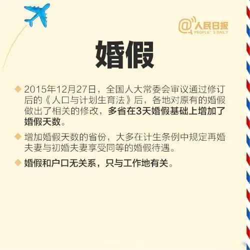

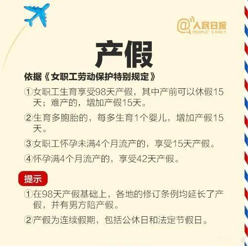

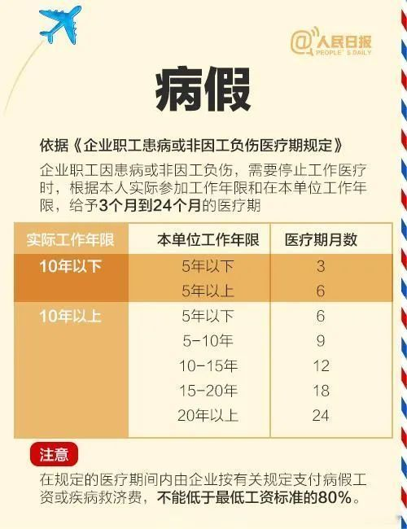

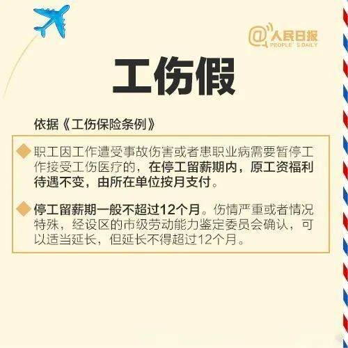

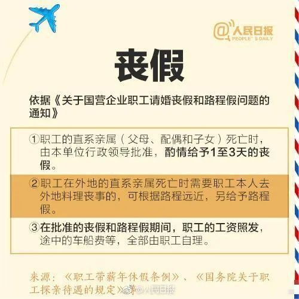

每日经济新闻综合自央视网

每经编辑：张锦河

