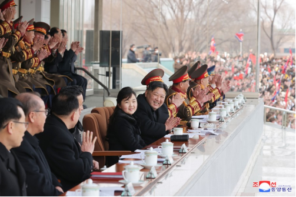
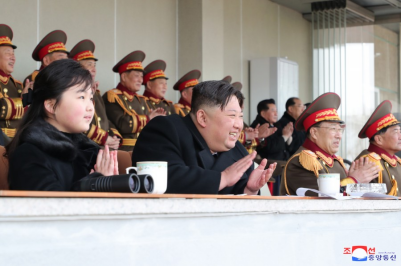
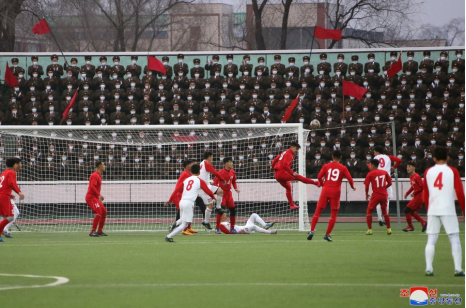
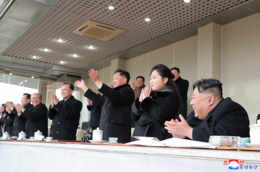
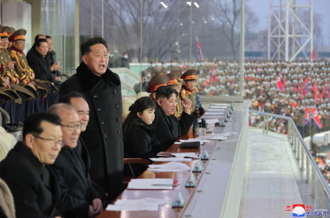
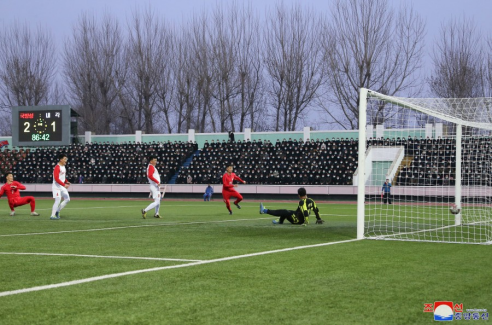
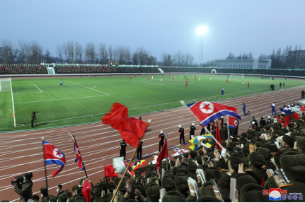
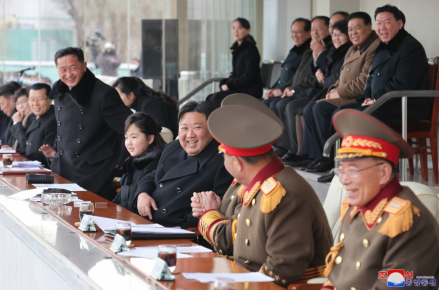

# 朝中社：“光明星节”之际，金正恩偕女儿观看体育比赛

【环球网报道】2月16日是朝鲜主要节日之一“光明星节”，暨已故朝鲜最高领导人金正日诞辰日。朝鲜中央通讯社18日报道称，该节日之际，朝鲜内阁和国防省职员于2月17日举行体育比赛，包括足球和拔河比赛。朝鲜劳动党总书记、国务委员长金正恩偕女儿一同观看比赛。

朝鲜劳动党总书记、国务委员长金正恩偕女儿一同观看“光明星节”体育比赛。图源：朝中社

