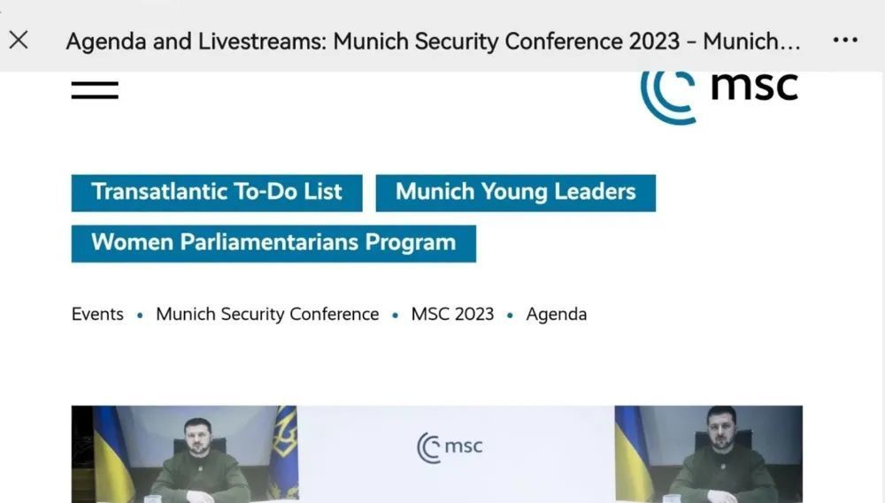
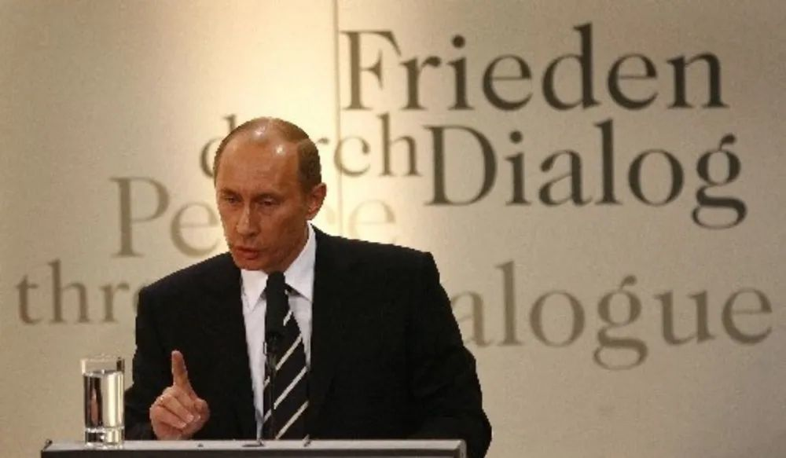
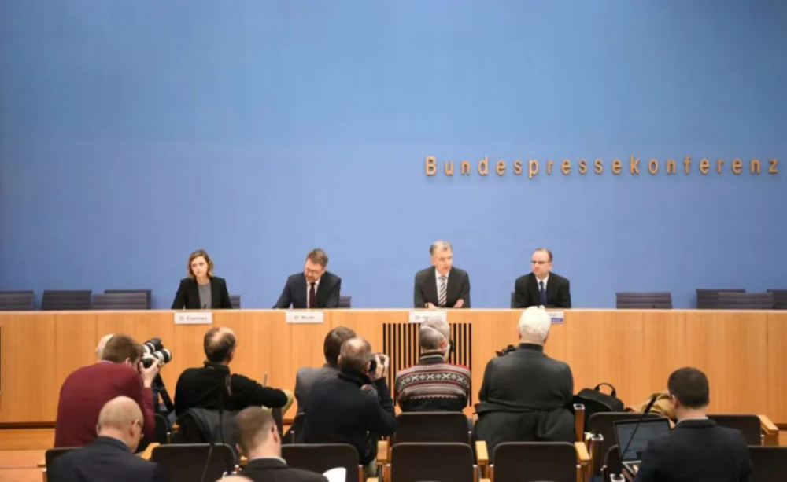
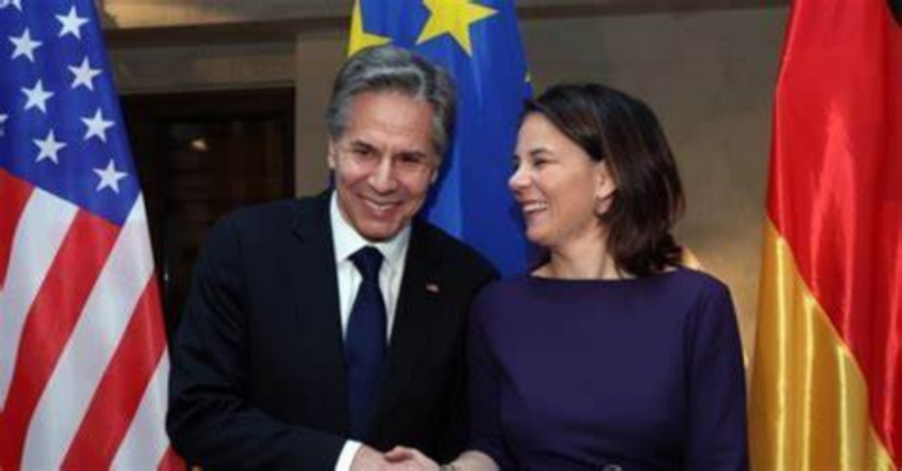

# 本届慕安会：俄乌冲突是主要议题，德媒称最令人期待的客人来自北京

毫无疑问，俄乌冲突是本届慕安会的主要议题。

**文 | 海上客**

不出意料，乌克兰总统泽连斯基又来了一出视频秀。

在当地时间2月17日开幕的第59届慕尼黑安全会议（英文缩写MSC，以下简称：慕安会）上，约850名与会者、其中包括四十余国政府首脑和国际组织负责人，看了泽连斯基的现场连线视频。

_慕安会网站上，议程表页面大图配的是泽连斯基
图：慕安会网站_

海叔甚至发现，慕安会网站上，议程表页面大图配的都是泽连斯基。

由于正值俄乌冲突一周年之际，俄罗斯领导人未与会，乌克兰领导人的视频在慕尼黑被如此重视，确实不出意料。

**1**

**比较出乎意料的是德新社的一则报道。**
其称，“今年的慕安会一反常态，美国派出了比以往任何时候都规模庞大的代表团，俄罗斯领导人自上世纪90年代以来首次未受邀出席……也许，最令人期待的客人来自北京”。

_当地时间2月18日上午10时45分，慕安会“世界上的中国”对话
图：翻拍自慕安会议程表_

这当然不仅仅是在披露一些议程——

譬如中央政治局委员、中央外事工作委员会办公室主任王毅将在慕安会上与慕安会基金会主席沃尔夫冈·伊申格尔的现场对话；

或者两位来自中国的女士——第十三届全国人民代表大会外事委员会副主任委员傅莹、中国军事科学学会高级顾问姚云竹等之与会交流。

这更是在点明中国参会，对本届慕安会的重要意义。

诚然，慕安会本身是西方发起的，极具大西洋色彩的一场有关军事、防务安全政策的会议。其最初的议题设置其实就是针对苏联，研讨西欧的防务和外交政策。在苏联解体以后，1995年，俄罗斯代表首次受邀出席会议。不过，这并不是在显露西方对当时的叶利钦当局有多友好，其主要目的是“修正”西方在冷战结束时对俄国人的承诺。

苏联前领导人戈尔巴乔夫生前多次称，在两德统一时，西方承诺北约不再东扩。而1995年，西方将叶利钦当局的官员招呼到慕尼黑，主要目的就是向俄罗斯宣告——北约还是要东扩。

_普京在第43届慕安会上抨击美国怂恿北约东扩_

1999年，中国也首次有代表参加慕安会。在海叔看来，回顾非西方国家参加慕安会的历史，就会发现，其实以美国为首的北约并不是想搞个“世界大团结”，其无非是想将别人都纳入他们的体系，成为他们的仆从。但非西方国家利用这个场合，来声明自身的观点，与西方在论坛上舌战交锋，其实也没什么不好。

以本次慕安会为例，德新社为什么说中国是“最令人期待的客人”？原因大抵在于中国的实力，以及在俄乌冲突中至今仍表现中立。西方当然有人想要威胁利诱中国加入到反对俄罗斯的阵营中。但对于中国来说，其实稳得很——俄乌冲突中，真正跟着美国极力拱火的也就四十余国。诸如印度这样的大国也无非中立。在“美国后院”拉美，更是有不少国家已经声明，绝不会向乌克兰输送武器。换言之，世界上大多数国家在俄乌冲突问题上并没有跟着美国划定的路线图前进。中国凭什么要跟着美国的“队伍”跑？

相信，在慕安会上，那些跟着美国并没有捞到好处的与会者，还是能够听到比较中肯的分析的。

_第59届慕尼黑安全会议主办方2月13日在柏林发布《2023年慕尼黑安全报告》，将今年会议定调为“重塑愿景”，这是当天在德国柏林拍摄的新闻发布会现场
图：新华社_

**2**

**王毅主任此次访欧，从法国到意大利，再到德国，已经与这三个国家的领导人会晤过了。**

当地时间2月15日，在巴黎爱丽舍宫，法国总统马克龙与王毅会谈。法国媒体称，“并不是随便哪个国家的外交高官都能受到总统接见”。确实，从级别来说，马克龙毕竟是法国总统。如果从外交对等的角度看，法国外长科隆纳、总统外交事务顾问博纳与王毅会晤，就已经算礼数到了。而一家德国媒体甚至称“马克龙与王毅就俄乌冲突进行闭门会谈”。搞得好像中法之间只谈了俄乌似的。其实当然不是这样。这一点，从此后一天，王毅与博纳共同主持的中法战略对话上，就可见端倪。

当王毅飞往罗马时，法国方面又开了一次总统府媒体吹风会，主要谈中法重启对话与合作，甚至证实马克龙正准备访问北京。

当地时间2月17日，意大利总统马塔雷拉会见王毅。除了请王毅转达对中国最高领导人的问候以外，马塔雷拉称，“愿本着相互理解、相互尊重精神推动意中关系发展，深化经贸、文化等领域合作，赞同双方尽快重启各合作机制。意方支持欧盟发展对华关系，当前形势下，欧中合作对于应对全球挑战至关重要”。

_当地时间2月17日开幕的慕安会现场_

可以说，法国、意大利，包括中国方面都是带着最新的外交收获来到慕尼黑的。

而德国总理朔尔茨也忙不迭在慕尼黑会见王毅。朔尔茨先祝贺中国抗疫成功，又表示要尽快重启与中国在各个领域的合作。“德方将坚定发展同中国的经贸关系，反对任何形式的脱钩。强劲的德中关系和经贸互利合作有利于世界的稳定和繁荣。”朔尔茨说。

在慕安会开幕前，欧洲主要大国的领导人对中国所言中，高频用词是——

重启、合作、不脱钩。

而中国与欧洲方面的深入沟通，大致来说，无非要向对方点明——

你们都是独立自主的大国，该有自己的外交自主权，也该承担相应的国际责任。

说白了，在俄乌冲突问题上，欧洲好歹该有自己的利益与看法吧！别被有些人带沟里去啊！

**3**

**再看美国方面。确实，美方派出了上百人的庞大代表团出席慕安会。但对于美国国务卿布林肯来说，也许麻烦也正在于此！**

_出席慕安会的美国国务卿布林肯与德国外长贝尔伯克
图：德新社_

毕竟，美方带队出席的是美国副总统哈里斯。怎么算，布林肯的级别都比哈里斯低一些。种种迹象表明，拜登当局的这个副总统，似乎比历届副总统干的工作都要多！

而美国参议院三分之一参议员都来到慕尼黑，两党在参议院的头目也都出席。海叔不禁要说，即便美国驴象两党、参众两院在对俄、对华问题上已经有了不少共识，可还是有分歧的。譬如美国前总统、共和党阵营的特朗普就说，如果他来当政，俄乌冲突二十四小时内可以结束。对于布林肯来说，随着一大帮子人来到慕尼黑，他这个主要负责外交的官员，还得随时向同去的“老佛爷”汇报。这差事，其实挺难当的。

在与德国外长贝尔伯克会晤，并一同参加论坛时，布林肯也只是泛泛而述地讲了些美国目前在俄乌冲突问题上的看法，了无新意……

毫无疑问，俄乌冲突是本届慕安会的主要议题，而对于欧洲来说，他们所见，是美国根本拿不出解决问题的办法。何况，那个“北溪”到底是谁炸的，谁还不心知肚明？

