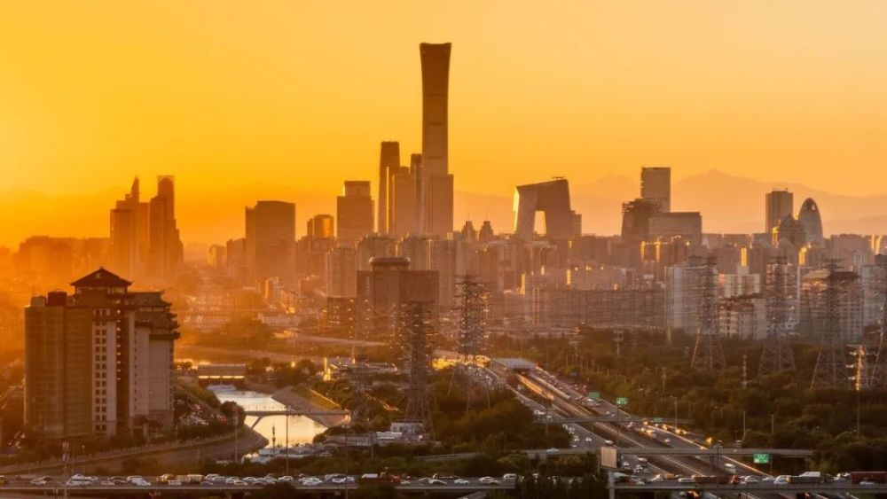
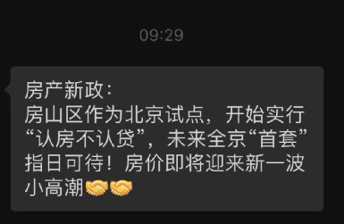

# 网传北京房山区试点“认房不认贷”？官方：消息不属实

**文 | 《财经》记者 刘昕**

**编辑 | 王博**

作为全国楼市风向标，北京任何关于房地产政策调控的消息都能引起不小的波澜。

近日，一则北京“房山区将试点认房不认贷”的消息在房产中介和购房者中流传。

2月17日上午，
**《财经》记者向房山区房屋交易中心求证此消息，对方表示：房山区“认房不认贷”的消息不属实，目前没有落实该政策，不要听信市场机构过度解读。**

此外，《财经》记者向一家在房山有在售楼盘的头部房企求证，对方表示目前没有接到相关政策。一位房山区的链家中介也告诉《财经》，目前没有实行此政策。

去年下半年至今，已有郑州、南京、苏州、无锡、佛山等城市陆续放开、优化“认房又认贷”购房标准，但北京、深圳、上海等一线城市并未有明显信号释放。

**“认房”“认贷”，是界定是否属于首套房时使用的标准。**

**目前，北京的政策是“认房又认贷”，自2017年3月开始执行。**
只有当居民家庭名下在北京无住房，且没有商业性住房贷款记录或公积金住房贷款记录的，才能算作首套房。购买首套普通自住房（见注释），首付款比例不低于35%，购买首套非普通自住房，首付比例不低于40%。

即在此政策下发之后，如果一个买房者在京有购房资格，无任何住房，但此前有房贷记录，无论是京内记录还是外地记录，就算已经还清贷款，也无法在北京享受首套房首付标准，算二套标准。

“认房又认贷”政策下发后，抑制了一大批置换和刚需购房者。一批曾有房贷并已经还清的人，如再买房，首付比例从原来的35%，上升至60%，如果是非普通自住房，首付比例下限为80%。相比首套房，购房门槛翻倍。

一位通州区的房产中介告诉《财经》，他接触的客户中，约有一半因“认房又认贷”政策被划定为二套房。“原本交100万元的首付就能买一套300万元的房子，现在得交200万元，这部分人可能暂时就不买了。”

在北京，房山区属于房产交易量较小、价格较低的城区。根据北京市住建委数据，今年1月，北京全市存量房交易9491套，其中，房山区交易525套，占全市交易套数的5.5%，在16个区中排名第八。

根据房山区政府官网，2020年和2021年，房山区的商品房待售面积同比分别下降0.2%、9.2%。但是，2022年，房山区的待售面积为271.8万平方米，较上一年增长26%，去化压力增大。

根据诸葛找房数据，今年1月，房山区二手房均价为28467元/平方米。去年2月，均价为27954元/平方米。一年时间，房屋均价上涨约1.8%。同一时间段，北京房屋均价上涨7%。

**去年8月，北京市“认房又认贷”的限制曾有过小范围放松，但是仅限于中心城区60岁及以上老年家庭。**
这类家庭若在昌平区、顺义区三宗地的试点项目买房，且名下无住房、无在途贷款，首付比例最低可到35%。“无住房、无在途贷款”，意味着“认房不认贷”。

今年1月，北京市政府印发《2023年市政府工作报告重点任务清单》，在232条提到，完善“一区一策”调控措施。

这些迹象让部分购房者和开发商相信，北京将来能在“认房又认贷”的限制上出现实质性的放松。

**注释：**

北京市普通住宅和非普通住宅的区分标准依据是住建委、财政局和税务局2014年10月份实施的《关于调整本市享受税收优惠政策普通住房平均交易价格有关问题的通知》。

普通住宅需满足三个条件：

1.住宅小区建筑容积率在1.0（含）以上；

2.单套建筑面积在140平方米（含）以下；

3.实际成交价格低于按本通知确定的价格标准，其中五环内单价低于39600元/平方米或总价低于468万元，五至六环之间单价低于31680元/平方米或总价低于374.4万元，六环以外单价低于23760元/平方米或总价低于280.8万元，本条中单价或总价其中一个条件符合即可。

