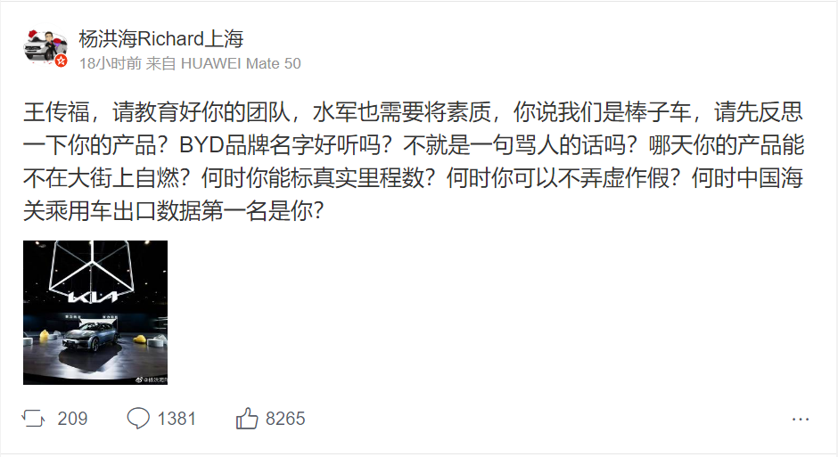
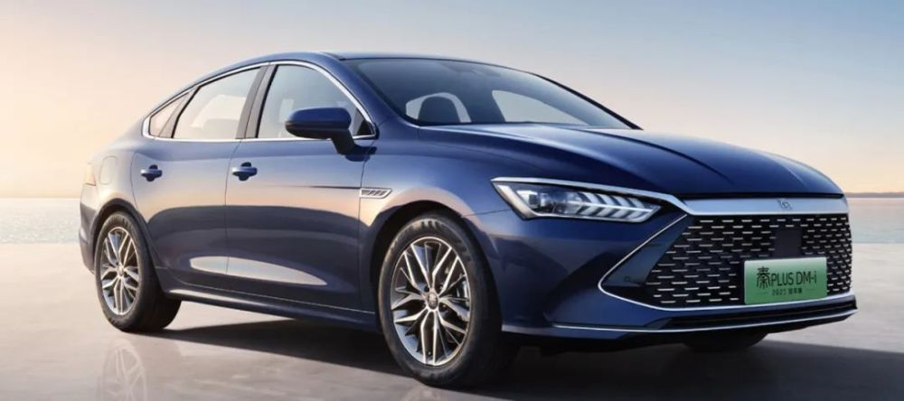
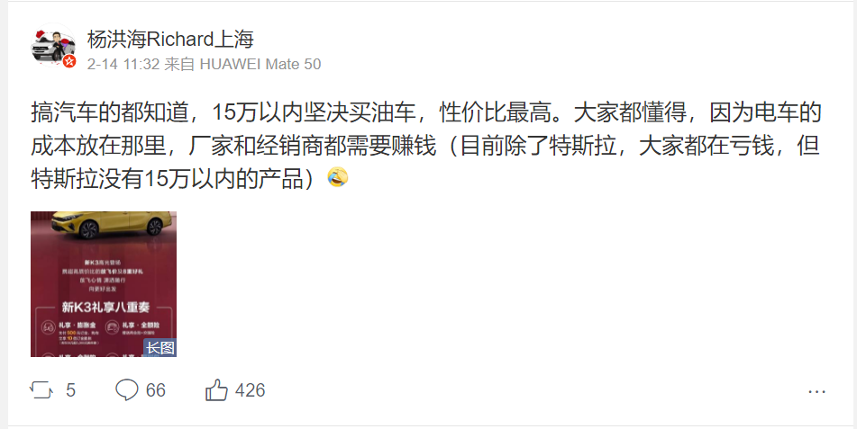
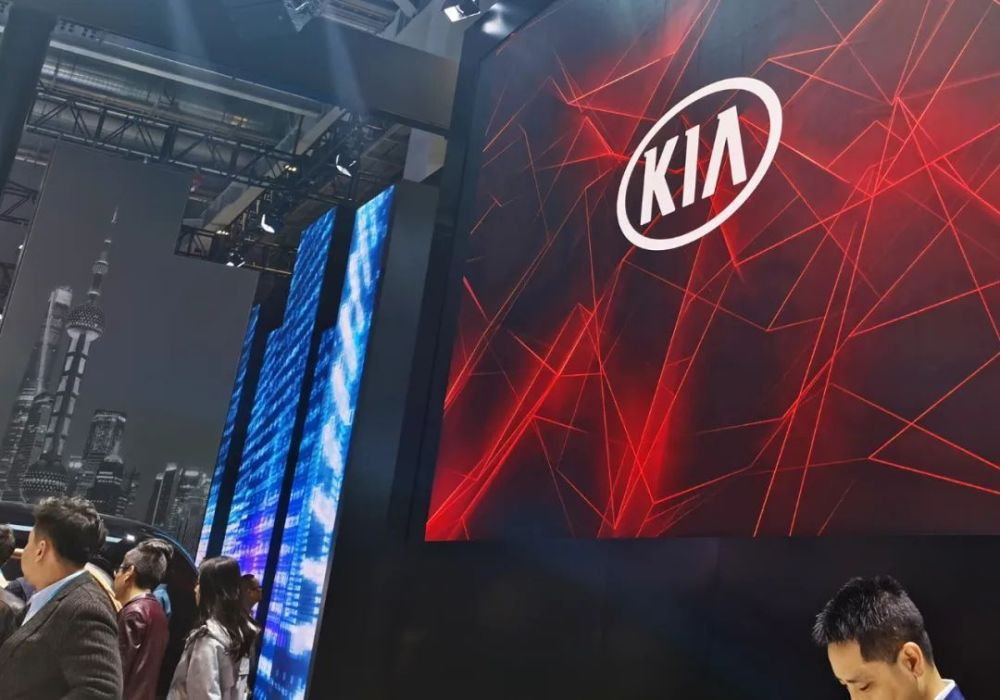

# 起亚高管“开喷”比亚迪：“别靠政府补贴”！业内：折射合资品牌焦虑

每经记者：董天意 每经编辑：孙磊,何小桃,易启江

杨洪海“火”了。

作为起亚中国首席运营官（COO），杨洪海于2月16日通过个人社交媒体发文，以6句反问，将矛头直指比亚迪及其董事长兼总裁王传福。

“王传福，请教育好你的团队，水军也需要将（讲）素质，你说我们是棒子车，请先反思一下你的产品？BYD品牌名字好听吗？不就是一句骂人的话吗？哪天你的产品能不在大街上自燃？何时你能标真实里程数？何时你可以不弄虚作假？何时中国海关乘用车出口数据第一名是你？”杨洪海在个人社交媒体上称。

_图片来源：新浪微博@杨洪海Richard上海_

不仅如此，杨洪海的“怒火”也蔓延至网友评论区，其中不乏“（比亚迪）为什么要水军这么low的营销手段”“（起亚）全球第三，销量比比亚迪高多了”“你BYD有本事全球卖车盈利460亿，不要靠政府补贴活着啊，不要靠糊弄客户赚钱”等回复。

_图片来源：新浪微博@杨洪海Richard上海_

此外，面对网友“起亚还没凉吗”“这年头还有人买韩国车”等质疑，杨洪海也一一“回怼”道，“挺好的，（起亚）去年赚了460亿人民币”“等你买的起车了，再来喷”。

值得一提的是，截至《每日经济新闻》记者发稿前，杨洪海的个人社交媒体已将上述部分内容删除。而新浪微博@小迪快报则发文并“点名”杨洪海称：“祝起亚中国首席运营官杨洪海先生新年工作顺利。”

随着竞争环境的加剧，汽车圈“互怼”事件近段时间屡见不鲜，但相比以往偏重于技术层面的探讨，类似上述措辞激烈的表态并不多见，而结合杨洪海当前的职位身份及行业履历来看，这样的场景更是难遇。

公开资料显示，杨洪海可谓是汽车行业的营销“老将”，其曾先后担任过上汽大通品牌及网络部总监、营销总监、MPV事业部副总经理、上汽印尼公司副总经理等职务。2020年4月，杨洪海加盟华晨雷诺金杯出任公司副总裁，全面负责华晨雷诺金杯的市场营销工作。不过，随着2022年年初华晨雷诺金杯的破产重整，杨洪海也逐渐消失于公众视野。

今年2月13日，在新起亚K3的上市活动中，杨洪海以起亚中国首席运营官的全新身份亮相。杨洪海在现场表示，今年起亚将秉承“New
Kia中国战略”，全面向新出发，坚持燃油、电动两手抓，持续以高品质、高科技的全球车型，为中国用户带来焕然一新的产品和服务体验。

但令人意外的是，下定决心在产品和服务体验层面焕然一新的起亚，其开端竟如此“激烈”。对此，有观点认为，杨洪海向比亚迪“开炮”的原因，或与新起亚K3和比亚迪秦PLUS
DM-i冠军版的潜在竞争关系有关。

就在新起亚K3上市前不久，比亚迪推出2023款秦PLUS DM-
i冠军版，新车起售价为9.98万元，首次将A级插电式混动轿车的起售价拉至10万元以内。据官方数据，2023款秦PLUS DM-
i冠军版上市7天即获得3.2万辆订单，市场需求火爆。

_图片来源：比亚迪官网_

通过新K3的市场营销策略来看，其也被起亚中国方面寄予厚望。据了解，新起亚K3的指导价区间为11.29万~14.39万元，但由于官方推出了“赠送全额险”“订金10倍膨胀”等优惠政策，所以新起亚K3着重强调了其综合优惠后8.99万元的起售价格，旨在放大“性价比”卖点。

2月14日，杨洪海通过个人社交媒体为新起亚K3造势时表示：“搞汽车的都知道，15万（元）以内坚决买油车，性价比最高。大家都懂得，因为电车的成本放在那里，厂家和经销商都需要赚钱。”此外，杨洪海还强调：“目前除了特斯拉，大家都在亏钱，但特斯拉没有15万（元）以内的产品。”

_图片来源：新浪微博@杨洪海Richard上海_

上述言论却让部分比亚迪“粉丝”产生质疑。有网友在下方留言表示：“比亚迪秦dmi，九万八，了解一下。”“我选9.98万的比亚迪秦，毕竟落地跟你这个油车落地价差不多，还比你省油，还比你先进。”也有网友调侃称：“15万以内的电车仅仅一款海豚就要超过起亚了吧。”

对此，杨洪海于2月15日再度发文称：“很有趣的事情，我在脉脉上发了一条关于15万MSRP（市场指导价）价位内选油车还是电车的话题（只提到了特斯拉没有15万以内的产品，一个字都没提比亚迪），结果竟然引来了一帮比亚迪水军攻击我。井底之蛙的世界真的很可怕！”

而在双方的你来我往中，一场围绕“15万元内最具性价比车型”的讨论，便逐渐升级为比亚迪与起亚，乃至整个合资品牌阵营间的对比。有观点认为，这场“口水战”背后，或折射出部分合资品牌在华发展的焦虑。

以起亚品牌为例，其2022年全球销量约290万辆，同比实现4.6%的增长。但在中国市场，经历股份结构调整，现以韩方为主导的悦达起亚却未见起色，其2022年全年在华销量不足10万辆，在国内乘用车市场占有率不足0.5%。

_图片来源：每日经济新闻 资料图_

更需要注意的是，借助新能源汽车技术层面的优势，比亚迪等自主品牌正在不断侵蚀合资品牌的传统强势市场。例如，2023款秦PLUS DM-
i冠军版9.98万元的售价，已经对同级别落地价格在9万元左右的燃油车型形成威胁，而这正是东风日产轩逸、上汽大众朗逸、一汽丰田卡罗拉等合资品牌热销车型的主阵地。

此外，2023款秦PLUS DM-
i冠军版所释放出的“油电同价”信号，或将成为国内A级家轿市场用户的消费认知锚点，引导消费者的价值预期，这意味着，合资品牌或也将失去该细分市场的主导权，陷入“技术跟不上”或“价格降不下”的两难境地。

一组数据也印证了上述观点。记者查阅经销商报价后发现，当前，起售价为9.98万元2022款轩逸经典的终端优惠已到2.8万元，落地价格或不超过8万元；2022款卡罗拉手动先锋版的优惠幅度为2.3万元，裸车价格为8.68万元；而朗逸则给出最高3.4万元的综合优惠，其1.5L手动风尚版车型的裸车价格已降至7.99万元。

此前有消息称，王传福曾表示2023年比亚迪将向全年销量400万辆目标发起冲击。虽然比亚迪方面回应称，由于市场、消费需求和供应体系的众多不确定性，目前2023年公司的销量目标还不好判断。但有观点认为，2023款秦PLUS
DM-
i冠军版可作为比亚迪销量摸高的重要推动力，由此带来的“油电同价”消费认知一旦形成，比亚迪可凭借其技术优势和规模效应，以相同打法扩展市场边界。届时，其它汽车品牌的生存能力或将面临更严峻的考验。

**记者|** 董天意 **编辑|** 孙磊 何小桃 易启江

