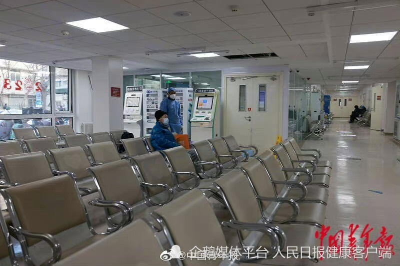

# 这个节骨眼又出现了感冒、发烧的症状，是新冠吗？

**人民日报健康客户端记者 张爽**

“上周六就烧了，浑身疼得要死，这感觉似曾相识……但每天测抗原都是一条线。”2月18日，李洁（化名）告诉人民日报健康客户端记者，最近，她本人和几位同事、朋友先后出现了发烧或感冒的症状，“大家第一反应都是：‘不会又感染了吧？’”

记者查询某短视频平台发现，像李洁一样担心自己二次感染新冠的还不在少数。对此，上海市肺科医院呼吸与危重症医学科副主任胡洋在接受人民日报健康客户端记者采访时表示，发烧患者每天都有，并未感觉到近期在数量上有明显增加。而且，发烧也不一定就和新冠或其他感染性疾病相关联。

_2月7日，北京朝阳医院，发热门诊内患者寥寥。中国青年报
图。_

**甲流、诺如病毒感染进入多发期，也能引起发热**

据人民日报健康客户端不完全梳理发现，近期，多地都报告了流感、诺如病毒感染的病例，而发热也是这两者的主要临床表现之一。

合肥市疾病预防控制中心在2月16日就曾发文提示，冬春季是呼吸道传染病高发时期，近期安徽省内已发生多起校园甲型H1N1流感聚集性疫情。而流感的临床表现与新冠病毒感染的表现相似，主要为发热、头痛、肌痛和全身不适起病。

据华声在线2月17日报道，长沙市中心医院（南华大学附属长沙中心医院）儿科及急诊科已陆续接诊并治疗30余例诺如病毒感染者。台州晚报在18日的报道中也提到，台州市立医院最近夜间急诊一半都为诺如病毒感染。此外，北京、河南、浙江等多地疾控部门也都发布消息，提醒家长诺如病毒引起的急性感染性腹泻进入发病高峰期。

在中国疾病预防控制中心2月14日发布的《诺如病毒胃肠炎健康提示》中也提到，一般10月到次年3月是诺如病毒感染高发季节。人群普遍易感。常见症状主要为恶心、呕吐、发热、腹痛和腹泻。

“因此，我们可以看到不同的人有不同导致发热的原因，并不能说现在发热就一定代表‘阳’了。”胡洋向记者总结。

**如何判断为何发热？测抗原，及时到医院检查**

既然目前的发热可能是新冠、流感、诺如病毒等多种原因导致的，那么又如何判断自己到底属于哪种情况呢？胡洋向记者表示，患者想要自行判断自己属于哪种情况还是很难的。“如果出现发热的话，大家可以先测一下抗原，看看是否呈新冠阳性，而至于其他的还是需要及时去医院进行专业检查。”

“不过，就我目前所注意到的，并没有感觉到医院门诊的发热患者数量出现明显增多。即使真的出现流感流行，有关部门也可以通过对医院系统上报信息分析而取得相关数据，所以大家可以放心。”胡洋说。

