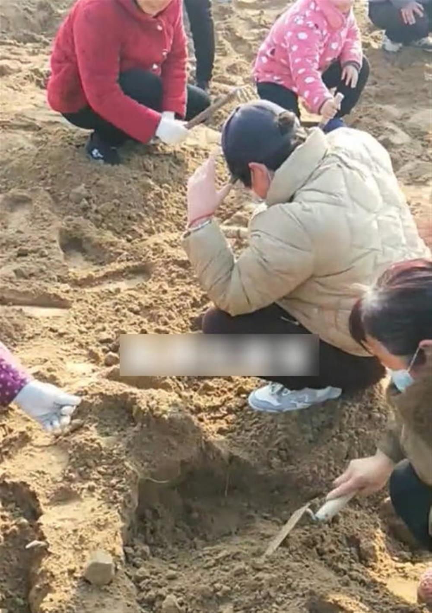
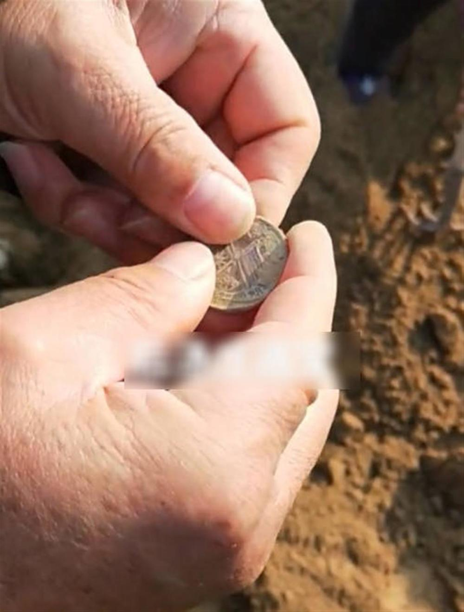

# 山东一地发现古钱币吸引村民“寻宝”，当地：私挖违法文物违法

极目新闻记者 丁伟

山东菏泽东明县焦园乡后汤庄又热闹了起来，近日不断有人慕名前来。据村民介绍，这里地下挖出了古钱币，不少人专程前来“寻宝”。

2月19日，相关部门工作人员向极目新闻记者介绍，当地发现的铜钱和铜板属于文物，不允许个人私自挖掘。

**村庄发现古钱币吸引“寻宝者”**

视频显示，“挖宝”现场很是热闹，有村民正在用力开挖土地，周边围满了看热闹的村民。另一段视频则显示，一村民正展示其战果，手里拿的疑似是一枚圆形钱币，原本平坦的土地上已被挖出一个又一个大小不一的深洞。

_村民“挖宝”_

上述视频勾起了不少网友的兴趣，有网友表示要准备探测仪动身去挖宝，甚至还有人建议用挖掘机等大型设备挖掘。

据了解，上述视频拍摄于山东菏泽东明县焦园乡后汤庄村。

“差不多有四五天时间了，天天有人去挖，但是有派出所民警值守，不让挖。”2月19日上午，焦园乡一村民告诉极目新闻记者，所谓的“宝”其实是一些铜钱，“听说没什么价值，并不值钱。”该村民介绍，网上所说的挖宝地就是原来的后汤庄村，目前整个村子已经搬迁到了新址，几天前有人用仪器发现了一些古钱币，后来村民听说后也纷纷去“挖宝”。

当地另一村民表示，这几天确实有不少人去寻宝，甚至还有人趁夜色去碰运气。

焦园乡政府工作人员向极目新闻记者证实，在后汤庄的原址上确实发现了一些古钱币，至于属不属于文物，他并不清楚。同时，该工作人员还表示，原来的村庄用地现在已经改造成了耕地，不建议村民去私自挖掘，以免对耕地造成破坏。

辖区派出所工作人员表示，目前有民警在事发地值守，不允许村民私自挖掘。

**博物馆称文物不能私自挖掘**

村民们发现的古钱币到底属不属于文物？2月19日上午，极目新闻记者拨打了东明县文化和旅游局的电话，接线人员称，已听说焦园乡一村庄发现古钱币的事，当地博物馆工作人员还去了现场。

随后，极目新闻记者又致电东明县博物馆，工作人员介绍，近日焦园乡所发现的钱币主要是一些铜钱和铜板，属于文物。“不允许私自挖掘，如有人私自挖掘那就属于违法行为。目前已经挖掘的也已上交，数量正在清理，至于这些钱币属于哪个朝代，还有待鉴定。”该工作人员说。

_村民展示挖到的钱币_

地下所挖文物所有权到底归谁？对此，湖北征和律师事务所董文明律师表示，根据《文物保护法》第五条规定，中华人民共和国境内地下、内水和领海中遗存的一切文物，属于国家所有。但是，该法第六条还规定，属于集体所有和私人所有的纪念建筑物、古建筑和祖传文物以及依法取得的其他文物，其所有权受法律保护。“也就是说，对于埋藏或者隐藏于公民祖宅内的文物，在公民能证明属于其祖产的情况下，后代可以通过继承取得，祖传文物的私有产权受到法律保护。”董律师说。

（来源：极目新闻）

