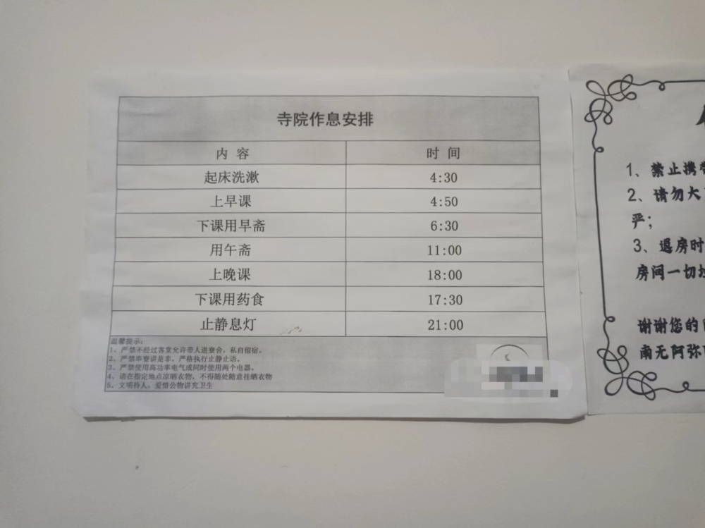
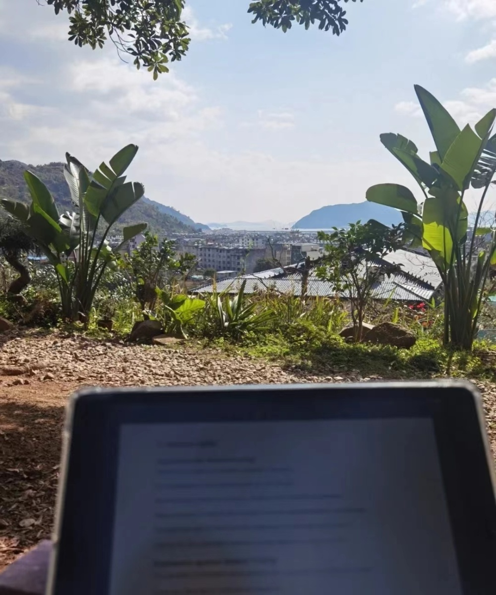
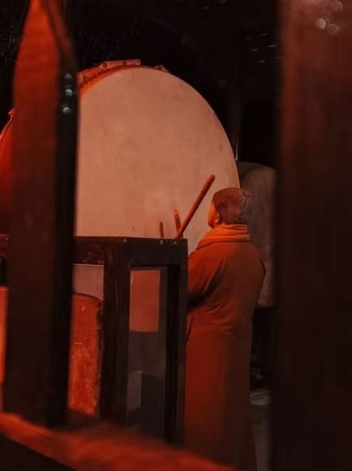

# 年轻人涌入寺庙做义工：有人缓解焦虑找到安宁，有人感慨没想到那么多尔虞我诈

周颖盘腿坐着，双手合十，眼睛紧闭，耳边是大师父低沉有力的念经声。她几乎什么都听不懂，只觉得尾音拖得很长，“肺活量真大，”她想，“他可以去当歌手。”尽管嘴上努力跟着，意识却开始模糊，有几个瞬间，她感觉自己快要睡着了。

突然，一只手戳了戳她，她回过神来，有些发懵地睁开眼，身边坐着的人都不见了。目光往上移，其他人已排成一列，正围着殿内转圈，戳她的师父在队伍中间看着她，提醒她一起走。她慌忙起身，窜到队伍末尾，为了不显得突兀，她不敢连续几步走，只能在大家一念一动时，尽可能地跨大步前进。

那是她去成都一座寺庙做义工的第二天，按照作息安排，她得参加凌晨4点多的早课。早课持续了近两个小时，后来她才知道，打坐结束后，大家需要围着大殿转三圈。

像周颖一样选择到寺庙做义工的年轻人不少。她所去寺庙的一位师父提到，年轻的义工们来自五湖四海，甚至会有人特意从东北赶来，有些特别年轻的，高考结束就来了。

他们大多不信仰佛教，渴望寺庙带来另一种人生体验，年轻人纷至沓来，涌入古老的寺庙。有人收获了想象中的安宁，有人却发现，这里与“原子化”的现代社会没什么两样，自己像个“免费劳动力”。

_周颖所在寺庙作息安排。图/九派新闻
彭茸雯_

**一：有人曾认为寺庙是“封建迷信”，有人为了调整作息**

周颖成为一名寺庙义工，是在机缘巧合之下，连她自己都“从没想过”。

进入寺庙之前，周颖没关注过这方面。她记不清自己从那座寺庙门口经过了多少次，更多时候，她觉得这是一种封建迷信。但偶尔，她也会对里面的生活产生好奇。

春节，时间突然空了下来，她想找个地方打发时间，想到朋友曾提到，这间寺庙对游客开放，立刻给寺庙打了电话。寺庙接待人员表示，从未对游客开放，但可以来做义工，食宿由寺庙提供。

寺庙招收义工的门槛比周颖想的要容易很多，只要年满18周岁，不需要通过层层的筛选审核，也不需要有宗教信仰，时间上也可随意安排，哪怕只做一两天都行。“对工作天数没有要求”这点打动了周颖，她立刻决定动身，准备利用春节假期去待上四五天。

来到这里后，她发现身边有很多年轻的义工，来的理由也千奇百怪。有人像她一样，想体验一下这种不同的生活，也有人平时喜欢熬夜，听说寺庙里作息规律，想着“调整一下作息时间”。

义工宿舍和周颖想象的“大通铺”完全不同。两张上下铺的四人间、独立卫生间、有24小时通电的电源插座，床上甚至还有电热毯。

徐晓所在的义工宿舍条件更好些，两人一间，不仅有独立卫浴和电源插座，还有冷热两用的空调、装有棉被的大衣柜，以及两张木质大床，“除了要自己铺床，别的跟宾馆双人间没啥两样。”

她到现在都念着寺庙的斋饭，土豆烧菌菇、豆腐白菜馅的素饺子，斋堂里烧的所有菜都很好吃，她总想着什么时候能再尝上一口。

和许多来做义工的年轻人不同，佛教是徐晓的信仰，对她来说，来到寺庙做义工，是件庄严而神圣的事。

常州人大都信佛，这是一代代传下来的。受家人和身边朋友感染，她想到寺庙做义工的念头已经好几年了，但因为工作原因一直没能成行。好不容易赶上今年过年，她如愿成为了嘉兴一座寺庙的第一批义工。

寺庙招收的年轻义工很多。一些其他寺庙的人来参观时，总觉得惊奇。他们问庙里的僧人，是不是因为有人来参观，所以特意从外面雇了很多年轻人过来，“好让我们觉得你们寺庙很有朝气”？

**二、20多岁的年纪迷茫 在寺庙想明白了很多**

“00后”的唐玲玲去年刚从一所大学设计专业毕业，没有升学或工作，选择备考雅思，准备第二年申请港校。看到周围的同学们陆续开启了新的生活，她一度陷入迷茫和焦虑。

她是一个坚定的“唯物主义者”。2022年末，备考压力大，她想着“找个清静的地方待一下，换一换这个焦虑的状态”，刚好一位朋友介绍，邻省的一个寺庙里的师傅“很厉害”，机缘巧合下，唐玲玲动身前往，一待就是两个多月。

进入寺庙并不难，没有考核的门槛，硬性条件就是年满18岁。在寺庙中，用手机等设备都是自由的。

唐玲玲的义工生活清闲自在。她曾和带她的师父讲，自己今年希望能得到一个很好的一个offer，想要成功上岸。住持师傅就不会让派给她很繁重的工作，每天只需要扫地、拖地、摘菜，或在香客多的时候去帮忙。

在寺庙里，每天上课和工作的时间加起来只有四小时左右，其余时间唐玲玲都可以自由支配。遇到有信众，附近村民上来帮忙的情况，她全天时间都可以在庙里自行学习。

来到寺庙后，唐玲玲的作息也变得规律起来。早上4点半左右起床上佛经课，课后有运动大约半个小时，中午有午休，通常晚上九十点钟就会睡觉。“起的很早，三餐很稳定，只需要做一些类似的家务的工作”。

寺院里，师父的“生活情调”也潜移默化的影响着她。师父们在后山做了一个树屋，在树屋下面搭了一个喝茶的小亭子，旁边还凿了流水，随处可见绿植和各式各样的花儿。寺里有人过生日的时候，师父还会拿吉他出来为寿星唱生日歌。

“很养人”，提起这段经历，唐玲玲心怀感激。在她身边，20多岁的年轻人，好像都对自己未来的方向和前途感到迷茫和焦虑，不知何去何从。她也遇到很多和她一样来到寺庙的年轻人：“现在的人太焦虑了，可能都想借用这种方式，去找一找别的答案。”

_唐玲玲在寺庙自习。图/受访者提供_

住持师父的课程改善了她的焦虑情况。平日里，唐玲玲常常会没来由的手抖停不下来，不停刷淘宝页面。听了住持的课程，她才明白，这是她焦虑的心理状态躯体外化的表现。她学到可以通过不停的小跳来缓解。

现在，每当她学习一会儿，就会不停在原地蹦跳。这让她感到很受用——原来手抖的症状也随之减缓很多，心态也更加沉稳平和。

唐玲玲最喜欢的地方是寺里的禅堂，堂里有两张长条桌，旁边有几个三四层高的木质书架，里面摆满了佛经。闲暇时，她常来到这里自习，伴着远处隐约传来的佛经声和寺院清幽的香气，她伏在案上奋笔疾书。

“我的同学们大多毕业后没有从事本专业工作，有人找了半年工作，仍然不知道要干什么。我在这里能静下心去思考未来，这种感觉挺好的。”唐玲玲说到。

**三、“摸鱼”都是奢望 和在厨房打工没什么两样**

唐玲玲在寺庙生活的日子里寻找到了清净与安宁，但对22岁，没有工作的王翰来说，他却对寺庙义工的经历感到痛苦。“永远不会再来，除非哪天我脑子短路了。”

王翰觉得，比起“义工”，自己更像一个免费劳动力。

2022年8月，王翰因生活有些不顺想散散心，看到网上寺庙义工的招募，此前从未了解过佛法的他想着，寺里应该清净些，选择成为了一名义工。

“没想到那么多尔虞我诈。”王翰感叹。义工最初的管理人员是一位老居士，那段时间，王翰呆的挺开心。守山门的时候，一些师父会送水果过来。平时出去散散步。碰到一些和善的师傅也会跟他们一起聊聊天。

而自从管理换成几个年轻人之后，他的不满日益加剧。

由于义工流动性很大，缺义工的时候，寺庙的工作就压到了常住的几个人身上。在王翰眼中，管理人员只知道安排人干活，让他们动手帮下忙，就一副“不干就走人”的态度。“摸个鱼都是奢望，不干活的管理一直盯着你，生怕你不去干。”

在12月时，几位师兄和王翰都“阳了”，发烧之余还要做繁重的体力活儿，搬瓦、搬菜、抬桌子、为师父送饭。这段日子让王翰感到愤怒——寺庙把小柴胡颗粒、布洛芬、N95口罩等防疫物资“藏的严严实实的”，有师兄感染后症状比较严重，请他去帮忙拿药，管理人员却告诉王翰，药只剩几包了，要优先留给师父用。

那段时间，“阳了”的王翰每天要干活儿，还要强撑着参加每天早上四点半的早课，有天，他所在的宿舍因为太累了，集体睡过了头，被管理人员“告状”到了知客僧（注：接待宾客的僧人）处，当天就被赶出了寺庙。

在劳动分配上，基本是“什么活儿累男生就干什么”。守山门一守就是一整天，有重活时，安排女生过来换班，干完活继续回去守。

在寺庙的两三个月时间里，从最轻松的守山门，到斋堂拖地，再到洗碗，看着需要重体力的活一件一件多起来，王翰觉得，是种对于身体和心灵的双重折磨。

慢慢的，在寺庙做义工对王翰来说，更像是打着“积福报”的名义使唤免费劳动力。寺庙的洗碗工作本来是请的工作人员负责，后来，就直接分配给义工了。王翰在开会时提出这个问题，管理人员回答，因为工作人员不想干，所以给义工干，不想干的话，可以不做义工。

在他做义工的时间里，身边是年轻人居多，一些人觉得无所谓，一些人像王翰一样，对寺庙怨气颇深。王翰记得，一位师兄曾说，“我有力气我可以多干活，但不能因为我有力气，就什么活都让我干。”这句话被他奉为圭臬。

2019年发表在《经济法界》上的一篇论文指出，寺庙与义工间存在非典型的劳动关系，但保障制度并不完善。应当通过确立义工的劳动合同规则、完善义工的劳动报酬支付标准和社会保险待遇、建立义工自愿转换规则等方式来厘清寺庙与义工之间的关系维护，保护义工的劳动权益。

邵静静也有与王翰同样的感受。自从在小红书上刷到寺庙义工的活动，她就心心念念着想去。她并不信佛，只心想能“隔绝开这乱七八糟的世界”，也希望庙里的师父能够点拨她生活中想不通的事。

去年11月中旬，她请了年假准备做一周的寺庙义工，但只做了两天就离开了。

初到寺庙，环境和她想的完全不同，90%都在建设中，尘土飞扬的土路、隐藏在土坡里的庙堂、狭小的工厂宿舍，登记后，身份证也被“没收”了。

登记表上，她选择的工作岗位是农林耕种，但还是被分配到厨房，因为“那边不缺人”。入住后，她发现室友在做了两天室外工作后，也被叫去了厨房打杂了五天。

第一天，她干了一切与厨房有关的活儿，手被水泡的发白，浑身发冷。躺在床上，她有些难过，觉得“这不是我想要的”。和男朋友说了之后，男朋友让她回去，“这和外面餐厅厨房打工有什么区别？”

她的经历得到了很多网友的共鸣。很多网友给她私信，都说基本都是在厨房帮忙，而且在普通的寺庙，很少能遇到愿意和自己聊天的师父。

**四、年轻义工越来越多 寺庙义工只是人生中的一次体验**

无论义工体验如何，涌入寺庙的年轻人越来越多了。寺庙也在飞速发展的时代中，与社会紧密的连结在一起。

对于僧人来说，现在的寺庙人来人往，已经完全融入了现代社会之中。“每年都会有很多人来来往往，有些人只住了两三天，有些人一住就住了一年。”唐玲玲回忆。

唐玲玲在网上看到过一个帖子，有人问情侣在这边当义工，是不是要装作不认识。在唐玲玲看来只要举止不是很出格，不必隐瞒两人间的关系。现在有很多夫妻共同来做义工，或者家庭把几岁的小孩带来做义工，对于寺庙来说，都是欢迎的态度。

现代寺庙和外界的想象有很大不同。唐玲玲身边，很多师父都是“半路出家”，前半生在国内的教育体系培养下，读了很多年的书，网购、在网上查资料、做excel表格，这些寺庙里的师父基本都会。

徐晓也感受到寺庙生活的现代化。每天早上5点举行大拜仪式时，师兄们会在微信上进行直播，平常也会直播讲解一些佛理佛法。一位师兄还在义工群里开了一门相关的线上课程，每周三晚上，他会使用腾讯会议给大家上课。

周颖和寺里师父交流时，也发现有些师父还对时下流行的新媒体兴趣浓厚。寺庙有自己的公众号，上面会定期发布寺庙举行的回馈活动、年会和招募义工的通知。短视频也在涉猎范围内，主要是闪着金光的佛塔的照片，配文里是对大家的祝福。

“但我们不熟悉，不知道怎么能做得更好”，师父告诉她，现在寺里打算招一个主做新媒体的人。周颖在做义工期间，也借助自己“旅游博主”的技能，帮寺庙拍摄了很多照片。

_周颖为寺庙拍摄的照片。图/受访者提供_

网络为寺庙提供了便利的渠道。周颖从寺庙回家后，也在小红书上发布了一篇笔记，讲述了自己做义工的经历。这篇笔记发出后，有上百个人找到周颖，询问如何去这间寺庙做义工，她“回都回不过来”。

张瑶是四川一寺庙的“长期义工”，只要有空闲，她就会来住上一段时间。家住成都的她，是通过“佛友”们口口相传的推荐来到的这间寺庙。

在张瑶记忆中，小红书和知乎等社交平台为寺庙招揽来了很多年轻义工，其中不乏很多从外地赶来的，上了年纪义工基本都是家住寺庙周围县市的。她接待过的最小的义工刚刚高考结束，年仅18岁，来了就表明要长住40天。她有些紧张，打电话去和女孩的父母确认，并告知了主管。

这家寺庙的“老义工”乔雪，从2022年11月和丈夫一起进入寺庙做义工至今，已经待了4个月左右，几个月来，她看到了很多年轻义工来来往往，但“基本都是来体验生活的”。在乔雪看来，年轻义工“干活儿”的主动性和能力会与老义工有差距。

做了10年义工的许云今年快49岁了。她眼中看到的义工，更多是五六十岁的人。从2013年开始到疫情前，基本每个月两次风雨无阻。每次去帮忙，她心里总想着“我多干一点，她们就能少干一点”。

在20多岁的周颖看来，大多数来做义工的年轻人没有老一辈的想法。他们并不信佛，也不是为了“积福田”，只是想“找个清净的地方待一待”，调整作息，暂时逃离生活。更多的，是希望义工经历能够对自己的现实生活起到帮助。

王翰和邵静静的义工生活和自己的想象相去甚远，繁重的工作留下了一段创伤的记忆。而对唐玲玲和周颖而言，她们收获了想要的生活的答案。

周颖庆幸自己是在寺庙繁忙的那段时间来到这里，虽然每天都在工作，属于个人的时间很少，但至少能睡几个懒觉。她听说，平常空闲时，凌晨会有师兄特意来敲门，让大家起床去赶四点的早课。室友常常念叨的“轮回说”也让她害怕，“有点像洗脑，偶尔听一次还可以，如果一直听这些，我肯定是不行的”。

义工之旅结束，周颖仍然不信佛，但那段短暂逃离喧嚣的时光对她弥足珍贵。现在，她已经回到了正常的生活轨道，开始年后的“复工”。

唐玲玲还住在寺庙里，她觉得，自己可能会再呆一段时间，等到雅思成绩或录取通知下来时离开。

“我早晚还是要回到自己生活里去的。”唐玲玲说道。

（为保护受访者隐私，文中人物均为化名）

**九派新闻记者 王怡然 彭茸雯**

【来源：九派新闻】

版权归原作者所有，向原创致敬

