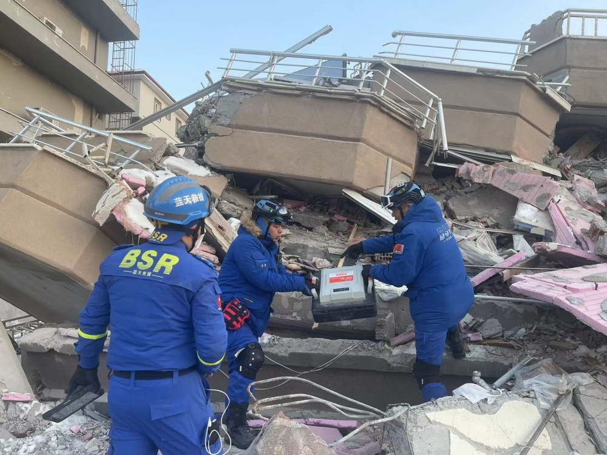

# 救援队土耳其亲历：有些年轻队员是第一次接触遇难者，需要心理疏导

北京时间18日晚上9时许，从伊斯坦布尔飞往广州的航班起飞。这架飞机搭载着蓝天救援队第一批前往土耳其进行地震救援的队员。

扬州队负责人郭震平告诉九派新闻记者，这是他第一次经历这么高强度的救援工作，“一般在国内，救援队员比较多，大家可以轮班。但是这次我们在国外没有人替换，那么多当地人在围观我们，我们必须得坚持下去，不放弃也是蓝天救援的精神。”

在阿德亚曼的一个救援点位，王涛带着广东队的队员们，花了20多个小时搜寻。在他看来，虽然大家的努力并没有换来发现幸存者，但找到遇难者，至少能给那些在废墟前寻找亲人的家属一个结果。

“出发前就做好了吃苦的准备，我们救援队的每一个人的想法都很简单，就是来救人，其他问题并没有考虑。”队伍中的八名女队员之一沈天梦说到。

_郭震平与队友使用雷达生命探测仪搜寻幸存者。图/九派新闻记者 王卓_

**【1】扬州队负责人郭震平：连续工作近30个小时，疲惫到产生幻听**

郭震平曾多次参与国内重大救援任务，但国际救援，这是第一次。

刚到土耳其马拉蒂亚时，他行李还没有放回营地，就被派去救援现场展开工作。

第一个救援现场，是90岁的老太太和一家五口被埋在废墟下。“我们用雷达生命探测仪探出了有微弱生命体征的信号，土方此前也探测过并且没有放弃，他们希望我们研究出救援的方案一起帮忙。”

搜寻废墟里的被困者，需要起重机械与人力挖掘相互配合，先用挖掘机或者牵引机移开表层的石板，再用人力一层层剥离碎石，然后用生命探测仪检测被困者的具体位置。47岁的郭震平和队友们在救援现场坚守了近30个小时，才找到遇难者的遗体。

“一般在国内，救援队员比较多，大家可以轮班。但是这次我们在国外没有人替换，那么多当地人在围观我们，我们必须得坚持下去，不放弃也是蓝天救援的精神。”这是郭震平第一次经历这么高强度的救援工作，他向九派新闻记者坦言，长时间的工作似乎导致队员们开始产生幻听，“如果不是有检测仪器辅助判断，我们都感觉好像有人在下面敲击求救，人已经疲惫到了这种程度。”

尽管每天都是在超负荷的状态下完成救援任务，但这段经历也给他留下一些印象深刻的瞬间。郭震平回忆，在阿德亚曼的深夜，土耳其人给正在救援的他送上了热红茶和热食并表示感谢，“尽管我们存在很大的文化差异，语言也不通，但是当地人的热情我能感受到。”

在救援现场，郭震平也非常尊重当地的风俗习惯，“之前在国内，我们会直接把遇难者抬出来，但是到这边我们会先和土耳其方沟通，尊重他们的文化传统。”面对每一个遇难者，他都会与队友一起脱帽致哀。

郭震平表示，人道主义救援不应该受国籍的影响，作为一线的救援队员，应该义无反顾地冲在前面，挽救每一条生命。

_王涛和队友在救援现场协助土耳其方救援队。图/九派新闻特派记者
王卓_

**【2】广东队负责人王涛：做事情善始善终，找到遇难者是给家属一个结果**

“闻到味道说明我们有任务要去完成了，我们能尽快让遇难者和自己的家人见面，让其入土为安。”王涛说。

他曾参加尼泊尔、缅甸等国家的国际救援任务，这次土耳其救援行动是他第一次带95后的队员冲在前线。在阿德亚曼，他们每天冒着遇到余震二次坍塌的风险在废墟里搜寻，仅用4天找到35名遇难者。

在救援现场，王涛也遇到过美国、英国以及越南的搜救队，“这些国家的救援队来现场看看有没有幸存者的可能性，如果找到幸存者的可能性很小，他们就会选择离开。”与这些队伍的处理方式不同，王涛更希望做事情能够善始善终。

王涛向九派新闻记者回忆，在阿德亚曼的一个救援点位，他们花了20多个小时搜寻并从废墟中转移遇难者，“当时被困者的家属还特意走到废墟洞口，跟救援队的翻译说我们太辛苦了，希望我们能休息一下。”王涛的回复是，会和当地的救援队伍一起继续搜寻下去，直到找到人。

“那个家属一直在旁边默默守候我们，很小心地和我们沟通，怕打扰到我们的工作。直到我们把遇难者的遗体转运出来，他瞬间就崩溃了。”在王涛看来，找到遇难者，至少能给那些在废墟前寻找亲人的家属一个结果。

在最后一个作业点，王涛发现了遇难的一家四口，男人用双臂守护妻子、儿子还有女儿，四个人紧紧拥抱在一起。“我在这里看到了很多男子，在生命的最后一秒都还在守护家庭以及爱人。”这让王涛十分感动，他告诉记者这是自己之前很少遇到的场景。

每天完成搜寻任务后，王涛都会和队员们对当天的工作情况进行复盘，并且给年轻的队员进行一些心理疏导，“有的新人是第一次接触遇难者，会出现心理抵触，这是一种本能的反应，我们不怪他们，所以会希望他们把自己的感受说出来，这样心里会好受一些。”

**【3】湖南队负责人金灿：当地需要普及防灾减灾等应急救护知识**

只要有救援小组需要雷达生命探测仪，金灿就会提着仪器出现在现场。

他会对救援点是否有生命迹象进行研判，给队员们评估疑似幸存者所在位置，给搜索小组的挖掘工作提供参考。

金灿告诉九派新闻记者，雷达生命探测仪可以探测到人的呼吸和心跳，但是回传的信号成像是否符合人的标准，需要进行人为研判。“一方面我们用仪器进行探测，另一方面我们在外面通过呼叫等方式，来看所探测到的生物的波频是否会出现变化。”他表示，搜寻幸存者不仅需要有高科技设备，还需要结合搜救者的救援经验来判断，不能忽视求生者在危急时刻的本能反应。

“这次救援行动让我感觉当地需要普及防灾减灾等应急救护知识，这也是我们国家需要进一步推进的。”在救援现场，金灿遇到的很多遇难者的姿态是一个求救的动作，“他们躲避的位置不对，在主震和余震之间，其实有一个短暂的逃生时间，可以通过那个时间段快速逃生，或者躲在黄金三角区，一个坚固的小空间里，这样可以给我们的营救争取更多的时间。”

他补充道，这次救援队遇到的难点是楼房的毁损强度比较大，很多建筑物是叠层式的倒塌，生存空间很有限，导致幸存者并不太多。金灿告诉记者，回国后他会进一步推广应急救护教育，从小学开始提高整个国民的应急救护素养。

**【4】海南队潜水组负责人沈天梦：救援现场遇到余震，很担心洞里的同伴**

85后的沈天梦是第一批救援队中八名女队员之一，在土耳其救援时，主要负责第一批救援队的信息回传、沟通协调工作，以及工作任务的留档备份工作。

“我从事水下救援和打捞工作已经多年了，但是地震救援是第一次参与。在前线的时候我很担心我的队友们，害怕二次余震到来的时候，他们没有逃出来。”沈天梦告诉九派新闻记者，来到前线总是会让她想起过往经历。此前，在一次潜水任务中，她的潜伴遇到急流，由于没有及时挂上引导绳，被水流卷走。

“每次他们出发前，我都会跟他们说一句注意安全、听从队长的指挥平安回来。”沈天梦回忆，在抵达阿德亚曼的第二天，自己和队友们在救援现场遇到了余震，很多人从废墟上撤离下来，“当时我们还有几个队友在洞里，我很担心他们，好在他们都及时出来了。”

沈天梦告诉记者，救援队里的男队员们非常照顾她，常常跟她说不要去前线，怕现场的场景让她接受不了。“但实际上我并不害怕这些，在水下我也遇到过打捞的场景，这些都是我的家常便饭了。”她表示自己在出发前就做好了吃苦的准备，“我们救援队的每一个人的想法都很简单，就是来救人，其他问题并没有考虑。”

**【5】贵州众志通讯应急救援中心负责人苏雅:向其他国家的救援队学习，不断提高救援效率**

苏亚曾经是一名消防员，在2012年5月份成立了贵州众志通讯应急救援中心。

在救援现场，苏亚为摇摇欲坠的房屋做支撑工具。他告诉九派新闻记者，做支撑是一个技术活，需要对随时可能倒塌的房屋进行安全评估，需要计算房屋的承受力，并且不同的房屋情况使用不同的支撑材料，而这些都需要长时间的训练积累经验，才能保证所做的房屋支护是稳固可靠的。

为此，他会自费上万元进行地震救援相关专业知识培训，以及实践模拟操作，“我几乎每个月都会参加一次专业的模拟训练，业余的模拟训练每年有5次，一年下来有15次的实操模拟训练。”

在土耳其，苏亚遇到了越南、美国、苏丹等国家的救援队，“其实语言不是问题，有时候一个眼神和动作，大家都能明白。”他也坦言，在现场能够感受到每个队伍的专业差异性，他喜欢与专业能力强的救援队“交锋”，从他们救援的方式中学习总结经验。

他还告诉记者，每次救援施救的场景他都会进行记录，用于后期复盘时找出不足，从而提高救援效率。

**九派新闻特派记者王卓发自土耳其**

【来源：九派新闻】

版权归原作者所有，向原创致敬

