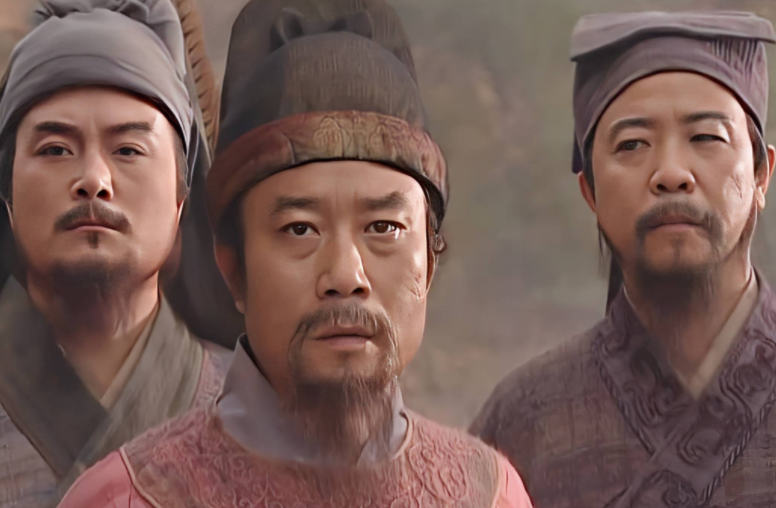

# 有家长称《水浒》毒害青少年应从课本清除，是水浒有毒，还是脑子有毒

近日，《水浒》相关内容是否应该从中小学课文和课外读物中删除的讨论，成了热点话题。有家长认为《水浒》有毒，足以毁灭“三观”，中小学生不应该读。

我想讨论的重点，不在于到底《水浒》是不是有毒，而在于当我们认为一本书有害的时候，我们是否应该以保护孩子为目的禁止阅读？

_电视剧《水浒传》剧照。图/视频截图_

**一切为了孩子？**

限制阅读，不是个新鲜事，秦始皇焚书坑儒家喻户晓，类似的事情罗马皇帝君士坦丁在公元4世纪也做过。书籍，作为传播思想的载体，在人类历史上不时会被视为洪水猛兽。

大范围限制阅读的主张，往往存在争议。有趣的是，禁止儿童和青少年书籍的做法却似乎更容易取得多方——尤其是家长——的共鸣。保护孩子，是很多限制阅读主张的初衷。

比如，塞林格（J.D.
Salinger）的《麦田里的守望者》因为描写了青春期叛逆，加之脏话和性描写，上世纪五六十年代在一些国家被禁。谢尔·西尔弗斯坦（Shel
Silverstein）的《给予树》因描述一棵无私的树，而在一些学校被禁止，因为成年人们担心它宣扬了一种不健康的、片面的爱和给予。甚至莫里斯·桑达克（Maurice
Sendak）的《野兽国》也在一些学校被禁止，因为它“鼓吹”儿童的恶作剧和不良行为。

这些书曾经让一些成年人忧心忡忡，唯恐教坏孩子，败坏风气。在时空转换后的几十年，谁又能想到，其中的每一本都成为儿童/青少年读物中的经典作品呢？这些担忧的成年人没说出口甚至没想明白的是，他们对孩子做了这样几个假设：孩子是弱的，没有判断能力；看书是一种被动接受，而不是主动思考；孩子接触“坏东西”就会变坏。

真的是这样吗？

**一书毁“三观”？**

我们总是忍不住担心：一旦放任不管，孩子会不会从书里“学坏”？这种担心不无道理，连研究者也一直企图找到两者之间的关系。然而，书籍与儿童行为之间的关系是复杂的。50年来的众多研究，仍然无法找到两者之间一锤定音的因果关联。当然，这也是因为阅读对行为产生的影响往往深远而长期，此类研究难度很大。

在一项针对脏话的研究中，研究者发现，小说人物脏话说得越多，他/她越受青少年读者的欢迎。这恐怕是个让家长揪心的结论。然而，研究者也做了一个重要的提醒：每个看书的孩子都是带着自己性格特点在阅读；如果你本身是一个充满敌意、酷爱暴力的孩子，你就更有可能去仿效脏话。也就是说，读书和孩子的行为问题存在某种相关性，但这种相关性未必是因果的：不是因为看了书才满嘴脏话，而是孩子本来就存在这种行为倾向。

著名的心理学家史蒂芬·平克对此作了一个高度总结。他说，我们消费的暴力娱乐比以往任何时候都多，但我们面临的血腥死亡风险却从未如此之低。这个推论，或许可以消弭一些成年人的焦虑。

不可否认，书籍对青少年的信仰、价值观和态度都会产生较大的影响。与此同时，我们需要提醒自己，书籍只是能够影响儿童行为的众多因素之一。“毁三观”
这个网络时代的常用语，让人们误以为一部电影、一本小说甚至一杯奶茶都足以摧毁一个人的世界观、人生观和价值观。这三种观念决定了一个人对于世界、生活和他人的看法，无时不刻影响我们的行为和决策。

美国著名学者，自然和人文作家迈克尔·波伦（Michael
Pollan）曾经在他的书中批评当今的营养健康学研究，他说：当下这种化学实验似的研究方法，让营养化学成分脱离了食物，食物脱离了饮食习惯，饮食习惯脱离了生活习惯；然而，它忽略了食物是一个极其复杂的带有深刻文化性的概念，有太多变量和复杂因素需要考虑。

借用迈克尔·伯伦的逻辑，这种认为一本书足以摧毁孩子“三观”的主张，其实把一本书的作用脱离开了孩子的整体阅读体验，把阅读体验脱离开了孩子的家庭环境，把家庭环境脱离开了社会文化。个人“三观”的形成是一个复杂的社会化过程，在塑造“三观”的过程中，很多因素都时时刻刻在发挥着决定性作用，包括：家庭背景、社会文化、个人经历和教育、哲学思想等等。

**怎样才是合理保护孩子？**

在《娇惯的心灵：“钢铁”是怎么没有炼成的？》这本书中，美国心理学家格雷格·卢金诺夫（Greg Lukianoff）和乔纳森·海特（Jonathan
Haidt）批判了现代美国大学文化，特别是“溺爱”或过度保护学生和回避有争议的问题的趋势。而这种现象绝非仅仅是大学生特有，这种保护主义至上的养育方式，在儿童和青少年时期就早已开始了。

两位作者认为，这种教育方式是由三个错误的假设造成的：

假设一：学生是脆弱的，他们的情感健康非常重要；

假设二：世界是极其危险和有害的；

假设三：我们应该让孩子避免任何思想上的争议、挑战或困难。

那些主张禁看《水浒》的成年人，对这三个假设是否似曾相识？

两位作者在书中有力地论证了这种过度保护的弊端——它直接导致言论和知识多样性的匮乏，让孩子与真实世界缺乏链接，减少了接触新思想和新观点机会，导致青少年抗压能力和应对技能下降，增加了焦虑和抑郁的比例。

而限制阅读的初衷，恰好完美地体现了这种保护主义至上的原则。就像每个成年人一样，青少年应该有权利阅读，甚至应该自己决定所读的内容，即使书中所表达的思想和观点可能存在争议。与其限制阅读，不如展开建设性的对话和辩论。

一百单八将算是好人吗？没有完美好人的小说算是好小说吗？他们的结局还有其他可能性吗？《水浒》和金庸小说哪个更好看？

作为家长，我会让自己的监管范围仅限于设置底线。童年时我对《聊斋》里画皮的恐惧，至今仍记忆犹新。但让人宽心的是，这种恐惧很多时候是一过性的。一方面家长可以对这些内容做适当筛选，但另一方面，我们更需要寻找恰当的时机，在跟孩子的对话中曝光这些阴暗角落。有些话题我们注定无法逃避，有些恐惧我们每个人都要学着去面对。一个幸运的孩子不是永远生活在彩色泡泡中的孩子，而是在面对恐惧的时候，有守望相助的成年人在身旁的孩子。

**《水浒》有毒？**

一千个人心中就有一千个哈姆雷特。《水浒》毒不毒，每个人有自己的解读。

《水浒》常被诟病的两大原罪不外乎丑化女性加之充斥暴力。但若把这两项罪状作为量尺，中国的古典作品，哪个还能有胜算？指望一个文学作品完全无害，本身就是个伪命题。《小红帽》充满暴力场面和性暗示，《海的女儿》鼓吹不平等的爱情观，《爱丽丝梦游仙境》的故事荒诞、思想颓废。看书不是拔毒。一本书为何值得一看？这才是我们应该关注的问题。

我无意探讨《水浒》的文学价值。古有金圣叹，现有毕飞宇，都对《水浒》的文学价值作出了极高的评价。毕飞宇对于林冲夜奔做了如下分析：“在美学上，说空话有一个专业的名词，叫‘席勒化’，把思想性落实到艺术性上，也有一个专业名词，叫‘莎士比亚化’，联系到林冲这个人物来说，如果施耐庵只是拍案而起、满腔热诚地‘安排’林冲‘走’上梁山，我们说，这就叫‘席勒化’。相反，由白虎堂、野猪林、牢城营、草料场、雪、风、石头、逃亡的失败再到柴进指路，林冲一步一步地、按照小说的内部逻辑、自己‘走’到梁山上去了。这才叫‘莎士比亚化’。在‘莎士比亚化’的进程当中，作家有时候都说不上话。但写作就是这样，作家的能力越小，他的权力就越大，反过来，他的能力越强，他的权力就越小。”

这是一段多么精辟入里的描述。毕飞宇不仅给我们提供了一个美学理论工具，引导我们来品味施耐庵的写作才华，他更细致入微地分析出了“暗中之明，明中之暗……草蛇灰线，马迹蛛丝”的写作手法。

对于中小学生而言，他们或许无法体会《水浒》在文学史上的意义，难以评估第一部白话文小说的历史价值，然而这种隐于不言、细入无间的文本语言、人物刻画和情节推进，一旦读懂，带给他们的体验无异于文学感官上的觉醒。

《水浒》讲的一定不是英雄的故事，甚至不一定是好人的故事。在这里，有朝廷，庙堂，江湖，阶级，家庭；有私利，算计，背叛，懦弱，诡计，人情，道义。就像浙江省教育厅人士指出的，这其中，有“庙堂失序与江湖理想”“个体失路的偶然与必然”“快意恩仇与暴力滥杀”——这里每一个命题，都可以打开一个广阔的讨论空间。

我们不会让孩子吃不健康的食物，自然而然，我们也不想让孩子接触“不健康”的观点、书籍、艺术作品。然而我们忽略了一点，不健康的食物的确会对身体造成伤害，而“不健康”的书籍可能会培养出更强健的头脑。

在《娇惯的心灵》书中，两位作者说了这样一段话，我深以为然：

我不希望看到你在思想上总是安全无虞。

我不希望你在情绪上总是安全无虞。

我只希望你变强大。

这两者大不相同。

我不会为你在丛林里铺平道路。你需要穿上靴子，趟平困境。

我不会把健身房里面的哑铃都拿走，那才是健身房存在的意义。

人生，就是健身房。

本文仅代表作者个人观点

作者系美国范德比尔特大学教育学博士、K12教学体系研发者

发于2023.2.20总第1080期《中国新闻周刊》杂志

杂志标题：论《水浒》和“三观”

作者：赵晴

