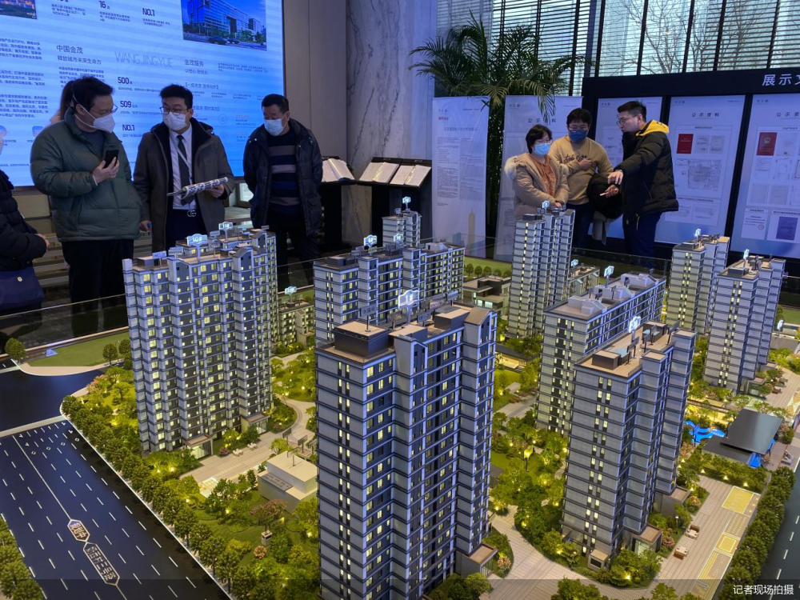
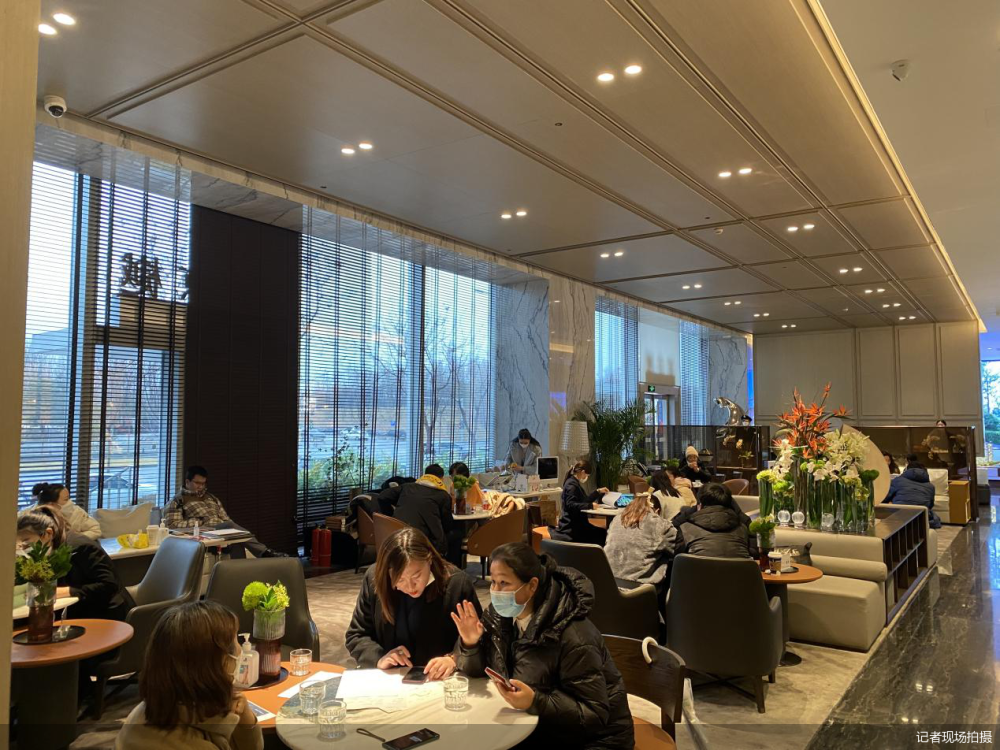
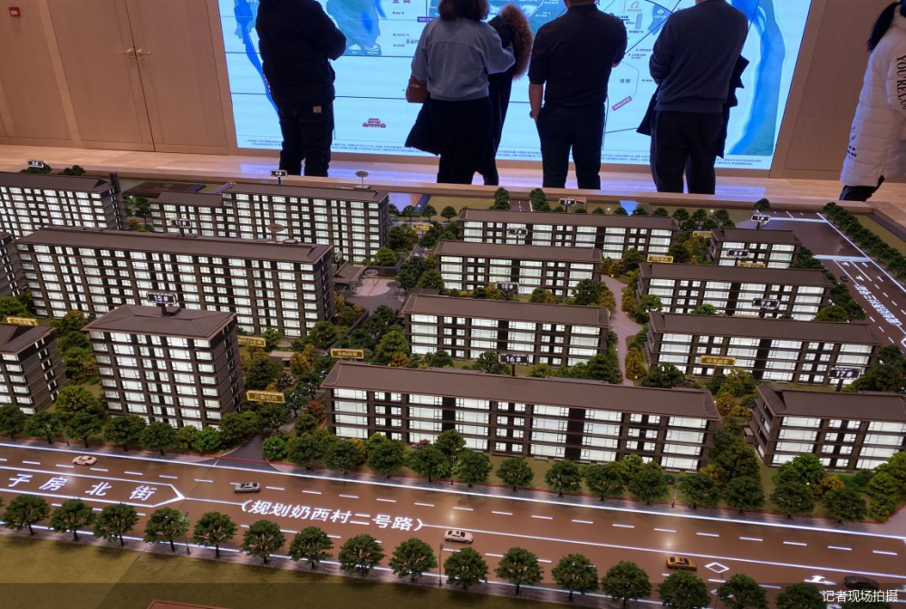

# 销售喊出“俩月卖了去年一年的量”，北京新房市场真暖了吗？

春节过后，关于一线城市新房回暖的声音越来越多。半个月以来，北京商报记者调研北京多个新房项目发现，开发商此前的打折、促销几乎销声匿迹，城六区的热点项目确实出现售楼处人头攒动的局面，哪怕在2月12日下雪的情况下，奶西、东坝等热门片区的项目人流依然不小。在销售人员口中，这是新房市场积极的信号。更有项目销售人员放话：“哪怕有春节因素的影响，最近俩月已经卖了去年将近一年的量。”

对于北京新房这波回暖行情，无论是行业专家还是一线销售，都表示认可，但对持续性存在分歧。大部分从业者认为，本轮释放主要是税费优惠、疫情褪去、经济复苏、置业情绪修复等多重因素叠加，但“需求就那么多”，购房者的心态也更健康。在高门槛的条件下，全年曲线如何走出，还要看后续的支持政策。

**“杂物间都被改造接待”**

“年后平均每天案场接待能够达到五六十组客户，而且以真实意向客户居多，整体成交周期也很短。”2月12日，北京春节后的首场降雪没能阻挡看房人群。张宜伦，是北京市朝阳区奶西片区某央企在售项目的置业顾问，据他介绍，因最近到访客流回升，原本的茶歇区也进行了扩容，他接待记者的位置之前是放置杂物的。

作为一名置业顾问，他承认眼下的新房市场确实“挺火”，有如此热度，除了项目本身颇具竞争力外，疫情的褪去、经济复苏的预期、购房者置业情绪的修复都是原因。“之前犹豫观望的，现在也愿意下场走一走，交易节奏自然整体回升。”

问及与之前状况的对比，张宜伦给记者指了指正门前台的摇号机，据说这是疫情最困难时的产物。“当时十几个销售等一组客户，有时候两三天才来一组，不摇号不行的，都是到访客户，分给谁都不公平，摇号产生其他人也没有怨气。”据张宜伦透露，尽管当天下着冬雪，但已经卖出去了五套，作为一个大户型的改善盘，这是一个不错的成绩。

“除了上面说到的大环境改善，政府的退税政策在这一波起到了很关键的作用。”张宜伦提到的退税政策，即2022年9月财政部、税务总局发布的《关于支持居民换购住房有关个人所得税政策的公告》，明确在2022年10月1日至2023年12月31日期间，对出售自有住房并在现住房出售后一年内在市场重新购买住房的纳税人，对其出售现住房已缴纳的个人所得税予以退税。其中，新购住房金额大于或等于现住房转让金额，可以享受个人所得税“免单”。退个税政策出台降低了置换成本，卖一买一的改善需求开始增多。

**年前裁人、年后领导自己接待**

“需求多了不全是春节后突然重启，节前的铺垫也很多。”2月18日国家统计局发布1月房地产相关数据后的第一个周末，在朝阳区的另外一个新房供应热点片区——东坝，北京某国企旗下TOD项目的销售人员关驰告诉北京商报记者，春节后售楼部的集中到访与春节前甚至疫情最为严重的12月，自己团队线上沟通有很大关系。“好多客户都是反复比较、经历了疫情的洗礼，春节后才下定决心的。”在关驰眼中，所谓的松绑政策没落地等客观因素，并没有抹掉大家买房的欲望，积压需求正在逐步释放。

虽然当天是关驰接待了记者，但他的另外一个身份是该项目的案场销售负责人。因年前不“景气”，该项目销售人员裁减了一批，年后到访人数多的时候他就需要临时顶班。“之前有多冷清，举个例子，我们公司特别卷，原来每年都‘连市’，今年春节是我进入公司四年多第一次休假。”

**“两个月就卖了去年一年的量”**

市场的反弹并非只有供地与新房销售双大户的朝阳，曾经的新房红海丰台也有了起色，甚至要更早一些。

“我们项目主要以改善客群为主，目前大户型已经基本清盘了，余下的小户型也处于顺销阶段。价格方面没有什么大的变动，主要还是市场变好了。”徐乐是丰台岳各庄板块某项目销售，据他介绍，春节前看房的人就多了起来，为此领导们在多番商量后决定连市。“哪怕有春节因素的影响，最近俩月已经卖了去年将近一年的量。”

但并不是所有人都有这种“运气”。虽然市场的反弹来得有些突然与集中，但关驰很谨慎地认为当前北京楼市仍是“买方市场”，并且最大的变化是项目的竞品不再局限于某个地段或片区，而是扩大到整个北京市。“交通的通达、配套的完善让购房者选择余地变大，这对于我们这种刚需盘最为困难。”关驰直言，目前项目的复苏还没到大热的程度，接待好每一个客户，一单一单吃是当下的任务。

**促销消失、价格倒挂成卖点**

售楼处热度回升，按照一般操作是打折、促销活动居前，记者此次走访发现，多个新房项目并未设置促销活动，仅有老带新助力奖励以及首付款按时到账的9.9折优惠。项目销售价格也基本围绕指导价浮动，边角房源低于指导价，就会在优质房源上找补回来。

仿佛是约定好的一般，除自身品牌和周边配套加持外，目前北京多个新房项目的最大卖点是“价格倒挂”。“与周边的二手房形成明显的价格倒挂，买到即赚到。”这是多个项目销售不断强调的。以上述提及的朝阳改善项目为例，该项目8万多元的销售指导价，与周边10万+的二手房已经有价格上的差距。

“指导价的管控，开发商利润受到挤压，出于利润的考虑，打折促销手段被暂且搁置。至于价格倒挂问题，是否能与周边高价二手房站在同一纬度上比较，还需琢磨一番。”地产分析师严跃进直言。

**小阳春前置 曲线尚未确定**

诸葛找房数据研究中心高级分析师关荣雪称，进入2023年，楼市交易市场将摆脱疫情的影响，加之全国政策端持续释放改善信号，市场将逐渐复苏，前期积压的购房需求也将会逐步释放，加上北京楼市本身抗风险能力以及价格涨势稳健，置业情绪及购房需求仍然相对饱满。

诸葛找房数据研究中心监测数据显示，2023年第6周（01.30-02.05）、第7周（02.06-02.12）北京新建商品住宅成交量呈持续上升态势，第7周新房成交1326套，较上周760套的成交量大幅上涨74.47%。“但由于北京区域内的购房政策仍然保持较为谨慎的态势，今年小阳春多是靠前期积压购房需求集中释放的推动，因此不会持续太久，成色很大可能会稍好于2022年同期。”关荣雪表示。

在合硕机构首席分析师郭毅看来，多重因素作用下，今年北京楼市小阳春相较于往年来得还要早。“市场好坏都受到消费预期的影响，北京楼市这样一个好的开局，短期内会有比较不错的表现，但最终还是需要政策放松的支持，这样才能保持一个稳定向上的曲线。”

北京商报记者 王寅浩

**特写：“是现房卖吗？”**

项目品质、周边配套、交通通达度等因素不同，购房者对项目的要求也各不相同，但共同点是在多个项目案场，本轮购房者比以往更关注交房时间的问题。售楼处现场，可以看到追在后面问“交付”、问“现房”的购房者，销售人员也经常会把现房、准现房等词汇挂在嘴边。“之前很少遇到这种情况，最近提出‘现房’问题的购房者特别多，我们要耐心解释期房售卖以及保交付问题。”多位项目销售人员告诉记者。

学校什么时候建成？地铁什么时候通车？正式交付的时候周边配套能保证齐全吗？最后没能兑现怎么办？这些承诺能不能写在合同里？……在不少买房人眼中，期房售卖往往带来的是自身的弱势地位，写在纸上的东西，不如“所见即所得”来得实在。尤其是经历2022
年楼盘停工烂尾风波后，严重影响了购房者的置业信心，也使得部分购房者安全感的缺失。

李先生一家，是记者在奶西项目遇到的卖一买一改善客群，“要么现房，要么保证一年内交付”是他们反复强调的关键诉求。“销售告诉我们，买期房可以任意选择喜欢的户型、楼层，但现在的新房项目基本都在偏远区域，周边配套也基本是在建状态，未来具体状况如何难以把握，2-3年太不保底了。买期房可以节约成本，但我们家是置换，卖了还要租房，一边交房租，一边还房贷，时间成本也是问题。”李先生说，现在政府也有一批配了现房的地块，但大部分还没有进入销售周期，如果实在挑不到好的新房，打算去看一看近两年的次新房。

“有条件的可以进行现房销售，继续实行预售的，必须把资金监管责任落实到位，防止资金抽逃，不能出现新的交楼风险。”1月17日召开的全国住房和城乡建设工作会议，已明确现房销售的可能性。近期山东、安徽、河南、四川等四省也陆续开启了现房试点，鼓励有条件的地方先行先试。

北京在此前的集中供地中也加入“现房”调节器。一方面是通过竞现房销售面积，对优质地块的价格上限进行调节，助力高品质住宅落地；另一方面也是防范烂尾风险，无形中设立了一个“高门槛”。

“购房者的疑虑，也说明楼市信心恢复是一个艰难而缓慢的过程。”郭毅称，需要特别注意的是，本轮小阳春虽然较以往有所提前但后续持续性具有一定阻碍。目前宏观环境还处于爬升期，购买力“脆弱”尚不具备持续性。此外，市场下行的积压情绪还未完全消除，北京目前可享受到的刺激政策提振有限。

北京商报记者 王寅浩

