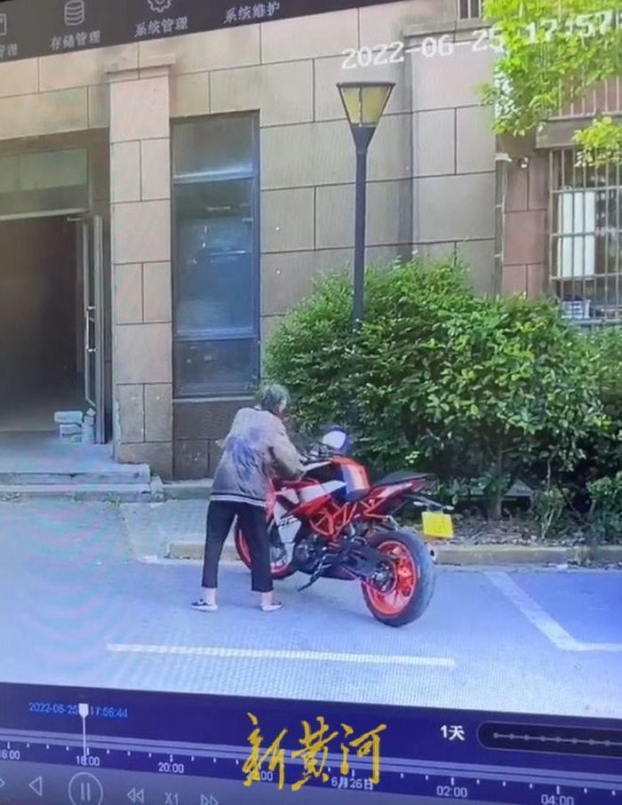
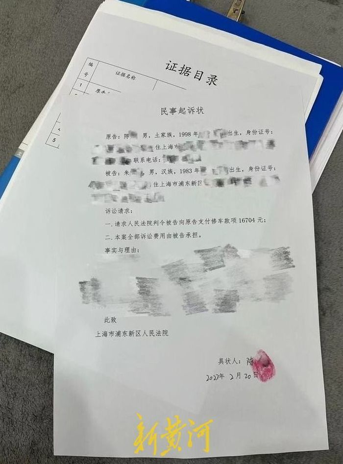

# 上海老人推倒摩托车后续：车主已正式对老人继承人提起民事诉讼

2月20日，新黄河记者从车主陈先生处获悉，他已经正式对老人继承人提起民事诉讼。据新黄河此前报道，根据上海市浦东新区人民法院的刑事裁定书，因涉事老人于1月24日去世，2月5日案件终止审理。

_老人推倒摩托车
视频截图_

根据陈先生提供的民事起诉状，此次民事诉讼请求为老人继承人支付陈先生修车款16704元。“虽然老人去世追究不了刑事责任，但不会人死债消，民事部分依旧可以追究继承人”。陈先生说，截至目前老人继承人仍未露面。

_民事起诉状 受访者供图_

据新黄河此前报道，2022年6月25日，陈先生将摩托车停放在小区楼栋门口后上楼收拾，傍晚却发现自己的摩托车已经倒在地上，后通过监控发现，摩托车被一名老人推倒。经鉴定，摩托车损失高达16000多元。车主陈先生报警后，2022年8月，当地警方对老人进行了精神鉴定，结果为老人患器质性精神障碍，行为能力受限，但具有限定刑事责任能力，有受审能力，后当地警方以寻衅滋事为由立案调查。之后公安机关将案件移交到检察院，检察院向法院提起了公诉。2023年1月24日，涉事老人去世。

新黄河客户端记者：李震 编辑：孙菲菲

