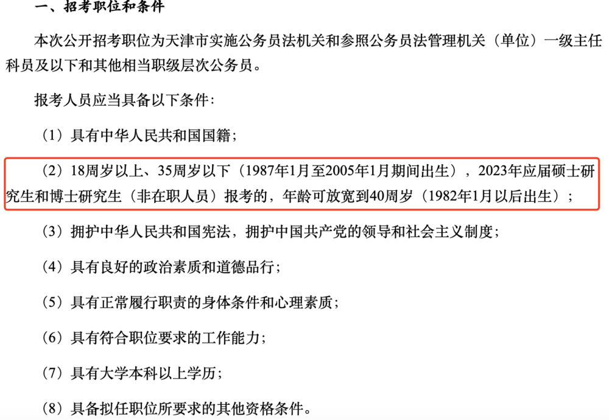
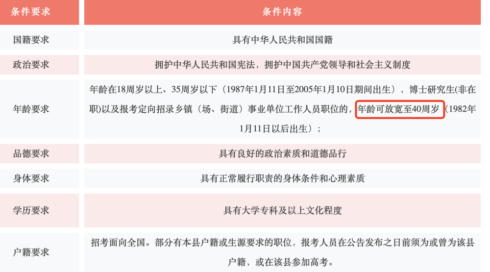

# 公务员省考招录有变化：10省份放宽35岁年龄限制，多地专设应届生报考职位

近年来，公务员考试持续升温。今年，公务员考试有了一些变化。

目前，全国已有近30个省份启动了2023年度公务员省考招录，其中27个省份将在本周末拉开考试的序幕。

相比于2022年，多个省份今年公务员扩招比例超过50%。红星新闻梳理发现，今年省考政策对应届毕业生的招录更加倾斜，不少地区专设岗位仅对应届生开放，且“三不限”岗位也相应增加。

此外，备受舆论关注的报考公务员“35岁及以下”年龄门槛限制，今年多地有了变化。据红星新闻不完全统计，近些年已有约10个省份将部分岗位年龄调整为40周岁以下。

_报考公务员 据新华网_

省考扩招：省考压力小了不少 多地扩招比例在50%以上

新年过后，多地公务员省考报名陆续进行。红星新闻梳理发现，约27个省份将在本周六迎来笔试。从目前的招录信息看，今年省考招录总人数接近20万，同比增长16%。相较于国考3.71万个招录名额，总报名数突破250万的激烈竞争，省考压力似乎小了不少。

无论是国考还是省考，近些年来“考公一族”队伍都日趋庞大。2023年国考连续4年扩招，招录人数和报名人数均创下近10年新高。就目前情况来看，“扩招”同样是今年省考一大关键词。据中公教育统计，2023年省考中，约有27个省份对招录人数进行了扩招。

其中，广西、甘肃两地招录增幅较大：广西2022年总共招录公务员4368名，到2023年增长至6781名，同比增长约55%。甘肃去年计划招录公务员2364名，今年计划招录超4000名，同比增长约80%。此外，云南、内蒙古扩招比例也均在50%以上。

除了招录人数明显提升，加入扩招行列的省份数量也较以往增加不少。红星新闻梳理2022年和2021年招录情况发现，尽管每年都有省份扩招，但扩招规模和幅度都远低于今年。

如2021年，仅有13个地区的省考有扩招，其中仅云南扩招增幅超50%；2022年，扩招省份增至18个，但未出现扩招增幅超80%的现象。

“近年来中国就业形势变得严峻，特别是大学生就业压力不可忽视。所以各地政府要增加一些公考岗位，来缓解大学生就业难问题。”国家行政学院教授竹立家在接受红星新闻记者采访时这样说。

在竹立家看来，扩招的主要原因除了缓解社会就业压力，另一方面则在于各地要发展经济，带动行政机关功能扩大。“比如一些地区过去经济发展落后，现在要恢复发展，就需要新生力量补充。”

年龄门槛：10省份面向应届硕、博 部分岗位年龄放宽至40周岁以下

于考公人员而言，除了扩招这一好消息外，放宽一些岗位的年龄限制，也同样是一大喜讯。

据红星新闻不完全统计，在20余个已公布公务员报考信息的省份中，河南、贵州、天津、湖北、江西、广西、四川、云南、重庆、内蒙古10个省份，近些年放宽了部分岗位的年龄限制。但这些地区报考年龄限制的放宽，多面向应届毕业硕士研究生和博士研究生（非在职）。

河南今年省考公告就写明，除对年龄有特殊要求的职位外，对2023年应届硕士、博士研究生（非在职人员），放宽到40周岁以下（1982年1月以后出生）。而过去年龄限制通常为35周岁以下。

对此，河南省公务员局一位工作人员回应红星新闻称，今年报考年龄限制原则上还是35岁，不过确实有部分岗位放宽了年龄限制。至于放宽年龄限制的原因，该工作人员表示因为具体职位需求变动了。至于未来是否会继续进一步放宽年龄要求，该工作人员表示尚不确定。

除河南外，天津、内蒙古、广西、重庆等地，也在近些年调整了要求，在公务员招考中指出，2023年应届硕士研究生和博士研究生（非在职人员）报考的，年龄可放宽到40周岁（1982年1月以后出生）。

_天津公务员招录公告_

江西则放宽了博士和定向招录人员的年龄限制，要求博士研究生（非在职）以及报考定向招录乡镇（场、街道）事业单位工作人员职位的，年龄可放宽至40周岁（1982年1月11日以后出生）。

_江西公务员招录公告_

云南提出，对于艰苦边远地区的招考职位，采取降低学历要求、放宽专业条件、不限制工作年限和经历、单独划定笔试合格分数线等措施，适当降低进入门槛。内蒙古则新增了“优秀嘎查村（社区）党组织书记”和“艰苦边远地区苏木乡镇事业编制人员”职位，这两类职位报考年龄放宽到40周岁以下。

“公务员招录并不是所有岗位都放宽年龄限制，原则上放宽到40岁的，还是极少数特定岗位。”江西省公务员局一名接线员告诉红星新闻记者，这些岗位之所以放宽年龄条件，大多是乡镇事业单位，而这些岗位报考的人一直较少。放宽年龄限制的这些岗位，也仍有一定的身份、条件要求，报考者需要符合要求。

专家观点：40岁招录条件是合理的条件设置

对于上述地区放宽公务员招录年龄限制，在竹立家看来：“这体现了国家在扩大就业上的决心。”他分析指出，过去公务员录用要求35岁及以下，导致很多普通单位也争相效仿设置这样的年龄门槛。当下公务员考试逐步放宽，能为企业招聘提供借鉴。

红星新闻记者查阅《公务员法》发现，在报考年龄限制上，仅要求为年满18周岁，并未对招录年龄上限给予规定。但在《公务员录用规定》中则明确，报考公务员年龄应当18周岁以上，35岁以下。

在竹立家看来，公共机构特别是政府性岗位招录打破年龄限制，拓宽年龄较大人群的就业渠道，做到了就业的公平公正，杜绝了年龄歧视的形成，具有重要意义。

实际上，公务员招录年龄限制问题也通常是全国“两会”上备受代表、委员热议的话题。去年全国“两会”上，时任全国人大代表、温州大学研究员蒋胜男就提出“解除35岁职场恐惧，修订国家公务员报考年龄限制”的建议。

2022年，针对放宽公务员报考35周岁年龄限制的建议，浙江省公务员局曾回复称，《公务员录用规定》明确，报考公务员年龄应当18周岁以上，35岁以下。经省级公务员主管部门批准，可以适当调整。

竹立家补充称，40岁的招录条件对公共机构来说是合理的条件设置。考虑到部分岗位的专业性、特殊性，并非所有职业都不该设置年龄招录上限。

引人关注：多地专设应届生报考职位 报名毕业年限延长

公开数据显示，2022年我国高校毕业生人数首次破千万，达到1076万，同比增加167万，考公成为更多应届毕业生的选择。今年的省考招录条件，也对应届毕业生有明显的倾斜。

红星新闻记者注意到，除了对硕、博身份的年龄要求放宽外，多地省考的大部分职位，都对应届高校毕业生开启了通道。如湖北专门安排4406个岗位给2023年应届普通高校毕业生，其中80%以上的职位，应届普通高校毕业生都可以报考。

在今年扩招涨幅最高的甘肃，超97.8%的职位对工作经验没有要求，这意味着应届毕业生都能报考。同时，还专门设置了2208人、1866个职位仅限应届毕业生报考，占总人数的51.69%、总职位数的51.41%。

吉林、浙江等，半数以上职位限定2023年应届毕业生报考。此外，湖北、浙江等还明确，2021年、2022年普通高校毕业生，也可报考身份要求为2023年普通高校应届毕业生的职位。

除了为应届毕业生“量身定制”岗位外，对学历要求也在不断降低。河南省公务员局在公告中就提到，平等对待各种学历人员，报考者只要持国家承认的学历，符合职位要求的资格条件均可报考。

山东则明文要求，对非全日制研究生与全日制研究生同等对待，对国内高校毕业生和国（境）外留学人员一视同仁；同时加大技术技能人才招录力度，为职业院校毕业生提供平等竞争机会。

内蒙古、甘肃等今年省考招录中，不限专业、不限学历（大专以上）、不限户籍的岗位增加了不少。

竹立家对此举表示赞同。他认为，党政机关招录公务员带头消除学历歧视，能更好地引导社会在人才选拔上建立以能力和岗位适合为导向的人才观念，扭转过度追求学历的错误观念。

红星新闻记者 杨雨奇 吴阳 实习生 李逸凡

责编 官莉 编辑 彭疆

