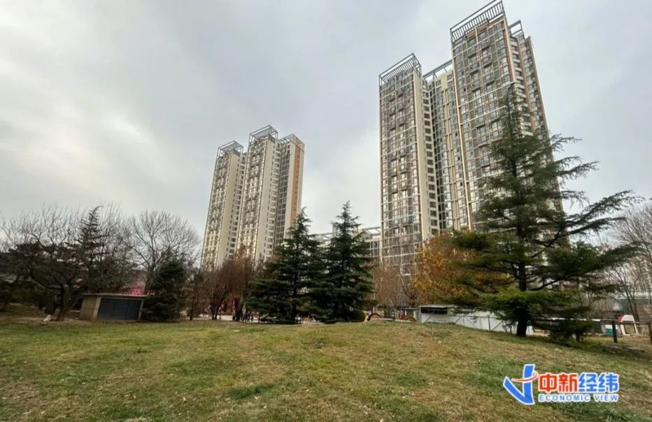

# 北京楼市小阳春：刚准备入手，业主反悔不卖了

来源：中新经纬

准备在北京买房的郭鹏（化名）有点郁闷，他春节前看中一套并不算优质的房源，当他思索再三准备入手时，业主却不卖了，因为业主觉得市场正在好转。房产经纪人也告诉他，现在看房的人正在增多。

春节过后，北京、上海、深圳、南京、武汉等多地都传出房地产市场回暖的消息，楼市似乎在一夜间就由冷转热。市场的急剧变化，让很多从业者都有些措手不及，北京一位房产经纪人对中新经纬说：“回暖速度太快，我们也觉得有些突然。”

中新经纬采访发现，春节假期后，北京二手房带看量的增长比较明显，在这一先导指标的带动下，2月1日-15日，二手房网签量环比1月同期增幅超30%。目前看，房价依然比较稳定，没有出现大幅上涨的情况。业内人士认为，北京楼市已进入“小阳春”状态，但能否持续则要看购房政策是否会变化。

**有业主反悔、加价**

春节后，陆萍（化名）开始集中看房，感受到了北京市场逐渐变热的过程。2月12日上午，北京下起小雨，但当她赶到石景山区一个刚开始蓄客的改善型楼盘时，售楼部已经有不少看房的人。她对中新经纬说：“虽然没有坐满，人还是比较多。”

**陆萍称，当天，该楼盘的置业顾问都有些忙不过来，要在售楼处等一会儿才有人接待与讲解。而且，即便是正在接待顾客，置业顾问的手机也会时不时响一下，接听其他顾客的电话咨询。接待她的置业顾问说，11日当天，该楼盘的排卡量就有100多位。**

“这个楼盘的置业顾问比较自信，不太担心客源不足，楼盘也没有什么折扣或优惠活动。置业顾问介绍，如果排卡客户超过房源量，还要摇号。”陆萍称，该楼盘的均价达到7.5万元/平方米，最小户型是113平方米，单价和总价都不低。不过，并非所有楼盘都火热，她看的另一个楼盘是由同一个开发商开发，虽然已经开盘半年，目前还是有不少房源可供选择。

_▲北京一住宅小区。来源：中新经纬
薛宇飞 摄_

除了新房，陆萍也看了不少二手房。她从经纪人口中得知，春节假期后，他们的带看量增加不少，成交量也有一定增长。
**目前，陆萍看了大概30套二手房，其中有10套她比较中意，也是她认为比较优质的房源。她发现，这10套房源中，已经有两三套在近几天成交，“我的感受是，交易速度加快了。”**

优质房源交易速度加快的情况，李敬（化名）也感受到了。在某房产交易平台，李敬关注了100多套北京的二手房，这些房子中有很多都是被该平台列入所在片区“捡漏榜”“热搜房源榜”“成交小区榜”，在一定意义上说，属于价格合适、关注度高的好房源。

他发现，关注的二手房源中，有几套已经在近期集中“停售”。根据该平台的规则，“停售”的原因有两种，一种是被卖出，一种是业主不再出售，而且，前者的可能性更大。李敬对中新经纬说：“我关注的房源中，断断续续都会有一些被标注为‘停售’，而这种情况在近段时间变得越来越频繁。”

郭鹏已经看了两年的房子，从环北京地区的燕郊、固安，到北京的石景山、丰台、海淀，至今没有定下来。2022年年底，他看中丰台区泥洼地铁站的一套二居室，这套房源优缺点都比较明显，优点在于总价低、带电梯、位置较好，缺点是顶层、西户型、小区老旧。年前，他与业主谈过一次价格，没有成功。

经过2023年春节假期的考虑，他决定购买这套不算优质的房子。但是，当他再找到经纪人询问这套房源时却被告知，
**业主已经不打算出售，原因是他觉得北京房价正在走强。**

今年2月5日，朝阳区的一位经纪人向郭鹏推荐了弘善家园一套420万元二手房。没想到的是，因为采光、装修好，这个“两年不出一套”的房子被购房人抢购。2月8日，经纪人告诉他，该房源最终加价11万元，以431万元成交了。

**“回暖太突然”**

对于北京楼市的变化，中新经纬于近日进行了走访。

房山区，是北京房价相对较低、距离主城区较近的区域，但由于多种原因，外界对该区的房价并不是很看好，因此，该区近几年的市场相对冷淡。即便是这样，专注于房山区房产交易的经纪人宋娟娟（化名），也察觉到近期的市场动态。

宋娟娟说：“我们之前也估计，这么多利好楼市的政策落地后，北京市场会回暖，
**但没想到的是，刚过完春节，咨询的客户明显增多。回暖速度太快，我们也觉得有些突然。”她称，目前只是带看量起来了，价格没有什么变化。**

_▲北京朝阳区住宅。来源：中新经纬
薛宇飞 摄_

中新经纬还走访了朝阳区十里堡区域，该区域的房产经纪人白天明（化名）称，由于当天是工作日，看房的客户不算多，但在晚上6点他还要接待一位顾客，“现在一些客户都是下了班之后看房。”

白天明称，春节后的两个周末，他们都忙不过来，门店里一个闲着的经纪人都没有，都要出去带客户看房。他说：“我们公司要求每个经纪人每月带看量不低于8组客户，而截止到2月16日，我已经接待了17组。我也没想到带看量会增加得这么快。”

**我爱我家研究院向中新经纬提供的数据显示，春节假期后20天（2023年1月28日-2月16日），我爱我家北京区域二手住宅买卖带看量环比节前20天（2023年1月1日-1月20日）增长超八成，同比去年节后20天（2022年2月7日-2月26日）增长超一成，节后带看需求较节前回升速度较快。**

白天明所在公司是北京最大的房产经纪公司，在上周日（2月12日），一天就成交了652套二手房，加上上周六（2月11日）的成交，两天合计超过1100套。要知道，北京2022全年二手房共成交约14.24万套，日均不足400套。

我爱我家研究院数据显示，春节假期后20天（2023年1月28日-2月16日），我爱我家北京区域二手住宅交易量环比节前20天（2023年1月1日-1月20日）增长超一成，同比去年节后20天（2022年2月7日-2月26日）增长超三成。

中原地产首席分析师张大伟对中新经纬分析，目前北京房地产市场并未出台刺激政策，本轮市场回暖多是因为学区房交易驱动，家长要赶在入学前办理好房源过户，因此需要提前购房，推动了换房需求，进而让整个市场的交易活跃。

**据北京市住建委网站数据，2月1日-15日，北京二手房共计网签6779套，环比1月同期的5152套增加了约31.58%。张大伟称，北京是一个以二手房交易为主的市场，二手房月网签1.2万套是楼市“枯荣线”，月网签高于1.2万套，市场会保持平稳，高于1.5万套的话，价格可能会走强；月网签低于1.2万套，市场会比较低迷，更低的话，价格则会下调。**

**价格依旧平稳**

上述受访的购房人、经纪人均表示，虽然北京带看量、成交量有所增加，但价格没有变化。

看了一些新房、二手房后，陆萍觉得，房价暂时没有上涨，整体比较稳定。对于买卖双方的议价空间，她认为，现在有关北京楼市回暖的消息比较多，业主们的底气可能更足了，谈价空间变小。陆萍并不着急马上入手，她要继续看更多区域的房源，对北京市场有了整体了解再买入。

白天明说：“去年市场最冷淡的时候，每月二手房成交量只有八九千套，客户谈价空间比较大，350万元的房子，谈下来10万元甚至更多也是有可能的。现在就没有那么大，可能就5万元左右。”

白天明判断，在带看量增加的刺激下，北京市场进入到了“量增价稳”的状态，如果交易量能一直维持较高的水平，涨价也是有可能的。“当然，价格的变化，要看未来一段时间的市场热度。”
**我爱我家研究院分析，随着经济持续恢复向好，春节假期后北京二手住宅市场正在逐渐复苏，回暖速度有所加快。市场回温较快的同时，二手住宅交易价格十分平稳。**

2022年以来，全国有相当多的城市都出台了促进房地产市场健康发展的举措，取消或放宽限购、限贷的政策也是层出不穷。到目前为止，北京成为少数没有在购房政策上出台过大刺激政策的城市之一。

不过，在今年1月，北京市政府印发了《2023年市政府工作报告重点任务清单》，在232条提到，完善“一区一策”调控措施。该表述引发外界关注。到2月，北京市场就传出消息，房山区要放宽楼市调控举措，实施“认房不认贷”政策。2月17日，房山区房屋交易中心对媒体表示，消息不属实，目前没有落实该政策，不要听信市场机构过度解读。

宋娟娟早就听到了这则传言，她也真假难辨。她认为，一些要购买二套房的客户对放松调控政策比较期待，若能落地，他们的首付比例就会明显降低，对市场也会产生很大的刺激作用。

对于北京要放宽楼市调控政策的消息，白天明认为，这不一定是好事。“北京并不缺购房需求，如果放宽二套房购房政策，房价可能就要上涨了。个人认为，调控政策不能大幅松动。”

张大伟称，从当前成交情况看，北京房地产市场已经进入“小阳春”状态，预计2月份二手房网签量能达到1.5万套，到3月份可能还会进一步增加。至于之后能否继续持续，则要看政策的优化程度，如果二套房政策出现调整，市场可能会持续升温，反之则转为平淡。“为了不过于刺激市场，北京二套房政策应该不会大幅度松动，存在一定程度的调整空间。”

