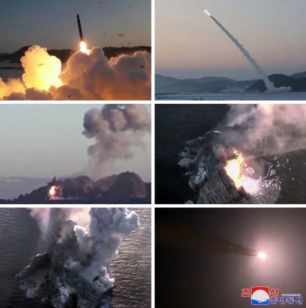

# 朝鲜称今发射2枚火箭弹，“仅4枚就可将敌人机场变为焦土”

据朝中社20日报道，朝鲜人民军西部战线远程炮兵部队下属火箭炮兵分队于当天上午7时动用口径为600毫米的超大型火箭炮进行火箭弹射击训练，朝距离发射地395公里和337公里的两处东海靶标发射两枚火箭弹。报道称，这属于最新型多连发精密攻击武器系统，只要用一门火箭炮发射4枚炮弹就可将敌人的作战机场变成焦土、陷入瘫痪。

朝中社还称，今天动员战术核攻击手段——超大型火箭炮进行的射击训练充分显示人民军对炫耀自己“空中优势”的美韩联合空军力量的彻底遏制准备状态和应对意志。

韩联社称，超大型火箭炮搭载制导功能，飞行轨迹与弹道导弹相似，因此属于短程弹道导弹。

朝鲜劳动党副部长金与正20日发表谈话，预告将继续针对美国采取反制措施。金与正表示，把太平洋用作朝军射击场的频率取决于美军行动的性质。

_朝鲜超大型火箭炮资料图
图源：朝中社_

而据日本共同社报道，日本海上保安厅20日援引防卫省的消息称，朝鲜发射了不止一枚可能是弹道导弹的物体。日本政府正详细调查包括确切发射次数在内的信息。报道指，韩国军方20日透露，朝鲜向日本海一侧发射了2枚短程弹道导弹。据多名日本政府相关人士透露，导弹可能均落入“日本专属经济区（EEZ）”外。

韩联社称，韩国联合参谋本部（联参）20日当天表示，军方探测到朝鲜当天上午7时至7时11分许在平安南道肃川一带向东海海域发射2枚短程弹道导弹，分别在飞行390多公里和340多公里后落入朝鲜半岛东部海域。朝方就此表示，当天发射了2枚600毫米口径的“火箭炮弹”。

韩国空军清州基地和美国空军群山基地正位于距离朝军发射原点340公里和390公里附近，韩美空军战机前一天分别从基地起飞参演。就此，韩国联参称，“强烈谴责朝鲜接连发射弹道导弹是破坏朝鲜半岛乃至国际社会和平稳定的重大挑衅，明显违反联合国安理会决议，并敦促朝鲜立即停止这一行为”，还表示在韩美密切合作下追踪和监视相关动向，并将基于韩美日安全合作保持高度戒备态势，坚决应对朝方挑衅。

韩联社报道还指出，朝中社在射弹仅1小时17分钟后（8时17分）即发布相关消息。考虑到朝媒通常在射弹次日发布相关报道，此次可谓“火速”报道。

来源丨朝中社、共同社、韩联社

