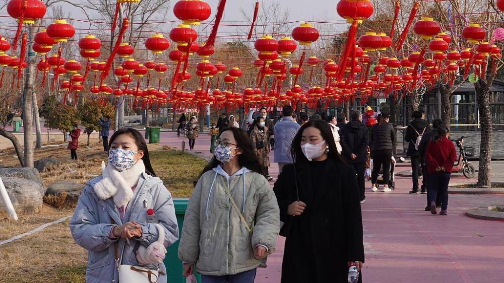

# 河南去年常住人口减少11万，人口自然增长率62年来首现负增长

人口大省河南公布了2022年全省人口数据情况。2月20日，据河南省统计局消息，2022年河南省常住人口总量继续下降，自然增长人口六十多年来首现负增长。

数据显示，2022年末，全省常住人口9872万人，比2021年末减少11万人。与2021年减少58万人相比，降幅缩小。

2022年末，全省常住人口中男性4955万人，占50.19%；女性4917万人，占49.81%；性别比为100.77。

河南省统计局表示，受育龄妇女持续减少、生育观念变化、婚育推迟、人口外流和人口老龄化等多方面因素影响，2022年全省出生人口持续减少，死亡人口增加。

2022年全省出生人口73.3万人，出生率为7.42‰；死亡人口74.1万人，死亡率为7.50‰；自然增长人口-0.8万人，自然增长率为-0.08‰。与2021年相比，全省出生人口减少6.0万人，出生率下降0.58个千分点；全省死亡人口增加1.1万人，死亡率上升0.14个千分点。
**人口自然增长率62年来（自1961年开始）首次出现负增长。**

值得注意的是，2020年，河南出生人口首次跌破100万，2021年再度跌破80万大关，是1978年以来的最低水平。

从年龄结构来看，2022年末，河南全省0—15岁人口为2266万人，占全省人口的22.95%；16—59岁人口为5744万人，占58.18%；60岁及以上人口为1862万人，占18.86%。与2021年末相比，0—15岁人口减少92万人，16—59岁人口增加2万人，60岁及以上人口增加79万人。

此外，受城镇区域扩张、城镇人口自然增长和乡村人口流入城镇等因素影响，河南城镇人口继续增加。2022年末，全省城镇常住人口5633万人，比2021年末增加54万人；乡村常住人口4239万人，减少65万人。城镇常住人口占全省常住人口的比重（城镇化率）为57.07%，比2021年末提高0.62个百分点。

