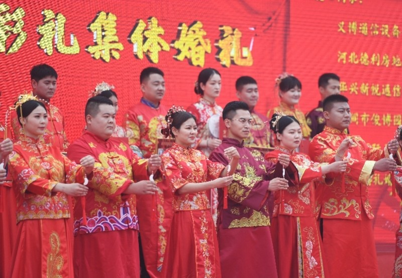

# 高价彩礼之痛：多方抵制及治理之下，“行情”缘何仍一路飙升

刚过去不久的春节假期里，“高价彩礼”再次成为热门话题。2月19日，多地适婚青年及其父母告诉南都、N视频记者，当地彩礼行情还在上涨。

日前，2023年中央一号文件发布，指出“推动各地因地制宜制定移风易俗规范，强化村规民约约束作用，党员、干部带头示范，扎实开展高价彩礼、大操大办等重点领域突出问题专项治理”。这已是中央一号文件连续3年点名“高价彩礼”。

针对“高价彩礼”问题的治理由来已久，甘肃、河南、四川等部分地区也于近期披露治理成效。不过，治理“高价彩礼”问题，难以一蹴而就，制约因素错综复杂。

“高价彩礼”为何近期又引关注？背后成因是什么？各地对抵制“高价彩礼”有何尝试？治理难点在哪？南都记者多方采访，梳理了“高价彩礼”四大焦点。

**一问：“高价彩礼”为何近期又引关注？**

在刚刚过去的春节返乡高峰期间，“高价彩礼”再次成为热门话题。

在外工作的江西萍乡适婚青年张先生春节回家后发现，当地的彩礼“行情”已涨到12.8万元至18.8万元。

江西抚州是坊间传闻中省内彩礼排名靠前的城市之一。女儿正值婚育年龄的抚州居民易女士告诉南都记者，目前当地的彩礼普遍在30万元左右，其中农村的费用更高。“这几年来，彩礼的确在涨，一个农村男孩要结婚不容易。除了彩礼，还得置办‘五金’，办成事酒，给女方家‘打发钱’，光是订婚就得花40到60多万”。

据易女士了解，“因为彩礼高，生儿子多的家庭负担很重。以往说‘多子多福’，现在情况变了，女孩相亲时听说男方家有几个儿子，都不大乐意。彩礼要得反而比独生子家庭更多，有些甚至根本不见。”

来自浙江某县城的李女士告诉南都记者，春节前后她的亲戚刚结婚，亲戚家拿了几十万彩礼给女方，女方则陪嫁了一辆车。据她观察，彩礼“年年涨价”，亲友们包的份子钱也不会低于千元。“其实我家乡也不重男轻女，可能主要是出于好面子，有些人家应该也会把所有彩礼和陪嫁给小夫妻两人的小家庭用。”

南昌大学中国乡村振兴研究院执行院长刘建生，近年来辗转于江西、四川、甘肃、贵州等地农村地区，进行乡村振兴相关研究。他在走访中发现“高价彩礼”问题农村比城市更突出。“现在农村说彩礼高就是20万左右，一般为求个吉利数字，18.8万、16.6万、13.8万这种比较多一些。”

西安交通大学公共政策与管理学院教授靳小怡长期从事农村人口婚姻家庭研究。为了解当代中国农村男性婚姻成本，2018年初，靳小怡带领课题组在山东、湖北、河北、江西、安徽、四川、甘肃、河南、山西、陕西和湖南11个省份，涵盖东、中、西部的经济发达和欠发达地区，对春节返乡的农村外出务工人口开展抽样调查，共计获得有效样本5004个。

靳小怡向南都记者介绍，这次调查不仅限于彩礼花费，还包含了媒人中介费、婚礼和婚房花费。她发现，农村男性婚姻成本地区差异显著。总体而言，西部地区婚姻总成本最低，但其中彩礼花费占比却最高，东部地区则在婚房开销上占比更大。

“中西部男性成婚难最直观的表现即为
‘高价彩礼’，东部受较高房价的影响，农村男性主要面临较大的婚房购买压力。”在靳小怡看来，随着近年来彩礼要价不断攀升，“高价彩礼”令婚姻仪式感减弱、“交易”性质加深。

“高价彩礼”也滋生出诸多乱象。南都记者注意到，2021年3月，江西九江银行推出“彩礼贷”宣传海报，以“彩礼开销不用愁
‘贷’来稳稳的幸福”为标语，称“最高可贷30万元，最长可贷一年，年利率低至4.9%”。该海报在网络上流传，引发舆论争议。

后经调查发现，“彩礼贷”系该行零售银行管理总部的工作人员在“零花钱”消费贷款基础上，针对新婚客户群体进行的文案设计。未经该行相关程序审批，此工作人员将尚处于设计阶段的文案发至微信朋友圈。

去年2月，网传宁夏银川一男子因“没有50万彩礼”，女朋友被其家人“强行拖走”，引发广泛关注。不到一个月后，当事男子再次发声，称其和女朋友已经“领证”，“现在生活已经恢复平静”，不少网友为两人送上祝福。

今年1月，知乎网帖中一用户自称其因“江西萍乡的女友父母”提出“1888万彩礼”而分手的消息引发广泛关注。1月13日，知乎方面回应称，经核查该内容出自某匿名用户发布的回答，该回答于1月12日被发布者修改为致歉声明，承认了杜撰事实。知乎平台决定对该用户账号永久封禁。

诸多乱象不断引发舆论争议，也让“高价彩礼”问题持续受到各界关注和讨论。

**二问：“高价彩礼”背后成因是什么？**

“‘高价彩礼’的成因多被归咎于性别失衡导致的男性婚姻挤压。”靳小怡向南都记者解释，从上世纪80年代开始，我国男女出生性别比例出现失衡，在2004年达到121，江西、广东、海南、安徽、河南五省的出生性别比甚至超过130。2016年全面二孩政策实施后，出生性别比开始稳步下降，七人普数据显示到2020年已降至111.3左右，也即每诞生100个女婴，就有111.3个男婴来到世上。据测算，男性过剩人口在3000至5000万。

而在城镇化进程中，人口的迁移流动又加剧了经济相对落后地区男性的婚姻挤压。“大量农村青年来到城市，城乡通婚圈融合，适婚青年有了更多选择，资源较差的农村男性劣势地位加剧。”靳小怡表示。

易女士也有同感，“以前彩礼也没这么高，几万块就行。但现在，特别在偏远农村地区，很少有女孩想嫁过去。这就导致本地人去外地讨媳妇，包括本省的赣州，云贵地区，甚至还有东南亚国家。”易女士告诉南都记者，近期她听说过最高的一笔彩礼高达42.8万元，是一名“三婚”女性嫁到当地较为偏远的农村。

这种情况还催生出许多职业媒人，他们游走在乡间，每介绍成功一对，便能收取数万元介绍费。“但这种职业媒人不是很靠谱，为了赚钱，还会隐瞒智力或身体有缺陷等信息。”易女士透露，“我们当地有个智力有些问题的女孩，职业媒人把她连续介绍给四位男性，女方家收到的彩礼加起来近百万。”

靳小怡发现，在社会关系相对稳定、圈子文化浓重的乡村社会中，缔结婚姻易受到攀比、从众心理的影响。她举例称，农村地区女方家庭索要高额彩礼，除了有“养个女儿不容易”的想法外，更多的考量是“别人家都要这么多，我为什么不要”。而当女方家庭所收的彩礼明显低于普遍标准时，也会被村民议论“坏了规矩”，因此受到埋怨、排挤。

“大部分父母还是希望孩子过得幸福。城区家庭一般都会让女儿把彩礼带走，还会贴补一些给小家庭。”易女士认为彩礼还是得收，不收彩礼怕女儿被男方轻视。“彩礼其实体现了男方对女方和这门亲事的尊重，丰俭由人。如果男方是外地人，根据双方的习俗，商量着来就行。”

张先生也认为高价彩礼来源于攀比。“比如我们邻居家给了20万，我就肯定要高于20万。因为邻居之间会讨论彩礼的事情，还会进行比较。”

另一名老家在江西的祝女士同样表示，网传的“天价彩礼”或许会有些“水分”，有的家庭为了面子，会宣称自己给出了高价彩礼。但实际上，双方父母会在私底下商讨具体的彩礼数目，有些甚至还会考虑分期给付彩礼。

**三问：各地抵制“高价彩礼”有何尝试？**

2月13日，2023年中央一号文件发布。文件在“加强农村精神文明建设”方面指出，“推动各地因地制宜制定移风易俗规范，强化村规民约约束作用，党员、干部带头示范，扎实开展高价彩礼、大操大办等重点领域突出问题专项治理”。

南都记者注意到，这是中央一号文件连续3年点名“高价彩礼”。为移风易俗治理“高价彩礼”，全国多地开展了不同行动。

2020年5月，民政部印发《关于开展婚俗改革试点工作的指导意见》，指出要开展对天价彩礼、铺张浪费、低俗婚闹、随礼攀比等不正之风的整治，建立健全长效机制，助力脱贫攻坚，推进社会风气好转，并于次年将河北省河间市等15个单位确认为全国婚俗改革实验区，实验时间为3年。

甘肃、四川、宁夏等地市区（县）直接对彩礼、酒席花费制定标准。2022年，甘肃定西市提出9条“硬核”措施，利用8个月时间对高价彩礼、人情攀比等陈规陋习进行集中整治。其中包括对彩礼、酒席“限高”，要求婚嫁礼金不超过5万元，婚嫁活动双方不超过2天；举办婚事酒席不超过20桌，在城区每桌不超过880元，在农村地区举办婚事每桌不超过480元。

同年7月，四川凉山彝族自治州发布的《移风易俗条例》提出，按照传统习俗确需给付或者收受婚嫁彩礼、礼金，彩礼的标准和礼金的种类、标准应当遵守村规民约（居民公约）等相关规定，要自觉抵制索要高额彩礼、礼金或者利用彩礼、礼金干涉婚姻自由；操办婚事时应控制婚嫁宴请对象、范围、次数、随礼标准及接送亲车辆、人数和聚餐（宴席）规模、标准等。

今年2月，宁夏泾源县也出台《进一步推进移风易俗助力乡村振兴的实施意见（试行）》，提出彩礼最高不得超过6万元，并逐年下降，酒席不超过10桌，人情礼金不得高于200元。此外，加大“零彩礼光荣，高彩礼丢人”宣传力度，形成抵制高价彩礼的社会氛围。

而在2022年9月，江西广昌县就曾为“零彩礼”的10对新人举办移风易俗集体婚礼，这场婚礼在线直播，观看量超4万人次。一位参加婚礼的新娘表示，“这么热闹又有仪式感的婚礼，是多少彩礼都换不来的。”

同年11月，在江西省进贤县人民广场，进贤县委宣传部、县妇联、县民政局等单位联合举办第二届“树文明新风不要彩礼要幸福”集体婚礼，现场16对新人参与，共同倡导“抵制奢靡之风，反对高额彩礼”的文明新风之举，用实际行动践行移风易俗文明新风尚。

“政府对于这种婚育新风的宣传和倡导还是非常有必要的。”靳小怡向南都记者表示，观念的扭转对于抵制“高价彩礼”至关重要，地方政府因地施策、逐步完善与细化相关措施，充分考虑不同乡村的经济社会状况、村民文化素质等因素，对彩礼标准进行具体地规定，“能够实现精准打击和治理”。

刘建生也认为，“限礼”标准、村规民约（居民公约）等移风易俗措施对于降低婚嫁成本、形成新风尚能够发挥一定作用。

**四问：“高价彩礼”治理难点在哪？**

多措并举之下，部分地区整治“高价彩礼”取得成效。2022年底，民政部召开全国婚俗改革经验交流电视电话会议，指出各实验区从开展婚姻家庭辅导、倡导简约适度婚俗礼仪、培育文明向上婚俗文化、传承良好家风家教四个方面入手，“细化实施方案，聚焦主题主线，采取有效措施创新试点，较好完成了阶段性实验任务”。

河北河间市介绍称，该市被确定为全国婚俗改革实验区后，自2021年4月以来，全市共办理新婚登记4726对，其中“零彩礼”“低彩礼”占比88%，每桩婚事花费比之前平均减少7万至15万元。

_2021年5月20日，河北省河间市在瀛海公园举办“零彩礼”公益集体婚礼，26对新人身穿中式传统婚服执手入场。新华社发_

日前，甘肃定西市也公布了高价彩礼的治理情况，据不完全统计，治理高价彩礼推动移风易俗培育文明乡风攻坚年行动自2022年6月份启动实施以来，当地70%的出嫁方彩礼控制在0至5万元以内，平均为4.9万元，比行动前下降了10.9%。

四川凉山彝族自治州也表示，移风易俗专班运行以来，全州共报备红事991起，白事2527起，共制止10万元以上彩礼528起，涉及金额7010万元，收集村（居）民从简办理婚丧事宜的典型案例263起，群众“不愿收、也不愿送”的氛围已初步形成。

然而，根治“高价彩礼”难题，依然无法一蹴而就。靳小怡向南都记者分析，“人口是一个大的惯性系统，未来可预期的二三十年内，我们的婚姻市场供需都是不平衡的，彩礼问题甚至可能更加严重，这是一个长期的综合性的治理过程。”

靳小怡认为，“治理的底层逻辑是承认爱情是婚姻的基础。”她在调查中发现，“高价彩礼”也并不能保障婚姻幸福，“我们发现部分收取高额彩礼的家庭，婚姻质量不高，一个是离婚的意愿比较高，另外婚内家庭暴力发生率比较高。”她表示，应倡导回归婚姻的本质，将其建立在彼此了解和真实情感之上。此外，还应提升农村人口教育水平，加大中西部农村居民教育投入，令其能够接受正确的婚恋观。

“ ‘高价彩礼’背后的另一个问题，是农村‘光棍’增多。”刘建生告诉南都记者，“有的男性四五十岁还是单身，宁愿多花点钱也想成个家。”

靳小怡也观察到，人口性别结构失衡难以快速转变，欠发达农村地区大龄未婚男性的生存发展权益应受关注，“比如通过加强社会保障制度的覆盖面与支持力度，满足欠发达农村地区大龄未婚男性的基本生活需求和养老需求，营造更宽松的社会环境，减轻对他们的社会排斥。”

此外，她表示，还应加强教育、就业、医疗、社保等优质资源在城乡间、区域间的合理配置，促进中西部农业转移人口就地就近城镇化，避免人口迁移流动加剧男性婚姻挤压。

从根本上破解“高价彩礼”难题，刘建生认为，一方面政府要加强引导进行移风易俗；另一方面，必须加快推动乡村振兴，不断缩小城乡差距，“让年轻人愿意留在乡村发展，让更多男女青年愿意在乡村安家落户”。

出品：南都即时

采写：南都记者 张林菲 方诗琪 杨天智 实习生 陈宇龙

