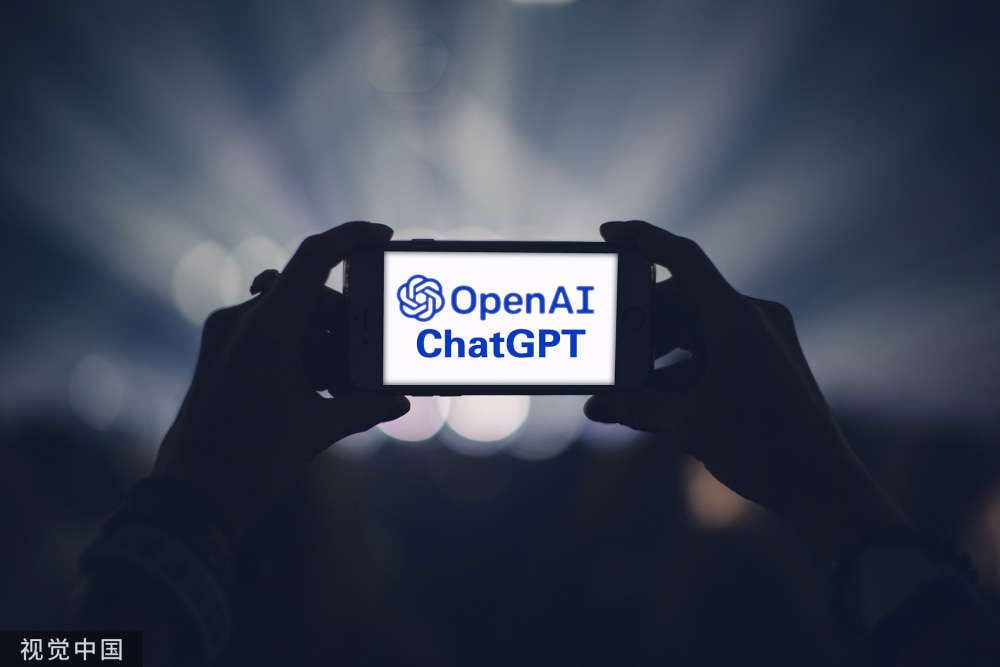
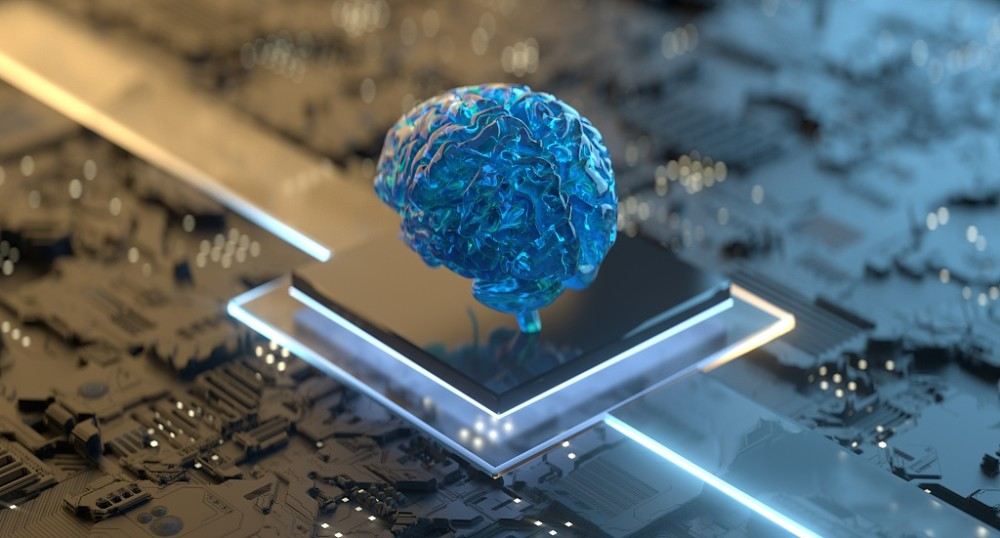

# ChatGPT让传统教育反思：我们需要培养什么样的人才？

ChatGPT对教育有什么挑战？我们到底应该如何应对？之前认为人工智能+机器会先取代重复性体力劳动，现在看最先消灭的是非创造性脑力劳动。ChatGPT意味着重复的知识是没有意义的，应试教育下的人才培养是否需要及时调整？大学里哪些专业会率先被淘汰？教师职业将面临哪些挑战？

本期《文话教育》邀请：中国科学院自然科学史研究所研究员、博士生导师刘益东；中国教育在线总编辑陈志文两位专家做客直播间聊聊ChatGPT对学习和教育的深远影响。

ChatGPT对教育的影响是颠覆性的

**问：ChatGPT是什么？其主要特点是什么？为什么会引起如此巨大的影响？**

**刘益东**
：ChatGPT是人工智能的一个最新成果。它是人工智能技术驱动的自然语言的一个模型，它最主要的一个特点是能够学习和理解人类的语言进行对话，还可以根据上下文进行互动。它整个表现就像真人一样，当然是一个非常博学的真人。从技术角度来讲它是使用了Transformer神经网络架构，通过预先训练海量的文本数据，具有人类自然语言理解和文本生成能力，使得它对人类的智慧和知识成果有很好的理解与学习，并可以关联上下文，进行聊天对话。所以ChatGPT的核心技术就是能够学习和理解人类的自然语言，这是以前的人工智能难以做到的。

**陈志文**
：ChatGPT显然和搜索引擎完全不是一回事，搜索引擎更多是基于关键字的一个检索，是一个原始知识的呈现。而ChatGPT是对过往知识进行一次梳理总结归纳甚至提升，我定性它是一个新的知识组织方式的产生，或者说组织形式。虽然它不生产新的知识，但是它的知识组织形式，尤其是总结归纳梳理能力极大地提高了学习效率，所以我们会认为ChatGPT的能力要高于人类。

**问：ChatGPT对教育会产生哪些颠覆性的影响？**

**刘益东** ：ChatGPT对教育的影响是颠覆性的。它表现在以下几个方面。

从学习的角度来讲，我们整个的教育是以教师为中心的，但顶级大学和顶级名师是有限的。而ChatGPT变革的教育是以学习者为中心，学习者想学习到最好的知识应该向最好的老师请教，互联网和人工智能等信息技术提供了精英教育普惠化的可能，这是一个深刻的变化，从学生角度来讲是非常好的。这种情况会导致大量教师要重新考虑自己的定位，能否在某个知识点上教授得最好，让自己有竞争力。

**陈志文**
：我认为对学习是颠覆性的影响，并且已经跨越从学习到教育。学习和教育是有区别的，学校教育是学习的一个主要组织形式，但更多的是自我的学习。ChatGPT从根本上改变了学习的方式，学生不一定完全依赖老师，这是一个非常大的变化，必然会投射到教育上。对于优秀的爱思考的孩子来说，这种学习方式提供了极大的便利和更多的选择。在这个基础上，对教育尤其是学校教育必然带来颠覆性的影响。这种影响对于中小学来说可能要滞后一点，因为中小学规范化强，在管理上相对比较严密，自由度也相对较小。

人工智能让重复劳动变得毫无意义

**问：ChatGPT意味着重复的知识是没有意义的，应试教育下的人才培养是否需要及时调整？**

**刘益东**
：前不久清华教授钱颖一写了一篇文章《人工智能将使中国教育优势荡然无存》，说的就是这种应试教育。我们现在讨论ChatGPT的影响，可以回顾一下搜索引擎出来之后带来的影响。当时搜索引擎出来之后，学生发现很多知识比老师讲的还丰富、准确。当然中文搜索引擎和英文搜索引擎的品质差距还是非常大的。信息和知识的数量与质量决定学习成效，使用中文搜索引擎和使用英文搜索引擎长大的学生会拉开很大距离，实际上就输在了起跑线上。这次ChatGPT来了，我们也要思考这种数字鸿沟是否会进一步拉大？

对中国的家长来说挑战有几个方面。一个是教育层面上，教育方式的差距，我们的原创能力是否能进一步提高，学生分化，强者更强，弱者更弱的现象是否能缓和？另一个层面就是就业，本来竞争对手是同类，未来出现了人工智能，它会和人类抢饭碗。所以能否学习得更好更快以提高核心竞争力，成为我们面临的挑战。培养出来的毕业生不仅一专多能，而且一尖多能，实行针尖战略，在一个研究场点、技能场点，必须做到国内一流乃至世界一流，才可能有自己的用武之地。

**陈志文**
：相对于中小学生来讲，我认为目前还是踏踏实实地按学校安排去做。因为高考的指挥棒还在那里，很难改变或解决这个现实，我也坚信学校会有变化和调整的，根据多元化、个性化的需求做调整。另外还有一个残酷的现实就是教育评价没有变，包括中高考在内，不会因ChatGPT的出现就改变了，所以目前能做的就是先把学校基本动作做完。可以把ChatGPT发展成一个更好的自学手段，这样有利于孩子的成长。

**问：ChatGPT会影响哪些行业或者职业？**

**刘益东**
：整个世界面临的问题就是人工智能等新兴技术大规模崛起和应用所带来的挑战。人类的观念、组织、体制机制都极其不适应，被它牵着跑。我专门研究科技风险20多年，人类面临的挑战极为严峻和紧迫。当然，教育发展也迎来新的机遇，目前的国内国际的顶级大学都是互联网和人工智能出现之前形成的。人工智能等新兴科技的变革会使得教育体制重新洗牌，未来会出现一批新的顶级大学。

英国工业革命以来，机器换人就一直受到关注。
卢德运动是19世纪早期英国爆发的一场以砸毁机器为主要表征的手工工人抗议事件。20世纪新卢德主义者继承发展了卢德主义的观点，从破坏机器演变为泛指的反对机械化、反对自动化的人和观点。现在关于人工智能导致的失业有很多讨论，比如世界银行2016年研究表明，未来20年内非洲有高达71%的就业岗位会被人工智能替代；发展中国家这个数字是50%，经合组织国家是57%。美国白宫2016年底的报告说未来10年到20年，人工智能替代就业岗位的比例将由目前的9%上升到47%。

麦肯锡全球研究所2017年底的预测显示，到2030年约有60%的职业可能被人工智能和自动化所取代。实际上这些预测都是比较保守的，因为2016年AlphaGo开始横空出世，到现在的ChatGPT的出现，人工智能进入了一个大爆发的态势，因此上述预测都是比较保守的。李开复说过人工智能已经蓄能完毕，将迎来一个全新的爆发拐点。他说很多工作都会被替代，只有剩下创造力、同理心和灵活性这类的工作还有壁垒。其实不仅是教师，包括研究者、医生、律师、咨询领域都可能会被替代，而且这种替代过程是非常残酷的。

**陈志文**
：教育的重新洗牌在高等教育领域会率先出现。中小学相对制度化，无论中国还是西方，基础公众服务需要顾及大多数人，但是高等教育相对自由度更高。随着ChatGPT的出现，未来还可能会有更高级的人工智能手段出现，可能会诞生一批新型的大学，这种大学和传统大学会有本质区别。

清华大学副校长杨斌教授说过：”以前我认为人工智能+机器最先淘汰的是重复性的体力劳动者。但ChatGPT让我改变了这个看法，它的出现证明率先淘汰的是重复性的脑力劳动者。“这句话实际涵盖了很多行业。

**问：ChatGPT能否取代老师？**

**陈志文**
：我觉得人工智能可以成为老师的一个优秀的助手。原因很简单，教育是一个复杂的过程，就像三年前的疫情，导致全国师生转战在线教育，但三年之后遇到很多问题，一方面在线教育准备得不好，另一方面育人是一个复杂的过程，是需要人和人之间接触交流，包含情感的传递等等。纯粹的在线教育是无法完全完成的，另外教育和学习是有区别的，教育包含育人这个功能，纯粹的一个技术手段不能完全实现或者完成。所以从这个角度来讲，我不认为它就能完全替代老师，但是我想提醒那些只管教知识的老师，可能还真的会被替代。如果教师只是一个知识的传声筒，从知识教授角度来讲远不如这些机器人。但是从育人的角度来讲可能还存在一定的优势或在一个阶段保持优势。

人工智能的安全问题不容忽视

**问：学术界禁止使用ChatGPT，能禁得了吗？**

**刘益东**
：实际上大学越禁止，大家就越会去使用它，不能禁止使用电脑，就不能禁止使用ChatGPT。ChatGPT和人最大的区别是什么？在文字拼法和语法上ChatGPT不会犯错，而人不一定，所以适当加入一些错误就能够冒充人类。人的价值由谁来衡量？我觉得是由人工智能最新成果来衡量，如果人不如ChatGPT，就没有工作价值。而ChatGPT等人工智能的水平是不断提升的，所以有工作价值的人必然会越来越少。回归到教育上，中国需要一批有胆识、有魄力的教育家开创互联网和人工智能时代的新型教育，自下而上地进行教育改革，重新洗牌，名校格局将重构。

**陈志文**
：ChatGPT对教育包含科研最大的冲击就是舞弊。可以更方便地借用所有人的智慧来完成自己的工作，这个也的确禁止不了。随着人工智能技术的发展，机器是站在所有人类智慧的肩膀上快速迭代的，它们让没有创新的知识和技能变成毫无价值。我们人类即便是天才，也必须从零开始。

**问：ChatGPT包含其他的人工智能有哪些可怕之处？**

**刘益东** ：人工智能有三个地方如果突破了就非常可怕。

一个是 **图灵测试**
。图灵测试没有限制那个人是什么水平的人，ChatGPT在有些领域达到高中生水平，有些领域达到大学生水平，有些领域甚至达到专家的水平，实际上它已经通过了图灵测试。

二是 **自主意识**
，人工智能一旦拥有自我意识就非常可怕。这里面有一个知识点叫做博弈智慧。什么是博弈智慧，就是诸葛亮的智慧。诸葛亮为什么能够七擒孟获？因为孟获想到的诸葛亮都想到了。如果人工智能比人类聪明，人类就对付不了它。

三是 **自我繁衍** 。纳米机器人为什么可怕？就是它能够进行自我繁衍。所以现在确实已经到了人工智能大爆发的边缘，“奇点”某种程度上已经来临。

鉴于目前人工智能发展的大爆发态势，应该进行有效的伦理约束，探索可持续安全的人工智能，让人工智能造福人类，而非替代人类、危害人类。

版权声明：本文系腾讯新闻《文话教育》独家稿件，未经授权禁止媒体转载。

